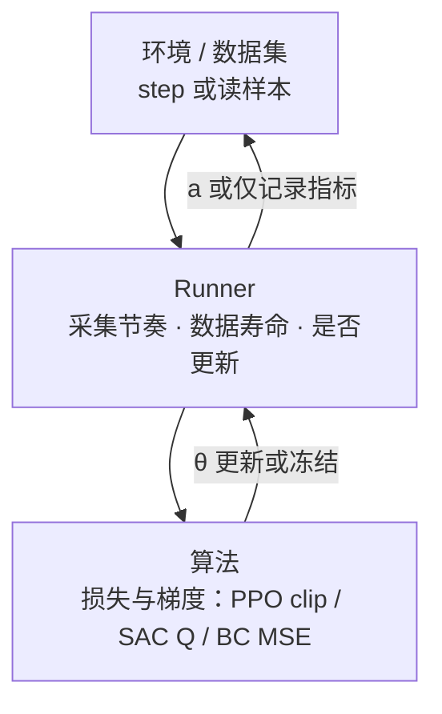
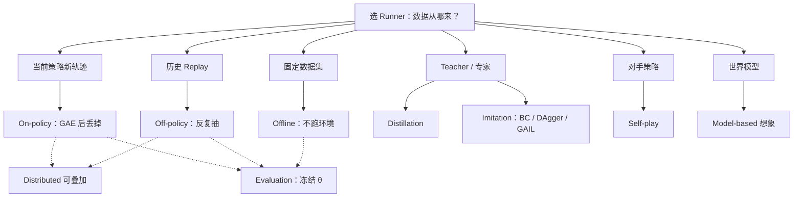

# RL Runner（训练循环编排）

RL Runner 是强化学习框架里驱动「采集 → 计算学习信号 → 更新（或只评测）」的编排层。算法给出损失与更新公式；环境给出 `step`；Runner 决定何时采、采完怎么用、用完是否丢掉、要不要改参数。

## 一句话定义

Runner 不是 PPO/SAC 本身，而是把算法接到环境（或数据集）上的那层循环：同一套损失可以挂不同 Runner，同一个环境也可以被训练 Runner 与评测 Runner 分别驱动。

## 英文缩写速查

| 缩写 | 英文全称 | 简要说明 |
|------|----------|----------|
| Runner | Training Runner | 采集–更新–评测循环的编排层；框架里也叫 Trainer / Algorithm |
| GAE | Generalized Advantage Estimation | On-policy Runner 在丢掉 rollout 前计算优势的标准步骤 |
| PPO | Proximal Policy Optimization | 典型 On-policy Runner 宿主算法 |
| SAC | Soft Actor-Critic | 典型 Off-policy Runner 宿主算法（Replay Buffer） |
| BC | Behavior Cloning | Imitation Runner 的监督式基线 |
| DAgger | Dataset Aggregation | 需要环境交互的模仿 Runner：学生滚出状态、专家回标 |
| MARL | Multi-Agent Reinforcement Learning | Multi-agent Runner 要打包多 agent 观测与策略 |
| MBRL | Model-Based Reinforcement Learning | Model-based Runner：真交互 + 世界模型想象 rollout |
| IMPALA | Importance Weighted Actor-Learner Architecture | Distributed Runner 的 Actor–Learner 代表 |

## 为什么重要

- **读代码时对得上号。** [rsl_rl](https://github.com/leggedrobotics/rsl_rl) 叫 `OnPolicyRunner`，[Stable-Baselines3](../entities/stable-baselines3.md) 把循环藏在 `algorithm.learn()`，Tianshou / RLlib 拆成 Collector + Learner。名字不同，问的是同一层问题。
- **算法选型其实先选循环。** [PPO vs SAC](../comparisons/ppo-vs-sac.md) 的核心分歧不是 clip 还是熵，而是「这批数据用完能不能再抽」——这正是 On-policy / Off-policy Runner 的差别。
- **补上环境闭环外包的那一层。** [具身 RL 最小闭环](./embodied-rl-minimal-closed-loop.md) 只保证 `obs → act → step → reward` 能转；[五模块训练栈](../overview/humanoid-rl-policy-training-five-modules.md) 讲 Actor-Critic / PPO / 奖励 / 蒸馏。Runner 回答：这些模块按什么节奏被调度。
- **评测必须单独成环。** 训练时的随机策略回报不能当选 checkpoint 的依据；Evaluation Runner 是所有算法都要有、且**禁止更新参数**的循环。

## 核心原理

### 三层分工

| 层 | 负责什么 | 不负责什么 |
|----|----------|------------|
| 环境闭环 | 状态、动作、奖励、物理步进 | 要不要丢掉这批数据 |
| 算法 | 目标函数、网络结构、优化器 | 几个进程在采、要不要跑环境 |
| Runner | 数据从哪来、用几次、何时 eval | 关节 PD 增益、奖励权重 |

行业命名对照：`Runner`（rsl_rl）、`Trainer`、`Algorithm`（RLlib）、`Collector` + `Learner`（Tianshou / IMPALA）。看到这些词，先问数据来源和核心循环，再问具体损失。

### 按数据来源划分的十类循环

下表转写教学谱系，并接到本库已有方法页。Distributed / Self-play 常**叠在** on/off-policy 更新规则上，不是第三种损失函数。

| Runner 类型 | 常见算法 | 数据来源 | 核心循环 | 本库落点 |
|-------------|----------|----------|----------|----------|
| **On-policy** | PPO, A2C, TRPO | 当前策略刚采的轨迹 | rollout → [GAE](../methods/gae.md) → update → **丢弃** rollout | [PPO](../methods/ppo.md) |
| **Off-policy** | SAC, TD3, DDPG, DQN | Replay Buffer | 少量采集 → 随机抽历史 → **多次**更新 | [SAC](../methods/sac.md) |
| **Offline** | CQL, IQL, BCQ, TD3+BC | 固定数据集 | 读盘 → 更新，**不** `env.step` | [Online vs Offline](../comparisons/online-vs-offline-rl.md) |
| **Distillation** | Teacher–Student | Teacher 动作或轨迹 | Teacher 推理 → Student 模仿 | [特权训练](./privileged-training.md) |
| **Imitation** | BC, DAgger, GAIL | 专家演示 ± 环境 | 采专家/学生轨迹 → 模仿更新 | [模仿学习](../methods/imitation-learning.md) |
| **Multi-agent** | MAPPO, QMIX, MADDPG | 多智能体环境 | 打包多 agent 观测/动作/共享或独立策略 | [MARL](../methods/marl.md) |
| **Self-play** | AlphaZero 类、博弈策略 | 当前或历史策略互打 | 选对手 → 对局 → 更新 → 写入策略池 | [RoboStriker](../entities/paper-notebook-robostriker.md) |
| **Distributed** | IMPALA, Ape-X, 分布式 PPO | 多采样进程 | Actor 并行采 → Learner 集中更新 | 执行拓扑，可包 on/off-policy |
| **Model-based** | Dreamer, MuZero, MBPO | 真环境 + 学到的动力学 | 采数 → 训世界模型 → 想象 rollout → 更新策略 | [MBRL](../methods/model-based-rl.md) |
| **Evaluation** | 任意算法 | 只交互、不学习 | 确定性推理 → 统计指标，**不改 θ** | 训练正交；选 checkpoint 用 |

### 各类循环在做什么

**On-policy Runner。** 策略一变，旧轨迹的重要性权重就失效。因此每轮必须用**当前** $\pi_\theta$ 重新 rollout，用 [GAE](../methods/gae.md) 估 $\hat{A}_t$，做有限次 minibatch 更新（PPO 常见 3–10 epoch），然后**整批丢掉**。人形/四足在 [Isaac Lab](../entities/isaac-lab.md) 上千并行环境里走这条路：样本利用率低，但墙钟短。工程实例：rsl_rl `OnPolicyRunner`、[AMP_mjlab](../entities/amp-mjlab.md) 的 `AMPOnPolicyRunner`。

**Off-policy Runner。** 转移 $(s,a,r,s')$ 进 Replay Buffer，更新时随机抽历史。每条经验被反复用，样本效率高，但 Q 自举会过时；并行环境太多时，写入速度会淹没更新，这是大规模仿真里 SAC 常慢于 PPO 的原因之一。

**Offline Runner。** 没有探索、没有 `env.step`，只从固定数据集学。瓶颈是分布偏移：策略一旦走出数据集支撑集，没有真实反馈可纠。CQL / IQL / TD3+BC 都是在这条循环上加保守约束，不是换了一种采集器。

**Distillation Runner。** 数据来自 **Teacher 策略**（常带仿真特权观测），Student 做监督拟合。它通常接在 On-policy 收敛**之后**，不参与前期探索；对象若未收敛，学生只会稳定地学错。见 [特权训练](./privileged-training.md) 与 [Teacher-Student / DAgger](../methods/teacher-student-dagger-training.md)。

**Imitation Runner。** 数据来自 **专家演示**，不是 Teacher 网络。纯 [BC](../methods/behavior-cloning.md) 可以完全离线；[DAgger](../methods/dagger.md) 必须让学生与环境交互，再请专家回标；GAIL 还要把判别器奖励送进 RL 更新。和蒸馏的差别：老师是人或演示集，还是另一套已训策略。

**Multi-agent Runner。** 每个 step 要组装 $N$ 个观测与动作，处理共享策略 vs 独立策略、集中训练分布式执行（CTDE）。非平稳性来自「别的 agent 也在学」，不是普通单智能体 on-policy 能靠加并行环境解决的。

**Self-play Runner。** 对手从策略池抽样（当前、历史平均、或冻结副本），对局产生数据后再更新并回写池。朴素永远打最新自己容易循环相克；人形拳击里常先把技能压进 latent 再自博弈，见 [RoboStriker](../entities/paper-notebook-robostriker.md)。

**Distributed Runner。** 把「谁在 `env.step`」和「谁在 `loss.backward`」拆开：多 Actor 采样，一个（或少数）Learner 更新。IMPALA 用 V-trace 纠正策略滞后；Ape-X 把这条拓扑接到 off-policy replay。它回答的是**算力拓扑**，损失仍是 PPO 或 Q-learning。

**Model-based Runner。** 真环境只采相对少的数据，用来拟合动力学；大量更新发生在模型里的想象 rollout（Dreamer 的 latent imagination、MBPO 的短 horizon 模型轨迹）。模型偏了，策略会在假世界里过拟合。见 [MBRL](../methods/model-based-rl.md)、[潜空间想象](./latent-imagination.md)。

**Evaluation Runner。** 关掉探索噪声（或取分布均值动作），跑固定种子/场景，只记成功率、回报、摔倒率。**零梯度。** 训练曲线上的 `mean_reward` 往往含探索噪声，不能替代这条循环。

## 工程实践

### 机器人栈里常见挂载

| 场景 | 默认 Runner | 注释 |
|------|-------------|------|
| 仿真 locomotion（legged_gym / Isaac Lab / rsl_rl） | On-policy + 并行 Evaluation | 8192 环境级 PPO；play/export 走 Evaluation |
| 真机或少样本连续控制 | Off-policy（SAC/TD3） | Buffer 预热后再更新；并行度不必追 locomotion |
| 只有演示、不能乱试 | Offline 或 Imitation（BC） | 无奖励用 BC；有奖励标注可上 IQL/CQL |
| 仿真特权 → 机载观测 | 先 On-policy Teacher，再 Distillation | 蒸馏损失可叠任务奖励，避免只抄均值 |
| 专家在环纠偏 | Imitation（DAgger） | 学生必须自己滚状态，否则退回 BC |
| 双人对抗 / 足球战术 | Self-play 或 Multi-agent | 先保证单智能体能站稳，再开对手池 |
| 世界模型 / 想象训练 | Model-based | 真交互与想象更新的比例要单独调 |
| 任何训练结束选 ckpt | Evaluation | 确定性策略 + 固定测评集 |

选型口诀：

1. **能不能 `env.step`？** 不能 → Offline / 纯 BC。
2. **数据能不能复用？** 当前策略轨迹必须丢 → On-policy；历史转移仍有效 → Off-policy。
3. **监督从哪来？** 另一策略 → Distillation；人/演示 → Imitation。
4. **几个决策者？** $>1$ 且共享环境 → Multi-agent；对手是自己的旧权重 → Self-play。
5. **更新是否与采样同进程？** 否 → Distributed。
6. **要不要先学世界？** 是 → Model-based。
7. **这次能不能改权重？** 否 → Evaluation。

算法层面的 PPO/SAC/TD3 对照仍看 [RL 算法选型](../queries/rl-algorithm-selection.md)；本页只决定**循环形态**。

### 调试时看哪条曲线

- On-policy：`mean_reward` 与 clip fraction / KL 一起看；KL 爆了说明这轮 epoch 太多，等于在过期数据上硬训。
- Off-policy：Buffer 大小、`learning_starts`、Q 值是否单调飙升（高估）。
- Distillation：Teacher 任务指标已经平台期，再看 Student 动作 MSE；Teacher 还在爬坡就蒸馏是浪费。
- Evaluation：与训练回报分列记录；Sim2Real 门禁只认 Evaluation。

## 局限与风险

- **不要按类名选框架。** 把 SAC 塞进 On-policy Runner（采完即丢）会毁掉它的样本效率；反过来用 Replay 喂 PPO 而不做重要性校正，等于用错数据。
- **十类不是互斥分区。** 分布式 PPO 仍是 On-policy；Ape-X 仍是 Off-policy；Teacher-Student 常常「On-policy 训教师 + Distillation 训学生」两条 Runner 串起来。
- **Imitation ≠ Distillation。** 演示集没有特权状态通道；Teacher 网络有。混用会导致「学生输入维数对不上还以为在做 BC」。
- **Evaluation 被训练噪声污染。** 用探索策略的回报挑 checkpoint，上真机往往立刻掉性能。
- **Model-based 的想象不是免费并行。** 模型误差会在 rollout 中累积；当想象轨迹当真实数据，是最常见的崩溃模式。
- **本页不替代奖励与观测设计。** Runner 只调度；奖励仍见 [奖励设计](./reward-design.md)，观测见 [策略观测输入](./humanoid-policy-observation-inputs.md)。

## 关联页面

- [具身 RL 最小闭环](./embodied-rl-minimal-closed-loop.md) — 环境侧 `S–A–R–P` 循环；本页是其外包编排
- [Reinforcement Learning](../methods/reinforcement-learning.md) — 算法与范式总览
- [PPO](../methods/ppo.md) / [GAE](../methods/gae.md) — On-policy Runner 的默认宿主
- [SAC](../methods/sac.md) / [PPO vs SAC](../comparisons/ppo-vs-sac.md) — Off-policy 循环与选型
- [Online vs Offline RL](../comparisons/online-vs-offline-rl.md) — 固定数据集循环的瓶颈
- [模仿学习](../methods/imitation-learning.md) / [Behavior Cloning](../methods/behavior-cloning.md) / [DAgger](../methods/dagger.md)
- [特权训练](./privileged-training.md) / [Teacher-Student 与 DAgger](../methods/teacher-student-dagger-training.md)
- [MARL](../methods/marl.md) — Multi-agent Runner
- [Model-Based RL](../methods/model-based-rl.md) / [潜空间想象](./latent-imagination.md)
- [人形 RL 策略训练五模块](../overview/humanoid-rl-policy-training-five-modules.md) — 模块分工；本页补调度节奏
- [RL 运动控制完整管线](../overview/robot-rl-motion-control-pipeline.md)
- [IL/RL 知识链](../overview/hub-learning.md)
- [RL 算法选型](../queries/rl-algorithm-selection.md)
- [Stable-Baselines3](../entities/stable-baselines3.md) — `learn()` 把 Runner 藏进算法对象
- [AMP_mjlab](../entities/amp-mjlab.md) — `AMPOnPolicyRunner` 实例
- [Isaac Lab](../entities/isaac-lab.md) — 大规模 On-policy 并行宿主

## 参考来源

- [RL Runner 类型谱系（图示转写）](../../sources/personal/rl_runner_types.md) — 本页分类表与读法边界的原始整理
- [Policy Optimization 来源归档](../../sources/papers/policy_optimization.md) — PPO / SAC / TD3 算法侧依据
- [深蓝具身智能：人形 RL 策略训练体系](../../sources/blogs/wechat_shenlan_humanoid_rl_policy_training_system.md) — 五模块闭环与蒸馏在训练栈中的位置

## 推荐继续阅读

- Schulman et al., *Proximal Policy Optimization Algorithms*（2017）— On-policy 循环的主流损失
- Haarnoja et al., *Soft Actor-Critic*（2018）— Off-policy Replay 循环
- Espeholt et al., *IMPALA*（2018）— Actor–Learner 分布式 Runner
- [rsl_rl OnPolicyRunner 源码](https://github.com/leggedrobotics/rsl_rl) — 足式/人形栈里最常见的 Runner 实现
- [Tianshou 文档：Collector 与 Trainer](https://tianshou.org/) — Collector + Learner 拆分的对照读法
