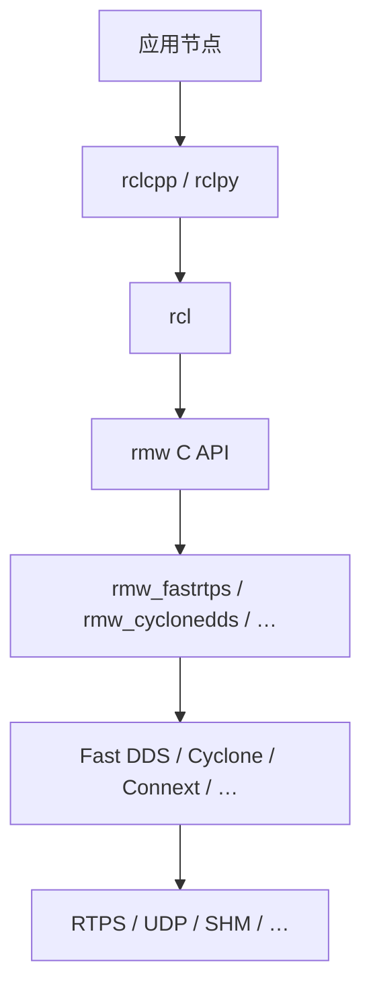

# RMW（ROS Middleware Interface）

## 一句话定义

**RMW** 是 ROS 2 的 **中间件抽象接口**：用纯 C API 把 `rcl` / 客户端库与底层通信实现（通常是某家 **DDS/RTPS**，经 `rmw_*` 适配包）隔开，从而支持多 vendor、隐藏 DDS 细节，并允许在运行时切换实现。

## 英文缩写速查

| 缩写 | 英文全称 | 简要说明 |
|------|----------|----------|
| RMW | ROS Middleware | 本页：客户端库与中间件实现之间的抽象层 |
| DDS | Data Distribution Service | 常见底层中间件标准（OMG） |
| RTPS | Real-Time Publish-Subscribe | DDS 互操作线协议 |
| RCL | ROS Client Library (C) | 位于 RMW 之上的公共客户端逻辑 |
| QoS | Quality of Service | 可靠性、历史、截止期等；RMW 映射子集到 DDS |

## 为什么重要

- 排障「节点发现不到 / topic 无数据」时，问题常在 **RMW vendor + QoS + 发现**，而非业务回调。
- 真机栈可能 **钉死非默认 RMW**（如 [unitree_ros2](../entities/unitree-ros2.md) → `rmw_cyclonedds_cpp`），与桌面默认 [Fast DDS](../entities/fast-dds.md) 不一致会导致「本机通、跨机不通」。
- 写应用应停在 rclcpp/rclpy；只有做新中间件适配、深度互通或性能剖析才需要读 [ros2/rmw](../../sources/repos/rmw.md)。

## 核心原理

### 分层（设计一手）

设计动机（[design.ros2.org](https://design.ros2.org/articles/ros_middleware_interface.html)）：

1. 复用成熟 DDS，而不是再造一套 ROS 1 式自研协议。
2. **不绑死单一实现**（许可、平台、 footprint、性能不同）。
3. 接口尽量 **对 DDS 不可知**，便于将来非 DDS 实现。
4. 接口之上只见 **ROS 消息**；之下由实现 + **type support** 做转换或直序列化。

### 接口仓提供什么

[ros2/rmw](https://github.com/ros2/rmw)（Apache-2.0，Quality Level 1）定义最小原语：init/shutdown、Node、Publisher/Subscription、Service、wait set / guard condition、图内省、分配器与错误处理等。具体 vendor 在独立仓（`rmw_fastrtps`、`rmw_cyclonedds`、…）；加载策略由 `rmw_implementation` 等配合。

### 发行版常见实现（官方 Vendors 表）

| 产品 | RMW 标识 | 备注 |
|------|----------|------|
| [Fast DDS](../entities/fast-dds.md) | `rmw_fastrtps_cpp` | 多数二进制默认；随发行包提供 |
| [Cyclone DDS](../entities/cyclone-dds.md) | `rmw_cyclonedds_cpp` | tier-1；Unitree 等常用 |
| RTI Connext | `rmw_connextdds` | 另装 Connext |
| GurumDDS | `rmw_gurumdds_cpp` | 社区支持；另装 vendor |

底层语义与互通见 [DDS 通信机制](./dds-communication.md)；标准层见 [OMG DDS / RTPS](../../sources/sites/omg-dds-spec.md)。

### 概念映射（设计文）

| ROS | 典型 DDS 映射 |
|-----|----------------|
| 每个 Node | 一个 DomainParticipant（同进程多节点 → 多 Participant） |
| Pub / Sub | DDS pub/sub；DataWriter/Reader/Topic 不直接暴露给 ROS API |
| 部分 QoS | 映射到 DDS QoS；其余策略默认不经 ROS API |

## 工程实践

### 开源状态（2026-07-28）

- **接口与文档已开源**：`ros2/rmw`、Design 文、`ros2_documentation` RST、各开源 `rmw_*` / Fast / Cyclone。
- **商业 vendor**：Connext、GurumDDS 等需另装；RMW 适配可能随 ROS 二进制提供。

### 切换与钉死

1. 安装对应包后设置：`export RMW_IMPLEMENTATION=rmw_cyclonedds_cpp`（或 `rmw_fastrtps_cpp` 等）。
2. **写入仓库**（CI、launch、docker）：与 `ROS_DISTRO`、Domain ID、QoS profile 一起版本化。
3. 切换后执行 `ros2 daemon stop`，避免 CLI 仍连旧 RMW daemon。
4. 源码工作区新装 DDS 后常用 `colcon build --cmake-clean-cache` 让 RMW 包重新检测依赖。
5. **默认规则**：有 Fast DDS 时通常默认它；否则按实现标识字母序（亦查 [REP-2000](https://reps.openrobotics.org/rep-2000/)）。

### 调试清单

- `echo $RMW_IMPLEMENTATION`；未设置则按 distro 默认。
- 全机（含 `ros2` CLI、bag、桥接）统一同一标识；跨 vendor 互通 **非保证**。
- QoS 不兼容会静默无匹配——对照 [dds-communication](./dds-communication.md)。
- 1 kHz 力矩环不要默认走 DDS topic（[运控中间件指南](../queries/real-time-control-middleware-guide.md)）。

## 局限与风险

- RMW 抽象有成本；尾延迟与发现流量仍由 **具体 vendor** 主导。
- 「同一 RTPS」≠「任意 RMW 组合都能互通」；官方列举过 `WString` 等跨 vendor 坑。
- 设计文中的 Connext/OpenSplice 历史包名可能过时——以当前 distro Vendors 页为准。
- 误设 `RMW_IMPLEMENTATION` 为未安装标识会直接启动失败。

## 关联页面

- [ROS 2 基础](./ros2-basics.md)
- [DDS 通信机制](./dds-communication.md)
- [Fast DDS](../entities/fast-dds.md)
- [Cyclone DDS](../entities/cyclone-dds.md)
- [unitree_ros2](../entities/unitree-ros2.md)
- [ROS 2 vs LCM](../comparisons/ros2-vs-lcm.md)
- [实时运控中间件指南](../queries/real-time-control-middleware-guide.md)

## 参考来源

- [ROS 2 Design：Middleware Interface](../../sources/sites/ros2-design-rmw-interface.md)
- [不同中间件 Vendor / 多 RMW How-To](../../sources/sites/ros2-rmw-middleware-vendors.md)
- [ros2/rmw 仓](../../sources/repos/rmw.md)
- [ros2 元仓](../../sources/repos/ros2.md) · [官方文档总归档](../../sources/sites/ros2-official-documentation.md)

## 推荐继续阅读

- Design 原文：https://design.ros2.org/articles/ros_middleware_interface.html
- `rmw` API：https://docs.ros.org/en/rolling/p/rmw/generated/
- Vendors 概念页：https://docs.ros.org/en/humble/Concepts/Intermediate/About-Different-Middleware-Vendors.html
- 多 RMW 操作：https://docs.ros.org/en/humble/How-To-Guides/Working-with-multiple-RMW-implementations.html
