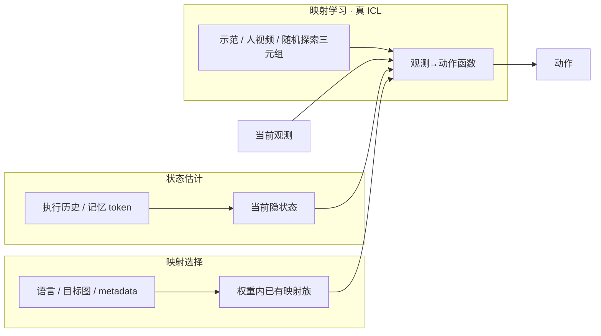
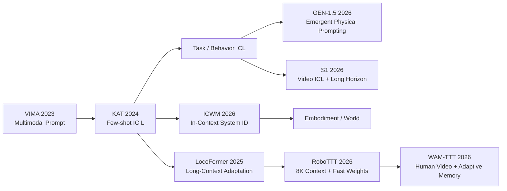

# 机器人 In-Context Learning（上下文学习）

## 一句话定义

**机器人 In-Context Learning（ICL，上下文学习）**：在 **不更新模型权重** 的前提下，把一段 **示范轨迹、人类视频或任务无关交互片段** 放进策略的 **上下文窗口**，让模型从窗口内的配对样本中 **归纳出新的观测→动作映射**，并应用到当前场景——类比语言模型 few-shot prompt，但输入是连续图像、力与动作序列。

## 英文缩写速查

| 缩写 | 英文全称 | 简要说明 |
|------|----------|----------|
| ICL | In-Context Learning | 上下文内归纳新映射，权重不变 |
| VLA | Vision-Language-Action | 常以 \(a_t=\pi(o_t,\ell)\) 形式隐含马尔可夫假设 |
| IL | Imitation Learning | 遥操作 / 人视频示范是 ICL 主要数据来源 |
| TTT | Test-Time Training | 测试时用梯度写权重；与 ICL 目标重叠但机制不同 |
| Sim2Real | Simulation to Real | 本篇亦指仿真 rollout 作 prompt 驱动真机 |

## 为什么重要

- **部署适应轴：** 新任务、新相机位姿、新末端执行器时，**当前帧往往不足以定动作**；上下文补上缺失信息，可避免每次重训整条策略。
- **名词过载：** 2026 年「上下文」同时指 **π0.7 的 metadata 选择**、**MemoryVLA 的历史记忆**、**GEN-1.5 的 physical prompt** 与 **RoboTTT 的 8K 步 fast weights**——混用会误判机制与代价。
- **与 Foundation Policy 交汇：** [GEN-1.5](../entities/generalist-gen15-one-shot.md) 报告 **无显式 ICL 训练** 下涌现 one-shot；[S1](../entities/skild-s1.md) 则把 ICL 写成 **预训练目标本身**（任务只经视频示范指定），并宣称覆盖 **未见 + 最长约 10 分钟**；[Qwen-RobotManip](../entities/qwen-robot-manip.md) 用 in-context chunk 做行为风格适配——预训练规模可能改变「适应」的数据与算力预算（闭源 / 技术报告，需独立验证）。
- **通用 LLM 控机器人不是长窗口 ICL：** [Embody](../entities/anthropic-embody.md) 的代际优势来自 **短时程重试**；截掉远期上下文多数模型不掉分。这是失败后改策略，不是从示范轨迹归纳新映射——对照 [LLM 控制接口](./llm-robotics-control-interfaces.md)，勿与本页真 ICL 混读。

---

## 三类不确定性：先分清「上下文在干什么」

标准 VLA 可写为 \(a_t = \pi(o_t, \ell)\)，隐含 **马尔可夫假设**：当前观测足以定下一步动作。真实部署中，同一画面可能对应多种合法动作、相机/本体变化会改写像素–运动学关系、多阶段任务当前帧看不到进度——**缺失信息往往能从上下文 \(C\) 获得**。

| 不确定性类型 | 典型上下文内容 | 读完之后什么变了 | 是否真 ICL |
|--------------|----------------|------------------|------------|
| **映射选择** | 语言指令、目标图像、速度/质量等 episode metadata | 从权重里 **已有映射族中挑一个** | 否 |
| **状态估计** | 过去若干帧执行历史、记忆 token | **代入映射的状态** 更新 | 否 |
| **映射本身** | 遥操作示范、人视频、系统辨识片段 | **观测→动作函数** 改变 | **是** |

**判别口诀：** 读完一条 **任务示范** 后，模型「怎么做这件事」变了 → ICL；读完 **历史帧** 后，只是知道「做到哪一步了」→ 记忆；读完 **metadata** 后，只是换了一种执行风格 → 条件化选择。

### 三类学习对象（与上文互补）

[Mbot 具身 ICL 综述（2026-09）](../../sources/blogs/wechat_mbot_embodied_icl_survey_2026-09.md) 从 **归纳对象** 再拆一层（可与上表交叉读）：

| 学习对象 | Context 典型来源 | 代表工作 |
|----------|------------------|----------|
| **Task / Behavior** | 机器人 demo、人视频、XR 遥操作 | KAT、[GEN-1.5](../entities/generalist-gen15-one-shot.md)、[S1](../entities/skild-s1.md) |
| **Embodiment / World** | 任务无关主动探索、系统辨识片段 | ICWM、[LocoFormer](../entities/paper-notebook-locoformer-generalist-locomotion-via-long-contex.md) |
| **History / Memory** | 自身 rollout、失败、跨 episode 历史 | LocoFormer、[RoboTTT](../entities/paper-robottt-test-time-training-vla-context.md) |

未来基础模型很可能在同一上下文窗口内 **同时** 推断「做什么」「身体/环境如何工作」「刚才发生了什么」。

### Pure ICL 与 TTT（双层口径）

| 范式 | 测试时更新主权重 | 典型机制 | 代表 |
|------|------------------|----------|------|
| **Pure ICL** | 否 | Attention、KV Cache、Transformer-XL | KAT、ICWM、LocoFormer、GEN-1.5、S1 |
| **TTT / Fast-Weight** | 否（仅快权重） | 自监督内循环写 Adaptive Memory | [RoboTTT](../entities/paper-robottt-test-time-training-vla-context.md)、[WAM-TTT](../entities/paper-wam-ttt-human-video-test-time-steering.md) |

[WAM-TTT](../entities/paper-wam-ttt-human-video-test-time-steering.md) 对照实验：**同人视频纯塞进 context（WAM-ICL 7.1%）不如写快权重（46.2%）**，甚至低于无视频 backbone（32.5%）——说明 **并非所有部署证据都能靠加长 context 利用**；[RoboTTT](../entities/paper-robottt-test-time-training-vla-context.md) 对 GDN 的对照则显示 **8K 步历史需真梯度式快权重才能持续 scaling**。产业侧 [GEN-1.5](../entities/generalist-gen15-one-shot.md)/[S1](../entities/skild-s1.md) 的 one-shot 仍走 **零梯度 physical/video prompt**；工程上更可能走向 **短期 prompt + 长期 fast weights + retrieval** 混合（见 Mbot 综述 §7.4）。

---

## 技术演化谱系（2023–2026）

[Mbot 综述](../../sources/blogs/wechat_mbot_embodied_icl_survey_2026-09.md) 将具身 ICL 概括为三阶段、八项主线：

| 阶段 | 年份 | 要点 |
|------|------|------|
| **Prompt 化** | 2023–2024 | VIMA 统一多模态 prompt；KAT 冻结 LLM + 关键点 token 做 few-shot ICIL |
| **在线适应化** | 2025–2026 | ICWM 测试时系统辨识；LocoFormer 跨 episode TXL；RoboTTT/WAM-TTT 快权重记忆 |
| **Foundation-Scale** | 2026– | GEN-1.5 涌现 physical prompting；S1 显式 ICL 预训练 + 分钟级未见任务 |

**八项对照（文内深读坐标）：**

| 工作 | Context 来源 | 参数更新 | 文内关键数字/证据 |
|------|--------------|----------|-------------------|
| VIMA | 文本+图像+视频 prompt | 否 | L4 零样本最高 **2.9×** 于基线 |
| KAT | ≤10 demo | 否 | **>40 demo** 后纯 ICL 触顶 |
| ICWM | N=5 任务无关探测 | 否 | 假 context（180° 错位）比无 context 更差 |
| LocoFormer | 跨 episode rollout | 否 | 10 台未见机零样本 **0.96**，5s 适应 **0.98** |
| RoboTTT | 人视频+失败+DAgger | 快权重 | **8K** 步 context，比 1K **+63%** |
| WAM-TTT | 无标注人玩耍视频 | video 侧快权重 | TTT **46.2%** vs WAM-ICL **7.1%** progress |
| GEN-1.5 | 3–12s sensorimotor demo | 否 | one-shot **~59%**（闭源自报） |
| S1 | 单条任务视频 | 否 | 100k h 未见 **66%** vs 语言 VLA **9%**（闭源自报） |

---

## 按示范来源分线

### 1. 遥操作轨迹（同坐标系示范）

- **训练塑造归纳能力：** One-Shot Imitation Learning 等在训练时构造「一条示范 + 一次查询」，优化 **读完示范后的执行表现**。
- **表征形态：** ICRT 类 **图像/状态/动作 token 交错序列**；Instant Policy **图 diffusion**；KAT **关键点 + 文本 Transformer**；BPP **示范 embedding + cross-attention**（见 [BPP 实体](../entities/paper-behavior-prompting-policy.md)）；[StellaVLA](../entities/paper-stellavla-structured-icl-vla.md) **结构化计划、子目标与 2D/3D 运动 verbalization**。
- **Action tokenizer：** 相邻动作在 latent 空间是否平滑（如 LipVQ-VAE）直接影响从示范归纳出的控制是否可执行。
- **配对数据：** 同任务多条示范互相作 prompt/query；或仿真程序化生成（SynthICL）。
- **后装能力：** RICL 在预训练 VLA（如 π0-FAST）上做小规模 in-context post-training。

### 2. 人类视频（跨 embodiment）

- **核心难点：** 视频无机器人动作标签 + **embodiment gap**。
- **路线：** Vid2Robot（视频–轨迹配对 + 对比对齐）；[MimicDroid](../entities/paper-notebook-mimicdroid-in-context-learning-for-humanoid-robo.md)（无标注人视频 + retargeting + patch masking）；Point Policy（语义关键点统一人与机观测）。
- **对照：** [WAM-TTT](../entities/paper-wam-ttt-human-video-test-time-steering.md) 用 **fast-weight 记忆** 而非 ICL 上下文，同人视频 OOD 上显著优于 WAM-ICL（**46.2% vs 7.1%** progress，自报）。

### 3. 任务无关随机运动（系统辨识）

- **ICWM 设定：** 任务开始前数秒 **随机运动**，记录 (动作前画面, 动作, 动作后画面) 三元组作 prompt。
- **归纳对象：** 不是「任务怎么做」，而是 **当前相机/本体下动作如何改变画面**——相机挪动、夹爪更换后重跑几秒即可重校准。
- **仍属 ICL：** 改变的是 **映射本身**（系统动力学），而非任务选择或 episodic 状态。

---

## 规模涌现与产业案例

| 工作 | 上下文装什么 | ICL 训练 | 要点 |
|------|------------|----------|------|
| [GEN-1.5](../entities/generalist-gen15-one-shot.md) | 3–12s physical prompt（人/机/仿真） | **无显式 ICL 设计**；8+ 月预训练涌现 | one-shot ~59%；10 步微调 ~83%（闭源自报） |
| [S1](../entities/skild-s1.md) | 一条任务视频（可跨场景/视角/本体） | **显式**：预训练任务只经示范指定 | 未见任务最长约 10 min；100k h 档未见 66% vs 语言 VLA 9%（闭源自报） |
| [HOST](../entities/paper-host-one-shot-human-video.md) | 单条真人视频 + 进度流形 | **显式**：TCC/DTW 对齐 + 自接地级联 | 八任务 62%；29 s；不改权重；代码+HF 权重已开 |
| [Qwen-RobotManip](../entities/qwen-robot-manip.md) | 近期 H 个 (o,s,a) chunk | in-context policy adaptation | **stochastic context sampling** 防退化为复制最近 chunk |
| [Light REACT](../entities/light-react.md) | 近期全身交互历史（运动反馈） | **仿真 meta-training** 学读上下文 | **全身** 故障/扰动下重组行走/爬行/恢复；权重冻结；**未开源**（2026-09 产业发布） |

GEN-1.5 与显式 ICL 方法的关键差异：**未把「读完示范后的表现」写入训练目标**；作者假设物理数据分布的 burstiness / 重复循环模式与语言 ICL 涌现机制类似（**假设性解释**）。S1 走相反路线：把「从示范学习」当成预训练外环，并强调语言 prompt 在 **未见长程** 上几乎不 scale。

---

## 非 ICL 的「上下文」与正交路径

### 映射选择：π0.7

[π0.7](../methods/pi07-policy.md) 把语言、子任务、速度/质量 metadata、subgoal image 等塞进 prompt——描述 **目标与风格**，完成行为的映射已在权重中；metadata **选择** 映射，不改变函数形式。

### 状态记忆

MemoryVLA、MemER、ContextVLA、MEM、HiMe 等解决 **部分可观测**：杯子放哪了、多阶段任务进度。**形式** 可与示范轨迹同为 \((o,a)\) 序列，但读完 **不改变** 观测→动作函数，只更新状态估计。技术难点在 **选择与压缩**（关键帧、门控读取），而非归纳新任务。

### Test-Time Training（TTT）

[RoboTTT](../entities/paper-robottt-test-time-training-vla-context.md) 用 **fast weights** 把长达 **~8K 步** 历史写入可在线更新的参数；VANE 等用 **未来视觉预测** 门控是否提交更新。**需要梯度**、难回退、对在线安全要求更高——与 ICL **目标重叠、代价不同**。

---

## 开放问题与评测方向

### 机制与表征（2026-08 具身智能之心 + 2026-09 Mbot 合并）

1. **涌现机制：** 除 GEN-1.5 外，机器人 ICL 多靠 **显式训练**（S1 是产业侧最强的显式样本）；何种数据分布 / 规模可预测涌现？与显式 ICL 的泛化行为是否系统不同？短程涌现与 **10 分钟未见** 是否同一现象的两端？
2. **示范形态：** token 序列、图节点、关键点、结构化计划、原始感觉运动序列——抽象高则归纳易但丢接触/力信息；抽象低则保留全信息但对应关系难建立。
3. **Long-context scaling：** 控制回路需高频动作输出，上下文变长直接增加 **每步推理成本**（不同于语言模型「延迟」问题）；何信息必须逐帧保留、何信息可压成一个 token 仍开放。
4. **Context 四问（Mbot §4.2）：** 来自哪里、如何表示、存在哪里（Attention vs TXL vs Fast Weights）、如何 **证明真在用 context**（假 context、unseen **task** 而非仅 unseen object）。

### 严格 ICL 评测（Mbot §7.8）

未来 benchmark 宜包含：**同一观测配不同 prompt**、假/冲突 context、完全未见任务、prompt 与执行环境不一致、跨 embodiment、context 长度 scaling curve、移除 context 后的性能落差——避免把普通 OOD 泛化误判为 ICL。

---

## 与其他页面的关系

- [Foundation Policy](./foundation-policy.md) — ICL 是部署期适应手段，不改变「大规模预训练通用策略」母类定义
- [Imitation Learning](../methods/imitation-learning.md) — 示范数据与 one-shot / few-shot 训练目标的传统路线
- [VLA](../methods/vla.md) — 马尔可夫 VLA 与长上下文 / 记忆增强 VLA 的分叉
- [操作任务](../tasks/manipulation.md) — 短程原子操作是 GEN-1.5 one-shot 主战场；S1 把评测轴推到长程未见
- [S1（Skild）](../entities/skild-s1.md) — 显式 ICL 预训练 + 视频 prompt；闭源自报 10 min 未见任务
- [HOST](../entities/paper-host-one-shot-human-video.md) — 开源单视频 one-shot；进度对齐 + 自接地未来观测
- [The Imitator Game](../entities/paper-imitator-game.md) — 意图级模仿基准；L3 / 未见零样本把「视频条件」打回原形
- [Zero-WAM](../entities/paper-zero-wam.md) — 人视频当 WAM 任务规格；HumanGen ICL 对 + IFP；代码待发布
- [StellaVLA](../entities/paper-stellavla-structured-icl-vla.md) — 结构化检索示范；VLA-Arena 0.63；无官方代码
- [四路线对比（WAM-TTT / RoboTTT / StellaVLA / Zero-WAM）](../comparisons/wam-ttt-robottt-stellavla-zero-wam-embodied-icl.md) — 2026-08 可核对论文纵横向坐标系
- [ICL 纵深路线](../../roadmap/depth-icl.md) — Stage 0–5 学习路径（判别边界 → 示范表征 → 遥操作/人视频两条数据线 → 机制选型 → 涌现与评测）
- [跨具身知识链](../overview/hub-cross-embodiment.md) — 人视频 / 仿真 prompt→真机与重定向、域随机不同机制
- [RealAB 14 篇地图](../overview/realab-14-papers-technology-map-2026.md) — BPP 等 in-context 操作索引
- [Light REACT](../entities/light-react.md) — 全身运动反馈作上下文；故障下行走/爬行/恢复（亮源新创部署段）
- [LocoFormer（待深读）](../entities/paper-notebook-locoformer-generalist-locomotion-via-long-contex.md) — Skild 系跨 episode TXL 运动适应；S1 的技术前序
- [具身大模型分类学选型闭环](../queries/embodied-fm-taxonomy-loop.md) — 选型链在 VLA 层给出 I/O 边界与时延约束；ICL 是同一层的 **部署期适应旋钮**，长上下文直接吃掉该链关心的每步推理预算
- [接触力旋量闭环](../queries/contact-wrench-closed-loop.md) — 示范抽象越高越易归纳，但接触力信息正是这条链所需；ICL 上下文用关键点/图节点表示时，力与接触细节被丢在这里

## 推荐继续阅读

- [GEN-1.5 官方博客归档](../../sources/blogs/generalist_gen15_one_shot.md)
- Generalist AI 原文：<https://generalistai.com/blog/gen-1.5>
- Skild S1 原文：<https://www.skild.ai/blogs/s1>
- 综述原文（具身智能之心）：<https://mp.weixin.qq.com/s/V_Dm8kHvB2YxtGY7qScjXA>
- 演化综述（Mbot 具身智能实验室）：<https://mp.weixin.qq.com/s/WmtTSKS85i2ZJJijFewy3A>

## 参考来源

- [Embodied ICL 调研综述：Few-Shot → Physical Prompting（Mbot 具身智能实验室，2026-09）](../../sources/blogs/wechat_mbot_embodied_icl_survey_2026-09.md)
- [万字长文：机器人上下文学习到底在学什么（具身智能之心，2026-08-25）](../../sources/blogs/wechat_embodied_heart_robot_icl_gen15_survey_2026-08-25.md)
- [GEN-1.5: Embodied Foundation Models are One-Shot Learners（Generalist AI 博客归档）](../../sources/blogs/generalist_gen15_one_shot.md)
- [S1: In-Context Learning for Robotics（Skild 博客归档）](../../sources/blogs/skild_s1_in_context_learning.md)
- [每日智能四篇 ICL 纵横向解读（2026-08-31）](../../sources/blogs/wechat_meiri_zhineng_embodied_icl_four_papers_2026-08-31.md)
- [亮源新创 Light REACT 全身韧性 ICL 发布（2026-09-09）](../../sources/blogs/wechat_lightorigins_light_react_2026-09-09.md)
