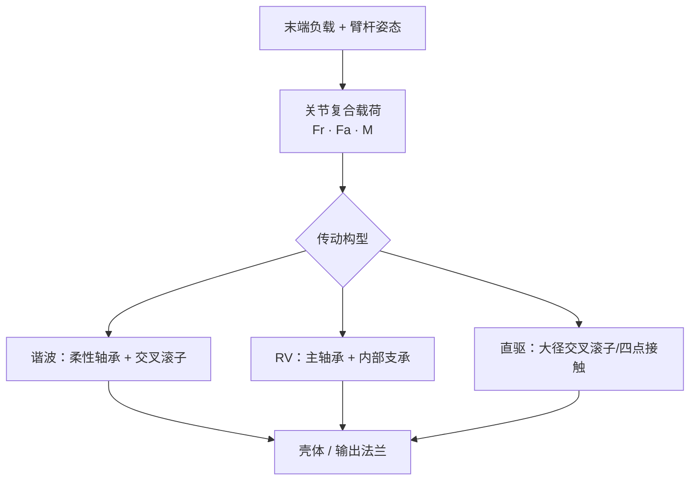

# 机器人关节轴承选型（载荷路径与五笔账）

## 一句话定义

**关节轴承**占 BOM 比例不高，却处在 **径向–轴向–倾覆力矩** 复合载荷的关键节点；选型不是翻样本选最大 C 值，而是先画清 **谐波 / RV / 直驱** 各自载荷路径，再用 **载荷谱、刚度串联、精度预算、寿命累积与预紧配合** 五笔账落到可验收指标。

## 英文缩写速查

| 缩写 | 英文全称 | 简要说明 |
|------|----------|----------|
| RB / RA | Cross-Roller Bearing types | 交叉滚子分割结构；RB 外圈分半、RA 内圈分半 |
| RV | Rotational Vector reducer | 摆线 RV 减速器，轴承用量大 |
| P5 / P4 | Bearing precision grades | GB/T 307（ISO 492）精度等级，数字越小越高 |
| L10 | Basic rating life | 90% 可靠度基本额定寿命 |
| S0 | Static safety factor | 静安全系数 \(C_0/P_0\) |
| ISO 281 | Rolling bearings — Dynamic load ratings and rating life | 寿命计算国际标准 |
| GB/T 30819 | Harmonic drive reducers for robots | 谐波减速器国标（2024 版） |

## 为什么重要

- **精度与寿命的隐藏杠杆：** 重复定位、末端刚度、温升与整机寿命大量由轴承接触与预紧决定，而非仅由减速器齿隙决定。
- **布置决定逻辑：** 谐波输出 **交叉滚子**、波发生器 **柔性轴承**、RV **主轴承**、直驱 **四点接触/交叉滚子** — 位置不同，失效后果与选型公式完全不同。
- **与关节模组流程衔接：** [自研关节模组开发流程](./joint-module-self-development-workflow.md) 强调装配预紧与一致性；本页补齐 **轴承级** 计算与现场判据。
- **量产与售后成本：** 选型阶段多算一天载荷谱，常比售后一整年返修便宜 — 与 [人形量产工程](./humanoid-mass-production-engineering.md) 同构。

## 核心原理

### 第一步：载荷路径与轴承角色

| 关节构型 | 轴承布置要点 |
|----------|--------------|
| **谐波** | 电机轴小轴承；**柔性轴承**（椭圆变形 + 滚动疲劳）；输出 **交叉滚子**（常一体化） |
| **RV** | **主轴承**承几乎全部外载；内部 9–15 套支承轴承影响噪声/温升/一致性 |
| **直驱** | 大直径 **四点接触球** 或 **交叉滚子** 直接支承转子 |

### 交叉滚子轴承（输出端主力）

- 滚子 90° 交错，**一套** 抗双向轴向、径向与 **倾覆力矩**；关节反力方向多变时避免双轴承复杂预紧。
- **RB 型** 外圈分半 — 输出法兰多直接装内圈整体侧；精度 **P5**，关键轴 **P4**；寿命目标惯例 **≥6000 h**。
- 当量动载荷（含倾覆）：

\[
P = X F_r + Y F_a + Z M
\]

静安全系数：\(S_0 = C_0/P_0\)，滚子轴承一般 **≥1.5**，冲击工况再放大。

### 谐波柔性轴承

- 极薄套圈随凸轮 **周期性椭圆变形** + 滚动接触疲劳 — 工况独特。
- **柔轮–柔性轴承外圈过盈**；必须专用工装，禁止敲击。
- 选型按厂方 **允许转速–疲劳寿命曲线**，不能只看额定动载荷 C。
- 参考 **GB/T 30819-2024**；备件 **同型号同批次**，轮廓尺寸逐一核对。

### 薄壁与四点接触

- 腹、肘、腕及电机轴支撑；**四点接触** 一套抗双向轴向 + 倾覆。
- 薄壁套圈弹性大 → **安装面圆度/平面度/过盈** 必须进图纸与工艺文件。

### 五笔选型账

| 账 | 要点 |
|----|------|
| **1. 载荷** | 用 **载荷谱**（实测/仿真），Miner 累积；忌单峰值算到底 |
| **2. 刚度** | 末端刚度 ≈ 减速器刚度 **串联** 轴承刚度；预紧↑刚度↑、摩擦与温升↑ |
| **3. 精度** | P5/P4 常见；回差大头在 **齿隙与装配** — 做装配链误差预算 |
| **4. 寿命** | \(L_{10}=(C/P)^\varepsilon·10^6\)，滚子 \(\varepsilon=10/3\)；99% 可靠度 × \(a_1\)；**+10℃ ≈ 脂寿命减半** |
| **5. 游隙/配合** | 交叉滚子常 **负游隙预紧**；过盈吃掉约 **60–70%** 径向游隙；座–轴同轴 **≤0.02 mm** |

### 润滑、摩擦与温升

- 交叉滚子以 **脂润滑** 为主（基油黏度建议 ISO VG 68+）；填充 **25–35%**。
- 关节级要求起动力矩/运转力矩 **低且稳定** — 低速爬行与振动直接伤轨迹精度。
- **正常温升宜 ≤30℃**（RV 减速器温升考核常用 30℃）；异常先查润滑与预紧。

## 工程实践

| 场景 | 建议 |
|------|------|
| RV 主轴承 | 输出额定载荷能力常由主轴承 **C / 刚度** 封顶 |
| 谐波输出 | 优先确认减速器是否 **集成交叉滚子** 模块 |
| 样机预紧标定 | 做 **预紧–力矩–温升** 三角试验，避免刚性好看、寿命打折 |
| 供应商 | RV 内部保持架工艺不稳定会在耐久台架暴露 — 选有 **批量装机史** 的供应方 |
| 与模态 | 轴承跨距与预紧进入 [结构模态](./robot-structural-modal-analysis.md) 低阶频率 |

## 局限与风险

- 本文为 **工程经验归纳**（Zane Hub 第三方解读），非某厂商官方设计手册；具体系数以所选轴承厂样本为准。
- **载荷谱依赖系统仿真/实测** — 早期无谱时寿命计算偏差大。
- 柔性轴承、RV 内部轴承 **定制件多**，供应链与备件策略需单独规划。

## 关联页面

- [Hardware 101 · 直线传动与轴承](../overview/humanoid-hardware-101-linear-transmission-bearings.md) — 图谱分类节点（丝杠 + 轴承概览）
- [自研关节模组开发流程](./joint-module-self-development-workflow.md) — 五件套与装配一致性
- [膝侧谐波判据](./humanoid-knee-harmonic-drive-limits.md) — 谐波柔轮疲劳与主承力链
- [执行器驱动链选型闭环](../queries/actuator-drive-chain-selection-loop.md)

## 参考来源

- [Zane Hub · 关节轴承选型（微信公众号）](../../sources/blogs/wechat_zanehub_robot_joint_bearing_selection.md)
- [自研关节模组流程（同作者线）](../../sources/blogs/wechat_zanehub_joint_module_self_development_workflow.md)

## 推荐继续阅读

- [原文链接（微信公众号）](https://mp.weixin.qq.com/s/rweTJtjvt8LaJLLM8eEYBg)
- GB/T 30819-2024《机器人用谐波齿轮减速器》
- GB/T 6391-2010（等同 ISO 281 滚动轴承额定寿命）
