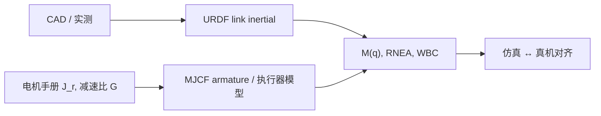

# 连杆惯量与转子惯量（Robot Link vs Rotor Inertia）

人形与腿足机器人的「关节有多沉」，在工程上往往来自 **两件不同的事**：**连杆刚体惯量**（机械结构质量分布）与 **电机转子经减速器反射的等效惯量**（传动链旋转部件）。混淆两者会导致仿真偏轻、PD 整定错位、SysID 在错误参数上收敛。

## 一句话定义

- **连杆惯量（link / body inertia）**：每个刚性连杆相对其质心的 **质量 + 惯性张量**，进入 $M(q)$、逆动力学与接触预测。
- **转子惯量 / 反射惯量（rotor / armature / reflected inertia）**：电机（及中间齿轮）旋转惯量经减速比 $G$ 映射到关节坐标后的 **附加惯量**，典型量级关系 $I_{\mathrm{arm}} \approx J_r G^2$。

## 为什么重要

| 场景 | 只改连杆惯量 | 只改 armature | 两者都需对齐 |
|------|-------------|---------------|-------------|
| 高减速比关节（谐波 1:50+） | 往往不够 | **关键** | ✅ |
| 全身质量分布 / 质心高度 | **关键** | 次要 | ✅ |
| WBC / TSID / 模型预测控制 | 影响 $M,C,g$ | 影响高频力矩环 | ✅ |
| RL + 固定 PD 增益 | 影响落地冲击 | 影响振荡与带宽 | ✅ |

> Pinocchio、Drake 等 **默认刚体模型** 消费 URDF 的 link 惯量；**不自动** 包含转子反射项——须在仿真器 joint 属性或执行器子模型中补齐（见 [Armature Modeling](./armature-modeling.md)）。

## 连杆惯量：规范与动力学角色

### URDF 中的表示

每个 `link` 的 `<inertial>` 块规定（一手规范：[ROS urdf/XML/link#inertial](http://wiki.ros.org/urdf/XML/link#inertial)）：

- `<mass value="..."/>`
- `<origin xyz="..." rpy="..."/>`：质心坐标系 **C** 相对 link 系 **L** 的位姿
- `<inertia ixx="..." ixy="..." .../>`：相对 **C** 的 $3\times3$ 惯性张量（含惯量积）

**常见坑：**

- CAD 导出时 **惯量积符号** 与 URDF 约定不一致 → 仿真侧向/扭转耦合错误。
- 未填 `<inertial>` → 默认为零，连杆在动力学中「无质量」。
- 碰撞几何（`<collision>`）与惯性几何不一致 → 接触对但惯性错。

### 在开放链动力学中的位置

[Lynch & Park《Modern Robotics》](../entities/modern-robotics-book.md) 第 8 章将各连杆 **空间惯量** 递归合成为广义惯性矩阵 $M(q)$，满足：

$$
M(q)\ddot q + C(q,\dot q)\dot q + g(q) = \tau
$$

这是 [Floating Base Dynamics](./floating-base-dynamics.md)、[Pinocchio](../entities/pinocchio.md)、[TSID](../concepts/tsid.md) 的共同底座。

### 辨识与最小参数集

并非 URDF 中 10 个惯性分量都可独立辨识。**Gautier & Khalil (1990)** 给出串联机器人 **最小惯性参数集** 的闭式计算，减少冗余参数、提升 SysID 鲁棒性（详见 [System Identification](./system-identification.md)）。

## 转子惯量：反射惯量与 `armature`

### 物理关系

单级减速比 $G$（电机转角 / 关节转角）时，转子惯量 $J_r$ 反射到关节侧：

$$
I_{\mathrm{arm}} \approx J_r \cdot G^2
$$

多级传动可对各级 $J_k$ 与剩余减速比平方加权求和（见 [Armature Modeling](./armature-modeling.md)）。

### MuJoCo 官方语义

MuJoCo 在 **joint** 上提供 `armature` 属性，明确表示 **不来自 body 质量的附加关节惯量**，并命名为 **reflected inertia**；官方用齿轮比 $G=3$ 的等价模型说明放大因子为 $G^2$（[XML Reference — armature](https://mujoco.readthedocs.io/en/latest/XMLreference.html)，测试用例 `armature_equivalence.xml`）。

```xml
<joint name="knee" type="hinge" armature="0.012" ... />
```

### 与 URDF 的分工

| 表示层 | 连杆惯量 | 转子/反射惯量 |
|--------|----------|---------------|
| URDF | `<link><inertial>` | **无标准字段** |
| MJCF | `<body>` 质量惯量 | `<joint armature="...">` |
| 工程实践 | CAD / 称重 / SysID | 电机手册 $J_r$ + 减速比计算 |

高减速比人形腿关节上，$I_{\mathrm{arm}}$ 有时 **大于** 连杆自身惯量；忽略它会使仿真关节显得「过轻、过脆」。

## 总关节惯量的心智模型

对单关节（简化）：

$$
I_{\mathrm{joint,eff}} \approx I_{\mathrm{link}} + I_{\mathrm{arm}}
$$

- $I_{\mathrm{link}}$：由该关节所驱动运动链上的连杆空间惯量投影得到（随构型 $q$ 变化）。
- $I_{\mathrm{arm}}$：近似常数（若减速比固定），来自转子与齿轮。

PD 增益若按 $I \omega^2$ 标定，应使用 **二者之和的有效惯量**，而不是只读 URDF 质量。



## 常见误区

- **把 armature 写进 URDF 质量**：破坏质心位置与重力项，且不同构型下等效惯量投影错误。
- **只用 CAD 惯量、不补 armature**：高减速比关节 Sim2Real 高频振荡的常见原因。
- **SysID 只随机化质量 ±20%**：未覆盖 $G^2$ 放大后的执行器惯量时，域随机化可能「盖错地方」。
- **混淆 armature 与 joint damping/friction**：MuJoCo 中三者独立；摩擦需另辨识。

## 关联页面

- [Armature Modeling（电枢惯量建模）](./armature-modeling.md) — 反射惯量公式、双驱动、BeyondMimic PD 标定
- [System Identification](./system-identification.md) — 连杆参数与执行器层辨识
- [Floating Base Dynamics](./floating-base-dynamics.md) — $M(q)$ 与 CRBA
- [MuJoCo](../entities/mujoco.md) — 仿真器中的 joint 参数
- [Sim2Real](./sim2real.md) — 质量/惯量随机化与真机偏差

## 参考来源

- [机器人连杆惯量与转子惯量（一手资料索引）](../../sources/papers/robot_link_rotor_inertia_primary_refs.md) — URDF 规范、Modern Robotics Ch.8、Gautier & Khalil 1990、MuJoCo `armature` 官方定义

## 推荐继续阅读

- [Modern Robotics 官方 PDF](https://hades.mech.northwestern.edu/images/7/7f/MR.pdf) — 第 8 章开放链动力学
- [Gautier & Khalil 1990 — 最小惯性参数集](https://doi.org/10.1109/70.56657)
- [MuJoCo XML Reference — joint armature](https://mujoco.readthedocs.io/en/latest/XMLreference.html)
