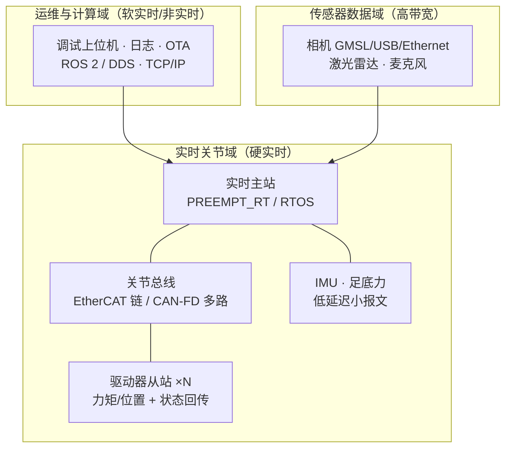

# 机器人整机通信架构（总线分域 → 拓扑 → 时钟同步 → 延迟预算）

## 一句话定义

**整机通信架构**回答：几十个关节、多路相机与 IMU、主控与外部运维工具之间，**数据分几个域、走什么拓扑、时间基准怎么统一、从传感到力矩输出的延迟预算怎么分配**——单点协议选型（[CAN vs EtherCAT](../comparisons/can-vs-ethercat-joint-bus.md)）只是其中一层。

## 英文缩写速查

| 缩写 | 英文全称 | 简要说明 |
|------|----------|----------|
| EtherCAT | Ethernet for Control Automation Technology | 工业实时以太网，本页主要看其拓扑与分布式时钟 |
| DC | Distributed Clocks | EtherCAT 分布式时钟，从站间同步机制 |
| CAN-FD | CAN with Flexible Data-Rate | 高带宽 CAN 变体，关节总线常用 |
| PTP | Precision Time Protocol | IEEE 1588 时间同步协议，以太网域对齐时间基准 |
| DDS | Data Distribution Service | ROS 2 底层通信标准，服务非硬实时域 |
| GMSL | Gigabit Multimedia Serial Link | 车载/机器人常用高带宽相机串行链路 |
| RTT | Round-Trip Time | 往返时延，总线闭环延迟的常用度量 |
| QoS | Quality of Service | 服务质量策略，DDS 侧可靠性/时效性配置 |

## 为什么重要

- **延迟直接吃掉控制裕度**：1 kHz 力控下，多花 1 ms 相当于把相位裕度削掉一大截；[控制环路延迟建模](../formalizations/control-loop-latency-modeling.md) 说明延迟必须当设计变量而不是"实现细节"。
- **带宽饱和的症状会伪装成算法问题**：CAN 负载率过高导致偶发丢帧，表现为个别关节"卡一下"，很容易被误判成策略抖动。
- **多传感器融合依赖同一时间基准**：[状态估计](./state-estimation.md) 与 [传感器融合](./sensor-fusion.md) 的一致性上限由时间戳质量决定，不是滤波器调参能补的。
- **架构决定可维护性**：拓扑顺序、地址分配、诊断计数器的可见性，决定了"哪一段线出问题"能否在 5 分钟内定位。

## 核心原理

### 三层分域

分域的判据是**截止时间与失效后果**：关节域丢一帧要有明确降级策略；传感器域允许缓冲与丢帧；运维域允许重传与阻塞。**把三者混在一个网口、一个进程、一套 QoS 里，是整机通信最常见的架构性错误。**

### 带宽与周期计算

关节域带宽按「每关节每周期字节数 × 关节数 × 控制频率」估算，双向都要算，并留出协议开销与余量：

- **CAN/CAN-FD**：负载率是核心指标，工程上给关节域留足余量（常见做法是不超过 50–60% 稳态负载），并按优先级分配 ID；关节多时分多路总线而不是硬提波特率。
- **EtherCAT**：单帧汇聚多从站，带宽压力小得多，但**拓扑顺序即地址顺序**，换线序会改变从站编号；主站周期抖动是主要风险，见 [EtherCAT 主站优化 Query](../queries/ethercat-master-optimization.md)。
- **传感器域**：多路相机按分辨率×帧率×压缩比估算，注意 USB 共享控制器带宽与时间戳质量问题。

### 时钟同步：三种精度层级

| 层级 | 机制 | 典型量级 | 用在哪 |
|------|------|----------|--------|
| 总线级 | EtherCAT 分布式时钟（DC） | 亚微秒 | 多关节采样/执行同步 |
| 网络级 | IEEE 1588 PTP / gPTP | 微秒级 | 主控与传感器计算节点对齐 |
| 应用级 | 硬件触发 + 主机时间戳标定 | 十微秒–毫秒 | 相机/雷达与 IMU 对齐 |

原则：**能硬件触发就不要软件打时间戳**；确实要软件时间戳时，必须标定固定偏置并记录抖动。算法层面见 [时钟同步算法](./clock-synchronization-algorithms.md)。

### 端到端延迟预算表

把"传感 → 力矩"的链路拆成可测量的段，每段给上限，加总后与控制器设计假设比对：

| 段 | 内容 | 常见处理 |
|----|------|----------|
| 采样 | 编码器/IMU 采样与滤波 | 与总线周期对齐，避免相位漂移 |
| 上行 | 从站 → 主站 | 一个总线周期 |
| 计算 | 状态估计 + 控制/策略推理 | 实时线程，最坏执行时间而非平均 |
| 下行 | 主站 → 驱动器 | 一个总线周期 |
| 执行 | 电流环建立 + 力矩形成 | 见 [FOC](./field-oriented-control.md) 电流环带宽 |

策略推理频率低于控制频率时，用 [控制/推理频率解耦](./control-inference-frequency-decoupling.md) 处理，不要让慢环阻塞快环。

## 工程实践

1. **先画分域图与拓扑图**，标出每段的介质、周期、带宽占用与时钟来源；这张图是硬件、固件、控制三方的共同契约。
2. **算完再选**：带宽表与延迟预算表先出，再决定关节域用 [CAN-FD](./can-fd.md) 多路还是 [EtherCAT](./ethercat-protocol.md) 单链（选型对比见 [CAN vs EtherCAT](../comparisons/can-vs-ethercat-joint-bus.md)）。
3. **实测而非推测**：用 GPIO 翻转 + 示波器测端到端延迟，采样上万周期出**抖动直方图与最坏值**；只看均值会漏掉致命的长尾。
4. **诊断可见性**：把总线错误计数、丢帧数、周期超时、从站状态机异常做成可查询指标，纳入 [可观测性](./observability-logs-metrics-tracing.md) 体系。
5. **降级策略先定义**：连续丢帧 N 次 → 关节保持/受控下蹲/STO，与 [安全状态机](./robot-safety-state-machine.md) 和 [配电安全回路](./robot-power-distribution-architecture.md) 对齐。
6. **中间件放在正确的层**：[ROS 2 / DDS](./dds-communication.md) 适合传感与运维域，硬实时关节环建议走专用实时通道（见 [实时运控中间件指南](../queries/real-time-control-middleware-guide.md)）。

## 局限与风险

- **把所有东西塞进一条 CAN**：关节数上去后负载率与优先级反转同时爆发。
- **只测平均延迟**：真机故障几乎总由最坏情况触发。
- **拓扑与线序不做记录**：EtherCAT 换线导致关节编号错位，是极易复现又极难自查的事故。
- **时间戳"看起来对齐"**：未标定的软件时间戳会让融合结果稳定地偏一点，很难被发现。
- **忽视电气侧**：屏蔽、终端电阻、共模干扰问题会以"通信偶发错误"的形态出现，需与 [配电与 EMC 设计](./robot-power-distribution-architecture.md) 一起排查。
- **本页给的是架构方法与量级判据**，具体协议时序与寄存器细节须查各自规范（ISO 11898 系列、ETG.1000 系列、IEEE 1588）。

## 关联页面

- [人形整机硬件设计纵深路线](../../roadmap/depth-humanoid-hardware-design.md) — 本页在 Stage 5 展开为学习顺序
- [人形整机机械布局设计](./humanoid-mechanical-layout-design.md) · [机器人整机配电架构](./robot-power-distribution-architecture.md)
- [CAN 总线协议](./can-bus-protocol.md) · [CAN-FD](./can-fd.md) · [EtherCAT 协议](./ethercat-protocol.md)
- [CAN vs EtherCAT 关节总线选型](../comparisons/can-vs-ethercat-joint-bus.md)
- [时钟同步算法](./clock-synchronization-algorithms.md) · [DDS 通信机制](./dds-communication.md)
- [控制环路延迟建模](../formalizations/control-loop-latency-modeling.md)
- [Query：EtherCAT 主站优化](../queries/ethercat-master-optimization.md) · [Query：实时运控中间件配置](../queries/real-time-control-middleware-guide.md)
- [硬件通信与协议知识链](../overview/hub-communication.md)

## 参考来源

- [Humanoid Hardware 101 微信长文编译](../../sources/blogs/wechat_human_five_humanoid_hardware_101.md) — 整机电子与链路的部件级视角
- [电机驱动器底软通信协议总览](../overview/motor-drive-firmware-bus-protocols.md) 及其 sources
- ISO 11898 系列（CAN / CAN-FD）、CiA 301 / CiA 402（CANopen 应用层与驱动 profile）— [CAN in Automation 知识库](https://www.can-cia.org/can-knowledge/)
- ETG.1000 系列 EtherCAT 规范与分布式时钟 — [EtherCAT Technology Group](https://www.ethercat.org/en/technology.html)
- IEEE 1588 精确时间协议 — [IEEE 1588 标准页](https://standards.ieee.org/ieee/1588/)

## 推荐继续阅读

- [ROS 2 实时性与执行器设计文档](https://docs.ros.org/en/rolling/Concepts/Intermediate/About-Executors.html) — 软实时域的调度语义
- [EtherCAT 技术介绍（ETG 官方）](https://www.ethercat.org/en/technology.html) — 分布式时钟与拓扑机制的一手说明
