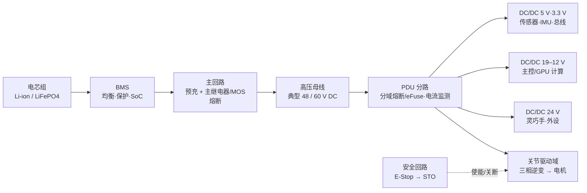

# 机器人整机配电架构（电池 → 母线 → DC/DC → 线束 → 安全回路）

## 一句话定义

**整机配电架构**回答：电池里的能量经过哪些开关、变换与导线，才能在**几十个关节同时爆发力矩**时既不掉压、不烧线、不干扰编码器，又能在异常时**以可预期的方式停下来**。

## 英文缩写速查

| 缩写 | 英文全称 | 简要说明 |
|------|----------|----------|
| BMS | Battery Management System | 电池管理系统，管均衡、保护与荷电估计 |
| PDU | Power Distribution Unit | 配电单元，母线分路、熔断与监测的集中点 |
| DC/DC | DC-to-DC Converter | 直流变换器，把母线电压降到各域工作电压 |
| SoC | State of Charge | 电池荷电状态，续航与降额策略的输入 |
| STO | Safe Torque Off | 安全力矩关断，从驱动器侧切断力矩而非切断母线 |
| E-Stop | Emergency Stop | 急停，按 IEC 60204-1 分停止类别 0/1/2 |
| EMC | Electromagnetic Compatibility | 电磁兼容，含发射与抗扰两侧 |
| PL | Performance Level | ISO 13849-1 定义的安全功能性能等级（a–e） |

## 为什么重要

- **人形是脉冲负载系统**：起跳、落地、抗扰恢复时多关节同时进入峰值电流，平均功率算得再好，也可能被瞬时母线跌落打穿——欠压重启在真机上表现为"莫名其妙倒地"。
- **电气故障是现场故障的大头**：拖链/滑环处线束疲劳断线、连接器接触不良、地环流干扰编码器，比算法 bug 更常出现在 [现场排障](../queries/field-robotics-troubleshooting.md) 记录里。
- **安全行为必须是电气可保证的**：软件 [安全状态机](./robot-safety-state-machine.md) 可以决策，但"一定能停"要靠硬件安全回路兜底。
- **配电与热是一体两面**：线损与变换器损耗都变成机身内的热，见 [电池与热管理 Query](../queries/humanoid-battery-thermal-management.md)。

## 核心原理

### 能量链与分域

**分域**的意义：把**功率域**（关节逆变、脉动大、噪声源）与**信号域**（编码器、IMU、总线、相机）在电源与地线上尽量分开，只在设计好的单点汇合。

### 四类必须显式设计的东西

1. **功率预算**：按关节峰值/连续力矩折算电流，区分「同时率」（真实运动中不会所有关节同时到峰值），得出母线峰值电流、电池 C-rate 需求与母线电容容量；预算的验收判据是**峰值工况下母线电压跌落**在驱动器欠压阈值之上留足裕度。
2. **上电与掉电时序**：预充电阻限制母线电容涌流 → 主回路闭合 → 各域 DC/DC 按依赖顺序使能（先信号与总线、后功率使能）→ 驱动器解除 STO。掉电反向，且要保证掉电瞬间关节不"失力自由落体"。
3. **分级保护**：电芯级（BMS 过压/过流/过温）→ 母线级（熔断/断路）→ 分路级（eFuse 或电子开关，可诊断可复位）→ 板级（驱动器过流/过温/欠压）。原则是**故障就地隔离**，不要让一个关节短路拉停整机。
4. **线束设计**：按载流与温升选截面（不是只按"够粗"），按长度做压降预算；功率线双绞减小回路面积，编码器/总线线屏蔽并远离逆变输出；跨关节段按**弯折寿命**选高柔性线并给足弯曲半径，走线通道要在机械布局阶段预留（见 [机械布局设计](./humanoid-mechanical-layout-design.md)）。

### 安全回路：E-Stop 不等于拔电

按 IEC 60204-1，停止类别 **0**（立即切断动力）、**1**（受控减速后切断）、**2**（受控停止但保持动力）适用于不同场景。对双足人形，**直接切母线（类别 0）常意味着直接倒地**，因此工程上更常用 **STO 通道 + 受控下蹲/保持** 的组合：安全回路以硬线冗余触点驱动驱动器 STO 输入，同时通知软件状态机执行受控动作。安全功能的等级评估参考 ISO 13849-1（PL a–e）与 IEC 61508（SIL），服务型/个人护理机器人另有 ISO 13482 的整体安全要求。西门子 G1 单元可行性研究把「类别 0 接触器可评 PL e、平衡站住评不了」写成 [fail-passive gap](../entities/paper-fail-passive-gap.md)：外部光幕/F-PLC 仍可按标准打分，机侧反应链没有等价接触器。

### EMC 与接地

- **噪声源明确**：逆变器 PWM 开关沿是主要共模源，沿电机线与机身结构传播。
- **接地策略**：功率地与信号地分区，单点连接；机身结构地是否与母线负极连接需明确决策并全局统一，避免多路"隐式接地"形成地环路。
- **敏感链路**：IMU、磁编码器、力/力矩与触觉传感器走屏蔽线且屏蔽层单端接地；差分总线（CAN、RS-485）保持双绞与正确终端电阻。
- **验证**：整机层面对照 IEC 61000-4 系列（ESD、辐射抗扰、EFT 等）做抗扰，CISPR 系列限值做发射预测试；真机常见判据是"关节全速运动时编码器与 IMU 噪声是否上升"。

## 工程实践

| 环节 | 交付物 | 验收方法 |
|------|--------|----------|
| 功率预算 | 分域电流/功率表（峰值·连续·同时率） | 峰值工况实测母线电压跌落与电池温升 |
| 配电原理图 | PDU 原理图 + 保护选型表（[KiCad](../entities/kicad.md) / [Altium](../entities/altium-designer.md)） | 逐路短路/过载注入测试，确认就地隔离 |
| 上电时序 | 时序图与联锁逻辑 | 反复冷启动/热插拔，观察是否有涌流报警或误使能 |
| 线束图 | 线号表、截面、屏蔽与连接器定义 | 满载温升实测、跨关节段弯折寿命循环 |
| 安全回路 | 安全功能清单 + 停止类别与 PL 评估 | 拍下急停，确认力矩关断时间与整机落地行为可复现 |
| EMC | 接地拓扑图、屏蔽约定 | 关节全速时传感器噪声底对比静止基线 |

调试指标速查：母线峰值跌落、分路电流峰均比、线束最高温升、E-Stop 到力矩为零的时间、编码器误码/丢帧计数、DC/DC 效率与温度。

## 局限与风险

- **按平均功率选电池与线径**：脉冲负载下会出现"账面充裕、实测欠压"。
- **把 E-Stop 做成切总电**：对双足平台等于"安全地摔一跤"，安全设计要连同倒地保护一起评估。这不是措辞问题：ISO 13849 参考例能给接触器 Reaction 打 PFHD，正是因为切电；人形单元若删掉接触器，端到端 PL 就断在反应链，见 [Fail-Passive Gap](../entities/paper-fail-passive-gap.md)。
- **地线随手接**：多点接地形成环路，症状是编码器抖动、CAN 偶发错误帧，极难从软件侧定位。
- **BMS 保护当作系统保护**：BMS 保护动作往往是"整机瞬断"，不能替代分路级可诊断保护。
- **忽略连接器与线束的机械寿命**：整机迭代期最频繁的硬件故障来源之一。
- **标准只作参考**：本页给的是标准覆盖范围与工程判据，实际认证需按目标市场与机型查阅标准正文。

## 关联页面

- [人形整机硬件设计纵深路线](../../roadmap/depth-humanoid-hardware-design.md) — 本页在 Stage 3–4 展开为学习顺序
- [人形整机机械布局设计](./humanoid-mechanical-layout-design.md) — 走线空间与散热路径的上游
- [机器人整机通信架构](./robot-onboard-communication-architecture.md) — 与配电共用线束与屏蔽策略
- [机器人安全状态机](./robot-safety-state-machine.md) — 软件侧的故障降级决策
- [Fail-Passive Gap](../entities/paper-fail-passive-gap.md) — 工业人形：类别 0 切电可认证，主动平衡站住不可认证
- [Hardware 101 · 能源与计算电子](../overview/humanoid-hardware-101-power-compute-electronics.md)
- [Query：人形机器人电池与热管理](../queries/humanoid-battery-thermal-management.md)
- [磁场定向控制（FOC）](./field-oriented-control.md) — 逆变器既是主要负载也是主要噪声源

## 参考来源

- [Humanoid Hardware 101 微信长文编译](../../sources/blogs/wechat_human_five_humanoid_hardware_101.md) — 电池、BMS、PCB 与计算单元的部件级视角
- [Hardware 101 · 能源与计算电子](../overview/humanoid-hardware-101-power-compute-electronics.md) 及其 sources
- IEC 60204-1（机械电气设备与停止类别）、ISO 13849-1（安全相关控制部件 PL）、IEC 61508（功能安全 SIL）、ISO 13482（个人护理机器人安全）— [IEC 标准检索](https://webstore.iec.ch/) · [ISO 标准检索](https://www.iso.org/search.html?q=13849)
- [Fail-Passive Gap 论文策展](../../sources/papers/fail_passive_gap_arxiv_2608_02809.md) — G1 半封闭单元上用认证外部链定位反应缺口
- IEC 61000-4 系列（EMC 抗扰试验）与 CISPR 系列（发射限值）— [IEC 标准检索](https://webstore.iec.ch/)

## 推荐继续阅读

- [IPC 电子互连标准（含 IPC-2221 / IPC-2152 载流能力）](https://www.ipc.org/) — 板级与走线载流、温升设计依据
- [Open-source humanoid 与四足整机的电气资料](../entities/open-source-humanoid-hardware.md) — 可对照真实机型的配电与保护做法
