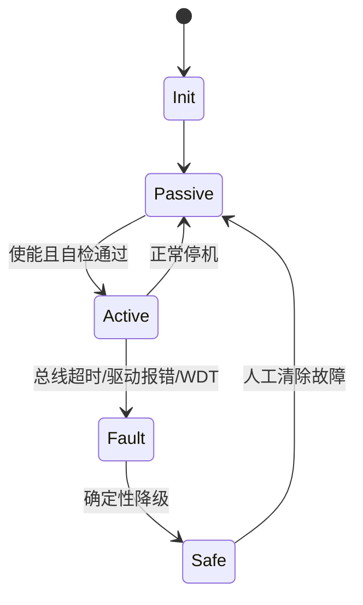

# 机器人安全状态机（硬件 / 通信故障）

## 一句话定义

**机器人安全状态机** 用确定性有限状态机，在 **驱动器报错、总线超时、控制 deadline miss、估计发散** 时切到预定义安全态（阻尼、无力矩、冻结姿态），保证故障响应不依赖网络。

## 英文缩写速查

| 缩写 | 英文全称 | 简要说明 |
|------|----------|----------|
| FSM | Finite State Machine | 有限状态机 |
| FMEA | Failure Mode and Effects Analysis | 故障模式与影响分析 |
| WDT | Watchdog Timer | 看门狗定时器 |
| STO | Safe Torque Off | 安全切断力矩（工业驱动概念） |
| E-Stop | Emergency Stop | 急停 |

## 为什么重要

- 通信中断时「等待重连」会让机器人以错误力矩运行。
- 部署框架如 [wbc_fsm](../entities/wbc-fsm.md) 用 Passive/Loco/WBC 模式切换体现同一思想。
- 与 [Safety Filter](./safety-filter.md) 互补：滤波器约束正常控制；FSM 处理硬故障切换。

## 核心原理

典型状态：`Init` → `Idle/Passive` → `Calib` → `Active(Loco/WBC/…)` → `Fault` → `Safe`；任意 Active 可因故障边进入 Safe。

| 故障源 | 检测 | 安全动作示例 |
|--------|------|--------------|
| 驱动器 | 错误码、过流/过温 | 切阻尼或 STO |
| 总线 | EtherCAT/CAN 超时、丢周期 | 保持最后安全指令或无力矩 |
| 控制软件 | WDT、deadline miss | 复位控制器、降级 |
| 传感 | IMU/编码器失效 | 冻结或坐下脚本 |
| OTA | 验签失败/更新中 | 拒绝切入 Active |

## 工程实践

1. 故障检测在 **最高优先级** 线程或 ISR 路径，短于一个控制周期。
2. 安全态动作预计算、无堆分配、无网络调用。
3. 记录故障码到黑匣子；恢复需显式清错，禁止自动弹回高力矩模式。
4. 与 [OTA](./model-versioning-ota.md) 约定：仅 Passive/Safe 允许换权重。

## 局限与风险

- FSM 状态爆炸：用分层状态机，避免巨型单图。
- 「Safe = 无力矩」在欠驱动站立机器人上可能直接摔倒——Safe 策略本身要按形态设计（阻尼站立/跪倒脚本等）。

## 关联页面

- [wbc_fsm 实体](../entities/wbc-fsm.md)
- [Safety Filter](./safety-filter.md)
- [EtherCAT](./ethercat-protocol.md) / [CAN](./can-bus-protocol.md)
- [系统工程专题](../overview/topic-systems-engineering.md)

## 参考来源

- [DDS/RTOS/边云/OTA/安全 FSM 一手资料](../../sources/sites/dds_omg_rtos_edge_ota_safety_primary_refs.md)

## 推荐继续阅读

- IEC 61508 / ISO 13849 功能安全导论；本库 wbc_fsm 源码归档
