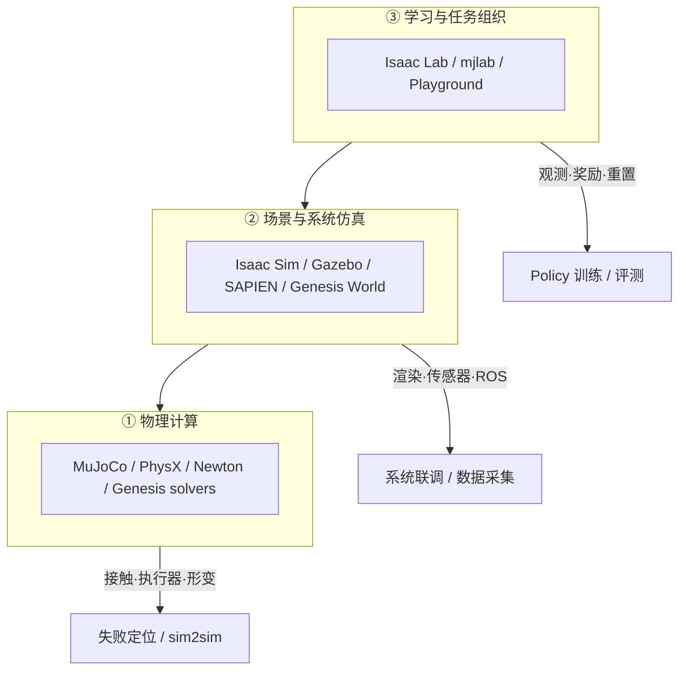

# 机器人仿真三层分工（Physics / Platform / Learning）

**机器人仿真三层分工**把 Isaac、MuJoCo、Genesis 等工具按职责拆成：**物理引擎**算运动与接触，**仿真平台**组织场景与传感器，**学习框架**连接观测、奖励与训练评测。同一产品可跨层；换物理后端或学习框架时，接口可复用但 **实验结果须重验**。

## 英文缩写速查

| 缩写 | 英文全称 | 简要说明 |
|------|----------|----------|
| Sim2Real | Simulation to Real | 仿真策略迁移真机的工程主线 |
| RL | Reinforcement Learning | 通过与环境交互学习策略的范式 |
| GPU | Graphics Processing Unit | 大规模并行仿真与学习的算力基础 |
| PhysX | NVIDIA PhysX | Isaac 线常用的 GPU 刚体/柔体物理引擎 |
| MJX | MuJoCo JAX | MuJoCo 的 JAX 批量后端 |
| FEM | Finite Element Method | 有限元，软体形变常用数值方法 |
| MPM | Material Point Method | 物质点法，Genesis 等支持的软体/流体求解路线 |
| DR | Domain Randomization | 训练中随机化物理/感知参数以提升鲁棒性 |
| ROS | Robot Operating System | 机器人中间件；Gazebo 等常经 ROS 2 联调 |

## 为什么重要？

- **避免混层选型：** 把「接触算不准」归咎于学习框架，或把「训练慢」归咎于物理引擎，都会浪费排错时间。
- **任务决定权重：** 抓取要对象与渲染；行走更敏感于电机与接触；软体任务还要材料模型——三层能力须 **放回具体任务** 衡量。
- **真机才是终判：** GPU 并行与视觉扩展了仿真用途，但 **policy 能否通过真机测试** 才是项目级进度指标；仿真分数需用真机失败案例校验。

## 核心原理

### 三层对照

| 层次 | 主要处理什么 | 代表性工具 |
|------|--------------|------------|
| **① 物理计算** | 动力学、碰撞、接触、材料形变 | [MuJoCo](../entities/mujoco.md)、PhysX、[Newton](../entities/newton-physics.md)、[Genesis](../entities/genesis-sim.md) 内部求解器 |
| **② 场景与系统仿真** | 机器人/物体、渲染、传感器、控制程序连接 | [Isaac Sim](../entities/isaac-sim.md)、Gazebo、SAPIEN、Genesis |
| **③ 学习与任务组织** | 观测、动作、奖励、随机化、训练与评测 | [Isaac Lab](../entities/isaac-lab.md)、[mjlab](../entities/mjlab.md)、[MuJoCo Playground](../entities/mujoco-playground.md)、ManiSkill |

以抓取为例：**物体是否滑落** → ①；**相机看到什么** → ②；**policy 如何学习** → ③。

### Isaac Sim 与 Isaac Lab

- **Isaac Sim：** 回答「世界怎样运行」——场景、物理、渲染、传感器、控制联调；**不必**先训练 policy。
- **Isaac Lab（2.x 主流）：** 在 Sim 能力之上组织 RL/IL 工作流（观测/奖励/重置）。
- **Isaac Lab 3.0 Early Access：** 进一步拆分物理/渲染/可视化，支持 PhysX、Newton/MuJoCo-Warp；部分流程可不启完整 Sim——**早期访问，任务兼容性须自验**。

### 吞吐量、延迟与框架模块化

- **总吞吐量**（多 env 合计 steps/s）≠ **单 env 单步延迟**；完整训练还含渲染、policy 推理、参数更新、环境重置。
- 检查控制器可能只需少量 env；训练 policy 则需要 **高采样量** 与合理 **任务分布/随机化**。
- [Isaac Lab](../entities/isaac-lab.md)、[mjlab](../entities/mjlab.md) 等把 obs/reward/curriculum **组件化**，避免每任务复制一套代码——环境定义正成为可维护的研究资产（参见 [训练栈分层地图](../overview/robot-training-stack-layers-technology-map.md)）。

### 软接触 vs 软体建模

| 概念 | 含义 | 典型场景 |
|------|------|----------|
| **软接触** | 接触面允许压入，按压入/相对运动算力；**物体仍可刚体** | 刚性抓取、足地接触参数化 |
| **软体模型** | 物体自身形变（FEM、粒子、flex 单元等） | 海绵、线缆、布料、流体 |

- MuJoCo 3.0 **flex / elastic cable**；Genesis **FEM/MPM/粒子** 等同平台多求解器。
- **后端 parity 须查：** MJX 功能表仍列 flex 不支持；MuJoCo Warp 的 flex 支持完善中——原生 MuJoCo 能力 ≠ 每种 GPU 实现完整支持。
- 软体任务要把 **材料测量**（弯曲刚度、摩擦等）纳入研发；若任务关键是布料形变，**仅 DR 刚体质量/摩擦补不上缺失形变**。

## 流程总览

## 工程实践

### Sim2Real 验收三问

判断一次迁移是否「真进展」，沿下列顺序：

1. **物理过程能否对得上** — 滑移、夹稳、接触力是否合理？
2. **真机能否完成任务** — 成功率与误差阈值（如 cm/° 级）是否满足大纲？
3. **换条件后能否稳定** — 换物体/地面、连续运行、失败后能否恢复？

**MuJoCo Playground 公开真机样例（须连同条件解读）：**

| 任务 | 报告结果 | 关键条件 |
|------|----------|----------|
| Franka 物块姿态调整 | 85.7%（35 次） | 位置 3 cm、角度 10° 阈值 |
| Franka 图像抓方块 | 12/12 | 2D 平面、简化动作空间 |
| LEAP 手连续转方块 | 中位 3.5 次旋转后失败 | 连续操作仍易卡住 |

论文 **「零样本迁移」** 通常指真机上无继续学习；团队仍可能做过硬件测量与模型校准。**训练 wall-clock 几分钟 ≠ 项目总周期。**

### 观测/动作接口对齐

部署观测须在真机可获得；目标位姿、位置增量、力矩对应不同控制栈；关节顺序、坐标系、动作缩放、控制频率与 **延迟** 须一致并纳入测试。

常见 gap 叠加：物理（质量/摩擦/电机）、感知（相机/噪声）、任务（新物体/初始条件）。先 **测量与校准**，再 **有依据的 DR**。

### 选型四问（比峰值 FPS 更实用）

1. **第一个任务多久能跑通？**
2. **失败能否定位？**（MuJoCo 执行器/接触可视化 vs 黑盒 GPU 栈）
3. **换一台设备要改什么？**
4. **模型与部署代码是否有人持续维护？**

**排错与搭建时间计入平台成本。** 可共享资产：校准模型、可复现 train/deploy 配置、真机失败固定测试用例。

### 按任务选入口（简表）

| 任务类型 | 优先关注 |
|----------|----------|
| 移动机器人系统联调 | 场景、传感器、ROS 接口（Gazebo 等） |
| 大规模运动控制学习 | 并行物理、执行器建模、现成部署项目（Isaac Lab、[mjlab](../entities/mjlab.md)、Unitree 线） |
| 视觉操作 | 对象多样性、渲染、数据采集（ManiSkill、Isaac 遥操作） |
| 软体交互 | 材料模型、求解器支持与 GPU parity |

更完整的 locomotion 三选一与六层训练栈，见 [仿真器选型指南](../queries/simulator-selection-guide.md) 与 [训练栈分层地图](../overview/robot-training-stack-layers-technology-map.md)。

## 局限与风险

- **更强模型 ≠ 更少 sim bias：** 通用模型可能更充分学到仿真偏差；data-driven 仿真（如 PhysTwin 从 RGB-D 视频估参数）是补充路线，不是自动消除 gap。
- **仿真评测须真机校验：** 测试场景若无法预测真机失败，高仿真分数不能单独说明部署质量（见 [仿真评测基础设施](simulation-evaluation-infrastructure.md)）。
- **换后端须重验：** Newton、Isaac Lab 3.0、MuJoCo-Warp 等组合能力在演进；接触、执行器与数值设置要重新检查。
- **本文是策展框架，非性能榜单** — 数值与版本以各项目官方为准。

## 关联页面

- [训练栈分层技术地图](../overview/robot-training-stack-layers-technology-map.md) — 六层互补视角（大平台 / sim2sim / 任务入口 / 异构运行时 / 连接器 / 闭环评估）
- [仿真器选型指南（locomotion）](../queries/simulator-selection-guide.md)
- [MuJoCo vs Isaac Sim](../comparisons/mujoco-vs-isaac-sim.md)
- [Sim2Real](sim2real.md)
- [Humanoid Motion Intelligence](../entities/humanoid-motion-intelligence.md) — 同源 GitHub 知识库入口

## 参考来源

- [RealXiaoze：机器人仿真三层分工（微信公众号）](../../sources/blogs/wechat_realxiaoze_robot_simulation_stack_2026-09-20.md)

## 推荐继续阅读

- [Isaac Lab 文档](https://isaac-sim.github.io/IsaacLab/) — 大平台 + 学习框架官方入口
- [MuJoCo Playground](https://playground.mujoco.org/) — 任务入口与真机部署案例
- [Genesis 官方文档](https://genesis-world.readthedocs.io/) — 多求解器与软体示例（以官网为准）
