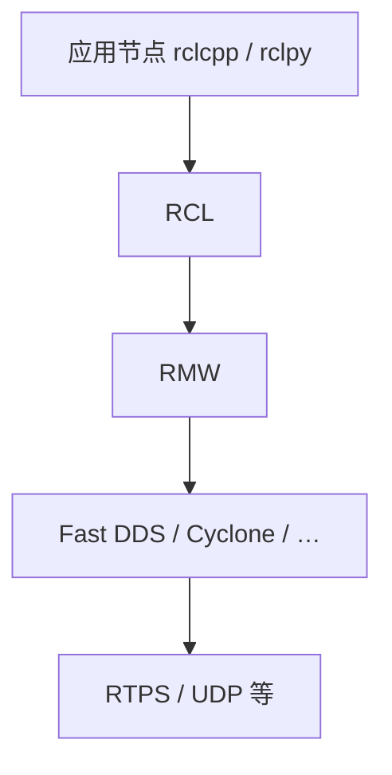

# ROS 2 (Robot Operating System 2) 基础

**ROS 2** 是一套开源的机器人软件库与工具（官方称 *meta operating system*）：跑在 Linux 等通用 OS 之上，用标准化通信、包管理与开发工具把驱动、算法与调试器接成可部署的系统。它**不是**内核级操作系统。

## 英文缩写速查

| 缩写 | 英文全称 | 简要说明 |
|------|----------|----------|
| ROS 2 | Robot Operating System 2 | 机器人系统集成与通信中间件栈 |
| DDS | Data Distribution Service | ROS 2 默认底层通信标准 |
| RMW | ROS Middleware | ROS 客户端库与具体中间件实现的适配层 |
| QoS | Quality of Service | 可靠性、历史深度、deadline 等策略 |
| LCM | Lightweight Communications and Marshalling | 轻量 UDP 组播中间件；常用于底层运控 |
| CLI | Command-Line Interface | `ros2` 命令行工具集 |

## 为什么重要

- **事实标准集成层**：Nav2、MoveIt 2、ros2_control、Autoware、Isaac ROS、厂商 `*_ros2` 包等以上层生态几乎都以 ROS 2 为胶水。
- **去中心化通信**：相对 ROS 1 取消 Master，默认经 DDS 发现与分发，更适合多机与长期运行。
- **与运控分层**：在本仓库主线中，ROS 2 通常承担 **10–100 Hz 感知/规划**；**500–1000 Hz 关节闭环** 更常走 [LCM](./lcm-basics.md) / 共享内存 / EtherCAT——见 [选型对比](../comparisons/ros2-vs-lcm.md)。

## 核心原理

### 架构：DDS + RMW

相比 ROS 1，ROS 2 核心变化是默认采用 **DDS**，经 **RMW** 对接具体实现（[Fast DDS](../entities/fast-dds.md)、[Cyclone DDS](../entities/cyclone-dds.md)、实验性 Zenoh 等）。独立概念页：[RMW 接口](./rmw-interface.md)、[DDS 通信机制](./dds-communication.md)；标准一手：[OMG DDS / RTPS](../../sources/sites/omg-dds-spec.md)。

- **去中心化**：无 `roscore`；单节点故障不拖垮全网发现域。
- **QoS**：按 topic 配置 Reliable / Best Effort、History、Deadline 等；发布端与订阅端须兼容。
- **代价**：协议与线程模型较重，尾延迟不适合硬实时 1 kHz 力矩环。

### 核心组件

| 组件 | 作用 |
|------|------|
| **Nodes** | 执行计算的进程（或组件容器内的节点） |
| **Topics** | 异步 pub/sub 数据流 |
| **Services** | 同步请求/响应（[RPC](./remote-procedure-call.md) 风格；实现经 RMW/DDS，不是 [gRPC](../entities/grpc.md)） |
| **Actions** | 长时任务：目标、反馈、可取消 |
| **Parameters** | 节点级运行时配置 |
| **tf2** | 坐标系树与时间戳变换 |
| **Launch** | 多节点启动拓扑与参数 |
| **Lifecycle** | 受管节点状态机 |

### 上游源码怎么找

| 入口 | 用途 |
|------|------|
| 组织 [github.com/ros2](https://github.com/ros2) | 客户端库、文档源、示例、RMW、工具仓索引（归档 [ros2-github-org](../../sources/sites/ros2-github-org.md)） |
| 元仓 [ros2/ros2](https://github.com/ros2/ros2) | `ros2.repos` 用 vcstool 拉整棵工作区（归档 [repos/ros2.md](../../sources/repos/ros2.md)） |
| 文档 [docs.ros.org](https://docs.ros.org/en/humble/) | 安装、概念、教程（归档 [ros2-official-documentation](../../sources/sites/ros2-official-documentation.md)） |
| REP-2000 | 发行版与目标平台矩阵 |

日常部署优先 **发行版二进制**；整树源码构建面向贡献者与定制 RMW。

## 工程实践

### 开源状态（2026-07-28 核查）

- **已开源**：GitHub `ros2` 组织公开仓 + 元仓 `ros2.repos` 所列上游；学术引用 DOI [10.1126/scirobotics.abm6074](https://www.science.org/doi/10.1126/scirobotics.abm6074)。
- **推荐发行版**：工业/科研常用 **Humble LTS**；跟进新特性用 Rolling / 新 LTS（以 REP-2000 为准）。
- **上层栈位置**：Nav2、MoveIt、Autoware 等在**独立组织**，不在 `ros2` org 内。

### 落地要点

1. 固定 `ROS_DISTRO`、`RMW_IMPLEMENTATION` 与 QoS 配置进仓库。
2. 大消息（点云/图像）注意带宽与 QoS；调试用 `ros2 topic`、`rosbag2`、[PlotJuggler](../entities/plotjuggler.md)、RViz。
3. 硬件侧优先 [ros2_control](https://control.ros.org/humble/) 抽象，再接仿真或真机。
4. 需要 1 kHz 力矩环时：**不要**把关节反馈/力矩默认丢在 DDS topic 上；做频率隔离与桥接。

### 典型应用案例

- **感知与决策**：[Booster RoboCup Demo](../entities/booster-robocup-demo.md) 用 Humble 集成检测与状态机。
- **导航栈**：[Navigation2](../entities/navigation2.md)、[导航·SLAM 总览](../overview/navigation-slam-autonomy-stack.md)。
- **厂商桥**：[unitree_ros2](../entities/unitree-ros2.md) 直接消费 CycloneDDS 消息。
- **ROS-optional 对照**：[DimOS](../entities/dimensionalos-dimos.md) 默认 LCM，可选 ROS 2 传输。

## 局限与风险

- **实时性**：复杂 QoS、动态分配与发现流量造成抖动；硬实时环路需另层。
- **体积与依赖**：桌面完整安装重；嵌入式需裁剪或跨机分工。
- **QoS 静默失败**：两端不兼容时「连不上」且难察觉。
- **版本碎片**：发行版、RMW vendor、第三方包 ABI 需对齐。

## 关联页面

- [RMW 接口](./rmw-interface.md)
- [DDS 通信机制](./dds-communication.md)
- [Fast DDS](../entities/fast-dds.md)
- [Cyclone DDS](../entities/cyclone-dds.md)
- [LCM 基础](./lcm-basics.md)
- [ROS 2 vs LCM](../comparisons/ros2-vs-lcm.md)
- [Navigation2](../entities/navigation2.md)
- [DimOS](../entities/dimensionalos-dimos.md)
- [PlotJuggler](../entities/plotjuggler.md)
- [导航·SLAM·自动驾驶栈总览](../overview/navigation-slam-autonomy-stack.md)
- [实时运控中间件配置指南](../queries/real-time-control-middleware-guide.md)
- [系统工程纵深](../overview/depth-systems-engineering.md)
- [技术地图：ROS 2 模块](../../tech-map/modules/system/ros2.md)

## 参考来源

- [ROS 2 官方文档（Humble）归档](../../sources/sites/ros2-official-documentation.md)
- [ROS 2 GitHub 组织归档](../../sources/sites/ros2-github-org.md)（https://github.com/ros2）
- [ros2/ros2 元仓库归档](../../sources/repos/ros2.md)（https://github.com/ros2/ros2）
- [ros2/rmw](../../sources/repos/rmw.md) · [RMW Design](../../sources/sites/ros2-design-rmw-interface.md) · [Vendors / 多 RMW](../../sources/sites/ros2-rmw-middleware-vendors.md)
- [OMG DDS / DDSI-RTPS](../../sources/sites/omg-dds-spec.md) · [Fast DDS](../../sources/repos/fast-dds.md) · [Cyclone DDS](../../sources/repos/cyclonedds.md)
- [DDS/RTOS 等一手资料合集](../../sources/sites/dds_omg_rtos_edge_ota_safety_primary_refs.md)

## 推荐继续阅读

- ROS 2 Concepts（Rolling）：https://docs.ros.org/en/rolling/Concepts/Basic.html
- ROS 2 Design：https://design.ros2.org/
- REP-2000：https://ros.org/reps/rep-2000.html
- 元仓 README / `ros2.repos`：https://github.com/ros2/ros2
