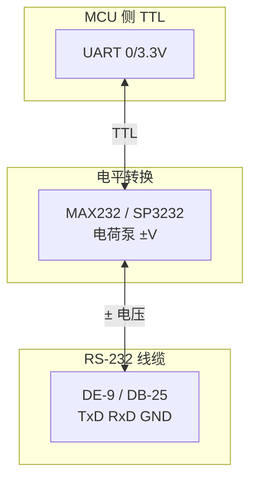

# RS-232 串行接口（TIA/EIA-232）

**RS-232**（现行标准名 **TIA-232-F**）是 1960 年代起用于 **数据终端设备（DTE）与数据电路终端设备（DCE）** 之间串行二进制交换的 **电气与机械接口标准**。它定义电压摆幅、信号含义与连接器引脚，**不定义** 波特率、字符格式或应用协议——后者由 UART 与应用层决定。

## 一句话定义

**单端、非平衡** 串行链路：数据线上 **逻辑 1（mark）为 −3 V～−15 V、逻辑 0（space）为 +3 V～+15 V**（相对信号地），适合 **点对点、中低速、较短距离**；与 [TTL](./ttl-serial-logic-level.md) 正逻辑及 [RS-485](./rs-485-serial-bus.md) 差分多点总线有本质区别。

## 英文缩写速查

| 缩写 | 英文全称 | 简要说明 |
|------|----------|----------|
| RS-232 | Recommended Standard 232 | 业界惯用名，现行维护为 TIA-232-F |
| DTE | Data Terminal Equipment | 数据终端，如 PC、PLC 编程口 |
| DCE | Data Circuit-Terminating Equipment | 数据电路终端，历史上多为调制解调器 |
| CTS | Clear To Send | 允许对端发送的流控应答线 |
| RTS | Request To Send | 请求发送的流控线 |
| DB-9 | D-sub 9-pin | PC「串口」常见 9 针连接器 |

## 为什么重要

- **工业设备存量接口**：CNC、老式伺服、条码枪、部分 **PLC 编程口** 仍提供 RS-232；机器人集成产线设备时常遇到。
- **电平转换枢纽**：USB–RS-232 转换器内部完成 **TTL ↔ ± 电平**；理解标准可避免 **直连 MCU 烧毁收发器**。
- **与 RS-485 转换器**：许多 **RS-232 ↔ RS-485** 网关用 RTS 控制 485 方向（见 [RS-485](./rs-485-serial-bus.md)）。

## 核心机制

### 1. 电压电平（数据电路 TxD / RxD）

| 逻辑状态 | 名称 | 电压（相对 GND） |
|----------|------|------------------|
| 1 | mark（空闲） | −3 V ～ −15 V |
| 0 | space | +3 V ～ +15 V |

- **−3 V ～ +3 V** 为无效区；接收器须容忍 **±25 V** 短路保护等级（标准对驱动器要求）。
- **控制线**（RTS/CTS/DTR/DSR）极性相反：**asserted = 正电压**。
- 实际芯片常输出 **±5 V 或 ±10 V**（「RS-232 兼容」），仍高于 TTL。

### 2. 角色、连接器与最小接线

标准规定 **DTE 用公头、DCE 用母头**；信号名从 DTE 视角定义。

**DE-9 DTE（PC 常见）常用引脚：**

| 引脚 | 信号 | 方向（DTE） |
|------|------|-------------|
| 2 | RxD | 输入 |
| 3 | TxD | 输出 |
| 5 | GND | 公共地 |
| 7 | RTS | 输出 |
| 8 | CTS | 输入 |

- **3 线制**（TxD/RxD/GND）足以传输 UART 数据，**多数嵌入式调试忽略握手线**。
- **DTE–DTE 直连** 需 **null modem** 交换 TxD/RxD；非标准正文但广泛使用。
- 电缆电容限制长度；经验上 **≤ 15 m**（标准电缆），低电容线可至约 **300 m**（降速）。

### 3. 与 UART 协议层的关系

| 层级 | RS-232 负责？ | 典型配置方 |
|------|---------------|------------|
| 波特率、数据位、校验 | 否 | UART / 驱动 |
| 电平与连接器 | 是 | 收发器芯片 |
| 应用协议（Modbus ASCII 等） | 否 | 主从软件 |

标准说明适用于 **低于 20 kbit/s** 量级；现代 UART 芯片可配置更高，但 **摆幅与边沿速率限制实际距离**。

### 4. 流控（RTS/CTS）

- 历史用途：半双工调制解调器同步。
- 现代 **「硬件流控」** 常指 **RTS/CTS** 防止接收缓冲溢出；USB 串口桥未必完整实现。
- TIA-232-E 起 **RTR（Ready to Receive）** 与 RTS 共引脚的双向流控定义，与旧 RTS/CTS 语义不同——读设备手册时须核对。

## 在机器人中的典型应用

| 场景 | 说明 |
|------|------|
| 工控机接 legacy 外设 | 通过 USB–RS-232 或板卡串口 |
| 产测 PC 夹具 | DB9 接被测板经 MAX3232 转 TTL |
| 现场仪器 | 示波器、电源、部分激光测距仪 |
| **不推荐** | 多关节实时闭环（应用 [CAN](./can-bus-protocol.md)/EtherCAT） |

## 常见误区

- **MCU GPIO 直驱 DB9**：5 V/3.3 V 逻辑 **不符合** RS-232 电平，且可能损坏双方。
- **「RS-232 兼容」= 标准完整实现」**：许多设备仅 ±5 V、仅 3 线、引脚定义非标。
- **忽略地环路**：长距离不同电源地之间电位差会导致误码；差分 [RS-485](./rs-485-serial-bus.md) 更耐共模干扰。
- **握手线悬空当 0」**：未用的控制线应上拉/下拉至确定态，否则噪声触发流控。

## 关联页面

- [TTL 串行逻辑电平](./ttl-serial-logic-level.md)
- [RS-485 串行总线](./rs-485-serial-bus.md)
- [UART 与串行通信总览](./uart-serial-communication.md)
- [电机驱动器底软通信协议总览](../overview/motor-drive-firmware-bus-protocols.md)

## 参考来源

- [RS-232（TIA/EIA-232）一手资料索引](../../sources/sites/rs232_tia_eia_primary_refs.md)
- [UART / RS-485 嵌入式入门索引](../../sources/courses/uart_rs485_serial_embedded.md)

## 推荐继续阅读

- TI [SLLA038 — RS-232 Basics](https://www.ti.com/lit/an/slla038/slla038.pdf)
- ITU-T [V.24](https://www.itu.int/rec/T-REC-V.24) 电路定义
