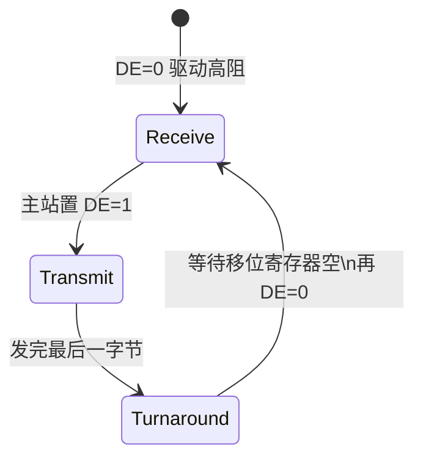
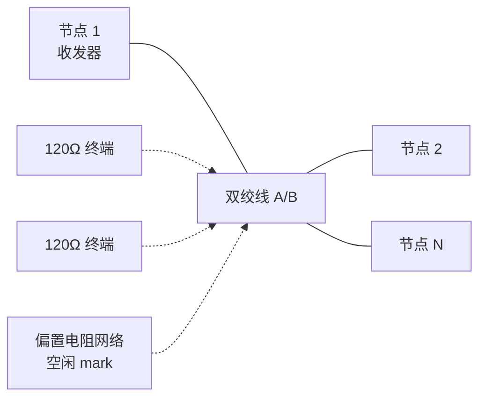

# RS-485 串行总线（TIA/EIA-485）

**RS-485**（**TIA-485-A**）定义 **平衡数字多点系统** 中驱动器与接收器的电气特性。它只规定 **物理层**——比特如何变成差分电压——**不规定** 帧格式或主从协议；机器人现场最常见叠加协议是 **Modbus RTU**，关节硬实时则多用 [CAN](./can-bus-protocol.md)。

## 一句话定义

**两线（A/B）差分、半双工、三态驱动** 的多点总线：同一时刻仅允许一个节点驱动；接收器对 **≥ 200 mV** 差分敏感，配合 **终端与偏置** 可在中等距离、电气噪声环境下挂接多个 UART 设备。

## 英文缩写速查

| 缩写 | 英文全称 | 简要说明 |
|------|----------|----------|
| RS-485 | Recommended Standard 485 | 业界惯用名，标准为 TIA/EIA-485-A |
| DE | Driver Enable | 发送使能，高电平常开启驱动器 |
| RE | Receiver Enable | 接收使能，低电平常开启接收（常与 DE 合并为 DE/RE̅） |
| RTU | Remote Terminal Unit | Modbus 二进制帧模式，CRC16 结尾 |
| UL | Unit Load | 485 标准负载单位，用于计算最大节点数 |
| GND | Ground | 信号参考；长距离需注意地环路 |

## 为什么重要

- **底盘与外设组网**：温湿度、继电器、老款 **伺服/变频器**、AGV 部分子模块用 **RS-485 + Modbus**；见 [电机驱动器底软通信协议总览](../overview/motor-drive-firmware-bus-protocols.md)。
- **距离与抗扰**：相对 [TTL](./ttl-serial-logic-level.md) 单端，差分对 **共模干扰** 抑制更好；比特率 × 米数受 TSB-89 经验式约束。
- **与 CAN 分工**：485 **无硬件仲裁**，多主机须软件令牌；高轴数关节闭环优先 CAN/EtherCAT（见 [CAN vs EtherCAT 选型](../comparisons/can-vs-ethercat-joint-bus.md)）。

## 核心机制

### 1. 差分信号与逻辑态

| 条件（A 相对 B） | 标准态名 | 常见 UART 空闲对应 |
|------------------|----------|---------------------|
| A − B < −200 mV | mark（binary 1 / OFF） | 总线空闲偏置到此态 |
| A − B > +200 mV | space（binary 0 / ON） | 驱动发送起始/数据 0 |

- 驱动器在 **54 Ω** 等效负载上差分 **≥ 1.5 V**。
- **A/B 丝印极性**：不同厂商与 Profibus 颜色约定可能相反，现场以 **差分电压极性** 为准（TI「Pesky Polarity」应用笔记）；见 [一手资料](../../sources/sites/rs485_tia_eia_primary_refs.md)。

### 2. 半双工与方向控制

- UART 本身 **全双工**；经 **单收发器** 映射到总线时须 **分时**。
- **DE/RE̅** 可由 GPIO 手动切换，或由 RTS 经反相器自动切换（与 [RS-232](./rs-232-serial-interface.md) 网关常见接法相同）。
- **turnaround 时间** 过短会导致末位被截断或总线冲突。

### 3. 拓扑、终端与偏置

| 要素 | 要点 |
|------|------|
| 拓扑 | **线性 multidrop** 为主；避免长星形支路（TSB-89A） |
| 终端 | 总线 **两端** 各 **120 Ω**（匹配特性阻抗） |
| 偏置 | 无驱动时把差分拉到确定 mark，防噪声误触发 |
| 节点数 | 标准 **≥ 32 UL**；现代 1/8 UL 收发器可挂更多 |
| 速率–距离 | 约 **速率(bps) × 长度(m) ≤ 10⁸**；1.2 km 级须极低波特率 |

### 4. 共模与接地

- 接收器共模范围约 **−7 V ～ +12 V**；超出会误码或损坏。
- **SG/GND** 应单点参考连接；建筑物间地电位差过大时，**信号地线宜串限流电阻**，避免地环路烧毁线缆或收发器。

### 5. 协议层（标准外）

| 协议 | 特点 |
|------|------|
| **Modbus RTU** | 主从轮询、地址 + 功能码 + CRC；底盘 I/O 最常见 |
| Profibus DP | 工业自动化，仍基于 RS-485 物理层 |
| 厂商私有 | 部分伺服紧凑寄存器读写 |

物理层相同 **不保证互操作**——波特率、字节序、寄存器映射须一致。

## 在机器人中的典型应用

| 场景 | 说明 |
|------|------|
| 移动底盘驱动器 | Modbus RTU 读编码器/写速度设定 |
| 环境传感 | 温湿度、气体、称重变送器 |
| 人机/外设 | 部分 LED 屏、门禁、老款力矩传感器 |
| **关节闭环** | 通常选 CAN/CANopen 或 EtherCAT，而非 485 |

## 常见误区

- **「485 能代替 CAN 控 30 关节」**：无按位仲裁，冲突与调度延迟难满足 kHz 级同步。
- **忘终端或只偏置不终端**：反射与空闲态误码，表现为 **偶发 CRC 错**。
- **DE 切换过快**：末字节未发完即关驱动，从站收不全。
- **A/B 接反**：若全体一致对调可工作；与文档/终端偏置极性不一致则全网失败。
- **与 TTL 长杜邦线混用**：超过数米应上 **正式双绞线 + 收发器**。

## 关联页面

- [UART 与串行通信总览](./uart-serial-communication.md)
- [TTL 串行逻辑电平](./ttl-serial-logic-level.md)
- [RS-232 串行接口](./rs-232-serial-interface.md)
- [CAN 总线（经典）](./can-bus-protocol.md)
- [电机驱动器底软通信协议总览](../overview/motor-drive-firmware-bus-protocols.md)

## 参考来源

- [RS-485（TIA/EIA-485）一手资料索引](../../sources/sites/rs485_tia_eia_primary_refs.md)
- [UART / RS-485 嵌入式入门索引](../../sources/courses/uart_rs485_serial_embedded.md)

## 推荐继续阅读

- TI [SLLA383B — UART-to-RS-485 Interface](https://www.ti.com/lit/an/slla383b/slla383b.pdf)
- Modbus [Modbus over serial line V1.02](https://modbus.org/docs/Modbus_over_serial_line_V1_02.pdf)
