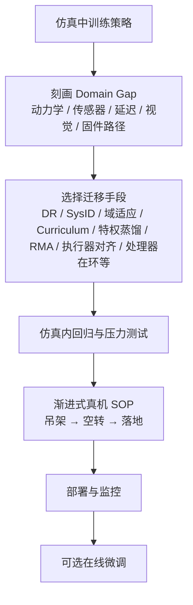

# Sim2Real

**Sim2Real**（仿真到现实迁移）：在仿真环境训练控制策略，然后部署到真实机器人上。

## 一句话定义

在仿真里学会，在现实中生效。

## 为什么重要

- 真实机器人训练成本高、速度慢、容易损坏
- 仿真可以并行加速、任意重置、无硬件损耗
- 但仿真和现实有 domain gap，必须解决迁移问题

## Sim2Real 工程流程总览



## 核心问题：Domain Gap

仿真和现实的主要差异：

- **物理参数差异**：质量、摩擦力、延迟等参数不准
- **传感器差异**：相机噪声、IMU 漂移、触觉反馈
- **动作执行差异**：电机响应延迟、控制频率限制
- **嵌入式与通信差异**：CAN/以太网抖动、线程错过周期、驱动协议路径与仿真「瞬时读写」不一致（见 [处理器在环 Sim2Real](./processor-in-the-loop-sim2real.md)）
- **视觉差异**：纹理、光照、背景

## 主要方法

### 1. Domain Randomization
在仿真中随机化物理参数，强制策略适应多样化环境。

代表工作：Tobio et al. 2018, "Sim-to-Real Transfer of Robotic Control with Dynamics Randomization"

### 2. System Identification
精确测量真实机器人参数，减少仿真-现实差距。

### 3. Domain Adaptation
用视觉/感知层面的 domain adaptation 减少感知差异。

### 4. Curriculum Learning
从简单环境逐步过渡到复杂/真实环境。

### 5. Privileged Information / Teacher-Student
训练时用额外信息（如 true state、环境参数），推理时只用可观测信息。见 [Privileged Training](./privileged-training.md)。

### 6. RMA（Rapid Motor Adaptation）

**RMA** 是目前 sim2real 领域最有影响力的 Teacher-Student 框架之一（Kumar et al. 2021）。

**两阶段流程：**

```
阶段 1：训练 Base Policy（仿真中）
  输入：机器人本体感知状态 s_t + 环境特权参数 e_t（质量/摩擦/电机参数）
  算法：PPO
  产出：Base Policy π(a | s_t, e_t)

阶段 2：训练 Adaptation Module（仿真中，模拟真机条件）
  输入：过去 k 步的关节状态历史 {s_{t-k}, ..., s_{t-1}}
  目标：从历史轨迹中隐式估计 e_t 的压缩表示 ê_t
  损失：||ê_t - φ(e_t)||²（对齐 Base Policy 所用的特权嵌入）

部署（真实机器人）：
  Base Policy + Adaptation Module（无需特权参数 e_t）
```

**为什么有效**：机器人与地面的历史交互隐含了地形/摩擦/质量等信息，Adaptation Module 从行为历史中隐式重建这些信息。

**在 Unitree A1 上实测**：复杂地形（草地/碎石/台阶）零样本迁移成功。

### 7. Sim2Real SOP (标准作业程序)

根据 [xbotics-embodied-guide](../../sources/repos/xbotics-embodied-guide.md) 的总结，为了提高 Sim2Real 的可复现性，应遵循标准化的工程步骤：
- **前置阶段**：精确的 URDF 建模与动力学参数初步对齐。
- **仿真验证**：在 [isaac-gym-isaac-lab](../entities/isaac-gym-isaac-lab.md) 或 [genesis-sim](../entities/genesis-sim.md) 中完成基础策略训练，并通过域随机化覆盖物理参数偏差。
- **中间件对齐**：统一仿真与真机的控制频率（如 50Hz 策略 + 200Hz 关节 PD）与动作/状态归一化标准。
- **实物测试**：采用“吊架测试 -> 空转测试 -> 落地测试”的渐进式 SOP。

### 8. 高保真执行器对齐 (Actuator Alignment)

根据 [zest](../methods/zest.md) 的实践，缩小动力学差距的关键在于精确处理闭链执行器（如膝盖、脚踝）的物理特性。通过基于电枢（Armature）分析值的增益选择程序，可以在不使用反馈补偿器的情况下，实现高动态动作的零样本迁移。机构层闭链几何、驱动—关节力映射与「训练用开环树 / 真机串并联」落差，可对照 [人形机器人并联关节解算](./humanoid-parallel-joint-kinematics.md)（含 LiPS、Kinematic Actuation Models 等文献锚点）。

### 9. 处理器在环（固件 + 外设路径）

当失效主要来自 **固件调度、总线语义与传感器融合实现** 而非刚体参数本身时，可在仿真中运行**未改动的生产固件**，并用 I2C/CAN 等外设仿真注入寄存器级数据流与请求–响应抖动，使 RL 策略与底层栈在同一闭环里被联合测试。工程动机与管线拆分见 [处理器在环 Sim2Real](./processor-in-the-loop-sim2real.md)。

## 常见误区

- **以为仿真越逼真越好**：太精确的仿真不一定更好，domain randomization 可能更 robust
- **忽略动作延迟**：仿真中动作瞬时执行，现实中有延迟
- **只看 reward 不看安全性**：sim2real 部署初期容易损坏硬件

## 在人形机器人中的应用

人形机器人 sim2real 的特殊挑战：

- 高维状态空间（30+ 自由度）
- 接触力难以精确建模
- 视觉感知差异大
- 足式接触的不确定性

典型 pipeline：

```
仿真训练 → 域随机化 → 零样本迁移 → 真实机器人部署 → 在线微调（可选）
```

- **补充参照（学习式管线）：** [LIFT](../entities/lift-humanoid.md) 将「预训练期高随机性探索」与「微调期真机侧确定性动作」拆开，并把随机探索主要约束在 **物理知情世界模型** 的 rollout 中，用于讨论 **安全–样本效率** 折中；其站点亦给出 **预训练任务设计不当 → 零样本 sim2real 失败**、再靠短时段实机数据恢复的案例叙事。

## 参考来源
- [KungFuAthleteBot](../../sources/papers/kung_fu_athlete_bot.md)

- Tobin et al. 2017, *Domain Randomization for Transferring Deep Neural Networks from Simulation to the Real World* — domain randomization 奠基论文
- Peng et al. 2018, *Sim-to-Real Transfer of Robotic Control with Dynamics Randomization* — locomotion 控制迁移基线
- [sources/papers/sim2real.md](../../sources/papers/sim2real.md) — DR / RMA / InEKF ingest 摘要
- [Sim2Real 论文导航](../../references/papers/sim2real.md) — 论文集合
- [Deployment-Ready RL: Pitfalls, Lessons, and Best Practices](https://thehumanoid.ai/deployment-ready-rl-pitfalls-lessons-and-best-practices/) — 工程实践
- [机器人论文阅读笔记：Domain Randomization](https://imchong.github.io/Humanoid_Robot_Learning_Paper_Notebooks/papers/01_Foundational_RL/Domain_Randomization_Understanding_Sim-to-Real_Transfer/Domain_Randomization_Understanding_Sim-to-Real_Transfer.html)
- [机器人论文阅读笔记：LCP](https://imchong.github.io/Humanoid_Robot_Learning_Paper_Notebooks/papers/01_Foundational_RL/LCP_Sim-to-Real_Action_Smoothing/LCP_Sim-to-Real_Action_Smoothing.html)
- [机器人论文阅读笔记：RMA](https://imchong.github.io/Humanoid_Robot_Learning_Paper_Notebooks/papers/09_Sim-to-Real/RMA_Rapid_Motor_Adaptation/RMA_Rapid_Motor_Adaptation.html)
- [Menlo：Noise is all you need…](../../sources/blogs/menlo_noise_is_all_you_need.md) — 处理器在环 + CAN 抖动注入的 Asimov 工程博文入库摘录
- **ingest 档案：** [sources/repos/sage-sim2real-actuator-gap.md](../../sources/repos/sage-sim2real-actuator-gap.md) — SAGE：Isaac Sim 重放与真机日志对齐的执行器层 sim2real gap 度量工具链

## 关联页面

- [Reinforcement Learning](../methods/reinforcement-learning.md)
- [Whole-Body Control](../concepts/whole-body-control.md)
- [Locomotion](../tasks/locomotion.md)
- [System Identification](./system-identification.md)（减少物理参数和执行器模型的 sim2real gap）
- [Actuator Network 执行器网络](../methods/actuator-network.md) — 用神经网络拟合电机非线性特性
- [Privileged Training](./privileged-training.md)（Teacher-Student 训练是 sim2real 的核心技术之一）
- [Query：RL 策略真机调试 Playbook](../queries/robot-policy-debug-playbook.md) — 真机部署阶段系统排障指南
- [GR00T-VisualSim2Real](../entities/gr00t-visual-sim2real.md) — NVIDIA 视觉 Sim2Real 框架，PPO Teacher + DAgger RGB Student，Unitree G1 零样本迁移（CVPR 2026）
- [SAGE（执行器 Sim2Real 间隙估计）](../entities/sage-sim2real-actuator-gap-estimator.md) — Isaac 重放与真机关节日志对齐，RMSE/相关/余弦相似度等量化执行器层 gap
- [LIFT](../entities/lift-humanoid.md) — JAX SAC 大规模预训练 + Brax 物理知情世界模型微调；微调阶段真机确定性采集与模型内随机探索解耦（arXiv:2601.21363）
- [人形机器人并联关节解算](./humanoid-parallel-joint-kinematics.md) — 并联踝闭链与仿真训练接口分层（冲击下传载再分配等）
- [处理器在环 Sim2Real](./processor-in-the-loop-sim2real.md) — 固件/总线/调度纳入仿真闭环的腿式迁移路径

## 继续深挖入口

如果你想沿着 sim2real 继续往下挖，建议从这里进入：

### 论文入口
- [Sim2Real 论文导航](../../references/papers/sim2real.md)

### 仿真 / 平台入口
- [Simulation](../../references/repos/simulation.md)
- [RL Frameworks](../../references/repos/rl-frameworks.md)

## 推荐继续阅读

- [Deployment-Ready RL: Pitfalls, Lessons, and Best Practices](https://thehumanoid.ai/deployment-ready-rl-pitfalls-lessons-and-best-practices/)
- [SAGE 官方仓库 README](https://github.com/isaac-sim2real/sage)（执行器层 gap 度量与成对数据集管线）
- [Query：如何缩小 sim2real gap](../queries/sim2real-gap-reduction.md)
- [Comparison：Sim2Real 方法横向对比](../comparisons/sim2real-approaches.md)
