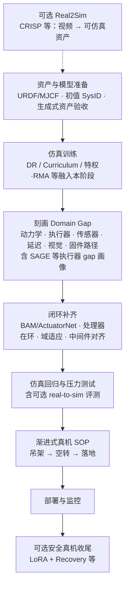

# Sim2Real

**Sim2Real**（仿真到现实迁移）：在仿真环境训练控制策略，然后部署到真实机器人上。

## 一句话定义

在仿真里学会，在现实中生效。

## 英文缩写速查

| 缩写 | 英文全称 | 简要说明 |
|------|----------|----------|
| Sim2Real | Simulation to Real | 仿真训练策略迁移到真机部署 |
| DR | Domain Randomization | 随机化仿真物理参数以提升跨域鲁棒性 |
| RMA | Rapid Motor Adaptation | 特权信息 Teacher–Student，从历史轨迹隐式估计环境参数 |
| SysID | System Identification | 标定真机动力学/摩擦等，缩小仿真–现实差距 |
| SOP | Standard Operating Procedure | 渐进式真机验证流程（吊架→空转→落地） |
| URDF | Unified Robot Description Format | 机器人运动学与惯性描述，迁移前须与真机对齐 |

## 为什么重要

- 真实机器人训练成本高、速度慢、容易损坏
- 仿真可以并行加速、任意重置、无硬件损耗
- 但仿真和现实有 domain gap，必须解决迁移问题

## Sim2Real 工程流程总览



## 核心问题：Domain Gap

仿真和现实的主要差异：

- **物理参数差异**：质量、摩擦力、延迟等参数不准
- **传感器差异**：相机噪声、IMU 漂移、触觉反馈
- **动作执行差异**：电机响应延迟、控制频率限制
- **嵌入式与通信差异**：CAN/以太网抖动、线程错过周期、驱动协议路径与仿真「瞬时读写」不一致（见 [处理器在环 Sim2Real](./processor-in-the-loop-sim2real.md)）
- **视觉差异**：纹理、光照、背景

## 主要方法

Sim2Real 应对 domain gap 的路线可按 **仿真端随机化（DR）**、**分布对齐（SysID / Domain Adaptation）**、**真机微调（Privileged / RMA）** 三大类组合使用。横向对比、选型决策树与代表工作见 **[Sim2Real 方法横向对比](../comparisons/sim2real-approaches.md)**；各子题深挖入口：

| 路线 | 站内入口 |
|------|----------|
| 域随机化 | [Domain Randomization](./domain-randomization.md) |
| 系统辨识 | [System Identification](./system-identification.md) |
| 领域自适应（视觉等） | 见 [Sim2Real 方法对比](../comparisons/sim2real-approaches.md) § Domain Adaptation |
| 特权 / Teacher–Student | [Privileged Training](./privileged-training.md) |
| 在线适应（RMA） | [RMA 论文实体](../entities/paper-rma-rapid-motor-adaptation.md) |
| 课程学习 | 见 [Locomotion](../tasks/locomotion.md) 训练管线 |

以下三项偏 **工程落地**，在对比页中不展开：

### Sim2Real SOP（标准作业程序）

根据 [xbotics-embodied-guide](../../sources/repos/xbotics-embodied-guide.md) 的总结，为了提高 Sim2Real 的可复现性，应遵循标准化的工程步骤：
- **前置阶段**：精确的 URDF 建模与动力学参数初步对齐；若场景物体来自 **生成式 sim-ready 管线**（如 [PhysX-Omni](../entities/physx-omni.md) 导出的 URDF/XML），须单独验收 **惯性、碰撞盒与关节轴** 是否与目标仿真器一致，不宜默认「生成即可用」。
- **仿真验证**：在 [isaac-gym-isaac-lab](../entities/isaac-gym-isaac-lab.md) 或 [genesis-sim](../entities/genesis-sim.md) 中完成基础策略训练，并通过域随机化覆盖物理参数偏差。
- **评测基础设施**：产业侧亦将可信仿真用于 **real-to-sim 闭环排序**（训练仍主要来自真机），见 [仿真评测基础设施](simulation-evaluation-infrastructure.md) 与 [Genesis World 1.0](../entities/genesis-world-10.md)。
- **中间件对齐**：统一仿真与真机的控制频率（如 50Hz 策略 + 200Hz 关节 PD）与动作/状态归一化标准。
- **实物测试**：采用“吊架测试 -> 空转测试 -> 落地测试”的渐进式 SOP。

### 高保真执行器对齐（Actuator Alignment）

**解析摩擦扩展（舵机 / 伺服）：** [BAM](../entities/paper-bam-extended-friction-servo-actuators.md)（ICRA 2025，[Rhoban/bam](https://github.com/Rhoban/bam)）在 MuJoCo 等默认 Coulomb–Viscous 之外，用 **M1–M6 可辨识摩擦上界**（Stribeck、负载相关、谐波二次项）与摆锤台架 **CMA-ES** 标定，在 Dynamixel / eRob 2R 臂上可将轨迹 MAE 降至约一半——尤其适合 **RL 低 PD 增益** 下执行器滞后明显的场景；与 [Actuator Network](../methods/actuator-network.md)（数据驱动）及 [SAGE](../entities/sage-sim2real-actuator-gap-estimator.md)（gap 度量）可组合使用。

根据 [zest](../methods/zest.md) 的实践，缩小动力学差距的关键在于精确处理闭链执行器（如膝盖、脚踝）的物理特性。通过基于电枢（Armature）分析值的增益选择程序，可以在不使用反馈补偿器的情况下，实现高动态动作的零样本迁移。机构层闭链几何、驱动—关节力映射与「训练用开环树 / 真机串并联」落差，可对照 [人形机器人并联关节解算](./humanoid-parallel-joint-kinematics.md)（含 LiPS、Kinematic Actuation Models 等文献锚点）。

### 处理器在环（固件 + 外设路径）

当失效主要来自 **固件调度、总线语义与传感器融合实现** 而非刚体参数本身时，可在仿真中运行**未改动的生产固件**，并用 I2C/CAN 等外设仿真注入寄存器级数据流与请求–响应抖动，使 RL 策略与底层栈在同一闭环里被联合测试。工程动机与管线拆分见 [处理器在环 Sim2Real](./processor-in-the-loop-sim2real.md)。

## 常见误区

- **以为仿真越逼真越好**：太精确的仿真不一定更好，domain randomization 可能更 robust
- **忽略动作延迟**：仿真中动作瞬时执行，现实中有延迟
- **只看 reward 不看安全性**：sim2real 部署初期容易损坏硬件

## 在人形机器人中的应用

人形机器人 sim2real 的特殊挑战：

- 高维状态空间（30+ 自由度）
- 接触力难以精确建模
- 视觉感知差异大
- 足式接触的不确定性

典型 pipeline：

```
仿真训练 → 域随机化 → 零样本迁移 → 真实机器人部署 → 在线微调（可选）
```

### 在「映射 → 训练 → 迁移」三段流水线中的位置

人形动作落地的整条链是「**映射 → 训练 → 迁移**」三段：[重定向流水线](./motion-retargeting.md) 把人体参考映射成物理可执行参考（**映射**），[WBT 流水线](./whole-body-tracking-pipeline.md) 把这些参考当训练数据学出全身跟踪策略（**训练**），[跨具身策略迁移](../queries/cross-embodiment-transfer-strategy.md) 再把策略搬到新机体（**迁移**）。Sim2Real **横切训练与迁移两段**：它既决定阶段 ② 训练出的策略能否零样本上真机，也决定阶段 ③ 换机体后是否需要重新跨越 domain gap。本页的 RMA / 域随机化 / 执行器对齐 / 安全 LoRA 收尾正是这条链「从仿真策略到真机可执行」的关键工程手段——其中 [SLowRL](../entities/paper-slowrl-safe-lora-locomotion-sim2real.md) 式「冻结策略 + rank-1 LoRA + 安全壳」尤其契合**跨具身迁移后**的真机收尾。不同 WBT 方法（[SONIC / BeyondMimic / SD-AMP / Heracles 对比](../comparisons/sonic-vs-beyondmimic-vs-sdamp-vs-heracles.md)）在「仿真训练 vs 真机微调」的比重上各有取舍。

> 部署后的真机在线适配自成一段窄口议题（低秩残差 / 生成兜底 / CBF 安全壳三条路径），单列于 [真机安全 RL 微调](./safe-real-world-rl-fine-tuning.md)。

- **安全、参数高效的真机微调（四足）：** [SLowRL](../entities/paper-slowrl-safe-lora-locomotion-sim2real.md)（arXiv:2603.17092）在 **冻结仿真策略** 上只训 **rank-1 LoRA**，并用 **Recovery Policy + Safety Filter** 约束真机探索；Unitree Go2 jump/trot 上相对全参 PPO 微调约 **46.5%** 墙钟缩短、训练期摔倒近零，适合讨论「**不全参、不盲探索**」的 sim2real 收尾阶段。

- **训练期电机包络约束（轮足零样本）：** [MUJICA](../entities/paper-mujica-wheel-legged-multi-skill.md)（arXiv:2605.13058）将 **DC 电机速度–扭矩硬约束** 写入 **P3O**，把仿真违规从 **>90%** 压到 **<3.5%**，支撑 Go2-W **高台攀爬** 等极限机动零样本上真机而不触发过流保护——适合讨论「**约束即 sim2real 安全层**」而非仅域随机化。

- **补充参照（学习式管线）：** [LIFT](../entities/lift-humanoid.md) 将「预训练期高随机性探索」与「微调期真机侧确定性动作」拆开，并把随机探索主要约束在 **物理知情世界模型** 的 rollout 中，用于讨论 **安全–样本效率** 折中；其站点亦给出 **预训练任务设计不当 → 零样本 sim2real 失败**、再靠短时段实机数据恢复的案例叙事。

- **补充参照（低成本双足 / 舵机）：** [Open Duck Mini](../entities/open-duck-mini.md) 在 **Feetech 舵机 + BAM 电机辨识 + MuJoCo Playground** 管线上公开 sim2real 行走；强调 MJCF 执行器参数与真机一致、模仿奖励与参考运动分仓迭代，机载部署在 Pi Zero 2W（见 [Open Duck Mini Runtime](../entities/open-duck-mini-runtime.md)）。

- **补充参照（人形 · Planner–IDM 少样本适应）：** [FADA](../entities/paper-fada-humanoid.md)（arXiv:2606.28476，CMU）把策略分解为 **规划器 + 逆动力学模型（IDM）**：源域 oracle+DAgger 训练后，部署 **冻结 planner**、仅用约 **2 分钟** 目标域 rollout 的观测–动作对 **LoRA 微调 IDM** 对齐动力学；G1/T1 真机高精度全身任务成功率 **20%→90%**，无需目标 reward 或仿真重标定——适合讨论「**只改执行映射、不改任务意图**」的 few-shot sim2real。

- **补充参照（人形 loco-manip · 冻结策略适配）：** [SplitAdapter](../entities/paper-splitadapter-load-aware-loco-manipulation.md)（arXiv:2606.03297）在 **冻结 AMP 搬箱策略** 上学习 **物体/负载** 与 **动力学** 双分支历史适配（分裂世界模型 + GRL + 分层 FiLM），针对 **载荷与搬放高度变化** 与 **sim–real 动力学差** 的耦合；MuJoCo sim-to-sim 与 **Unitree G1 零样本** 重载（6 kg）全流程成功率显著提升，可与 RMA 式「单 latent 外参估计」对照阅读。

### Real2Sim：从视频构造可仿真资产

讨论 Sim2Real 时常隐含「仿真里已有合理关卡与参考运动」；人形上下文技能还要解决如何把**单目视频**变成**接触动力学可信**的仿真资产。[CRISP](../methods/crisp-real2sim.md)（ICLR 2026）用**凸平面场景原语 + 人–场景接触补全 + RL 人形闭环**把视频推向可 rollout 的 Real2Sim，并与 VideoMimic 等管线在几何—控制接口上形成对照（见项目页交互对比区）。

**操作场景与策略闭环：** [SimFoundry](../entities/paper-simfoundry-real2sim-scene-generation.md)（arXiv:2606.28276，NVIDIA GEAR）从**单段真机视频**模块化重建 **sim-ready 数字孪生**，并自动生成 **object/scene/task digital cousins**；同一环境支撑 **real-to-sim 策略评测**（均值 Pearson **0.911**）与 **sim-to-real 演示训练**（DROID / YAM，含多步、铰接与双手任务），把「资产—评测—训练」收进可替换 foundation model 组件的统一栈。

## 参考来源
- [KungFuAthleteBot](../entities/paper-kungfuathlete-humanoid-martial-arts-tracking.md) — G1 真机高动态武术 tracking（[source](../../sources/papers/kung_fu_athlete_bot.md)）

- Tobin et al. 2017, *Domain Randomization for Transferring Deep Neural Networks from Simulation to the Real World* — domain randomization 奠基论文
- Peng et al. 2018, *Sim-to-Real Transfer of Robotic Control with Dynamics Randomization* — locomotion 控制迁移基线
- [sources/papers/sim2real.md](../../sources/papers/sim2real.md) — DR / RMA / InEKF ingest 摘要
- [sources/papers/rma_arxiv_2107_04034.md](../../sources/papers/rma_arxiv_2107_04034.md) — RMA 一手论文摘录（RSS 2021）
- [Sim2Real 方法横向对比](../comparisons/sim2real-approaches.md) — 迁移路线与代表工作
- [Deployment-Ready RL: Pitfalls, Lessons, and Best Practices](https://thehumanoid.ai/deployment-ready-rl-pitfalls-lessons-and-best-practices/) — 工程实践
- [机器人论文阅读笔记：Domain Randomization](https://imchong.github.io/Humanoid_Robot_Learning_Paper_Notebooks/papers/01_Foundational_RL/Domain_Randomization_Understanding_Sim-to-Real_Transfer/Domain_Randomization_Understanding_Sim-to-Real_Transfer.html)
- [机器人论文阅读笔记：LCP](https://imchong.github.io/Humanoid_Robot_Learning_Paper_Notebooks/papers/01_Foundational_RL/LCP_Sim-to-Real_Action_Smoothing/LCP_Sim-to-Real_Action_Smoothing.html)
- [机器人论文阅读笔记：RMA](https://imchong.github.io/Humanoid_Robot_Learning_Paper_Notebooks/papers/10_Sim-to-Real/RMA_Rapid_Motor_Adaptation/RMA_Rapid_Motor_Adaptation.html)
- [Menlo：Noise is all you need…](../../sources/blogs/menlo_noise_is_all_you_need.md) — 处理器在环 + CAN 抖动注入的 Asimov 工程博文入库摘录
- **ingest 档案：** [sources/courses/nvidia_sim_to_real_so101_isaac.md](../../sources/courses/nvidia_sim_to_real_so101_isaac.md) — NVIDIA SO-101 动手课：DR / Co-training / Cosmos / SAGE+GapONet 四类策略对照与 VLA workflow
- **ingest 档案：** [sources/repos/sage-sim2real-actuator-gap.md](../../sources/repos/sage-sim2real-actuator-gap.md) — SAGE：Isaac Sim 重放与真机日志对齐的执行器层 sim2real gap 度量工具链
- [sources/papers/crisp_real2sim_iclr2026.md](../../sources/papers/crisp_real2sim_iclr2026.md) — CRISP：单目视频平面原语 Real2Sim + 接触引导（ICLR 2026）ingest 摘录
- **ingest 档案：** [sources/papers/barkour_arxiv_2305_14654.md](../../sources/papers/barkour_arxiv_2305_14654.md) — Barkour：>1m/s 敏捷动作的额外 DR + 零样本 sim2real 完成 5m×5m 障碍课
- **ingest 档案：** [sources/papers/slowrl_arxiv_2603_17092.md](../../sources/papers/slowrl_arxiv_2603_17092.md) — SLowRL：LoRA + Recovery 安全真机微调（Go2）
- **ingest 档案：** [sources/papers/bam_extended_friction_servos_arxiv_2410_08650.md](../../sources/papers/bam_extended_friction_servos_arxiv_2410_08650.md) — BAM：舵机扩展摩擦模型 + MuJoCo 2R 验证（arXiv:2410.08650，ICRA 2025）
- **ingest 档案：** [sources/repos/rhoban_bam.md](../../sources/repos/rhoban_bam.md) — Rhoban/bam 开源辨识与仿真管线

## 关联页面

- [Reinforcement Learning](../methods/reinforcement-learning.md)
- [Whole-Body Control](../concepts/whole-body-control.md)
- [真机安全 RL 微调](./safe-real-world-rl-fine-tuning.md) — 部署后真机在线适配的安全边界：低秩残差 / 生成兜底 / CBF 安全壳三条路径
- [Motion Retargeting](./motion-retargeting.md) — 「映射 → 训练 → 迁移」三段流水线首段：Sim2Real 消费其物理可执行参考产物
- [Whole-Body Tracking Pipeline](./whole-body-tracking-pipeline.md) — 三段流水线中段；Sim2Real 横切其「训练 → 真机」落地
- [跨具身策略迁移选型指南](../queries/cross-embodiment-transfer-strategy.md) — 三段流水线末段；换机体后是否需重跨 domain gap
- [Locomotion](../tasks/locomotion.md)
- [System Identification](./system-identification.md)（减少物理参数和执行器模型的 sim2real gap）
- [Actuator Network 执行器网络](../methods/actuator-network.md) — 用神经网络拟合电机非线性特性
- [Privileged Training](./privileged-training.md)（Teacher-Student 训练是 sim2real 的核心技术之一）
- [RMA（论文实体）](../entities/paper-rma-rapid-motor-adaptation.md) — 特权 extrinsics + 历史适应模块；A1 异步 10/100 Hz 部署
- [Query：RL 策略真机调试 Playbook](../queries/robot-policy-debug-playbook.md) — 真机部署阶段系统排障指南
- [LEGS（论文实体）](../entities/paper-legs-embodied-gaussian-splatting-vla.md) — 3DGS 缩小 **视觉** sim2real gap 以合成 VLA 训练数据（arXiv:2606.01458）
- [OASIS（论文实体）](../entities/paper-loco-manip-04-oasis.md) — 仿真 VR teleop + Path-Tracing 视觉域随机化；**纯仿真数据** 训练 G1 loco-manip 零样本可 ≥ 等量真机 teleop（arXiv:2606.08548）
- [NVIDIA SO-101 Sim2Real 实验 workflow](../entities/nvidia-so101-sim2real-lab-workflow.md) — 官方动手课：四类 sim2real 策略 + GR00T N1.6 VLA + LeRobot/Isaac Lab
- [GR00T-VisualSim2Real](../entities/gr00t-visual-sim2real.md) — NVIDIA 视觉 Sim2Real 框架，PPO Teacher + DAgger RGB Student，Unitree G1 零样本迁移（CVPR 2026）
- [LadderMan](../entities/paper-ladderman-humanoid-perceptive-ladder-climbing.md) — **深度** sim-to-real：真机用 **VFM（Fast-FoundationStereo）** 替代重度 depth randomization，配合 **RFM** 聚焦梯子踏棍（arXiv:2606.05873）
- [SAGE（执行器 Sim2Real 间隙估计）](../entities/sage-sim2real-actuator-gap-estimator.md) — Isaac 重放与真机关节日志对齐，RMSE/相关/余弦相似度等量化执行器层 gap
- [LIFT](../entities/lift-humanoid.md) — JAX SAC 大规模预训练 + Brax 物理知情世界模型微调；微调阶段真机确定性采集与模型内随机探索解耦（arXiv:2601.21363）
- [人形机器人并联关节解算](./humanoid-parallel-joint-kinematics.md) — 并联踝闭链与仿真训练接口分层（冲击下传载再分配等）
- [处理器在环 Sim2Real](./processor-in-the-loop-sim2real.md) — 固件/总线/调度纳入仿真闭环的腿式迁移路径
- [CRISP（Contact-guided Real2Sim）](../methods/crisp-real2sim.md) — 单目视频 → 凸平面场景原语 + 接触补全 → RL 物理闭环的 Real2Sim（ICLR 2026）
- [SimFoundry](../entities/paper-simfoundry-real2sim-scene-generation.md) — 真机视频 → 数字孪生 + cousins；real-to-sim 评测与 sim-to-real 操作训练闭环（arXiv:2606.28276）
- [SLowRL（安全 LoRA 真机微调）](../entities/paper-slowrl-safe-lora-locomotion-sim2real.md) — 四足动态策略的低秩 + Recovery 安全层
- [FADA（Planner–IDM 少样本动力学对齐）](../entities/paper-fada-humanoid.md) — 冻结 planner、LoRA 微调 IDM；约 2 min 目标 rollout（arXiv:2606.28476）
- [BAM 扩展摩擦（舵机仿真）](../entities/paper-bam-extended-friction-servo-actuators.md)、[BAM 开源仓库](../entities/bam-better-actuator-models.md) — M1–M6 摩擦辨识与 MuJoCo 2R 验证
- [Friction Compensation](./friction-compensation.md) — 前馈摩擦补偿与 Project 3 式三组对比实验
- [Quadruped Control Curriculum](../entities/quadruped-control-curriculum.md) — 四足 SysID → Sim2Real 系统课程
- [ONNX](../entities/onnx.md) — 训练框架与机载 runtime 之间的开放模型交换格式
- [ONNX Runtime](../entities/onnxruntime.md) — 人形 C++ 机载策略推理的主流引擎
- [ONNX Runtime vs MNN vs TensorRT](../comparisons/onnxruntime-vs-mnn-vs-tensorrt.md) — onboard 推理 runtime 选型

## 继续深挖入口

如果你想沿着 sim2real 继续往下挖，建议从这里进入：

### 论文入口
- [Sim2Real 方法横向对比](../comparisons/sim2real-approaches.md)
- [Humanoid Robot Learning Paper Notebooks · Sim-to-Real](https://imchong.github.io/Humanoid_Robot_Learning_Paper_Notebooks/papers/10_Sim-to-Real/)

### 仿真 / 平台入口
- [Simulation](../../references/repos/simulation.md)
- [RL Frameworks](../../references/repos/rl-frameworks.md)

## 推荐继续阅读

- [RL Sim2Sim 在线演示：MuJoCo WASM + ONNX](https://imchong.github.io/RL_Sim2Sim_Demo_Website/index.html)
- [机器人论文阅读笔记：RAPT](https://imchong.github.io/Humanoid_Robot_Learning_Paper_Notebooks/papers/10_Sim-to-Real/RAPT__Model-Predictive_Out-of-Distribution_Detection_and_Failure_Diagnosis_for_/RAPT__Model-Predictive_Out-of-Distribution_Detection_and_Failure_Diagnosis_for_.html)
- [机器人论文阅读笔记：PolySim](https://imchong.github.io/Humanoid_Robot_Learning_Paper_Notebooks/papers/10_Sim-to-Real/PolySim__Bridging_the_Sim-to-Real_Gap_for_Humanoid_Control_via_Multi-Simulato/PolySim__Bridging_the_Sim-to-Real_Gap_for_Humanoid_Control_via_Multi-Simulato.html)
- [机器人论文阅读笔记：Towards Bridging the Gap](https://imchong.github.io/Humanoid_Robot_Learning_Paper_Notebooks/papers/10_Sim-to-Real/PACE_Systematic_Sim-to-Real_Transfer_for_Diverse_Legged_Robots/PACE_Systematic_Sim-to-Real_Transfer_for_Diverse_Legged_Robots.html)
- [机器人论文阅读笔记：MOSAIC](https://imchong.github.io/Humanoid_Robot_Learning_Paper_Notebooks/papers/04_Loco-Manipulation_and_WBC/MOSAIC__Bridging_the_Sim-to-Real_Gap_in_Generalist_Humanoid_Motion_Tracking_and_/MOSAIC__Bridging_the_Sim-to-Real_Gap_in_Generalist_Humanoid_Motion_Tracking_and_.html)
- [Deployment-Ready RL: Pitfalls, Lessons, and Best Practices](https://thehumanoid.ai/deployment-ready-rl-pitfalls-lessons-and-best-practices/)
- [SAGE 官方仓库 README](https://github.com/isaac-sim2real/sage)（执行器层 gap 度量与成对数据集管线）
- [Query：如何缩小 sim2real gap](../queries/sim2real-gap-reduction.md)
- [Comparison：Sim2Real 方法横向对比](../comparisons/sim2real-approaches.md)
