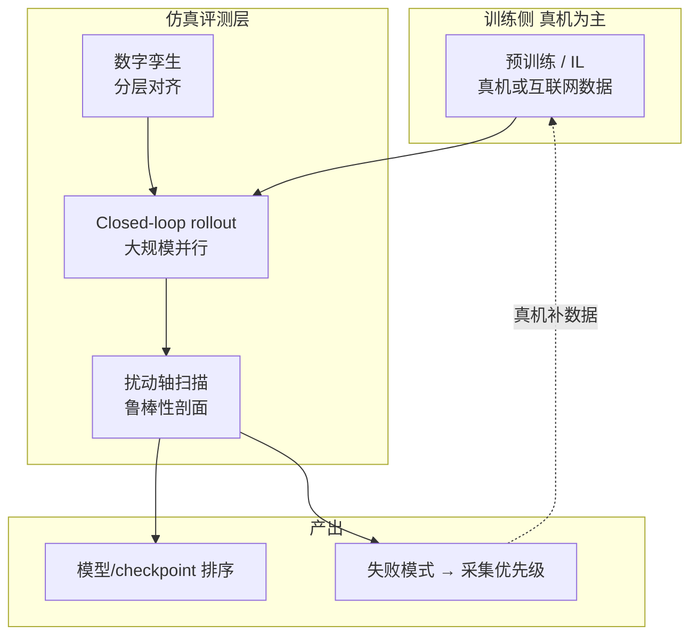

# 仿真评测基础设施（Simulation as Evaluation Infrastructure）

**仿真评测基础设施**指：在机器人学习与基础模型开发中，把仿真主要用作**可扩展、可复现的闭环评测与 recipe 迭代引擎**，而不是默认等同于「仿真数据生成器」。当评测与真机 rollout **统计相关**且训练管线刻意**不与评测共享同一仿真分布**时，团队可以在组合任务空间上高频打分，从而把进展速度更多绑定到 **GPU 算力** 而非 **真机墙钟**。

## 英文缩写速查

| 缩写 | 英文全称 | 简要说明 |
|------|----------|----------|
| Sim2Real | Simulation to Real | 把仿真中学到的策略迁移落地真机的工程主线 |
| GPU | Graphics Processing Unit | 图形处理器，大规模并行仿真训练的算力基础 |
| RL | Reinforcement Learning | 通过与环境交互最大化长期回报来学习策略的范式 |
| Isaac Gym | NVIDIA Isaac Gym | GPU 并行刚体仿真训练环境 |
| Isaac Lab | NVIDIA Isaac Lab | 基于 Omniverse 的机器人学习训练框架 |
| VLA | Vision-Language-Action | 视觉-语言-动作多模态基础策略方向 |
| AI | Artificial Intelligence | 人工智能 |

## 为什么重要？

- **第二个瓶颈：** 领域常强调数据稀缺，但 **模型开发周期本身**（ablation、checkpoint 对比、失败模式发现）在纯真机验证下同样难扩展。
- **指标错位：** 固定数据集上的 **open-loop** action 预测误差，在模型差异落在窄带时往往**无法预测**真机 closed-loop 成功率；自动驾驶等领域已较早投资**大规模闭环仿真里程**。
- **顺序问题：** 若仿真行为不可信，无论用于评测、数据生成还是 RL 后训练，结论都可能失真——因此产业实践可出现 **「评测先行、仿真训练数据后置」** 的分阶段策略（见 [Genesis World 1.0](../entities/genesis-world-10.md) 叙事）。
- **跨层 orchestration：** 全栈 Physical AI 还需把 **基础模型、闭环策略与全身控制** 的评测挂在 **同一 trace** 上，才能定位「一层引入、另一层显现」的回归——[DeepInsight](../entities/deepinsight.md)（XPENG Robotics）代表这一路 **统一评测 runtime** 的产业样本。

## 核心机制

### 1) 闭环 vs 开环

| 维度 | Open-loop | Closed-loop |
|------|-----------|-------------|
| 观测 | 固定日志/数据集 | 策略动作改变后续状态 |
| 指标 | 动作 MSE、R² 等 | 任务成功率、长程约束满足 |
| 适用 | 快速 sanity check | 模型排序与鲁棒性剖面 |

### 2) Real-to-sim 与训练解耦

- **Real-to-sim：** 策略用**真机数据**训练，在仿真中 **zero-shot** 评测；用于检验数字孪生而非「在 sim 里练再在 sim 里考」。
- **解耦动机：** 若预训练与评测共用同一仿真动力学，指标改善可能仅反映 **过拟合仿真器**，而非更好的数据/架构 recipe。

### 3) 可扩展评测要件

- **组合覆盖：** 多任务 × 多物体 × 多扰动（光照、相机、语言表述、构型等）。
- **可复现：** 同场景同随机种子下结果一致（真机评测受标定漂移、磨损、操作员差异影响）。
- **归因：** 分层数字孪生（控制、动力学、渲染）+ 并排或混合观测 rig，将 gap 分解到具体子系统而非单一成功率。

### 4) 扰动轴与鲁棒性剖面

对 generalist manipulation 等场景，可按 **Visual / Behavioral / Semantic** 等正交轴做单参数扫描，定义相对 nominal 的 **robustness retention**，指导「下一批该采什么真机数据」——评测结果直接驱动数据飞轮（参见 [数据飞轮](data-flywheel.md)）。

## 流程总览

## 常见误区

- 把 **仿真数据量** 当作仿真价值的唯一度量，忽视 **评测吞吐量与排序可信度**。
- 用 **open-loop** 指标在相近模型间做「谁更好」的最终裁决。
- 在未做 **real-to-sim 相关性** 校验的任务上，用仿真排行榜替代真机 sign-off。
- 将某一公司/平台的自报 Pearson/MMRV **外推**到所有机器人形态与任务分布。

**操作臂实证：** [SimFoundry](../entities/paper-simfoundry-real2sim-scene-generation.md)（arXiv:2606.28276）从真机视频构建孪生场景，在 **7 任务 × 5 策略族** 上报告 **均值 Pearson r=0.911、MMRV=0.018**，并相对 PolaRiS 显著提升排序相关性——可作为「**视频孪生 + cousins 数据**」路线的 real-to-sim 评测锚点。

## 关联页面

- [仿真物理保真度链路选型指南](../queries/simulation-physics-fidelity.md) — 本页所述物理/仿真要素在保真度链路（建模 ① → 数值 ② → 接触 ③ → 随机化 ④）中的定位
- [训练栈分层地图](../overview/robot-training-stack-layers-technology-map.md) — Genesis World 在「闭环评估基础设施层」的策展坐标
- [DeepInsight](../entities/deepinsight.md) — System 2/1/0 统一 trace 与跨层 failure localization
- [Genesis World 1.0](../entities/genesis-world-10.md) — 产业侧全栈实现与自报相关性案例
- [Sim2Real](sim2real.md) — 迁移与域随机化；本概念侧重 **评测闭环**
- [Isaac Gym / Isaac Lab](../entities/isaac-gym-isaac-lab.md) — 高并行仿真与 RL 评测生态
- [VLA](../methods/vla.md) — 操作基础模型评测基准语境
- [ENPIRE](../methods/enpire.md) — 真机闭环 autoresearch 与 RoboCasa 仿真 ablation 的分工样本
- [SimFoundry](../entities/paper-simfoundry-real2sim-scene-generation.md) — 真机视频孪生 + Pearson/MMRV 操作策略评测（arXiv:2606.28276）
- [数据飞轮](data-flywheel.md) — 评测驱动的数据采集闭环

## 推荐继续阅读

- [RL Sim2Sim 在线演示：MuJoCo WASM + ONNX](https://imchong.github.io/RL_Sim2Sim_Demo_Website/index.html)
- [机器人论文阅读笔记：HumanoidBench](https://imchong.github.io/Humanoid_Robot_Learning_Paper_Notebooks/papers/11_Simulation_Benchmark/HumanoidBench/HumanoidBench.html)
- [机器人论文阅读笔记：GRUtopia](https://imchong.github.io/Humanoid_Robot_Learning_Paper_Notebooks/papers/11_Simulation_Benchmark/GRUtopia__Dream_General_Robots_in_a_City_at_Scale/GRUtopia__Dream_General_Robots_in_a_City_at_Scale.html)
- Genesis AI（2026）：*The Role of Simulation in Scalable Robotics, Genesis World 1.0, and the Path Forward* — <https://www.genesis.ai/blog/the-role-of-simulation-in-scalable-robotics-genesis-world-10-and-the-path-forward>
- SimplerEnv 项目页（real-to-sim 评测）：<https://simpler-env.github.io/>
- Gao et al.（2025）— generalist manipulation 评测 taxonomy（博客引用 [06]）

## 参考来源

- [genesis_ai_simulation_world_10_blog](../../sources/blogs/genesis_ai_simulation_world_10_blog.md)
- [具身智能研究室：训练栈分层解读](../../sources/blogs/wechat_embodied_ai_lab_robot_training_stack_layers_2026.md)
