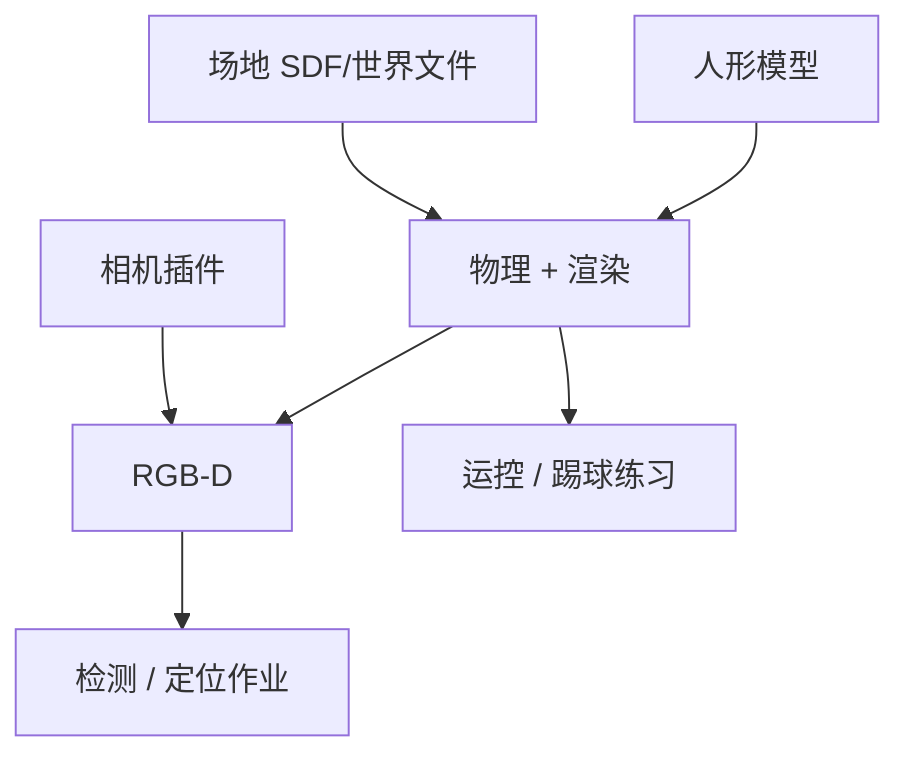

# 足球场仿真环境

## 一句话定义

**足球场仿真环境**是按比赛或教学规格搭建的 **场地几何 + 球/门实体 + 传感器与光照模型**，使人形在无真机场地时也能迭代感知与决策——课程第 6.3 节。

## 英文缩写速查

| 缩写 | 英文全称 | 简要说明 |
|------|----------|----------|
| RoboCup | Robot Soccer World Cup | 规则与场地尺寸常见来源 |
| Sim2Real | Simulation to Real | 视觉域差是主风险 |
| FOV | Field of View | 相机能否同时看到线与球 |
| SDF / URDF | Scene / Robot description | 常见场景与机器人描述 |
| Gym | RL Environment API | 策略训练环境接口 |
| Domain Rand. | Domain Randomization | 缩小视觉域差 |

## 为什么重要

- **真机场地贵且难约**：检测数据、线匹配、EKF 应先在可控仿真完成。
- **与 RL 足球环境分工**：[htwk-gym](../methods/htwk-gym.md) 等偏策略/奖励；本概念强调 **感知几何真实感**（线宽、门柱、相机噪声），服务课程 Ch6–7。
- 为 [YOLO 训练](../methods/soccer-field-line-detection.md) 提供可自动标注或易标注的图像源。

## 核心原理

### 最小要素清单

| 要素 | 要求 |
|------|------|
| 场地平面 | 尺寸符合规则或课程简化版 |
| 线图案 | 中线、中圈、禁区、球门线对比度足够 |
| 球门 | 门柱/横梁几何可被检测为 goal |
| 足球 | 碰撞体 + 高对比纹理 |
| 相机 | 对齐 [RealSense](../entities/intel-realsense.md) 内参更佳 |
| 机器人 | G1 等 URDF + 可控头/行走接口 |

### 保真度分层

| 层级 | 内容 | 服务对象 |
|------|------|----------|
| 几何保真 | 线位置、门宽 | 线匹配、EKF |
| 视觉保真 | 纹理、光照、运动模糊 | 检测泛化 |
| 物理保真 | 球弹跳、摩擦 | 踢球策略（另见 [Sim2Real](./sim2real.md)） |

课程感知章优先 **几何 + 中等视觉保真**；不必一开始追求草皮物理。

## 工程实践

### 搭建与数据闭环

1. 选用 Gazebo / Webots / Isaac 等，导入场地与 G1。
2. 固定若干相机位姿与随机位姿，批量截图。
3. 自动投影模型线生成交点标签，或半自动标注。
4. 训练检测 → 回灌仿真评估 → 再上真机小样本微调。

### 域随机化建议（视觉）

| 随机项 | 目的 |
|--------|------|
| 光照方向/强度 | 抗曝光 |
| 线亮度/草皮纹理 | 抗域差 |
| 相机俯仰微扰 | 抗标定误差 |
| 运动模糊 | 抗行走晃动 |

### 与任务页的衔接

完整比赛能力见 [Humanoid Soccer](../tasks/humanoid-soccer.md) 与 [足球纵深路线](../../roadmap/depth-humanoid-soccer.md)；仿真环境只是感知与初级决策的沙盘。

## 局限与风险

- **过干净仿真** → 真机检测崩；必须随机化或混真机数据。
- 物理引擎球弹跳与真草差距大，踢球策略迁移另论。
- **误区**：用仿真 mAP 代替真机闭环进球率。

## 关联页面

- [场地线检测](../methods/soccer-field-line-detection.md)
- [Intel RealSense](../entities/intel-realsense.md)
- [Humanoid Soccer](../tasks/humanoid-soccer.md)
- [htwk-gym](../methods/htwk-gym.md)
- [人形系统课程策展](../entities/humanoid-system-curriculum.md)
- [物理保真度 ↔ Sim2Real Gap](./physics-fidelity-sim2real-gap.md) — 本页「保真度分层」表（几何/视觉/物理）是该专题在足球场景的具体落点

## 参考来源

- [深蓝学院人形系统课程大纲](../../sources/courses/shenlan_humanoid_system_theory_practice.md)

## 推荐继续阅读

- RoboCup Humanoid League 规则（场地尺寸与线规格）
- 各队 Webots/Gazebo 公开场地资源
