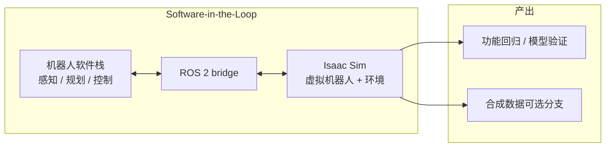

# Software-in-the-Loop（SIL，软件在环）

**Software-in-the-Loop（SIL）** 指在 **仿真中的虚拟机器人 + 虚拟环境** 上运行并验证机器人软件，使开发早期 **不必依赖物理硬件** 即可做场景覆盖、回归测试与 AI 模型验证。NVIDIA [Isaac Sim](../entities/isaac-sim.md) 通过 **ROS 2 bridge**、OmniGraph 与 Python API 提供官方 SIL 路径（见 [Getting Started With Isaac Sim 教程模块](../../sources/sites/nvidia-isaac-sim-sil-tutorial.md)）。

## 一句话定义

**先把整机软件栈接到仿真里跑通，再上台架或真机——SIL 是 Sim2Real 之前的软件验证环，不是 Spatial Intelligence Lab 研究组。**

## 英文缩写速查

| 缩写 | 英文全称 | 简要说明 |
|------|----------|----------|
| SIL | Software-in-the-Loop | 本页核心：软件在仿真环境验证 |
| HIL | Hardware-in-the-Loop | 真实计算硬件 + 仿真环境，测软硬件集成 |
| ROS 2 | Robot Operating System 2 | Isaac Sim 最常见的 SIL 桥接中间件 |
| SDG | Synthetic Data Generation | 仿真衍生数据；常与 SIL 测试并列 |
| Sim2Real | Simulation to Real | SIL 通过后仍须解决的分布迁移问题 |
| AI | Artificial Intelligence | 感知/决策模型可在仿真极端场景训练与测试 |

## 为什么重要

- **穷举场景成本：** 真机复现多样背景、光照、物体布局与动作组合 **费时且危险**；仿真可在受控环境批量生成极端 case，补足 AI **外推** 弱点前的 **内插** 训练。
- **与 Isaac 产品分工：** 官方把 **场景 / 传感器 / SIL / SDG** 放在 Isaac Sim，把 **大规模 RL/IL** 放在 [Isaac Lab](../entities/isaac-lab.md)——SIL 是 **接外部栈** 的接口层，不是训练框架本身。
- **ROS 2 生态对齐：** 许多部署栈以 ROS 2 为中心；SIL 让你在 Sim 里先跑 **同一套节点与话题图**，再切真机 driver。
- **与 HIL 递进：** 课程路径上 SIL 之后引入 HIL，把 **真实 ECU/计算平台** 接入仿真世界，缩小「算力与驱动差异」盲区。

## 核心结构

### Isaac Sim 中的三条脚本路径

| 路径 | 适用 |
|------|------|
| **ROS 2 bridge** | 已有 ROS 包，SIL 联调 segmentation、导航、驾驶等 |
| **OmniGraph** | 无代码搭仿真逻辑与传感器图（见 [OmniGraph 实体页](../entities/omnigraph.md)） |
| **Python API** | 批量场景、CI 回归、自定义传感器 |

### SIL vs HIL vs Sim2Real

| 阶段 | 测什么 | 典型工具 |
|------|--------|----------|
| **SIL** | 软件逻辑在仿真机器人上是否正确 | Isaac Sim + ROS 2 |
| **HIL** | 软件在 **真实硬件** 上是否仍正确 | [Hardware-in-the-Loop](./hardware-in-the-loop.md) · Isaac Sim HIL 模块 |
| **Sim2Real** | 仿真策略/模型在真机是否可用 | 域随机化、系统辨识、真机标定等 |

## 工程实践

| 目标 | 做法 |
|------|------|
| 入门 | [Physical AI Learning](../entities/nvidia-physical-ai-learning.md) → *Getting Started With Isaac Sim* → SIL 模块 |
| ROS 包测试 | 启 Sim + ROS 2 bridge，record/play 与真机同名 topic |
| 感知模型 | 在 Sim 变光照/布局，跑分割或检测节点做回归 |
| 与训练区分 | 策略学习用 Isaac Lab；SIL 偏 **栈集成验证** |
| 缩写消歧 | 研究组 [Spatial Intelligence Lab](../entities/nvidia-spatial-intelligence-lab.md) 也叫 SIL——读 NVIDIA 文档时看 URL 域 |

## 局限与风险

- **不能替代全部硬件测试：** 课程明确 SIL **减少** 而非 **消除** 对物理样机的需求；接触、延迟、驱动 bug 仍要靠 HIL/真机。
- **仿真保真度上限：** 传感器噪声、摩擦、通信抖动建模不足会导致「SIL 全绿、真机翻车」——见 [Sim2Real](../concepts/sim2real.md)；该往几何/动力学/接触/执行器哪一层加投，按 [仿真物理保真度链路选型指南](../queries/simulation-physics-fidelity.md) 逐层判。
- **与 Spatial Intelligence Lab 混淆：** 同一缩写 **SIL** 在仓库中亦指 NVIDIA 研究组，上下文靠链接区分。

## 关联页面

- [Isaac Sim](../entities/isaac-sim.md) — SIL 主平台
- [NVIDIA Physical AI Learning](../entities/nvidia-physical-ai-learning.md) — 官方课程入口
- [ROS 2 基础](../concepts/ros2-basics.md)
- [Sim2Real](../concepts/sim2real.md)
- [Hardware-in-the-Loop](./hardware-in-the-loop.md) — SIL 之后的软硬件集成验证
- [NVIDIA Spatial Intelligence Lab](../entities/nvidia-spatial-intelligence-lab.md) — **不同含义的 SIL**
- [RL 策略真机调试 Playbook](../queries/robot-policy-debug-playbook.md)
- [仿真物理保真度链路选型指南](../queries/simulation-physics-fidelity.md) — SIL 通过后仍要逐层核的保真度投资判据

## 参考来源

- [Isaac Sim SIL 教程模块归档](../../sources/sites/nvidia-isaac-sim-sil-tutorial.md)

## 推荐继续阅读

- [Software-in-the-Loop（官方模块）](https://docs.nvidia.com/learning/physical-ai/getting-started-with-isaac-sim/latest/developing-robots-with-sil-in-isaac-sim/02-software-in-the-loop-sil.html)
- [Hardware-in-the-Loop Fundamentals（官方 HIL 模块）](https://docs.nvidia.com/learning/physical-ai/getting-started-with-isaac-sim/latest/leveraging-ros-2-and-hil-in-isaac-sim/01-hardware-in-the-loop-hil-fundamentals.html)
- [Isaac Sim 文档](https://docs.isaacsim.omniverse.nvidia.com/latest/index.html)
- [NVIDIA Physical AI Learning](https://docs.nvidia.com/learning/physical-ai/)
