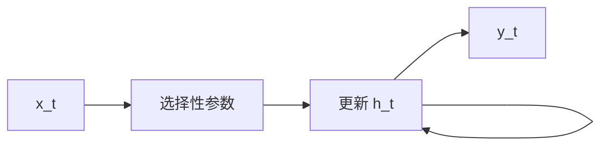

# 状态空间模型（SSM）

## 一句话定义

**SSM（State Space Model）** 用隐状态 $h_t$ 与输入 $x_t$ 的线性（或输入依赖的选择性）递推生成输出，可在频域/卷积视图与递推视图间转换；**Mamba** 为其选择性离散化的代表架构。

## 英文缩写速查

| 缩写 | 英文全称 | 简要说明 |
|------|----------|----------|
| SSM | State Space Model | 状态空间序列模型 |
| S4 | Structured State Space | 结构化 SSM 前驱 |
| Mamba | Mamba | 选择性 SSM 块 |
| HiPPO | HiPPO 初始化 | 长程记忆初始化理论 |
| Scan | Parallel Scan | 训练时并行前缀扫描 |

## 为什么重要

- 课程 7.1.2：理解 Vim/VMamba 前必须懂 SSM 在做什么。
- 对长时机器人轨迹/触觉历史压缩，SSM 提供相对注意力更省的选项（参见库内 TacMamba 等）。

## 核心原理

连续形式 $\dot h = Ah + Bx$，$y=Ch$；离散化后 $h_t = \bar A h_{t-1} + \bar B x_t$。选择性机制让 $\bar B,C$ 等依赖输入，从而动态记忆/遗忘。训练可用并行扫描，推理逐步 O(1) 状态更新。

## 工程实践

| 项 | 建议 |
|----|------|
| 实现 | 使用成熟 CUDA/ Triton 扫描核，避免朴素 Python 循环 |
| 视觉 | 见 Vim/VMamba 的扫描顺序设计 |
| 调试 | 对比同规模 Transformer 的困惑度/精度与吞吐 |

## 局限与风险

硬件与生态不及 Transformer；视觉任务对扫描路径敏感。勿把「线性复杂度」直接等同「一定更快」。

## 关联页面

- [RNN/CNN/Transformer/Mamba 对比](../comparisons/rnn-cnn-transformer-mamba.md)
- [Vision Mamba](../entities/vision-mamba-vim.md)
- [VMamba](../entities/vmamba.md)
- [Transformer CV 课程策展](../entities/transformer-cv-curriculum.md)

## 参考来源

- [Transformer 视觉应用课程大纲](../../sources/courses/transformer_cv_applications_syllabus.md)

## 推荐继续阅读

- [S4 (ICLR 2022) arXiv:2111.00396](https://arxiv.org/abs/2111.00396)
