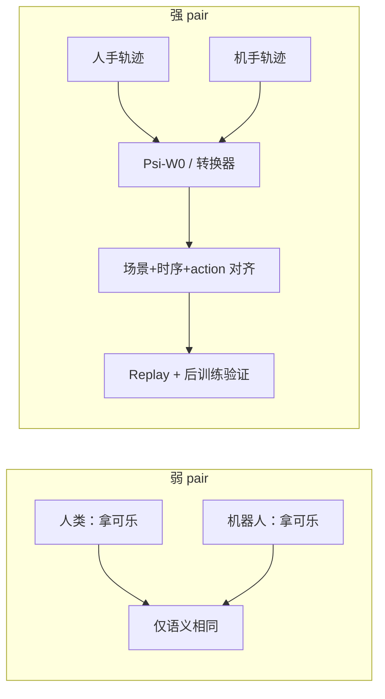

# 强 Pair Data（Strong Pair Data）

**强 pair data** 是 [人–机迁移](../methods/egoscale.md) 数据策展里的一个精度档位：不只要求「同一任务语义」，还要求 **视觉场景（除本体外）一致、时序逐帧对齐、机器人侧 action 可直接 replay**。PsiBot 在 [Psi-R2.5](../entities/psibot-r25.md) 技术博客中将其与 **弱 pair** 对照，并作为 scaling 人类预训练数据质量的核心杠杆。

## 一句话定义

人类演示与机器人演示在 **像素场景 + 时间轴 + 可执行动作** 上成对锁定的训练样本，用于把 human dynamic 对齐到 robot domain，而非仅共享任务标签。

## 英文缩写速查

| 缩写 | 英文全称 | 简要说明 |
|------|----------|----------|
| Pair Data | Human–Robot Paired Demonstrations | 人–机成对示教，弱/强为对齐粒度 |
| ICL | In-Context Learning | 示范作 context；强 pair 可把人视频转为机端 prompt |
| WM | World Model | Psi-W0 等用于生成/优化强 pair 的世界模型 |
| HIL | Human-in-the-Loop | 后训练人机协同采集与纠偏 |
| SR | Success Rate | 强 pair 质量门控常用 replay / 后训练 SR |

## 为什么重要

- **弱 pair 不够训 cross-embodiment：** 仅「都拿可乐」的片段仍差 camera、遮挡、动力学；模型易学 **embodiment 分类器** 而非共享操作语义（[Psi-R2.5](../entities/psibot-r25.md) 博客论点）。
- **强 pair 可 scale：** 传统 real2sim / inpainting 难批量产出逐帧对齐 + 可 replay action；WM（Psi-W0）+ 蒸馏转换器 + **逆向从机数据造人手** 打开产能。
- **质量 > 盲目加量：** 固定评测下掺低质量人类数据可能 **降性能** — 强 pair 提供可验证的「人类数据信噪比」标尺。
- **支撑 ICL：** 人示范经转换模型变成 **机器人视角 context**，可零参数更新泛化新任务（见 [robot-in-context-learning](./robot-in-context-learning.md)）。

## 核心原理

### 弱 pair vs 强 pair

| 维度 | 弱 pair | 强 pair |
|------|---------|---------|
| 对齐依据 | 任务语义（language / intent） | 场景 + 时序 + action |
| 场景 | 可完全不同 | 除人手/机手外基本一致 |
| 时间 | 不对齐 | 帧级对应 |
| Action | 不要求 robot replay | **必须** 可在真机 replay |
| 典型来源 | 分别采集「同人异机」任务库 | WM RL 优化、逆向合成、video editing 转换器 |

### 与 Embodiment Gap 的关系

博客将 gap 拆为：

1. **Visual Embodiment Gap** — 手套/裸手 vs 机械手、相机内外参、环境差。
2. **Dynamic Embodiment Gap** — 手姿估计误差、人手 vs 机器人运动学、摩擦等物理参数差。

强 pair 目标是把 **dynamic**（及尽量 visual）拉到 **同一 domain**，使人类数据预训练时的梯度与机器人部署一致。

### 质量验证（PsiBot 提出的两道门）

1. **Replay 门：** 转换后的轨迹能否在真机 **直接 replay** 完成同类任务。
2. **后训练门：** 用转换数据微调后，模型能否 **泛化** 完成相关任务变体。

能通过者才视为「可进预训练的高质量人类数据」。

## 流程总览

## 工程实践

| 项 | 建议 |
|----|------|
| 采集优先级 | 先保证 **pair 对齐精度**，再扩小时数 |
| 任务多样性 | 压缩单任务冗余时长，扩 **任务数** + 原子动作标注（PsiBot：同总时长下 100 任务 × 1 h 可能信息量 ≈ 100 任务 × 100 h） |
| 生产路线 | WM 内 RL（重）→ 蒸馏 E2E 转换器（轻）→ **逆向从机数据生成人手**（Blog 推荐 pivot） |
| 开源现状 | [Psi-R2.5](../entities/psibot-r25.md) 管线 **未开源**；学术对照可看 [EgoSteer](../entities/paper-egosteer.md)（开源但非强 pair 定义） |
| 与缩放律 | 强 pair 解决 **质**；[EgoScale](../methods/egoscale.md) / [Dyna-2](../entities/dyna-2.md) 强调 **量** — 二者正交 |

## 局限与风险

- **产能与算力：** WM+RL 或高质量转换器前期投入大；博客为 **公司内部** 叙事，缺独立 benchmark。
- **泛化边界：** 「video editing 式」转换在极复杂接触/遮挡任务可能仅 **轨迹大致正确** 而非精确成功。
- **与开源生态错位：** 社区常见 weak pair 或 mid-training 对齐；强 pair 定义与工具链尚未标准化。
- **混淆产品线：** PKU–PsiBot [EgoSteer](../entities/paper-egosteer.md) 已开源，**≠** PsiBot 商业 R2.5 强 pair 栈。

## 关联页面

- [Psi-R2.5](../entities/psibot-r25.md)
- [EgoScale](../methods/egoscale.md)
- [EgoSteer](../entities/paper-egosteer.md)
- [World Action Models](./world-action-models.md)
- [Robot In-Context Learning](./robot-in-context-learning.md)
- [Manipulation](../tasks/manipulation.md)
- [接触力控（知识链汇总）](../overview/hub-contact-force-control.md) — 强 pair data 是其 ④ 接触丰富操作策略层的数据上游：人–机对齐样本决定接触策略能学到什么

## 参考来源

- [psibot_scaling_pair_data_embodied_intelligence_zh.md](../../sources/blogs/psibot_scaling_pair_data_embodied_intelligence_zh.md)
- [psibot-scaling-pair-data-zh.md](../../sources/sites/psibot-scaling-pair-data-zh.md)

## 推荐继续阅读

- [PsiBot 技术博客（中文）](https://www.psibot.ai/scaling-pair-data-for-embodied-intelligence-zh/)
- [EgoSteer 论文（arXiv:2607.09701）](https://arxiv.org/abs/2607.09701)
