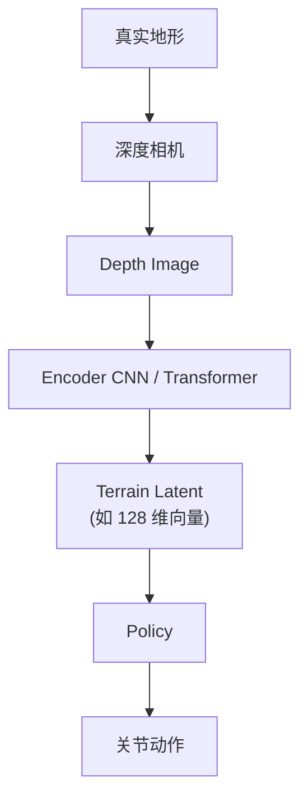

# 地形 Latent 表征（Terrain Latent Representation）

**地形 Latent 表征**：在感知足式/人形 locomotion 中，把深度图或高度图经 Encoder 映射为 **低维向量**（如 64–256 维），供策略网络消费。该向量常被称为 **Terrain Embedding / Visual Embedding / Terrain Latent**——它是 **地形的压缩摘要**，在数学上 **一般不等于** 可逐格阅读的高度栅格。

## 一句话定义

Latent 回答的是「前方地形对落脚决策 **足够用** 的摘要是什么」，而不是「把每个格子的高度原样交给 Policy」。

## 英文缩写速查

| 缩写 | 英文全称 | 简要说明 |
|------|----------|----------|
| CNN | Convolutional Neural Network | 卷积神经网络，处理图像/深度感知 |
| RL | Reinforcement Learning | 通过与环境交互最大化长期回报来学习策略 |
| Height Map | Terrain Height Map | 局部地形栅格高度表示 |
| Depth | Depth Image | 深度相机输出的距离图 |
| PPO | Proximal Policy Optimization | 感知行走 teacher 阶段常用算法 |
| Sim2Real | Simulation to Real | 把仿真中学到的策略迁移落地真机的工程主线 |
| BFM | Behavior Foundation Model | 条件生成式全身行为基础模型范式 |
| PHP | Perceptive Humanoid Parkour | 人形跑酷感知行走代表工作线之一 |

## 为什么重要

- **读论文图示时**：看到 `Depth → Encoder → Latent → Policy` 不要默认 Latent 就是 64×64 高度图——多数工作要的是 **可优化、低维、对动作足够** 的特征。
- **Teacher–Student 设计**：Teacher 可用显式高度图；Student 的 latent 只需让 **动作接近 Teacher**，不必 **长得像** 高度图（见 [特权信息训练](./privileged-training.md)）。
- **接口选型**：显式 Height Map 可解释但维数高；Latent 紧凑但不可读——影响 sim2real 调试与安全壳设计。

## 两条表征路线

| 路线 | 数据流 | 特点 |
|------|--------|------|
| **显式高度图** | Depth/点云 → 重建 Height Map（如 64×64）→ Policy | 直观、可可视化；维数高（4096+），RL 不友好 |
| **压缩 Latent（主流）** | Depth 64×64 → CNN → 128 维 `terrain_latent` → Policy | 紧凑；含台阶/坡度/障碍/可落脚区信息，但人类不可逐维解读 |



### 与语言 Embedding 的类比

一句话 → BERT/GPT **embedding** → 下游任务：向量里编码语义，但你看不出「第 128 维 = 台阶高度」。  
同理：深度图 → **terrain_latent** → policy 学会「这类 latent 对应 15 cm 台阶要抬脚」，无需 latent 本身可读。

## Teacher 阶段也常用 Latent

即使 Teacher 训练时可访问 **特权高度图**，工程上仍常：

```text
Height Map → Encoder → 128 维 latent → Teacher Policy
```

原因：RL 偏好与 Student 对齐的 **同维接口**；蒸馏时 Student 用 `Depth → Encoder → latent`，损失在 **动作** 上对齐，而非 latent 逐元素匹配。

代表工作线（非穷尽）：[Perceptive BFM](../entities/paper-perceptive-bfm.md)、PHP-Parkour、[Extreme Parkour](../entities/extreme-parkour.md)、Walk These Ways、[RPL](../entities/paper-rpl-robust-humanoid-perceptive-locomotion.md)。

## 与地形适应、视觉表征的关系

- [Terrain Adaptation](./terrain-adaptation.md) 讲 **闭环**：感知 → 落脚决策 → 控制；本页讲 **感知接口** 里 latent 是什么。
- [视觉表征作为策略输入](./visual-representation-for-policy.md) 侧重 **操作/VLA 骨干选型**（R3M、DINOv2 等）；本页侧重 **locomotion 地形几何** 的压缩表示。
- [DreamWaQ++](../entities/dreamwaq-plus.md) 等用 **点云 latent** 而非栅格高度图，同属「压缩摘要」思路。

## 常见误区

- **「有深度相机 = 策略用了感知」** — 数据须进入 **可优化目标**（policy 输入或奖励）；仅堆传感器而 policy 盲感知仍会摔（参见 [E-SDS](../entities/paper-e-sds-environment-aware-humanoid-locomotion-rl.md) 对照实验）。
- **「Student 的 latent 必须重建 Teacher 的高度图」** — 蒸馏目标是 **动作一致**；latent 是中间瓶颈，不要求可解释栅格。
- **「显式几何一定优于隐式 latent」** — 显式利于调试；隐式 latent 在维数、端到端优化、与深度噪声鲁棒性上常更实用（见 [显式楼梯几何 token 论文](../entities/paper-explicit-stair-geometry-humanoid-locomotion.md) 作为显式路线的对照）。

## 关联页面

- [Terrain Adaptation（地形适应）](./terrain-adaptation.md)
- [Privileged Training（特权信息训练）](./privileged-training.md) — Teacher 高度图 → Student 深度 latent 蒸馏
- [楼梯与障碍 Locomotion 中心节点](../tasks/stair-obstacle-perceptive-locomotion.md)
- [Perceptive BFM](../entities/paper-perceptive-bfm.md) — raw 参考 + 机器人中心高程感知
- [Extreme Parkour](../entities/extreme-parkour.md) — scandots/航向 teacher → 深度 student

## 参考来源

- [感知 Locomotion 表征与蒸馏本质 FAQ（维护者整理）](../../sources/personal/perceptive_locomotion_representation_essence.md)

## 推荐继续阅读

- Cheng et al., *Extreme Parkour with Legged Robots* (ICRA 2024) — 感知跑酷 teacher–student 范例
- Lee et al., *Learning Quadrupedal Locomotion over Challenging Terrain* (Science Robotics, 2020) — 高度图特权 teacher 经典线
