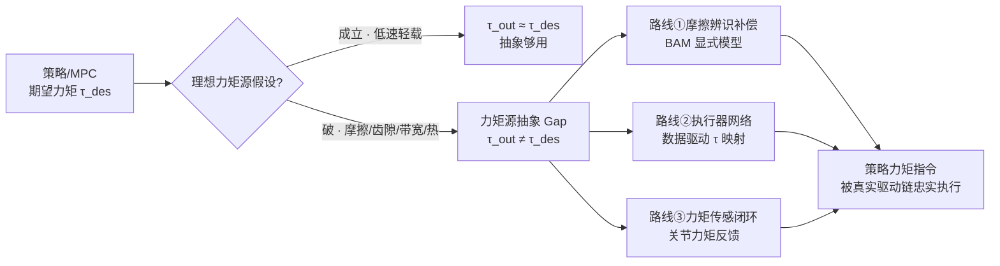

# 力矩源抽象 Gap（理想力矩源 ↔ 真实执行器）

RL/MPC 策略在仿真里几乎都默认一个隐含抽象：**执行器是一个理想力矩源**——策略下发的期望力矩 $\tau_{des}$ 会被瞬时、无损、无偏地施加到关节上，即 $\tau_{out}=\tau_{des}$。这条抽象让策略只需在「力矩空间」里思考，不必关心电机、减速器、驱动板与总线的物理细节。**力矩源抽象 Gap** 指的就是这条理想假设与真实执行器行为之间的系统性偏差——它是[执行器驱动链选型闭环](../queries/actuator-drive-chain-selection-loop.md)第③层「策略把执行器当理想力矩源何时破」这个问题的物理根因页。

## 一句话定义

> **力矩源抽象 Gap**：策略/控制器假设的「下发力矩 = 实际输出力矩」在真实执行器上不成立的那部分偏差——由摩擦、齿隙、电流环带宽、热约束、传动柔性等叠加而成，本质是「策略的力矩指令能否被真实驱动链忠实执行」。

## 英文缩写速查

| 缩写 | 英文全称 | 简要说明 |
|------|----------|----------|
| RL | Reinforcement Learning | 策略多在力矩/PD 目标空间输出，隐含理想力矩源假设 |
| MPC | Model Predictive Control | 模型预测控制，其内部模型也常把执行器当理想力矩源 |
| FOC | Field-Oriented Control | 磁场定向控制，电流环带宽决定力矩指令跟得多快 |
| BAM | Better Actuator Models | 可微执行器摩擦辨识框架，显式补偿路线 |
| SEA | Series Elastic Actuator | 串联弹性执行器，传动柔性使力矩非瞬时 |
| BEMF | Back-EMF | 反电动势，高速区限制可用力矩 |

## 抽象在什么条件下成立

理想力矩源不是永远错——在特定工况下它是够用的近似。判断它何时成立、何时破，比无脑上高保真模型更重要：

| 抽象成立条件 | 物理含义 | 一旦不满足会怎样 |
|--------------|----------|------------------|
| 低速 / 轻载 | 库仑+黏滞摩擦相对指令力矩占比小 | 低速爬行/精细接触时摩擦占比骤升，力矩「发虚」 |
| 齿隙可忽略 | 直驱或高背隙刚度传动 | 换向瞬间死区，力矩过零点丢失 |
| 指令带宽 ≪ 电流环带宽 | FOC 电流环能跟上力矩指令 | 高频力矩指令被电流环低通滤掉、相位滞后 |
| 热稳态 / 短时峰值 | 绕组温度未逼近降额点 | 持续负载下热降额，[力矩-电流曲线](./motor-torque-current-curve.md)在饱和区偏离标称 |
| 传动刚性足够 | 无明显 SEA/谐波减速柔性 | 柔性储能使输出力矩滞后、振荡 |

**总原则**：抽象成立与否取决于**「非理想效应的量级相对当前工况指令力矩的占比」**，而不是执行器「好不好」。同一台电机在轻载巡航时可当理想力矩源，在低速重载接触时就必须显式建模。

## 为什么它是 Sim2Real 的核心根因

力矩源抽象 Gap 是仿真–真机迁移失败最常见、也最隐蔽的一层。仿真里若执行器走 [implicit（引擎内 PD）](./implicit-explicit-actuator-modeling.md)，等于**默认了理想力矩源**；策略在这条抽象上训得很好，一旦上真机遇到摩擦/齿隙/带宽/热约束，同一条力矩指令产生的实际输出就变了，策略随即抖动或「发软」。这正是 [Sim2Real](./sim2real.md) 与[物理保真度 ↔ Sim2Real Gap](./physics-fidelity-sim2real-gap.md) 里「执行器层」的具体开关：

用 [SAGE](../entities/sage-sim2real-actuator-gap-estimator.md) 这类 sim2real 执行器 gap 估计，可以先量化**执行器层在整体 sim2real gap 中的占比**，再决定是否值得往上建更贵的模型——gap 占比小就别过度建模，占比大才投入辨识/传感成本。

## 收窄力矩执行 Gap 的三条工程路线

Gap 被定位后，收窄它有三条互补路线，成本与保真度递增：

### 路线①：摩擦辨识补偿（显式解析）

- **做什么**：用 [BAM / BAM-extended](../entities/bam-better-actuator-models.md) 实测辨识 Stribeck / 黏滞 / 库仑等[关节摩擦](./joint-friction-models.md)参数，在控制器里做前馈补偿，或写回仿真做 [explicit 执行器](./implicit-explicit-actuator-modeling.md)。
- **取舍**：参数少、可解释、辨识成本中等；但解析模型对齿隙、温漂等强非线性覆盖有限。
- **关键坑**：用**开环空载**扫参数代替**负载在环**辨识，得到的摩擦曲线在真实接触工况下系统性偏。

### 路线②：执行器网络（数据驱动）

- **做什么**：用真机数据端到端拟合「指令 → 实际力矩」映射（[Actuator Network](../methods/actuator-network.md) / [NeuralActuator](../entities/paper-neuralactuator-neural-actuation-modeling.md)），把摩擦/带宽/延迟一并吃进网络。
- **取舍**：保真度上限高、能吃复杂非线性；但需负载在环采数据，且**分布外（温升、老化、异常负载）容易漂移**。
- **关键坑**：把「训练集拟合好」当「真机各工况都准」——分布外漂移是主要失效源，要扩负载/温度采样分布。

### 路线③：力矩/电流传感闭环（硬件兜底）

- **做什么**：加关节力矩传感或用[电流](./motor-torque-current-curve.md)间接估力矩，做闭环反馈，让驱动链自己纠正 $\tau_{out}$ 向 $\tau_{des}$ 收敛，把[FOC](./field-oriented-control.md)电流环带宽这一制约显性化。
- **取舍**：从物理上直接缩 gap、对建模误差鲁棒；但增加传感器成本、噪声与带宽限制，闭环增益受编码器分辨率/采样噪声约束。
- **关键坑**：把电流环带宽拉高当万能——反馈精度受编码器分辨率上限制约，力矩闭环带宽仍受最慢环节限制。

三条路线常组合使用：**先辨识补偿吃掉可解释的大头（①），再用执行器网络吃残差（②），最后用力矩闭环兜底分布外（③）**。选哪条取决于 gap 占比、外推需求与硬件预算——详见[执行器驱动链选型闭环](../queries/actuator-drive-chain-selection-loop.md)第③层的决策树。

## 常见误判速查

| 误判 | 真相 | 第一优先排查 |
|------|------|-------------|
| 仿真力矩很准，真机就该准 | 仿真 implicit 默认了理想力矩源，真机没这条抽象 | 切 explicit / 辨识执行器再对齐 |
| 力矩「发软/发虚」是策略没训好 | 多为低速重载摩擦占比骤升，抽象破在③层 | 补摩擦辨识而非重训策略 |
| 电流环带宽拉高，力矩就跟得上 | 反馈分辨率/热降额仍是上限 | 查编码器分辨率与热降额，而非只加带宽 |
| 执行器网络拟合好就通用 | 分布外温升/负载漂移是主要失效源 | 扩采样分布，查开环 vs 负载在环 |
| 数据手册峰值力矩 = 可用力矩 | 峰值是瞬时值，持续受热约束降额 | 按工况是峰值瞬时还是持续负载判 |

## 常见误区

1. **≠「策略输出力矩就有 Gap，输出位置就没有」** — 位置/PD 目标最终仍要在底层转成力矩施加，理想力矩源假设同样隐含在 PD 那一层（见 [Kp/Kd 设置](../queries/legged-humanoid-rl-pd-gain-setting.md)）。
2. **≠「上了执行器网络就没 Gap」** — 网络只是把 gap 从「未建模」变成「分布内已建模、分布外仍漂移」，不消灭 gap。
3. **Gap 不是恒定的** — 同一执行器在不同速度/负载/温度下 gap 量级差很多，评估要覆盖部署工况包络，而非单点。

## 关联页面

- [执行器驱动链选型闭环知识链](../queries/actuator-drive-chain-selection-loop.md) — 本页是其③「执行器建模与摩擦辨识」层「理想力矩源何时破」的物理根因专页
- [Implicit / Explicit 执行器建模](./implicit-explicit-actuator-modeling.md) — 仿真侧 implicit 默认理想力矩源、explicit 才建这条 gap
- [物理保真度 ↔ Sim2Real Gap](./physics-fidelity-sim2real-gap.md) — 本页是其执行器层的具体开关
- [Sim2Real](./sim2real.md) — 力矩执行 gap 是高保真迁移的关键子链路
- [关节摩擦模型](./joint-friction-models.md) — 路线①显式补偿的建模对象
- [Actuator Network](../methods/actuator-network.md) — 路线②数据驱动执行器映射
- [BAM（执行器摩擦辨识）](../entities/bam-better-actuator-models.md) — 路线①显式辨识框架
- [NeuralActuator（神经执行器建模）](../entities/paper-neuralactuator-neural-actuation-modeling.md) — 路线②数据驱动指令→力矩映射
- [SAGE（sim2real 执行器 gap 估计）](../entities/sage-sim2real-actuator-gap-estimator.md) — 量化执行器层 gap 占比，决定是否值得建模
- [力矩-电流曲线](./motor-torque-current-curve.md) — 热降额/饱和区抽象破的标称背景
- [FOC 磁场定向控制](./field-oriented-control.md) — 电流环带宽制约力矩指令忠实度

## 参考来源

- [Isaac Lab / mjlab Implicit vs Explicit Actuator 一手资料索引](../../sources/courses/isaac_lab_implicit_explicit_actuators.md) — implicit 默认理想力矩源的仿真侧证据
- [NeuralActuator（神经执行器建模）](../../sources/papers/neuralactuator_arxiv_2607_11734.md) — 路线②数据驱动执行器网络一手资料
- [BAM-extended 伺服执行器摩擦辨识](../../sources/papers/bam_extended_friction_servos_arxiv_2410_08650.md) — 路线①显式摩擦辨识一手资料
