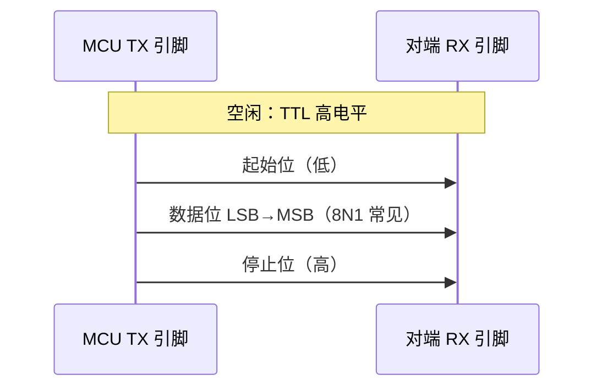
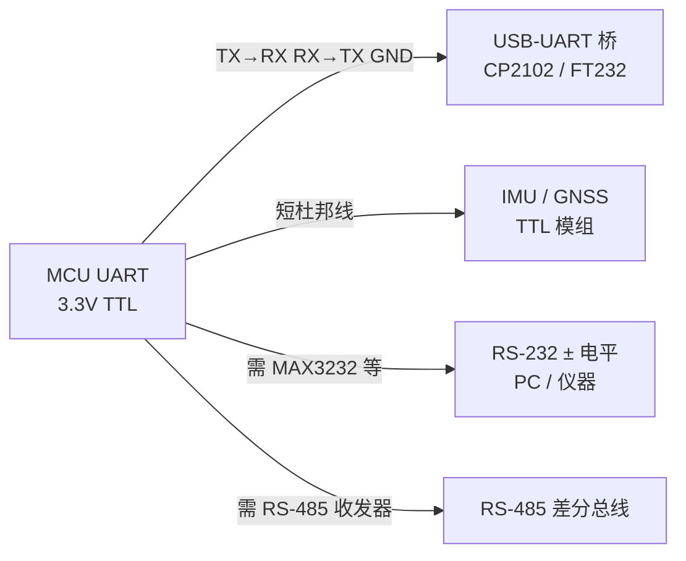

# TTL 串行逻辑电平（UART 板内接口）

在嵌入式与机器人固件语境里，「串口」若未特别说明电气标准，通常指 **MCU UART 外设引脚上的 TTL/CMOS 单端逻辑电平**——不是 RS-232 的 ±12 V，也不是 RS-485 的差分总线。

## 一句话定义

**UART 异步帧格式**（波特率 + 数据/校验/停止位）在 **0 V / VCC 附近摆幅的单端信号** 上传输；常见为 **3.3 V 或 5 V CMOS**，用于板内、杜邦线短距与 USB–TTL 调试器连接。

## 英文缩写速查

| 缩写 | 英文全称 | 简要说明 |
|------|----------|----------|
| UART | Universal Asynchronous Receiver-Transmitter | 可配置波特率与帧格式的异步串行外设 |
| TTL | Transistor–Transistor Logic | 历史上 5 V 逻辑家族；现多泛指单端 CMOS 电平串口 |
| CMOS | Complementary Metal–Oxide–Semiconductor | 现代 MCU 主流逻辑工艺，3.3 V 为主 |
| MCU | Microcontroller Unit | 微控制器，机器人关节板/底盘板常见主控 |
| VIH | Voltage Input High | 输入判定为逻辑 1 的最低电压 |
| GND | Ground | 信号参考地，必须与对端共地 |

## 为什么重要

- **Bring-up 第一接口**：Bootloader、日志 `printf`、CLI 几乎总是 TTL UART；见 [UART 与串行通信总览](./uart-serial-communication.md)。
- **传感器与外设默认电平**：不少 IMU、GNSS、遥控接收机、激光测距模组提供 **3.3 V TTL UART** 引脚，与 [处理器在环 Sim2Real](./processor-in-the-loop-sim2real.md) 中的 I2C/SPI 路径并列。
- **电平误接代价高**：3.3 V 引脚接 5 V TTL 可能 **永久损坏**；把 TTL 当 RS-232 直连 PC DB9 同样危险——需 [RS-232](./rs-232-serial-interface.md) 电平转换芯片。

## 核心机制

### 1. 逻辑电平（相对 GND）

| 逻辑 | 经典 5 V TTL（输出） | 3.3 V CMOS（典型） |
|------|----------------------|---------------------|
| 0（space） | ≤ 0.4 V | ≈ 0 V |
| 1（mark） | ≥ 2.4 V | ≈ VCC（如 3.3 V） |

输入侧用 **VIL/VIH** 阈值判别；驱动与接收阈值之间保留 **噪声容限**。JEDEC 与各家族数据手册给出精确范围（见 [一手资料索引](../../sources/sites/ttl_uart_logic_level_primary_refs.md)）。

**与 RS-232 的极性差异**：TTL 上 **空闲（无起始位）时 TX 常为高电平（逻辑 1）**；RS-232 数据电路上 **mark（逻辑 1）为负电压**。经 MAX232 等芯片时极性会在芯片内部处理，但 **示波器探头直接看 TTL 脚与 DB9 脚波形不可类比**。

### 2. UART 帧（与电平无关的协议层）

- **异步**：无时钟线；双方晶振误差须在 UART 采样窗口内（通常 ±2% 以内较稳妥）。
- **常见配置**：115200 8N1（8 数据位、无校验、1 停止位）；9600 用于老款模组。
- **全双工**：独立 TX、RX 线可同时收发；与 [RS-485](./rs-485-serial-bus.md) 半双工总线不同。

### 3. 典型连接拓扑

### 4. 跨电压域与线长

| 场景 | 建议 |
|------|------|
| 3.3 V MCU ↔ 5 V 器件 | 电平转换（如 TXB0104、分压仅单向且需验证速率）或选用 5 V 容忍输入的 3.3 V 器件 |
| 板内 &lt; 30 cm | 直连 TTL 通常可行 |
| 数米级 | 改用 RS-485 或 CAN，勿拉长裸 TTL |
| USB 串口「3.3 V / 5 V」跳线 | 必须与目标板 I/O 电压一致 |

## 在机器人中的典型应用

| 用途 | 说明 |
|------|------|
| 固件日志与 CLI | 开发阶段主通道；**勿在 1 kHz 控制线程内阻塞 UART 发送**（见 [实时运控中间件指南](../queries/real-time-control-middleware-guide.md)） |
| IMU / GNSS | 固定波特率 NMEA 或厂商二进制帧 |
| 遥控接收机（SBUS 等除外） | 部分仍用 UART 兼容电平 |
| 产测夹具 | 针床接 TX/RX/GND 烧录与校准 |

## 常见误区

- **「串口 = RS-232」**：PC 上的 COM 口经 USB 桥后，MCU 侧仍是 **TTL**；DB9 才是 RS-232 电压。
- **TX 接 TX**：UART 必须 **交叉**（A 的 TX → B 的 RX）；仅共 GND 不够。
- **不接 GND 也能通」**：浮地会导致误码与损坏风险；长线必须 **共地** 或改用差分标准。
- **波特率「差不多就行」**：晶振误差大时偶发乱码，Modbus/厂商 CRC 帧会直接失败。

## 关联页面

- [UART 与串行通信总览](./uart-serial-communication.md)
- [RS-232 串行接口](./rs-232-serial-interface.md)
- [RS-485 串行总线](./rs-485-serial-bus.md)
- [CAN 总线（经典）](./can-bus-protocol.md)

## 参考来源

- [TTL / CMOS UART 逻辑电平一手资料索引](../../sources/sites/ttl_uart_logic_level_primary_refs.md)
- [UART / RS-485 嵌入式入门索引](../../sources/courses/uart_rs485_serial_embedded.md)

## 推荐继续阅读

- SparkFun [Logic Levels](https://learn.sparkfun.com/tutorials/logic-levels)
- Wikipedia：[Universal asynchronous receiver-transmitter](https://en.wikipedia.org/wiki/Universal_asynchronous_receiver-transmitter)
