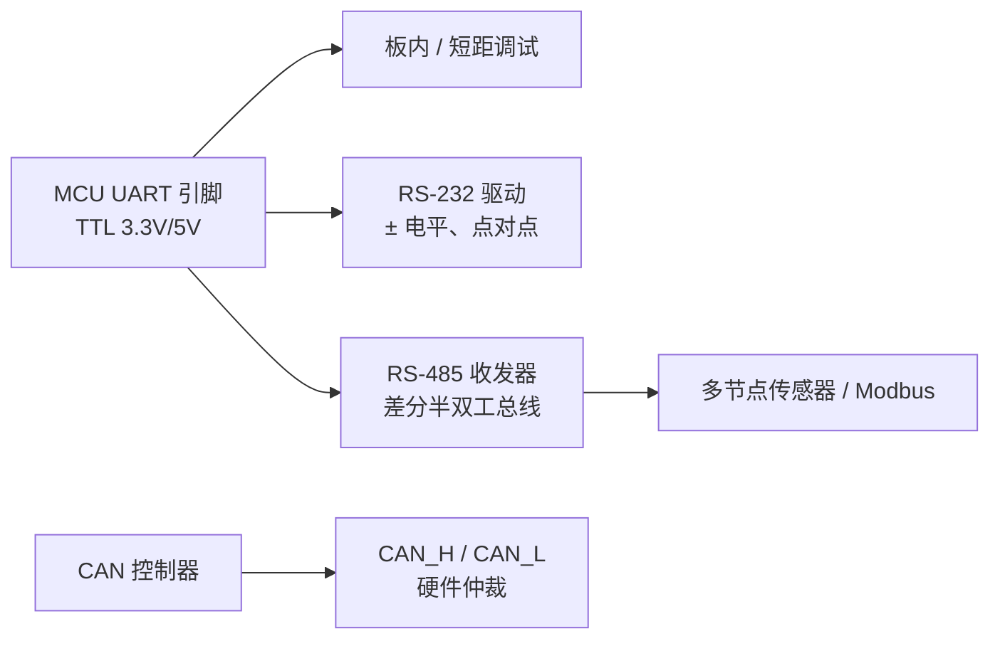

# UART 与串行通信（TTL / RS-232 / RS-485）

**UART（Universal Asynchronous Receiver-Transmitter）** 是 MCU 上最普遍的 **异步串行** 外设：按约定波特率逐位收发，用起始/停止位界定字符帧。机器人开发中，它既是 **Bring-up 与 printf 调试** 的第一接口，也常见于 **IMU、遥控器、GNSS、低成本模组**。

## 一句话定义

没有独立时钟线的 **异步** 串行链路：发送方与接收方须预先约定 **波特率、数据位、校验、停止位**；电气层由 TTL、RS-232 或 RS-485 等驱动电路实现。

## 英文缩写速查

| 缩写 | 英文全称 | 简要说明 |
|------|----------|----------|
| Sim2Real | Simulation to Real | 把仿真中学到的策略迁移落地真机的工程主线 |
| IMU | Inertial Measurement Unit | 惯性测量单元，提供加速度与角速度 |
| CAN | Controller Area Network | 电机/关节常用的现场总线通信协议 |
| EtherCAT | Ethernet for Control Automation Technology | 高实时性工业以太网总线 |

## 为什么重要

- **与 CAN 的分工**：UART 适合 **少量节点、点对点或简单主从**；CAN 提供 **硬件仲裁与错误帧**，适合多关节共享总线（见 [CAN 总线](./can-bus-protocol.md)）。
- **处理器在环**：仿真里常同时建模 **I2C（IMU 寄存器语义）+ CAN（电机）+ UART（调试）**；UART 本身较少进 1 kHz 闭环，但 **阻塞式 printf** 会破坏 RT 线程（见 [实时运控中间件指南](../queries/real-time-control-middleware-guide.md)）。
- **工业现场**：**RS-485** 半双工差分总线可挂多个 Modbus 设备，用于底盘、温湿度、部分老款伺服。

## 核心参数（配置前必对齐）

| 参数 | 典型值 | 说明 |
|------|--------|------|
| 波特率 | 9600 – 3 Mbaud+ | 双方必须一致；长距离 RS485 常降速 |
| 数据位 | 8 | 7 位用于部分 ASCII 协议 |
| 校验 | None / Even / Odd | 与对端一致 |
| 停止位 | 1 或 2 | |
| 流控 | 无 / RTS-CTS | USB 串口桥常忽略硬件流控 |

## 电平标准速览

各电平标准已拆分为独立概念页，详见：

| 电平 | 页面 | 要点 |
|------|------|------|
| **TTL / CMOS** | [TTL 串行逻辑电平](./ttl-serial-logic-level.md) | 板内 3.3 V/5 V 单端；调试与 IMU 默认形态 |
| **RS-232** | [RS-232 串行接口](./rs-232-serial-interface.md) | ± 电压、点对点；须经 MAX232 等与 MCU 相连 |
| **RS-485** | [RS-485 串行总线](./rs-485-serial-bus.md) | 差分半双工、多点；DE/RE、终端与偏置 |

## 常见误区

- **「串口能代替 CAN 控 30 个关节」**：无硬件仲裁，多主机需复杂协议；抖动与带宽难保证硬实时。
- **在 1 kHz 控制循环里 `printf`**：UART 发送阻塞是 RT 大忌，应丢进非实时日志线程。
- **3.3 V 与 5 V TTL 直连**：可能损坏引脚或电平误判。

## 关联页面

- [TTL 串行逻辑电平](./ttl-serial-logic-level.md)
- [RS-232 串行接口](./rs-232-serial-interface.md)
- [RS-485 串行总线](./rs-485-serial-bus.md)
- [CAN 总线（经典）](./can-bus-protocol.md)
- [CAN FD](./can-fd.md)
- [CAN vs EtherCAT：关节总线选型](../comparisons/can-vs-ethercat-joint-bus.md)
- [处理器在环 Sim2Real](./processor-in-the-loop-sim2real.md)

## 参考来源

- [UART / RS-485 嵌入式入门索引](../../sources/courses/uart_rs485_serial_embedded.md)
- [TTL / CMOS UART 逻辑电平一手资料](../../sources/sites/ttl_uart_logic_level_primary_refs.md)
- [RS-232（TIA/EIA-232）一手资料](../../sources/sites/rs232_tia_eia_primary_refs.md)
- [RS-485（TIA/EIA-485）一手资料](../../sources/sites/rs485_tia_eia_primary_refs.md)

## 推荐继续阅读

- Texas Instruments [SLLA383 — UART-to-RS-485 Interface](https://www.ti.com/lit/an/slla383b/slla383b.pdf)
- Wikipedia：[UART](https://en.wikipedia.org/wiki/Universal_asynchronous_receiver-transmitter)
