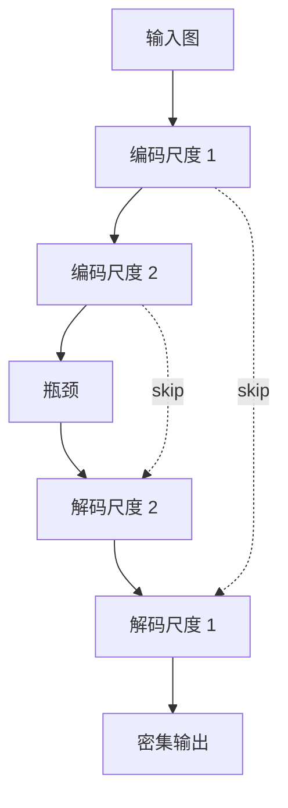

# U-Net

**U-Net**：对称的 **收缩路径（编码器）** 与 **扩张路径（解码器）**，并在每一尺度用 **跳跃连接** 把浅层高分辨率特征拼到解码器，一次前向输出与输入同空间尺寸的密集图。

## 一句话定义

把「看懂上下文」和「对准像素边界」拆成下采样与上采样两条路，再用跳跃把细节抄近道送回去。

## 英文缩写速查

| 缩写 | 英文全称 | 简要说明 |
|------|----------|----------|
| U-Net | U-shaped Convolutional Network | U 形编码–解码分割网 |
| Skip | Skip connection | 同尺度特征拼接，保边界 |
| FCN | Fully Convolutional Network | 无全连接的密集预测族 |
| DDPM | Denoising Diffusion Probabilistic Models | 经典扩散骨干即 U-Net |
| FPS | Frames Per Second | 机载分割的实时约束 |

## 为什么重要

- 医学图像验证了 **极少标注 + 弹性增广** 也能做像素级任务（[Ronneberger et al., 2015](../../sources/papers/unet_ronneberger_arxiv_1505_04597.md)）。
- 扩散模型把同一 U 形拿来做 **多尺度降噪**：浅层修纹理、深层修布局。
- 机器人占用栅格、可通行分割、触觉图像重建，常是 U-Net 变体而不是分类 ResNet。

## 核心原理

编码器反复 `Conv → 下采样`，通道加倍、分辨率减半；解码器上采样后与对应编码特征 **裁剪对齐并拼接**，再卷积融合。输出通道数等于类别数或回归维（深度、噪声、SDF）。

## 工程实践

| 项 | 建议 |
|----|------|
| 分割 | 类别不平衡用加权 CE / Dice；推理用 overlap-tile |
| 扩散 | 时间步嵌入注入残差块；通道与注意力插在中低分辨率 |
| 机器人 | 先定输出分辨率与延迟，再决定是否上 3D / 时序 U-Net |
| 预训练 | 医学权重几乎不能直接迁 RGB 操作；从 ImageNet 编码器更好 |

## 局限与风险

- **方形假设**：原实现依赖固定裁剪；任意尺寸要补 padding 策略。
- **不是生成模型**：U-Net 是骨干几何；生成能力来自扩散/分割损失。
- 高分辨率 3D 体积显存爆炸；点云任务应评估是否改用稀疏卷积或 [GNN](./graph-neural-network.md)。

## 关联页面

- [CNN](./convolutional-neural-network.md)
- [扩散模型](./diffusion-model.md)
- [视觉骨干](./vision-backbones.md)
- [机器人视觉感知栈选型闭环知识链](../queries/robot-perception-stack-selection-loop.md)
- [AI 架构地图](../overview/ai-architecture-map.md)

## 参考来源

- [U-Net 论文（arXiv:1505.04597）](../../sources/papers/unet_ronneberger_arxiv_1505_04597.md)
- [AI 架构地图一手论文簇](../../sources/papers/ai_architecture_foundations.md)

## 推荐继续阅读

- 项目页：<https://lmb.informatik.uni-freiburg.de/people/ronneberger/u-net/>
