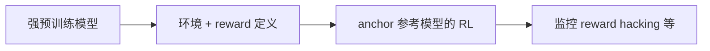

# Universal Post-Training for Robotics（通用机器人后训练）

**Universal post-training** 指：在 **大规模预训练** 的 VLA / WAM / foundation policy 之上，用 **可复现、可规模化的后训练栈**（算法 + 工程协议）把策略从「能做一次」推到 **高可靠自主部署**——类比 LLM 从 GPT-2 演示到 ChatGPT 可生产使用的 **SFT → RLHF → RLVR** 收敛路径。

## 一句话定义

**预训练解决「会不会」；通用 post-training 解决「每次、每台、每个场景都稳不稳」——机器人需要比 LLM 更严的 nines，因为坏动作不能等人审。**

## 英文缩写速查

| 缩写 | 英文全称 | 简要说明 |
|------|----------|----------|
| VLA | Vision-Language-Action | 预训练视觉—语言—动作策略，本篇 post-training 主要对象 |
| WAM | World Action Model | 与 VLA 并列的预训练动作基础模型族 |
| RLVR | RL from Verifiable Rewards | LLM 侧可验证 reward 的 post-training 默认 |
| HIL | Human-in-the-Loop | 真机 RL 中人工干预与纠错 |
| EXPO-FT | — | Perry 组 VLA 在线 RL 微调系统（edit + Q 选 chunk） |

## 为什么重要

- **产业时刻：** Physical Intelligence、Generalist、DeepMind、Skild 等已展示 **复杂预训练行为**，但 **95% 成功率** 在玻璃/宠物/产线场景仍意味着 **每周失败**。
- **范式缺口：** 模仿学习继承了 SL 的 **干净 recipe**（action chunking、遥操作、可预期 loss）；**RL post-training 仍是 craft**，只有少数团队能稳定微调十亿级 VLA。
- **部署门槛：** LLM 坏输出可人工过滤；**机器人坏动作直接发生** — post-training 的可靠性目标应 **高于** 语言模型。
- **路线分野：** 数字域 **on-policy PPO/GRPO** 已规模化；机器人因 **贵样本 + 长视界稀疏奖励** 更依赖 **value-based** 与 **协议标准化**（见 [Perry Dong 博文](https://pd-perry.github.io/posts/post-training.html)）。

## 核心结构

### 1. LLM 已收敛的「四步配方」（对照基准）

 robotics 需要 **同等粒度** 的 plug-and-play playbook，而非每任务重新发明 RL 栈。

### 2. 机器人 RL ≠ LLM RL（为何不能照搬 PPO）

| 因素 | LLM / AlphaGo | 机器人 |
|------|---------------|--------|
| 并行采样 | 廉价、海量 | 真机时间贵；500 步操纵仅 **末端一次 reward** |
| Credit assignment | 单 response | 数千低层动作共享 **一个成功信号** |
| 环境 | 近似确定 | 重复指令也可因接触/传感产生 **随机分支** |
| 已验证规模化 | on-policy PG | **value-based** 在大 VLA 上验证不足 |

→ 推动 **Q-function / value flow** 类方法与 **小步安全 edit**（如 EXPO 系），而非纯 on-policy 重采样。

### 3. 扩散/flow 策略的 post-training 难题

Frontier VLA 常用 **扩散/flow 动作头**（多模态正确动作）。经典 **DDPG/TD3/SAC** 假设单峰 Gaussian，直接套用会：

- **反传 Q 穿过全长去噪链** → 贵且不稳
- **只采样选 Q 最大** → 大模型权重 **不更新**
- **只 steer 噪声** → 无法超出预训练行为包络

**EXPO(-FT)**（Perry Dong 组）代表一条折中：**大 VLA 提案 + 轻量 edit policy 有界修正 + Q 选 chunk + 成功轨迹回灌大模型** — 详见 [Real-Time EXPO-FT](../entities/paper-real-time-expo-ft.md) 与 [QWM](../entities/paper-qwm.md)（测试时 WM 搜索）。

### 4. 配方 = 算法 + 标准协议（第二半）

即使算法稳定，仍缺 LLM 级 **默认协议**：

| 协议 | 开放问题 |
|------|----------|
| **Reward** | 无 robotics RLVR；per-task detector vs 人判 vs 学习分类器 |
| **Reset** | 人工复位 vs 学习 reset policy vs 不可逆任务流 |
| **HIL** | 何时干预、如何进 replay（Waymo 式远程监督能否 scale） |
| **超参** | LR、UTD、horizon、控制频率 — 无 SL 级 sane default |
| **初始化** | 离线演示量 vs 在线经验权重 |

### 5. 与自博弈 post-training 的对照

[Skild Physical Self-Play](../entities/skild-physical-self-play.md) 走 **仿真自博弈 + score-only** 超越人类演示；本篇 Perry 框架强调 **真机 value-RL + 人类协议**。二者可并存：**仿真自改进** vs **真机可靠性微调**。

## 工程实践

| 场景 | 建议 |
|------|------|
| **从 95% → 99%+** | 不要只加演示数据；规划 **post-training 环**（reward、reset、HIL、评估 nines） |
| **选算法** | 大 VLA + 扩散头优先查 **EXPO-FT / QWM / value-flow** 族，而非直接 PPO 全参 |
| **样本预算** | EXPO-FT 博客级数字：**~19 min** 在线交互 → 六任务 **30/30**（闭源，作量级参考） |
| **开源预期** | EXPO-FT 项目页 **待发布**；复现先用开源 **DSRL / HIL-SERL / HG-DAgger** 作对照 |
| **与 ICL 关系** | [Foundation Policy](./foundation-policy.md) 预训练 + ICL 解决冷启动；post-training 解决 **重复执行可靠性** |

## 局限与风险

- 本篇为 **观点 + 系统总结**，非独立 benchmark 论文。
- EXPO-FT 数字来自作者组 **内部六任务**；泛化到其他 VLA/任务未系统公开。
- **HIL 依赖** 可能限制无监督 scale；远程运营成本未量化。
- **长视界 value 误差** 仍是 EXPO「小步 edit」安全性的瓶颈。
- **算力：** 19 min 机器人时间 ≠ 19 min wall-clock（大模型梯度占主导）。

## 关联页面

- [Foundation Policy](./foundation-policy.md)
- [VLA](../methods/vla.md)
- [Reinforcement Learning](../methods/reinforcement-learning.md)
- [Real-Time EXPO-FT](../entities/paper-real-time-expo-ft.md)
- [QWM](../entities/paper-qwm.md)
- [Skild Physical Self-Play](../entities/skild-physical-self-play.md)
- [VLA 部署指南](../queries/vla-deployment-guide.md)
- [The Bitter Lesson](./bitter-lesson.md)

## 参考来源

- [Towards Universal Post-Training for Robotics（博客归档）](../../sources/blogs/pd_perry_universal_post_training_robotics_2026-09.md)
- [pd-perry.github.io 博文页归档](../../sources/sites/pd-perry-post-training.md)

## 推荐继续阅读

- 原文：<https://pd-perry.github.io/posts/post-training.html>
- [EXPO-FT 项目页](https://pd-perry.github.io/expo-ft/)
- Perry Dong et al., EXPO-FT（CoRL 2026，[arXiv:2605.25477](https://arxiv.org/abs/2605.25477)）
