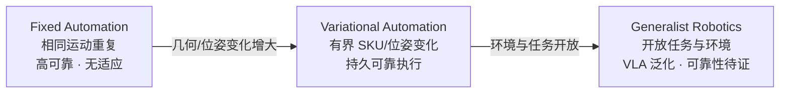

# 变体自动化（Variational Automation, VA）

**变体自动化（VA）** 由 [GaP](../entities/paper-gap-graph-as-policy.md)（NVIDIA / UC Berkeley 等，arXiv:[2607.05369](https://arxiv.org/abs/2607.05369)）明确提出，用于刻画商业与工业场景中 **大量重复、但每个实例几何/位姿不同** 的机器人任务——介于 **固定自动化（FA）** 与 **通才机器人（GR）** 之间。

## 一句话定义

**在已知工位与有界对象/位姿变化下，机器人需像产线一样持久、可靠地完成同一任务族的每个变体实例——这正是传统工程可做好、而纯 VLA 尚难稳定落地的中间地带。**

## 英文缩写速查

| 缩写 | 英文全称 | 简要说明 |
|------|----------|----------|
| VA | Variational Automation | 本页核心任务类：有界几何/位姿变化的持久自动化 |
| FA | Fixed Automation | 固定自动化：重复相同运动，无实例间适应 |
| GR | Generalist Robotics | 通才机器人：开放任务与开放环境，常靠 model-free VLA |
| VLA | Vision-Language-Action | 端到端视觉-语言-动作策略，GR 方向代表但 VA 上可靠性不足 |
| TAMP | Task and Motion Planning | 离散任务规划 + 连续运动规划，VA 相关的经典模块化路线 |
| ROS | Robot Operating System | 基于计算图的机器人中间件，GaP 图结构的重要灵感来源 |

## 为什么重要

- **填补 FA 与 GR 之间的产品空白：** 物流分拣、商用厨房、数据中心线缆、工业洗箱等 **不是** 完全固定轨迹，也 **不是** 开放家庭环境——它们需要 **可解释、可维护的工程结构**，同时又要吸收 **对象与位姿变化**。
- **为 agentic robotics 指明评测靶心：** 近年 robot learning 多瞄准 GR；VA 假设 **工位已知、变化有界**，使 **物体模型、标定传感器、模块化技能** 可复用——与「零样本进任意家庭」的 GR 假设不同。
- **解释 VLA 在工业场景的失效模式：** 同一 VLA 在 LIBERO 小变化上可达 **0.96**，在 VA 大位姿变化列可跌至 **~0.20**；VA 是讨论 **可靠性 gap** 的合适任务刻度（见 [GaP 实验](../entities/paper-gap-graph-as-policy.md)）。
- **与 code-as-policy / 计算图路线对齐：** VA 的长期执行偏好 **模块化图 + edge 解释器**，而非每次推理都调用 frontier LLM——[GaP](../entities/paper-gap-graph-as-policy.md) 与 [ASPIRE](../methods/aspire.md) 同属 agentic 编程谱，但 GaP 强调 **ROS 式图** 与 **仿真排练自学习**。

## 任务谱：FA → VA → GR

| 维度 | FA | VA | GR |
|------|----|----|-----|
| **实例变化** | 无（相同轨迹） | 有界（SKU、位姿分布） | 开放（新物体、新场景） |
| **工位/传感器** | 已知固定 | **已知固定**（VA 假设） | 常未知或高度变化 |
| **典型方法** | 手工示教、PLC | TAMP、ROS 栈、**GaP 计算图** | model-free **VLA** |
| **可靠性** | 产线级 | **目标：商业/工业级** | 研究原型为主 |
| **例子** | 点焊、喷涂 | 分拣包裹、咖啡馆咖啡、商用厨房、USB 插线、洗箱 | 家庭杂务、开放词汇家务 |

## VA 形式化（GaP 论文）

VA 任务可写为 tuple $\mathcal{T}=\langle\mathcal{L},\mathcal{E},\mathcal{R},\mathcal{O},\mathcal{X},\mathcal{B},\mathcal{J}\rangle$（归纳）：

- $\mathcal{L}$：自然语言任务描述与语义分段上下文
- $\mathcal{E}$：已知静止工位环境（世界系、占用图）
- $\mathcal{R}$：固定机器人与传感器配置
- $\mathcal{O}$：有界对象集（可复用几何模型）
- $\mathcal{X}$：状态空间；$\mathcal{B}$：初始位姿/配置 **信念分布**（每 episode 采样）
- $\mathcal{J}$：成功判据与吞吐目标

**关键：** VA 的「已知工位」不是 oracle 作弊，而是 **任务定义的一部分**——与 GR 的开放环境假设正交。

## GaP 开放的 8 项 VA benchmark（摘要）

| ID | 任务 | 环境 | 变化来源 |
|----|------|------|----------|
| VA-I | 杂货履约 | Sim + Real | 目标物、位姿、篮位随机 |
| VA-II | 杂货打包 | Sim + Real | 物品集与位姿；感知→抓取→搬运回环 |
| VA-III | 做爆米花 | Sim + Real | 长时程炉灶操作；自学习代表任务 |
| VA-IV | USB-C 插线 | Real | UR5 + 力反馈；升/降序与奇偶口位 |
| VA-V | 工业洗箱 | Sim（双臂） | 箱位与到达顺序随机；对标真实洗线 |

## 常见误区

- **误区 1：「VA = 小扰动 LIBERO。」** LIBERO / LIBERO-Pro 位姿变化仍偏小；GaP 的 **X-Y 20×20、basket_swap、permutation** 等列刻意拉大变化，VLA 与 TAMP 基线在此分化。
- **误区 2：「VA 只需更大 VLA 数据。」** 论文显示纯 VLA 在 VA 列 **可靠性断崖**；**GaP staging**（先图式感知/相机位姿再 handoff VLA）可把 π₀.₅ 成功率 **>2×**，说明 **结构 + 学习** 而非单一路线。
- **误区 3：「VA 等于传统 FA 加一点随机。」** FA **不适应** 实例变化；VA 要求 **每个新实例** 在策略/图层面吸收变化，且 **长期运行**（小时/月级），对 **吞吐、成本、安全** 有 FA 同级要求。

## 与其他页面的关系

- [GaP（Graph-as-Policy）](../entities/paper-gap-graph-as-policy.md) — VA 任务类的 flagship 系统与 benchmark
- [Manipulation 任务](../tasks/manipulation.md) — VA 在操作栈中的 agentic / 工业分支
- [VLA](../methods/vla.md) — GR 方向代表；VA 上常作基线或 **被 GaP staging 的末端策略**
- [ASPIRE](../methods/aspire.md) — 同属 agentic code-as-policy，侧重 **技能库复利** 而非 **ROS 式图 + 仿真排练**
- [Foundation Policy](../concepts/foundation-policy.md) — GR 的通才策略抽象；VA 更偏 **结构化可部署策略**
- [具身大模型分类学选型闭环（专题枢纽）](../overview/topic-embodied-foundation-model.md) — VA 是 VLA/GR 选型谱里「工位已知、变化有界」的中间地带，对应五层闭环的 VLA 动作执行层可靠性讨论
- [Query：接触力旋量闭环知识链](../queries/contact-wrench-closed-loop.md) — VA-IV USB-C 插线等接触丰富任务依赖力反馈闭环，与接触力旋量的感知→控制链路相通

## 推荐继续阅读

- Chen et al., *GaP: A Graph-as-Policy Multi-Agent Self-Learning Harness For Variational Automation Tasks*, arXiv:2607.05369, 2026. <https://graph-robots.github.io/gap/>
- [ASPIRE](../methods/aspire.md) — NVIDIA GEAR 的 code-as-policy 持续学习对照
- [Real-robot policy autoresearch harness](../queries/real-robot-policy-autoresearch-harness.md) — agentic 机器人开发环综述

## 参考来源

- [GaP 论文归档](../../sources/papers/gap_arxiv_2607_05369.md)
- [GaP 项目页归档](../../sources/sites/gap-graph-robots-project.md)
