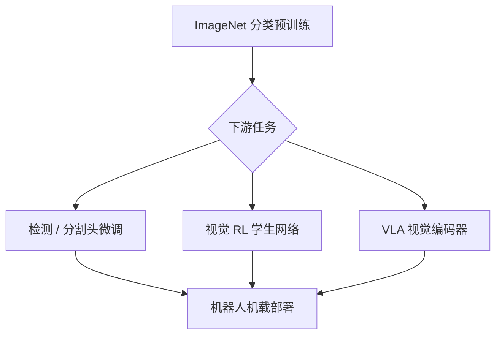

# 视觉骨干（Vision Backbones）

## 一句话定义

**视觉骨干**是感知管线中负责从 RGB/深度图提取 **层次化特征** 的神经网络主体；在机器人栈里，它常为 **检测头、策略网络、VLA 视觉塔** 提供可迁移的表征，典型训练路径是 **ImageNet 预训练 → 任务微调**。

## 英文缩写速查

| 缩写 | 英文全称 | 简要说明 |
|------|----------|----------|
| CNN | Convolutional Neural Network | 卷积神经网络，处理图像/深度感知 |
| ViT | Vision Transformer | 将图像分块后用 Transformer 编码的视觉骨干 |
| FPN | Feature Pyramid Network | 多尺度特征融合，检测/分割常用 neck |
| ImageNet | ImageNet Large Scale Visual Recognition Challenge | 大规模图像分类预训练数据源 |
| VLA | Vision-Language-Action | 视觉-语言-动作多模态策略，依赖强视觉塔 |
| FPS | Frames Per Second | 机载感知实时性指标 |

## 为什么重要

- **表征深度决定上限：** 浅层 CNN 难以同时编码 **纹理、部件、语义**；[ResNet](../entities/paper-resnet-deep-residual-learning.md) 证明 **百层网络可训**，直接抬升检测、分割与下游 RL 视觉编码能力。
- **算力与延迟约束：** 机载 GPU/边缘芯片需在 **FPS、功耗、精度** 间折中；骨干选型（ResNet-50 vs ViT vs 轻量 CSP）往往比换检测头更影响部署。
- **跨任务迁移：** 同一骨干可服务 **抓取检测、导航语义分割、VLA 图像 token**；理解骨干机制有助于做 **Sim2Real 视觉域随机化** 与 **微调策略** 判断。

## 核心结构

### 1. 层次特征

| 阶段 | 典型感受野 | 机器人用途 |
|------|------------|------------|
| 浅层 | 局部边缘/纹理 | 触觉视觉传感器形变、边缘跟踪 |
| 中层 | 部件/局部形状 | 抓取 affordance、障碍物轮廓 |
| 深层 | 物体/场景语义 | 任务条件策略、开放词汇检测 |

### 2. 深度可训练性：残差范式

[ResNet](../entities/paper-resnet-deep-residual-learning.md) 的 **捷径连接** 使优化器学习 **残差扰动** 而非完整映射，缓解 **退化问题**（更深网络训练误差反而升高）。现代骨干（ResNeXt、EfficientNet、ConvNeXt）均可视为在此基础上的结构搜索与效率改进。

### 3. 预训练—微调链条

[YOLO v1](../entities/paper-yolo-unified-realtime-detection.md) 即典型路径：前 20 层 ImageNet 预训练 → 升分辨率检测微调。

## 常见误区或局限

- **误区：「骨干越强，机器人策略越好。」** 仿真—真机 **视觉域差距**、相机标定与 **时序对齐** 常比换 ResNet-152 更致命。
- **误区：「ViT 已完全取代 CNN。」** 边缘部署、小数据微调、触觉形变图等场景 **CNN / 混合架构** 仍常见。
- **局限：** 骨干输出多为 **2D 特征**；空间操作、6DoF 抓取常需额外 **深度、位姿头或 3D 骨干**（见 [三维坐标变换](../formalizations/3d-coordinate-transforms-vision-robotics.md)）。

## 关联页面

- [深度学习基础](./deep-learning-foundations.md)
- [目标检测（方法）](../methods/object-detection.md)
- [CNN vs ViT 视觉骨干（对比）](../comparisons/cnn-vs-vit-backbones.md)
- [ResNet（论文实体）](../entities/paper-resnet-deep-residual-learning.md)
- [YOLO v1（论文实体）](../entities/paper-yolo-unified-realtime-detection.md)
- [传感器融合](./sensor-fusion.md)
- [三维坐标变换（形式化）](../formalizations/3d-coordinate-transforms-vision-robotics.md)

## 参考来源

- [ResNet 论文摘录（arXiv:1512.03385）](../../sources/papers/resnet_arxiv_1512_03385.md)
- [经典视觉骨干与检测文献簇](../../sources/papers/vision_backbone_detection_classics.md)

## 推荐继续阅读

- [ResNet 论文 PDF](https://arxiv.org/pdf/1512.03385.pdf)
- [PyTorch Torchvision Models](https://pytorch.org/vision/stable/models.html)
- [Deep Learning Book — CNN 章节](https://www.deeplearningbook.org/contents/convnets.html)
