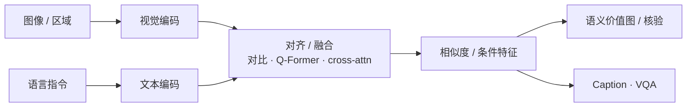

# 视觉–语言特征融合与语义空间对齐

**视觉–语言特征融合** 指将视觉编码器输出与文本编码器（或 LLM 词嵌入）结合，使跨模态信号可在同一任务头下计算相似度、检索或条件生成。**语义空间对齐** 强调训练或投影后，语义相近的图–文对在嵌入空间中靠近。

## 一句话定义

**让「看到的一块图」和「读到的一句话」变成可以算距离、可以互相条件化的向量——对齐了才能拿语言去搜物体、指路和核验。**

## 英文缩写速查

| 缩写 | 英文全称 | 简要说明 |
|------|----------|----------|
| VLM | Vision-Language Model | 视觉–语言模型 |
| CLIP | Contrastive Language–Image Pretraining | 对比学习对齐范式代表 |
| Q-Former | Querying Transformer | BLIP-2 可训跨模态桥 |
| ITM | Image-Text Matching | 图文匹配分数 |
| Emb | Embedding | 嵌入向量 |
| VLN | Vision-Language Navigation | 语言条件导航下游任务 |

## 为什么重要

- **课程技术点：** Day2「视觉–语言特征融合 / 语义空间对齐」是语义认知地图与零样本导航的共用底座，需独立概念页。
- **分工清晰：** [SAM 3](../entities/paper-sam3.md) 解决实例在哪；融合/对齐模块解决「语言指的是不是它」。
- **选型语言：** CLIP 式对比、BLIP-2 Q-Former、深层 cross-attn VLM 是三条常见对齐路线。

## 核心原理

| 路线 | 机制 | 典型用途 |
|------|------|----------|
| 对比对齐 | 双塔编码 + InfoNCE | 区域/整图与指令快速打分 |
| 桥接查询 | Q-Former 等可训 query（[BLIP-2](../entities/paper-blip2.md)） | 冻塔前提下的匹配与生成 |
| 深度融合 | 多层 cross-attention / 统一 Transformer | 复杂 VQA、多视角核验 |

## 工程实践

| 项 | 建议 |
|----|------|
| ObjectNav | 对 frontier 或实例裁剪算 ITM，写入空间价值图（TravExplorer 叙事） |
| 延迟 | 双塔检索机载；重 VLM 核验离板或异步 |
| 对齐失效信号 | 高分但几何不可达、或多视角分数抖动 → 拒绝 STOP |
| 与认知地图 | 对齐分数是实体置信度的来源之一，需与几何占用联合 |

## 局限与风险

- **袋装语义：** 双塔对组合属性（「冰箱左边的杯子」）偏弱，需结构化语言或深度 VLM。
- **域移：** 仿真渲染 vs 真机光照导致嵌入漂移，需目标域校准。
- **不可替代规划：** 对齐只提供语义势场，不能保证可通行与动力学可行。

## 关联页面

- [具身语义认知地图](./embodied-semantic-cognitive-map.md)
- [BLIP-2](../entities/paper-blip2.md)
- [SAM 3](../entities/paper-sam3.md)
- [零样本目标导航](../tasks/zero-shot-object-navigation.md)
- [四足×VLN 实战营总览](../overview/quadruped-vln-embodied-workshop.md)

## 参考来源

- [四足×VLN 实战营课程大纲](../../sources/courses/quadruped_vln_embodied_workshop_2day.md)
- [BLIP-2 论文摘录](../../sources/papers/blip2_arxiv_2301_12597.md)

## 推荐继续阅读

- [VLM / VLN / VLA / VLX / 世界模型分类](../comparisons/vlm-vln-vla-vlx-world-model-taxonomy.md)
