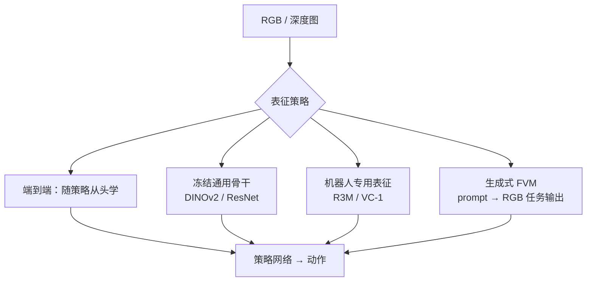

# 视觉表征作为策略输入（Visual Representation for Policy）

## 一句话定义

**视觉表征作为策略输入**指：把 [视觉骨干](./vision-backbones.md) 输出的图像特征接入控制/操作策略网络的方式选择——是 **随策略一起从头学**、**冻结一个通用预训练骨干当特征提取器**，还是 **用机器人数据专门预训练的表征**（R3M / VC-1 / DINOv2 等）。这一选择直接决定策略的 **样本效率、泛化能力与仿真—真机视觉域差距** 的大小。

## 英文缩写速查

| 缩写 | 英文全称 | 简要说明 |
|------|----------|----------|
| SSL | Self-Supervised Learning | 自监督预训练，无需人工标注 |
| R3M | Reusable Representations for Robotic Manipulation | 用 Ego4D 人类视频预训练的操作表征 |
| VC-1 | Visual Cortex 1 | CortexBench 提出的通用具身视觉骨干（MAE 预训练 ViT） |
| DINOv2 | self-DIstillation with NO labels v2 | 大规模自监督 ViT 通用视觉特征 |
| VLA | Vision-Language-Action | 视觉-语言-动作多模态策略 |
| E2E | End-to-End | 端到端，从像素到动作联合训练 |

## 为什么重要

- **样本效率瓶颈**：机器人真机数据昂贵，从头学视觉表征往往需要海量交互；用预训练表征可把数据需求降低一到两个量级。
- **域差距（domain gap）**：仿真渲染与真机相机的像素分布差异，常比策略本身更致命；强通用表征对光照/纹理变化更鲁棒（参见 [sim2real](./sim2real.md)）。
- **解耦感知与控制**：冻结骨干让感知层可独立迭代、复用，与 [基础策略](./foundation-policy.md) 的「预训练 → 下游微调」范式一致。

## 三条路径与取舍

| 路径 | 表征来源 | 样本效率 | 泛化 | 典型风险 |
|------|----------|----------|------|----------|
| **端到端联合训练** | 随策略从头学 | 低（需大量交互） | 易过拟合任务 | 视觉特征与控制耦合、难复用 |
| **冻结预训练骨干** | ImageNet/SSL 通用骨干冻结 | 高 | 取决于预训练域 | 通用域与机器人域不匹配 |
| **机器人专用预训练表征** | R3M / VC-1（具身数据预训练） | 高 | 对操作场景更对口 | 覆盖任务面有限、可得性弱 |
| **生成式视觉预训练（新兴）** | T2I 基座 + prompt 驱动分割/深度（如 [Vision Banana](../entities/vision-banana.md)） | 待验证 | 开放词汇、多任务统一接口 | 机载延迟与权重可得性未明；部分步骤依赖 MLLM |

- **数据充足、任务单一**：端到端可逼近上限，但泛化与复用差。
- **数据稀缺、需快速起步**：冻结预训练骨干是务实默认，配少量适配层（adapter/线性探针）即可。
- **操作类任务、强调可迁移**：R3M / VC-1 等具身预训练表征在抓取/操作上常优于纯 ImageNet 骨干。
- **混合路线**：冻结骨干 + 轻量可训练 neck/适配头，兼顾稳定性与任务适配，是工程常见折中。

## 与视觉骨干、检测头的衔接

视觉骨干输出的特征有两种下游接法：一是经 **检测/分割头**（见 [目标检测](../methods/object-detection.md)）得到结构化的物体/位姿，再喂给策略；二是把骨干 **特征图/CLS token 直接** 当作策略输入。前者可解释、便于安全约束，后者保留更多信息、契合端到端 [VLA](../methods/vla.md)。骨干族（CNN vs ViT）的选择见 [CNN vs ViT 视觉骨干对比](../comparisons/cnn-vs-vit-backbones.md)。

## 常见误区或局限

- **误区：「换更强的骨干，策略一定更好。」** 相机标定、时序对齐与控制策略本身常比骨干更关键。
- **误区：「冻结表征一定省事。」** 若预训练域（如网络图片）与机器人第一视角差距大，冻结反而拖累，需领域内微调或专用表征。
- **局限：** 多数 2D 表征缺空间几何，6DoF 抓取仍需深度/位姿头或 3D 表征补充。

## 关联页面

- [视觉骨干（概念）](./vision-backbones.md)
- [CNN vs ViT 视觉骨干对比](../comparisons/cnn-vs-vit-backbones.md)
- [感知骨干/表征选型 Query](../queries/perception-backbone-selection.md)
- [基础策略（概念）](./foundation-policy.md)
- [人形策略网络架构（概念）](./humanoid-policy-network-architecture.md)
- [目标检测（方法）](../methods/object-detection.md)
- [VLA（方法）](../methods/vla.md)
- [ResNet（论文实体）](../entities/paper-resnet-deep-residual-learning.md)
- [生成式视觉预训练（概念）](./generative-vision-pretraining.md)
- [Vision Banana（实体）](../entities/vision-banana.md)
- [Face Anything（实体）](../entities/paper-face-anything-4d-face-reconstruction.md) — 面部 4D 前馈几何/对应，与全身 HMR 互补
- [具身大模型分类学选型闭环（专题枢纽）](../overview/topic-embodied-foundation-model.md) — 策略视觉表征支撑五层闭环的 VLM 感知理解层

## 参考来源

- [ResNet 论文摘录（arXiv:1512.03385）](../../sources/papers/resnet_arxiv_1512_03385.md)
- [经典视觉骨干与检测文献簇](../../sources/papers/vision_backbone_detection_classics.md)

## 推荐继续阅读

- [R3M: A Universal Visual Representation for Robot Manipulation](https://arxiv.org/abs/2203.12601)
- [VC-1 / CortexBench: Where are we in the search for an Artificial Visual Cortex?](https://arxiv.org/abs/2303.18240)
- [DINOv2 通用视觉特征](https://arxiv.org/abs/2304.07193)
