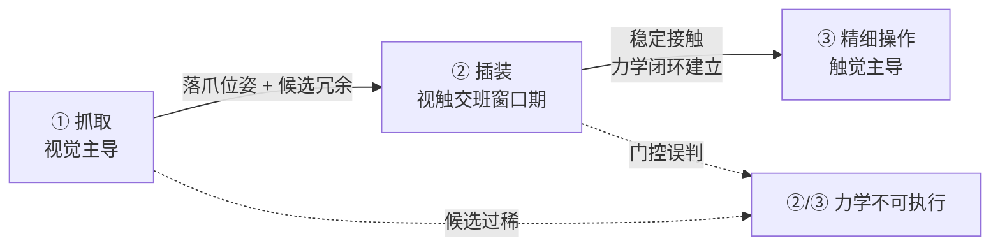

# 视触觉融合（Visuo-Tactile Fusion）

**视触觉融合 (Visuo-Tactile Fusion)** 研究如何在一次操作的不同阶段，让机器人在「视觉全局信息」与「触觉局部信息」之间动态切换权重，特别关注**接触瞬间**这一最难的窗口期。

## 一句话定义

视触觉融合不是把两路特征拼起来那么简单，它的本质是：**在接触发生前以视觉为主、接触发生后以触觉为主、接触瞬间两者都不可靠时如何平稳过渡**。

## 英文缩写速查

| 缩写 | 英文全称 | 简要说明 |
|------|----------|----------|
| VLA | Vision-Language-Action | 视觉-语言-动作多模态基础策略方向 |
| Manipulation | Robot Manipulation | 抓取、移动、操作物体的任务总称 |
| RL | Reinforcement Learning | 通过与环境交互最大化长期回报来学习策略的范式 |
| RGB | Red-Green-Blue | 彩色图像通道，常与深度 (RGB-D) 配合 |
| IMU | Inertial Measurement Unit | 惯性测量单元，提供加速度与角速度 |

## 为什么重要

接触丰富型任务（插拔、装配、灵巧抓取）有一个共同结构：

```
接近 (approach) → 接触瞬间 (make-contact) → 持续接触 (in-contact) → 脱离 (release)
```

每个阶段「哪个模态可信」是完全不一样的：

| 阶段 | 视觉可信度 | 触觉可信度 | 主导模态 |
|------|-----------|-----------|---------|
| 接近 | 高（无遮挡） | 无信号 | 视觉 |
| 接触瞬间 | **下降**（手 / 工具开始遮挡） | **不稳定**（瞬态冲击、未达稳态） | 都不可靠 |
| 持续接触 | 严重遮挡 | 高 | 触觉 |
| 脱离 | 恢复 | 衰减 | 视觉 |

「接触瞬间」往往就是 demo 走向真机部署的失败点。视触觉融合的目标，就是显式建模这个切换过程，而不是让网络自己去学。

## 视觉与触觉的本质互补

| 维度 | 视觉 | 触觉 |
|------|------|------|
| 空间范围 | 全局、远距 | 局部、毫米级 |
| 主要量 | 几何 / 颜色 / 语义 | 力 / 压力分布 / 滑移 |
| 频率 | 30–60 Hz | 100–1000 Hz（F/T）/ 30–60 Hz（视触觉传感器） |
| 失效模式 | 遮挡、暗光、反光 | 接触前无信号、瞬态噪声、迟滞 |
| 与控制层关系 | 适合规划、粗对位 | 适合阻抗 / 力控的闭环反馈 |

视觉给「应该把手放到哪儿」，触觉给「现在是不是已经稳住了」。把两者放在同一时间步等权融合，几乎一定会得到比单模态更差的结果——因为两路噪声在不同阶段几乎是反相关的。

## 三种主流融合范式

### 1. 阶段切换 (Phase-Switched Fusion)

最朴素也最稳的做法：用一个**接触检测器** (contact detector) 把任务切成接触前 / 接触中两段，分别走视觉策略和触觉策略。

- 接触检测器常用：F/T 传感器法向力阈值、关节扭矩残差、视觉触觉传感器形变面积。
- 优点：可解释、易调；接触阶段策略可以使用力 / 阻抗控制等成熟方法。
- 缺点：检测器本身的延迟和误判会被放大；接触瞬间的「灰色地带」依然没有解。
- **硬件级实例：** [VTAP Gripper](../entities/paper-vtap-gripper.md)（arXiv:2607.15448）把阶段切换做进 **主动掌**：同一 USB 相机在 LED 关时透射远场视觉、开时成光学触觉，配合指尖 FlexiTac 做反应抓取与 peg-in-hole——是「传感器本体切换」而非网络门控。

### 2. 软门控融合 (Gated Fusion)

不再硬切，而是学一个门控权重 $\alpha_t \in [0, 1]$：

$$
z_t = \alpha_t\, z^{\text{vis}}_t + (1 - \alpha_t)\, z^{\text{tac}}_t
$$

$\alpha_t$ 既可以由人类先验（接触力、深度差）算出，也可以让网络自己学一个 sigmoid head。Gate 输入通常包含「触觉是否有信号」和「视觉特征是否被自己遮挡」这两个信号。

- 优点：在接触瞬间能给出连续过渡。
- 关键技巧：训练时用 [Modality Dropout](../queries/multimodal-fusion-tricks.md) 随机屏蔽某一路，强制门控学会真正切换。

### 3. 注意力级融合 (Attention-based Fusion)

走 [Cross-modal Attention](../formalizations/cross-modal-attention.md) 路线：把触觉补丁与视觉补丁拼成同一序列，让 Transformer 自己学跨模态权重。

- 适合 VLA / Diffusion Policy 这类已经是 token-序列的策略骨架。
- 注意：纯端到端训练时，触觉 token 数量远小于视觉 token，容易被「淹没」。常用做法是给触觉 token 加一个固定大小的 learnable bias，或者在 loss 中加一项「触觉注意力下界」正则。

2026 年的 [HTD](../methods/humanoid-transformer-touch-dreaming.md) 说明了另一种实用做法：不要只靠注意力自动发现触觉重要性，而是在行为克隆训练中加入未来手部力与未来触觉 latent 预测。这样触觉路径会被接触时序目标持续监督，部署时仍只保留动作输出。

### 4. 残差适应 (Residual Adaptation)

不把触觉写进同一个策略网络，而是 **冻结视觉基策略**，另训 **轻量触觉残差** 在真机上线修正接触段。代表：[OmniTacTune](../entities/paper-omnitactune-tactile-residual-adaptation.md)（arXiv:2607.03723）用 **40–80 min 真机 RL** 把 Flow/ACT/DP/π₀.₅ 等基策略从 **5–40% 拉到 85–100%**，且 **无需离线触觉演示**。

- **接口设计：** 残差 actor 只读 **物体关键点子目标、基策略 action chunk、触觉与本体**，不依赖基策略内部隐状态——因此同一残差头可挂多种 IL/VLA 架构。
- **与端到端融合的分工：** 视觉策略继续吃规模化人视频/遥操数据；触觉只在 **接触丰富最后一公里** 通过试错学习，避开「触觉数据永远追不上视觉规模」的困境。
- **与 [T-Rex](../entities/paper-trex-tactile-reactive-dexterous-manipulation.md) 的对照：** T-Rex 需要 **100 h 触觉 mid-training** 把触觉写进 VLA；OmniTacTune 适合 **已有视觉策略、预算有限、想快速补触觉** 的部署场景。

### 5. 预测–反应层级 (Predictive–Reactive Hierarchy)

在 **名义 VLA 之外** 再拆两条触觉专用通路：**慢层预测未来视触觉子目标**，**快层 TRT 残差纠偏**。代表：[TouchWorld](../entities/paper-touchworld-tactile-foundation-dexterous-manipulation.md)（arXiv:2607.07287）用 **Subtask Planner + Tactile World Model（Wan2.2）** 生成接触感知子目标，名义 **视触觉 flow-VLA** 出 $H=32$ 动作块，**TRT** 在 $W=16$ 滑动窗口上每 $C=4$ 步提交残差；六任务长程 benchmark 干净 **65.0%**、人为扰动 **53.7%**，较单体触觉基线 FTP-1 **+15.7 / +18.5 pt**。

- **与残差适应的分工：** OmniTacTune 的残差来自 **真机 RL 试错**；TouchWorld 的 TRT 来自 **遥操残差监督**，且上游还有 **触觉世界模型** 提供「预期接触长什么样」。
- **与 T-Rex 的对照：** 二者都强调 **频率解耦 + 残差精修**；TouchWorld 额外把 **子任务规划 + 触觉子目标预测** 写入层级，更偏 **长程 household 六任务** 与 **人形 Wuji 平台**。

## 接触瞬间为什么难

把这一阶段单独拎出来，是因为常见的几个坑都集中在这里：

1. **视觉自遮挡放大几何误差**：手刚要碰上目标时，目标的最关键边角往往恰好被指尖挡住。视觉给出的位姿误差此时反而比远处更大。
2. **触觉信号还没建立**：接触刚发生 0–30 ms 内，弹性垫尚未到达稳态形变，力读数和形变图像都处在瞬态。
3. **两路时间不对齐**：视觉典型 30 Hz，触觉 1 kHz；接触瞬间是亚毫秒级事件，必须做时间对齐（[Sensor Fusion](./sensor-fusion.md) 中的零阶保持 / 时间戳同步）。
4. **力闭环还没接管**：策略往往是「位置控制下接近 → 阻抗控制下持续接触」，切换瞬间的控制器交接本身就会引入冲击。

工程上常见的兜底是：在视觉给出的目标位置上加一个微小的「过冲量 (over-travel)」，让接触一定先于精准对齐发生，再交给触觉做最后的微调。这等价于把「接触瞬间」从一个未知点变成一个**期望事件**，从而为融合策略提供稳定的对齐信号。

## 抓取 → 插装 → 精细操作（级联视角）

把视触觉融合放回更长的操作流水线，可以看清「为什么单独训一个融合网络往往效果不好」：融合的真正难点是在**三段不同主导模态**之间无缝交班，而不只是把两路特征做加权。



| 阶段 | 主导模态 | 关键决策 | 代表页面 |
|------|----------|----------|----------|
| ① **抓取（pre-contact）** | 视觉（RGBD / 点云） | 落爪位姿 + 候选稠密度 + 摩擦锥兼容性 | [Grasp Pose Estimation](../methods/grasp-pose-estimation.md)、[AnyGrasp](../entities/anygrasp.md)、[抓取策略选型 Query](../queries/grasp-policy-selection.md)、[AnyGrasp vs GraspNet](../comparisons/anygrasp-vs-graspnet.md) |
| ② **插装（make-contact）** | 视触交班，本页核心 | 接触检测、门控权重、过冲量、控制器切换 | 本页 + [Contact-Rich Manipulation](./contact-rich-manipulation.md)、[Contact Estimation](./contact-estimation.md)、[Hybrid Force-Position Control](./hybrid-force-position-control.md) |
| ③ **精细操作（in-contact）** | 触觉 + 本体感受 | 阻抗在线调节、滑移检测、力跟踪 | [Tactile Impedance Control](../methods/tactile-impedance-control.md)、[Impedance Control](./impedance-control.md)、[Tactile Feedback in RL](../queries/tactile-feedback-in-rl.md)、[Contact Wrench Cone](../formalizations/contact-wrench-cone.md) |

> **常被忽略的衔接点**：① 阶段的检测式 grasp（GraspNet / Contact-GraspNet / AnyGrasp）只输出 $(R, t, w, q)$，**不带任何接触可信度信息**——它会在指尖完全遮挡视觉之前就完成评估。这意味着 ② 阶段的视触觉融合**必须假设上游候选可能与真实接触面有数毫米的几何漂移**，门控/注意力机制要能在触觉一旦给出"实际接触在偏离 grasp 候选 N mm 处"的信号时**立刻让出权重**，否则会被上游 grasp 的高质量分数"锁死"在错误的接触假设上。这也是为什么把 ① 与 ② 串成一段端到端 VLA、却又不重采样接触瞬间样本时，融合策略经常退化为纯视觉的根因。

## 训练数据怎么收

视触觉融合策略对数据分布极其敏感：

- **必须包含同步的视觉 + 触觉 + 力轨迹**：很多公开 manipulation 数据集只有 RGB-D 与机器人状态，没有触觉，无法用于训练融合策略。
- **接触瞬间样本要刻意加权**：一段 demo 中，接触瞬间往往只占 1–5% 的时间步，但承担了 80% 的失败风险。常用做法是按「接触状态变化」做重采样。
- **遥操作时要让操作员自己感受触觉**：仅凭视觉遥操作收来的数据，操作员根本不会做出「碰到再微调」的策略，模型自然学不到。这一点和 [Dexterous Data Collection Guide](../queries/dexterous-data-collection-guide.md) 强调的一致。

## 常见误区

- **误区 1：「先训单模态，再加另一模态 fine-tune」就够了。**
  接触瞬间的相关性是在时间维度上的，事后 fine-tune 很难学到这种切换结构，除非数据里专门强调接触段。
- **误区 2：视觉触觉传感器（如 GelSight）就解决了一切。**
  GelSight 给出的依然是「接触局部」的信号，仍然需要全局相机做粗对位；它替代不了视觉 + 触觉的分工，只是把触觉那一路的信息密度变高了。
- **误区 3：把触觉信号简单拼到视觉 token 后面。**
  在 VLA / Diffusion Policy 中，token 数量不平衡几乎一定让触觉被忽略；必须在结构上显式偏置或在 loss 中保护触觉路径。[T-Rex](../entities/paper-trex-tactile-reactive-dexterous-manipulation.md) 给出 VLA 尺度反例：**π₀.₅ + tactile** 平均成功率低于无触觉 π₀.₅，需 **频率解耦触觉专家 + 时序力 VQ-VAE**。[OmniTacTune](../entities/paper-omnitactune-tactile-residual-adaptation.md) 则表明：短预算下 **冻结视觉 + 触觉残差真机 RL** 可优于 **继续堆 visuo-tactile 演示**。[TouchWorld](../entities/paper-touchworld-tactile-foundation-dexterous-manipulation.md) 进一步把触觉拆成 **TWM 预测子目标 + TRT 快残差**，在人为扰动设置优势更大。
- **误区 4：用力残差代替触觉就行。**
  力残差只能告诉「有没有接触」，无法告诉「接触发生在指尖哪一块」。空间分布是视觉触觉传感器或阵列式传感器的核心价值。

## 与其他页面的关系

- 上游传感器原理 → [Tactile Sensing](./tactile-sensing.md)
- 上游任务定义 → [Contact-Rich Manipulation](./contact-rich-manipulation.md)
- 与一般传感器融合的区别 → [Sensor Fusion](./sensor-fusion.md)（侧重 IMU / 视觉 / 腿部运动学，用于状态估计；本页侧重操作策略）
- 与一般多模态技巧的区别 → [Multimodal Fusion Tricks](../queries/multimodal-fusion-tricks.md)（涵盖语言 / 视觉 / 本体感受；本页只聚焦视-触这一对，且强调时间相位）
- 代表方法 → [HTD](../methods/humanoid-transformer-touch-dreaming.md) 把触觉 latent 预测作为 humanoid loco-manipulation 行为克隆的辅助目标
- 数学约束 → [Contact Wrench Cone](../formalizations/contact-wrench-cone.md) 给出的力学边界，是触觉信号判断「是否稳定接触」的物理依据
- RL 视角的具体实现 → [在 RL 中利用触觉反馈](../queries/tactile-feedback-in-rl.md)

## 关联页面

- [Tactile Sensing](./tactile-sensing.md)
- [Contact-Rich Manipulation](./contact-rich-manipulation.md)
- [Contact Estimation](./contact-estimation.md)
- [Humanoid Transformer with Touch Dreaming](../methods/humanoid-transformer-touch-dreaming.md)
- [Cross-modal Attention](../formalizations/cross-modal-attention.md)
- [Contact Wrench Cone](../formalizations/contact-wrench-cone.md)
- [Multimodal Fusion Tricks](../queries/multimodal-fusion-tricks.md)
- [Tactile Feedback in RL](../queries/tactile-feedback-in-rl.md)
- [OmniTacTune](../entities/paper-omnitactune-tactile-residual-adaptation.md) — 冻结视觉 + 触觉残差真机 RL，无需离线触觉演示
- [TouchWorld](../entities/paper-touchworld-tactile-foundation-dexterous-manipulation.md) — 预测–反应式触觉层级：TWM 子目标 + TRT 残差 + 六任务长程 benchmark
- [VTAP Gripper](../entities/paper-vtap-gripper.md) — 主动掌 LED 开关视/触 + FlexiTac 指尖；硬件级阶段切换实例（arXiv:2607.15448）
- [Manipulation 任务](../tasks/manipulation.md)
- [Grasp Pose Estimation](../methods/grasp-pose-estimation.md) — ① 抓取阶段的视觉感知主线
- [抓取策略选型 Query](../queries/grasp-policy-selection.md) — ① 抓取阶段的选型决策
- [AnyGrasp vs GraspNet](../comparisons/anygrasp-vs-graspnet.md) — ① 抓取检测家族对比
- [Tactile Impedance Control](../methods/tactile-impedance-control.md) — ③ 精细操作阶段的触觉闭环
- [Hybrid Force-Position Control](./hybrid-force-position-control.md) — ② 插装/③ 精细操作的执行层切换
- [Query：接触力旋量闭环知识链](../queries/contact-wrench-closed-loop.md) — 本页是四层闭环里的 **① 感知/估计层**（视触觉证据补法向力与打滑）
- [Contact-Force-Loop Bandwidth（力控闭环带宽）](./contact-force-loop-bandwidth.md) — 触觉采样率须 ≥ 控制环，否则感知时延压低可达带宽

## 参考来源

- [sources/papers/perception.md](../../sources/papers/perception.md)
- [sources/papers/contact_dynamics.md](../../sources/papers/contact_dynamics.md)
- [sources/papers/humanoid_touch_dream.md](../../sources/papers/humanoid_touch_dream.md)
- [sources/papers/vtap_gripper_arxiv_2607_15448.md](../../sources/papers/vtap_gripper_arxiv_2607_15448.md) — VTAP 主动掌视触切换硬件实例
- Calandra, R., et al. (2018). *More than a feeling: Learning to grasp and regrasp using vision and touch*.
- Lee, M. A., et al. (2019). *Making sense of vision and touch: Self-supervised learning of multimodal representations for contact-rich tasks*.
- Lambeta, M., et al. (2020). *DIGIT: A Novel Design for a Low-Cost Compact High-Resolution Tactile Sensor*.
