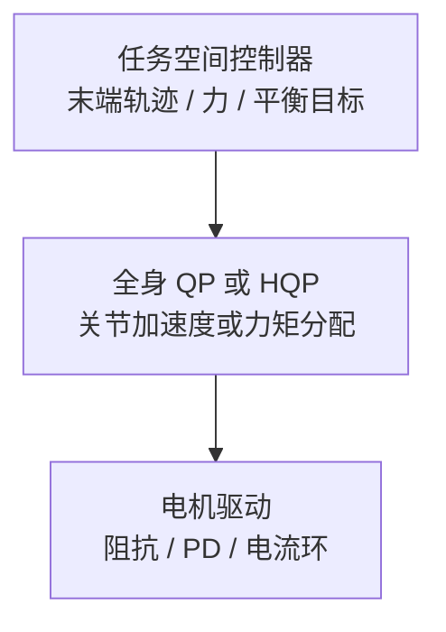

# Whole-Body Control (WBC，全身控制)

**全身控制**：对人形机器人等复杂系统，同时协调多个肢体/关节完成全身任务的控制方法。

## 一句话定义

不单独控制每个关节，而是把整个身体当成一个整体来协调控制。

## 英文缩写速查

| 缩写 | 英文全称 | 简要说明 |
|------|----------|----------|
| WBC | Whole-Body Control | 在全身动力学与任务约束下统一分配关节力矩/加速度 |
| QP | Quadratic Programming | 将 WBC 写成二次规划的标准形式 |
| HQP | Hierarchical Quadratic Programming | 分层 QP，按优先级堆叠任务与约束 |
| CoM | Center of Mass | 质心轨迹与平衡任务的核心状态量 |
| DoF | Degrees of Freedom | 人形通常 30+ 关节，需全身协调而非逐关节控制 |
| TSID | Task-Space Inverse Dynamics | 任务空间逆动力学，常与 WBC 分层组合 |

## 为什么重要

人形机器人的特点：

- 30+ 自由度
- 多个末端执行器（手、脚）
- 浮动基（身体位置和朝向不可控）
- 必须保持平衡

传统独立关节控制的局限：

- 各关节互相耦合，单独优化会冲突
- 没有全身协调意识
- 难以处理接触切换和约束

WBC 的优势：

- 通过优化或 hierarchical control 实现全身协调
- 能同时处理接触力、平衡、末端执行器任务
- 自然处理多接触场景

## 核心框架

### 典型分层执行流程



### 1. Hierarchical WBC
多层结构：

```
任务空间控制器（末端执行器轨迹）
        ↓
全身QP优化（关节力矩分配）
        ↓
电机驱动
```

代表：Whole-Body Impedance / TSID (Task Space Inverse Dynamics)

### 2. Optimization-based WBC
用 QP 或非线性优化直接求解：

- 给定任务目标（末端位置/姿态/力）
- 满足约束（关节限位、接触力、力矩平衡）
- 最小化某个代价函数

代表框架：Openuhan / tsid / exotica

### 3. Learning-based & Generative WBC
用 RL 或 IL 学习全身策略，或利用生成模型直接产生全身参考轨迹。

代表：DeepMimic, ASE, CALM, MimicKit, [MotionBricks](../methods/motionbricks.md) (Generative Backbone)，以及 **行为基础模型（BFM）** 谱系——见 [Behavior Foundation Model 概念页](./behavior-foundation-model.md)（综述 taxonomy + [awesome-bfm-papers](https://github.com/friedrichyuan/awesome-bfm-papers)）；单篇深读见把多种 mode 抽到 **位级掩码 + CVAE** 的 [BFM 论文实体](../entities/paper-behavior-foundation-model-humanoid.md)。

## 最小代码骨架

这段代码不是完整 WBC，而是 WBC 最核心的味道：
- 把多个任务写成误差项
- 在同一个 QP 里一起求一个关节加速度 / 力矩解
- 再把解交给底层执行器

```python
import numpy as np

# 关节加速度变量 qdd，示例只写成最小二乘形式
J_com = np.array([[1.0, 0.0], [0.0, 1.0]])
J_foot = np.array([[1.0, -1.0]])
acc_com_des = np.array([0.0, 0.2])
acc_foot_des = np.array([0.0])

A = np.vstack([J_com, J_foot])
b = np.concatenate([acc_com_des, acc_foot_des])

qdd_star, *_ = np.linalg.lstsq(A, b, rcond=None)
print("joint acceleration command:", qdd_star)
```

真实 WBC 会再加入：
- 动力学等式约束
- 接触力变量
- 摩擦锥、力矩限位、任务优先级
- 从 `qdd` 到 `tau` 的映射

## 方法局限性

- **强依赖模型与接触状态**：动力学模型不准、接触集合错了，整个 QP 都会偏
- **接口复杂**：上层 MPC / planner 和下层 WBC 的目标格式对齐很麻烦
- **调参成本高**：任务权重、优先级、阻抗参数经常比公式本身更难调
- **不直接提供高层策略**：WBC 擅长“怎么执行”，不天然回答“下一步想做什么”

## 关键概念

### Floating Base
人形机器人在空中时，base（躯干）的位置和朝向不在控制输入的直接控制下，需要通过接触力来驱动。

### Contact Schedule
什么时候哪只脚/手在接触地面，决定了可用力和平衡策略。

### Centroidal Dynamics
用质心动力学代替全关节动力学，更高效但精度略低。

## 参考来源

- Sentis & Khatib, *Synthesis of Whole-Body Behaviors Through Hierarchical Control of Behavioral Primitives* — WBC 早期基础论文
- Del Prete et al., *Task Space Inverse Dynamics* — WBC 动力学一致控制核心工作
- [sources/papers/whole_body_control.md](../../sources/papers/whole_body_control.md) — TSID / HQP / Crocoddyl ingest 摘要
- [TSID (Task Space Inverse Dynamics)](https://github.com/stack-of-tasks/tsid) — 开源 WBC 实现
- [Whole-Body Control 论文导航](../../references/papers/whole-body-control.md) — 论文集合
- [机器人论文阅读笔记：Expressive Whole-Body Control](https://imchong.github.io/Humanoid_Robot_Learning_Paper_Notebooks/papers/03_High_Impact_Selection/Expressive_Whole-Body_Control_for_Humanoid_Robots/Expressive_Whole-Body_Control_for_Humanoid_Robots.html)
- [机器人论文阅读笔记：ExBody2](https://imchong.github.io/Humanoid_Robot_Learning_Paper_Notebooks/papers/03_High_Impact_Selection/ExBody2_Advanced_Expressive_Whole-Body_Control/ExBody2_Advanced_Expressive_Whole-Body_Control.html)
- [sources/papers/gentlehumanoid_upper_body_compliance.md](../../sources/papers/gentlehumanoid_upper_body_compliance.md) — GentleHumanoid 原始资料摘录（上半身柔顺 / 接触丰富人机交互）
- [sources/papers/learn_weightlessness.md](../../sources/papers/learn_weightlessness.md) — Learn Weightlessness (WM) ingest 摘要
- [sources/papers/bfm_survey_arxiv_2506_20487.md](../../sources/papers/bfm_survey_arxiv_2506_20487.md) — BFM 综述（arXiv:2506.20487，TPAMI 2025）
- [sources/repos/awesome_bfm_papers.md](../../sources/repos/awesome_bfm_papers.md) — awesome-bfm-papers 精选列表
- [sources/papers/bfm_humanoid_arxiv_2509_13780.md](../../sources/papers/bfm_humanoid_arxiv_2509_13780.md) — BFM 论文摘要（CVAE + 位级掩码 + 在线蒸馏的人形 WBC 基础模型，arXiv:2509.13780）
- [sources/papers/pilot_arxiv_2601_17440.md](../../sources/papers/pilot_arxiv_2601_17440.md) — PILOT：感知统一 loco-manipulation 低层控制器（arXiv:2601.17440）
- [机器人论文阅读笔记：GentleHumanoid](https://imchong.github.io/Humanoid_Robot_Learning_Paper_Notebooks/papers/04_Loco-Manipulation_and_WBC/GentleHumanoid__Learning_Upper-body_Compliance_for_Contact-rich_Human_and_Object/GentleHumanoid__Learning_Upper-body_Compliance_for_Contact-rich_Human_and_Object.html)

## 关联页面

- [Locomotion](../tasks/locomotion.md)
- [Imitation Learning](../methods/imitation-learning.md)
- [WBC vs RL](../comparisons/wbc-vs-rl.md)
- [Sim2Real](./sim2real.md)
- [Contact Estimation](./contact-estimation.md) — WBC 的接触集合来自接触估计，直接影响约束矩阵
- [李群、李代数与刚体旋转](../formalizations/lie-group-rigid-body-motions.md) — 任务空间 twist 与 se(3) 增量
- [SE(3) 位姿表示形式化](../formalizations/se3-representation.md) — WBC 任务空间目标表示的基础
- [LEGS（论文实体）](../entities/paper-legs-embodied-gaussian-splatting-vla.md) — [SONIC](../methods/sonic-motion-tracking.md) 作低层 WBC 合成 loco-manip VLA 数据（arXiv:2606.01458）
- [MotionWAM（论文实体）](../entities/paper-motionwam-humanoid-loco-manipulation-wam.md) — WAM 在 **SONIC 统一 motion token** 空间预测全身行为，替代上下身分层命令接口（arXiv:2606.09215）
- [Query：什么时候该用 WBC，什么时候该用 RL？](../queries/when-to-use-wbc-vs-rl.md)
- [wbc_fsm](../entities/wbc-fsm.md) — WBC+FSM 在 Unitree G1 上的 C++ 部署实现
- [Behavior Foundation Model（BFM 概念）](./behavior-foundation-model.md) — 人形 WBC 行为基础模型 taxonomy
- [BFM（Behavior Foundation Model 论文实体）](../entities/paper-behavior-foundation-model-humanoid.md) — 把 WBC 多接口重表述为 CVAE 生成 + 位级掩码的人形基础模型
- [GentleHumanoid（上半身柔顺运动跟踪）](../methods/gentlehumanoid-motion-tracking.md) — 在 motion tracking 中集成阻抗参考动力学与可调力阈值
- [PILOT（论文实体）](../entities/paper-pilot-perceptive-loco-manipulation.md) — 学习型 **单阶段 MoE 全身 LLC**：LiDAR 高程图 + 跨模态编码，作 loco-manipulation 上层 API（arXiv:2601.17440）

## 继续深挖入口

如果你想沿着 WBC 继续往下挖，建议从这里进入：

### 论文入口
- [Whole-Body Control 论文导航](../../references/papers/whole-body-control.md)

### 工具 / Repo 入口
- [Utilities / Tooling](../../references/repos/utilities.md)

## 推荐继续阅读

- [机器人论文阅读笔记：Scalable and General Whole-Body Control for Cross-Humanoid Locomotion](https://imchong.github.io/Humanoid_Robot_Learning_Paper_Notebooks/papers/05_Locomotion/XHugWBC__Scalable_and_General_Whole-Body_Control_for_Cross-Humanoid_Locomotion/XHugWBC__Scalable_and_General_Whole-Body_Control_for_Cross-Humanoid_Locomotion.html)
- [机器人论文阅读笔记：HugWBC A Unified and General Humanoid Whole-Body Controller](https://imchong.github.io/Humanoid_Robot_Learning_Paper_Notebooks/papers/03_High_Impact_Selection/HugWBC_A_Unified_and_General_Humanoid_Whole-Body_Controller/HugWBC_A_Unified_and_General_Humanoid_Whole-Body_Controller.html)
- [ATOM01-Train](https://github.com/Roboparty/atom01_train)
- [TSID (Task Space Inverse Dynamics)](https://github.com/stack-of-tasks/tsid)

## 处理非自稳定运动与失重

传统的 WBC 通常强加严格的轨迹跟踪和自稳定约束，这在处理如坐下、躺下或靠墙等非自稳定（non-self-stabilizing, NSS）运动时显得局限。在这些任务中，机器人需要与环境建立安全的接触以完成动作。**Learn Weightlessness** (Xin et al., 2026) 提出通过学习人类的“失重”机制（即选择性地放松特定关节），允许身体与环境产生被动接触并稳定。这种思路通过引入动态放松增益调节网络，提供了一种从严格 WBC 轨迹跟踪向生物启发的环境适应性过渡的有效方案。
