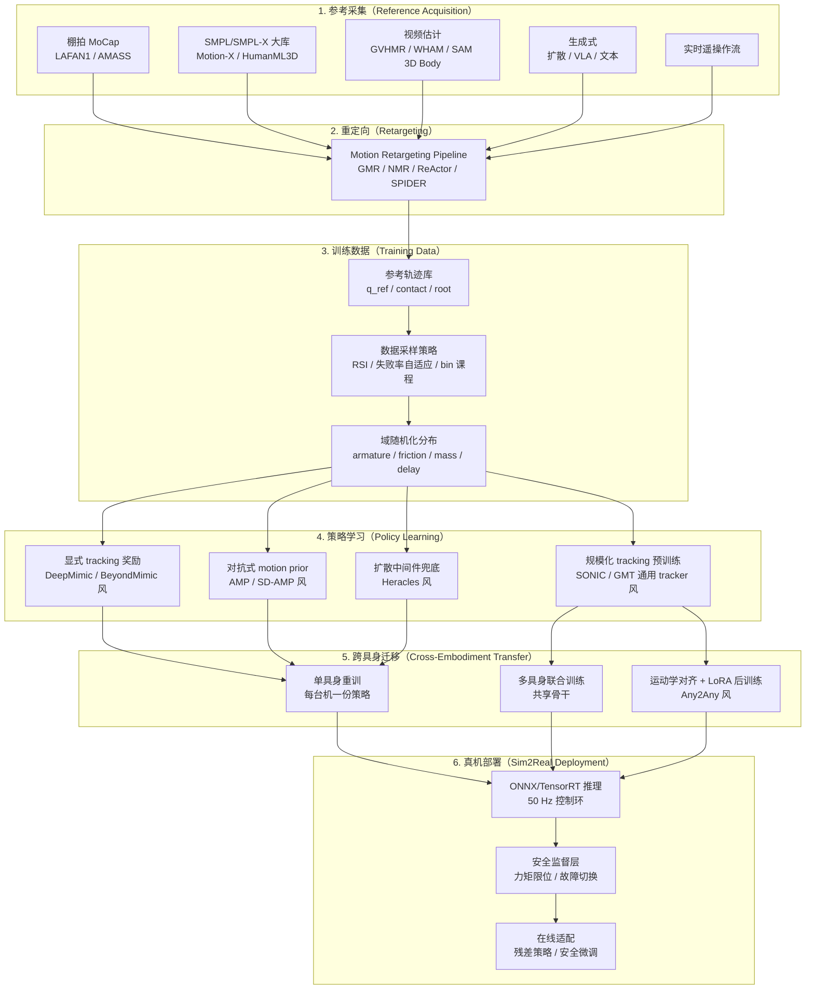

# Whole-Body Tracking Pipeline（全身运动跟踪流水线）

**Whole-Body Tracking（WBT）** 关心的是「让人形机器人**全身**按一段参考动作动起来」的端到端工程链路。它**消费** [Motion Retargeting Pipeline](./motion-retargeting-pipeline.md) 的参考轨迹产物，**生产**可上真机的跟踪策略。本页把这条链路统一成 6 个阶段，并把 **SONIC / BeyondMimic / SD-AMP / Heracles / Any2Any / GMT**（含 [Chen et al. GMT](../entities/paper-gmt.md) 与 RGMT 等鲁棒变体）等主流落地路径并排放进来对比。

## 一句话定义

WBT = **参考采集 → 重定向 → 训练数据 → 策略学习 → 跨具身迁移 → 真机部署** 的端到端流水线，目标是把一段「人形参考运动」变成一份「真机可执行的全身控制策略」。

## 英文缩写速查

| 缩写 | 英文全称 | 简要说明 |
|------|----------|----------|
| WBT | Whole-Body Tracking Pipeline | 参考→仿真跟踪→部署的流水线 |
| MoCap | Motion Capture | 上游人体/专家参考来源 |
| RL | Reinforcement Learning | 仿真中 PPO 等学跟踪策略 |
| Sim2Real | Simulation to Real | 跟踪策略迁移真机阶段 |
| Retargeting | Motion Retargeting | 流水线首段：映射到机器人骨架 |

## 为什么单独立一页

[Whole-Body Control (WBC)](./whole-body-control.md) 关心「**给定一帧参考，怎么协调全身关节求解力矩**」（QP 视角）；本页关心「**给定一批参考轨迹与一台目标机器人，怎么从数据到真机部署整条链路**」（学习驱动视角）。两者是同一战场上的两层抽象：

- WBC 是**一帧内**的协调问题
- WBT 是**一条策略**从训练到真机的工程问题

> 与 [Motion Retargeting Pipeline](./motion-retargeting-pipeline.md) 的关系：重定向流水线产出"机器人物理上可执行的参考"；WBT 流水线**消费**这些参考，训练一个能在真机上稳定执行它们的策略。两条流水线串起来构成「**MoCap → Reference → Policy → Real Robot**」的完整人形动作落地链。

## 端到端流水线总览（Mermaid）

## 阶段拆解

### 1. 参考采集（Reference Acquisition）

WBT 的**容量上限**由参考池决定。三类典型来源：

- **干净棚拍**：LAFAN1（少量、高质量）、AMASS（万级 SMPL 序列）；适合 fine-grained tracking。
- **大规模 SMPL 库**：Motion-X / HumanML3D / Motion-X++；适合规模化预训练（[SONIC](../methods/sonic-motion-tracking.md) 路线）。
- **视频估计 / 生成**：GVHMR、WHAM、扩散模型；噪声大、覆盖广，适合 long-tail 行为。轨迹级 **[HTD-Refine](../entities/paper-htd-refine-monocular-hmr.md)** 等后处理可在重定向前改善 **jitter / 脚滑 / 速度–加速度保真度**（对 TRAM、GVHMR 等初始化即插即用）。

> **关键经验**：参考池的**多样性**比单条参考的"精细度"更影响下游泛化；但太脏的视频估计会让全局位置漂移在策略上被放大（参见 [ExoActor](../methods/exoactor.md) 的"跳过重定向"反例）。高阶动力学精炼 **不能替代** 下游物理筛选与 tracking 消融。

### 2. 重定向（Retargeting）

详见 [Motion Retargeting Pipeline](./motion-retargeting-pipeline.md)。WBT 视角下，重定向的**输出契约**是：

- `q_ref(t)`：目标机器人关节角参考序列
- `root_ref(t)`：根位姿（位置 + 朝向）参考
- `contact_phase(t)`：接触相位标签（可选但强烈建议）
- `keypoints_ref(t)`：手 / 脚 / 头 / 骨盆 SE(3)（用于 tracking reward 设计）

**绕过重定向的反例**：[SONIC](../methods/sonic-motion-tracking.md) / [ExoActor](../methods/exoactor.md) 路线把"通用 tracker"当物理过滤器，直接消费视频估计源——这是一个**任务依赖**的选择，并非通用结论。

### 3. 训练数据（Training Data）

同一份参考池在不同采样策略下，训出来的策略可能差一个数量级：

- **RSI（Reference State Initialization）**：[DeepMimic](../methods/deepmimic.md) 经典做法，避免长 horizon 信用分配。
- **失败率自适应采样**：[BeyondMimic](../methods/beyondmimic.md) 按片段失败率动态调权，"难片段多练"。
- **Bin 级课程**：[EGM](../methods/egm-efficient-general-mimic.md) 按 bin 维度（速度 / 倾角 / 接触模式）做难度课程。
- **离线子集策展**：[LIMMT / GQS](../methods/limmt-gqs-motion-curation.md) 用仿真可行性 + HME 多样性 + 复杂度加权 FPS 从大库中选出 **≈3%** 高价值 clip，改善早期优化轨迹（tracker 无关）。
- **域随机化分布**：armature、friction、mass、传感器延迟等的扰动范围——是 sim2real 的主战场（详见 [Sim2Real](./sim2real.md)）。

### 4. 策略学习（Policy Learning）

WBT 的核心分歧在**奖励/损失**怎么写。四条主流：

| 路线 | 核心思想 | 代表 |
|------|----------|------|
| **显式 tracking 奖励** | 分项 reward 直接对齐参考（位姿/速度/末端） | [DeepMimic](../methods/deepmimic.md)、[BeyondMimic](../methods/beyondmimic.md) |
| **预训练 latent + 显式跟踪** | β-VAE 运动先验与 PPO 解耦，动画参考接口 | [VMP](../entities/paper-notebook-vmp.md) |
| **对抗式 motion prior** | 判别器约束风格分布，tracking 由任务奖励驱动 | [AMP](../methods/amp-reward.md)、[SD-AMP](../entities/paper-unified-walk-run-recovery-sdamp.md) |
| **生成式中间件** | 扩散/VAE 在 tracking 失败时改写参考 | [Heracles](../entities/paper-heracles-humanoid-diffusion.md) |
| **规模化通用 tracker** | 海量参考 + 大模型，把 tracking 当**预训练任务** | [SONIC](../methods/sonic-motion-tracking.md)、[GMT/RGMT](../entities/paper-hrl-stack-14-robust_and_generalized_humanoid_moti.md)、[Any2Track](../methods/any2track.md) |

### 5. 跨具身迁移（Cross-Embodiment Transfer）

参考池与策略**绑定到一台机器人**是历史包袱。当前三条主流路径：

- **单具身重训**（基线）：每台机重新训一份；简单但烧卡。
- **多具身联合训练**：共享骨干，靠观测/动作维度的统一编码吸收差异；需要大规模数据与多机型仿真。
- **运动学对齐 + LoRA 后训练**：[Any2Any](../entities/paper-any2any-cross-embodiment-wbt.md) 把差距拆为**运动学对齐**（无梯度的坐标重排）与**动力学残差**（LoRA 局部更新），用 ~1% 的全量训练算力把 SONIC 等骨干迁到 LimX / Unitree 等新机。

> **本阶段选型**：三条路径（单具身重训 + 重定向 / Any2Any 高效后训练 / 多具身联合训练）的「算力 × 数据 × 泛化」决策树与典型故障模式，见 [跨具身策略迁移选型指南](../queries/cross-embodiment-transfer-strategy.md)。

### 6. 真机部署（Sim2Real Deployment）

最后一段路："仿真里跑得好"≠"真机能用"。三层契约：

- **推理层**：[ONNX](../entities/onnx.md) / [ONNX Runtime](../entities/onnxruntime.md) / TensorRT（选型见 [对比页](../comparisons/onnxruntime-vs-mnn-vs-tensorrt.md)），控制频率通常 50 Hz；策略冻结。
- **安全监督层**：力矩限位、关节速度护栏、跌倒检测、故障切换到安全姿态；详见 [Balance Recovery](../tasks/balance-recovery.md)。
- **在线适配层**：残差策略（residual policy）、安全 LoRA 微调、CBF/CLF 安全壳。这是后续真机 RL 微调的入口（见 V23 P2 真机安全微调专题）。

## 六条主流落地路径对比

| 路径 | 参考池 | 重定向 | 训练目标 | 跨具身策略 | 真机交付 | 典型代表 |
|------|--------|--------|----------|------------|----------|----------|
| **SONIC** | 万级 SMPL（Motion-X 等） | 上游 GMR/语义对齐 | tracking-as-pretraining | 多具身联合 + 统一 token | NVIDIA GEAR-SONIC 仓库 | [SONIC](../methods/sonic-motion-tracking.md) |
| **BeyondMimic** | 干净棚拍（LAFAN1 等） | GMR / 手工对齐 | 显式 tracking + 失败率采样 | 单具身重训 | Isaac Lab + Unitree | [BeyondMimic](../methods/beyondmimic.md) |
| **SD-AMP** | 3 条 LAFAN1（走/跑/起身） | GMR | 双判别器门控 AMP + PPO | 单具身 | ONNX 50 Hz / Unitree G1 | [SD-AMP](../entities/paper-unified-walk-run-recovery-sdamp.md) |
| **Heracles** | 跟踪失败时由扩散重生成 | — | tracking + 扩散中间件兜底 | 单具身 | 项目页 demo | [Heracles](../entities/paper-heracles-humanoid-diffusion.md) |
| **Any2Any** | 复用源机参考池 | 运动学对齐层 | LoRA 后训练（约 1% 算力） | 多目标机 LoRA 适配 | LimX Oli/Luna、G1、H1 | [Any2Any](../entities/paper-any2any-cross-embodiment-wbt.md) |
| **GMT (RGMT)** | 多任务参考 + 扰动课程 | 上游通用 | 历史编码 + 命令交叉注意力 | 单具身（强抗扰） | Unitree G1 项目页 | [RGMT](../entities/paper-hrl-stack-14-robust_and_generalized_humanoid_moti.md)、[Any2Track](../methods/any2track.md) |
| **VMP** | 11 h 未过滤 CMU/Mixamo/Reallusion | IK retarget（LIME） | β-VAE prior + 条件 PPO 跟踪 | 单具身角色平台 | LIME 双足真机 | [VMP](../entities/paper-notebook-vmp.md) |

> **选型直觉**：
> - **动画工作流 + 角色真机** → VMP（kinematic 参考 + latent 上下文）
> - **想"开箱即用通用 tracker"** → SONIC / GMT 系（高代价但泛化最好）
> - **预算紧、想跑通一条线** → BeyondMimic 单具身重训（最成熟）
> - **要少参考做多行为** → SD-AMP（3 条参考覆盖走/跑/起身）
> - **想在 tracking 失败时优雅降级** → Heracles（扩散兜底）
> - **已有源机 SONIC/类似专家，想搬新机** → Any2Any（~1% 算力 LoRA）
> - **核心是抗扰与历史依赖** → GMT / RGMT / Any2Track

> **深入对比**：阶段 4「策略学习」里 SONIC / BeyondMimic / SD-AMP / Heracles 四条路线的逐维度取舍（参考池规模、训练目标、OOD 行为、真机交付），见 [SONIC vs BeyondMimic vs SD-AMP vs Heracles](../comparisons/sonic-vs-beyondmimic-vs-sdamp-vs-heracles.md)。

### 扩展：Omni-modal 运动生成 + tracker（OMG）

当 WBT 推理期需要 **语言 / 音频 / 人体参考 / 运动历史** 等多模态意图而非固定参考文件时，可在流水线前端插入 **运动生成器**。[OMG](../entities/paper-omg-omni-modal-humanoid-control.md)（清华 MARS Lab）采用 **generator–tracker 分层**：**OMG-DiT** 在 **OMG-Data**（约 1174.66 h，G1 对齐 + sim-in-the-loop 过滤）上训练扩散先验，经轻量 encoder 与 **CFG** 接入各模态；执行层复用 [HoloMotion](../entities/holomotion.md) tracker ONNX，并在 G1 上实现 **运行时多模态切换**。它与 [ETH G1 扩散 locomotion](../entities/paper-hrl-stack-27-learning_whole_body_humanoid_locomot.md)（地形条件 MDM + 自训 tracker）、[Heracles](../entities/paper-heracles-humanoid-diffusion.md)（recovery 中间件）并列，代表 **「参考生产」阶段的多模态 foundation 路线**。

### 扩展：双人物理交互 tracking（AssistMimic）

上表六条路径默认 **单具身** 按参考全身跟踪。当任务变为 **护理 / 扶起** 等 **双人力交换** 时，recipient 轨迹在物理上 **无法独立执行**，kinematic replay 或 frozen-recipient 解耦训练会系统性失败。[AssistMimic](../entities/paper-assistmimic.md)（arXiv:2603.11346）把问题升格为 **MARL**：supporter 与 recipient **联合 PPO**，以 [PHC](../entities/phc.md) 单人 prior 初始化，并叠加 **动态 hand retargeting** 与 **contact-promoting reward**。它仍在 **仿真 avatar** 层验证，但为 WBT 流水线提供了「从单人 GMT 到 **partner-aware 物理 tracking**」的明确分支。

### 扩展：双机真机社交交互（Rhythm）

当伙伴也是 **主动 humanoid** 且目标为 **拥抱、共舞、问候** 等 **对称物理交互** 时，重定向需同时解决 **个体运动保真** 与 **跨体几何一致** 的 kinematic conflict，策略还需在 **部分可观、异步执行** 下维持耦合动力学。[Rhythm](../entities/paper-rhythm-dual-humanoid-interaction.md)（arXiv:2603.02856）用 **IAMR** 解耦 $E_{self}$ / $E_{inter}$ 并导出交互图/接触图，再以 **IGRL（MAPPO + 图奖励）** 训练，配合 LiDAR 融合定位与 **相位软同步** 在 **双 Unitree G1** 真机落地——把 WBT 流水线的 partner-aware 分支从「仿真 assistive」推进到 **「双机真机富接触交互」**，并发布 **MAGIC** 双人数据集。

### 扩展：contact-conditioned HOI tracking（ContactMimic）

当 WBT 目标从 **自由空间姿态模仿** 延伸到 **人–物交互** 时，纯 keypoint 参考存在 **物理歧义**：机器人可到达正确几何却 **不建立任务相关接触**（擦板、坐椅、搬箱）。[ContactMimic](../entities/paper-contactmimic.md)（arXiv:2607.08742，UIUC）在阶段 2–4 用 **OmniRetarget** 从 **HUMOTO** 提取 keypoint 与 **per-body 二值接触标签**，并以 **三种轨迹增广**（label 翻转、去物体、膨胀碰撞几何）打破 keypoint–contact 相关；阶段 4 训练 **contact-conditioned PPO tracker**，部署时可在 **同一 keypoint** 下用 $\bar{\mathbf{c}}_t$ **开启或抑制** 接触。论文在 G1 真机 5 条 HOI 上验证 contact ✔/✘ controllability，并报告 **无任务专用奖励** 的搬箱 loco-manipulation——为 WBT 流水线补充了「**keypoint + 显式 contact 指令**」的物体交互分支，与 [SceneBot](../entities/paper-scenebot.md) 的通才单策略、[ResMimic](../entities/paper-resmimic.md) 的 GMT+残差路线形成对照。

### 扩展：GMT 先验 + 残差物体交互（ResMimic）

当 WBT 目标从 **纯运动模仿** 延伸到 **动态物体 loco-manipulation** 时，GMT 直出往往 **缺乏物体感知**（论文报告 MuJoCo 均值 SR 约 **10%**），而每条任务 **从头 PPO** 又面临奖励工程与样本效率问题。[ResMimic](../entities/paper-resmimic.md)（arXiv:2510.05070）在阶段 4 采用 **两阶段残差**：**Stage I** 用 AMASS/OMOMO 等训练 **GMT 先验** $\pi_{\mathrm{GMT}}$；**Stage II** 冻结先验并学习 **物体条件残差** $\Delta a$，使 $a=a^{\mathrm{gmt}}+\Delta a$，配合 **点云物体跟踪奖励**、**链节接触奖励** 与 **虚拟物体力课程**。它在 **统一奖励模板** 下覆盖跪姿抬箱、背载、蹲起托举、搬椅等任务，并在 G1 真机展示 **4.5–5.5 kg** 全身接触搬运——为 WBT 流水线补充了「**规模化 GMT 预训练 → 轻量 per-task 残差后训练**」的 loco-manipulation 分支，与 [holosoma](../entities/holosoma.md)/[OmniRetarget](../entities/paper-hrl-stack-03-omniretarget.md) 的 **交互保留参考生成** 形成上下游互补。

## 与 8 层 [人形 RL 身体系统栈](../overview/humanoid-rl-motion-control-body-system-stack.md) 的对应

| 8 层框架 | 在本流水线中的位置 |
|----------|--------------------|
| 1. 数据 | 阶段 1–2（参考采集 + 重定向） |
| 2. 参考 / 跟踪控制 | 阶段 3–4（训练数据 + 显式 tracking） |
| 3. 通用 tracker / 身体基础模型 | 阶段 4（SONIC / GMT 路线） |
| 4. 感知（视觉闭环） | 阶段 1（视频估计源）+ 阶段 6（在线适配） |
| 5. 接触 / 柔顺 | 阶段 4（接触相位奖励）+ 阶段 6（安全层） |
| 6. 安全 / 失败恢复 | 阶段 6（安全监督层 + 在线适配） |
| 7. 任务接口 / VLA 调用 | 阶段 4 输出（SONIC token 接口） |
| 8. 世界模型 | 阶段 5–6（执行前预测） |

## 常见失败模式

| 失败模式 | 触发阶段 | 典型表现 | 工程对策 |
|----------|----------|----------|----------|
| 参考池长尾盲区 | 阶段 1 | 真机遇到训练分布外行为就崩 | 扩参考池或换 SONIC 风规模化路线 |
| 重定向伪影放大 | 阶段 2→4 | 训练曲线好，真机脚滑/穿地 | 加 contact-phase 监督；或走 SONIC 跳过中间重定向 |
| RSI 把策略宠坏 | 阶段 3 | tracking 起点好，长 horizon 崩 | 课程从 RSI 渐变到长 rollout |
| 域随机化分布太窄 | 阶段 3→6 | sim 完美，真机一动就晃 | 扩 friction / armature / 延迟分布 |
| 跨具身 catastrophic forgetting | 阶段 5 | 新机适配后源机表现退化 | Any2Any 风局部 LoRA + 骨干冻结 |
| 真机首日"死机一次" | 阶段 6 | 安全层缺失 → 一次摔毁机器 | 力矩/速度护栏先行，再放 RL 在线微调 |

## 评测视角

- **几何指标**：MPJPE（关键点误差）、根速度差、末端轨迹误差。
- **跟踪成功率**：仿真内按参考片段计成功率；BeyondMimic / SONIC 等的核心横轴。
- **跨具身指标**：源机性能 vs 目标机性能差（[Any2Any](../entities/paper-any2any-cross-embodiment-wbt.md) 报告多组）。
- **真机指标**：sim-to-real gap、抗扰恢复时长、连续 rollout 时长。
- **数据效率**：达到目标性能所需参考数量 / 算力（[SD-AMP](../entities/paper-unified-walk-run-recovery-sdamp.md) 的 3 条参考 vs SONIC 的万级参考是两个极端）。

## 参考来源

- [bfm_awesome_sonic_arxiv_2511_07820.md](../../sources/papers/bfm_awesome_sonic_arxiv_2511_07820.md) — SONIC：规模化 tracking 预训练
- [bfm_awesome_beyondmimic_arxiv_2508_08241.md](../../sources/papers/bfm_awesome_beyondmimic_arxiv_2508_08241.md) — BeyondMimic：失败率驱动的精确 tracking
- [unified_walk_run_recovery_sdamp_arxiv_2605_18611.md](../../sources/papers/unified_walk_run_recovery_sdamp_arxiv_2605_18611.md) — SD-AMP：3 条参考覆盖走/跑/起身
- [heracles_humanoid_diffusion_arxiv_2603_27756.md](../../sources/papers/heracles_humanoid_diffusion_arxiv_2603_27756.md) — Heracles：扩散中间件兜底
- [any2any_arxiv_2605_23733.md](../../sources/papers/any2any_arxiv_2605_23733.md) — Any2Any：跨具身 LoRA 后训练
- [humanoid_rl_stack_17_sonic_supersizing_motion_tracking_for_natural_hu.md](../../sources/papers/humanoid_rl_stack_17_sonic_supersizing_motion_tracking_for_natural_hu.md) — SONIC 在 42 篇栈中的策展条目
- [humanoid_rl_stack_15_beyondmimic_from_motion_tracking_to_versatile_hu.md](../../sources/papers/humanoid_rl_stack_15_beyondmimic_from_motion_tracking_to_versatile_hu.md) — BeyondMimic 在 42 篇栈中的策展条目
- [humanoid_rl_stack_40_heracles_bridging_precise_tracking_and_generativ.md](../../sources/papers/humanoid_rl_stack_40_heracles_bridging_precise_tracking_and_generativ.md) — Heracles 在 42 篇栈中的策展条目

## 关联页面

- [Motion Retargeting Pipeline](./motion-retargeting-pipeline.md) — WBT 流水线的**上游**：参考从哪里来
- [Whole-Body Control (WBC)](./whole-body-control.md) — 一帧内的全身协调（与本页是两层抽象）
- [Sim2Real](./sim2real.md) — WBT 阶段 6 的核心问题域
- [Behavior Foundation Model](./behavior-foundation-model.md) — 与 SONIC 路线在叙事上同构的「身体基础模型」视角
- [SONIC](../methods/sonic-motion-tracking.md) — 规模化通用 tracker 代表
- [BeyondMimic](../methods/beyondmimic.md) — 显式 tracking + 失败率自适应代表
- [SD-AMP](../entities/paper-unified-walk-run-recovery-sdamp.md) — 状态门控对抗 motion prior
- [Heracles](../entities/paper-heracles-humanoid-diffusion.md) — 扩散中间件兜底
- [Any2Any](../entities/paper-any2any-cross-embodiment-wbt.md) — 跨具身 LoRA 后训练
- [RGMT](../entities/paper-hrl-stack-14-robust_and_generalized_humanoid_moti.md) / [Any2Track](../methods/any2track.md) — 历史编码 + 抗扰
- [SONIC vs BeyondMimic vs SD-AMP vs Heracles](../comparisons/sonic-vs-beyondmimic-vs-sdamp-vs-heracles.md) — 阶段 4「策略学习」四条路线逐维度对比
- [人形运动跟踪方法选型指南](../queries/humanoid-motion-tracking-method-selection.md) — 选型决策树
- [跨具身策略迁移选型指南](../queries/cross-embodiment-transfer-strategy.md) — 阶段 5 三路径选型与故障模式
- [人形 RL 身体系统栈](../overview/humanoid-rl-motion-control-body-system-stack.md) — 8 层总框架
- [ONNX](../entities/onnx.md) / [ONNX Runtime](../entities/onnxruntime.md) — 真机推理层格式与 runtime
- [ONNX Runtime vs MNN vs TensorRT](../comparisons/onnxruntime-vs-mnn-vs-tensorrt.md) — 机载推理选型

## 推荐继续阅读

- [GEAR-SONIC 项目页](https://nvlabs.github.io/GEAR-SONIC/) — 规模化 tracking 的工程实现
- [BeyondMimic 仓库说明](https://github.com/HybridRobotics/BeyondMimic) — Isaac Lab 上的标准 tracking 实现
- [Karpathy LLM Wiki 方法论](../references/llm-wiki-karpathy.md) — "compilation beats retrieval" 的内在动机
