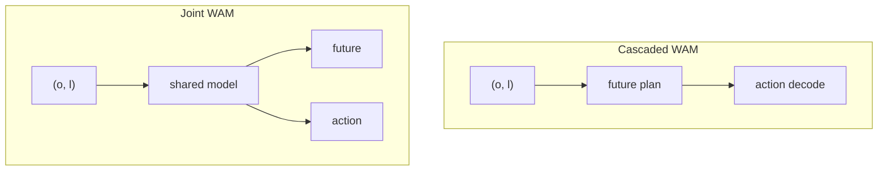

# World Action Models（WAM，世界–动作模型）

**World Action Models（WAM）**：具身基础模型中，把 **环境在干预下的前向演化（未来观测/状态）** 与 **可执行控制动作** 放在 **同一策略框架** 里联合建模的一类方法；其对象可概括为 **未来与动作的联合分布** \(p(o', a \mid o, l)\)，而不是只对动作边缘化建模。

## 一句话定义

让模型在生成动作时 **必须依托对未来世界的显式前向预测**，且该预测与动作在结构与训练目标上 **耦合**，而不是事后外挂仿真或辅助分支。

## 为什么重要

- **VLA** 在多任务语义与语言条件上很强，但常见形态仍是 **当前观测 → 动作** 的反应式映射，对 **长程物理后果** 与 **反事实 rollout** 的显式表达有限。
- **世界模型** 擅长 \(p(o' \mid o, a)\)，却 **不单独构成** 可部署策略：还需要 planner、策略头或二阶段系统。
- **WAM** 试图把两条线收束到一个范式里：既是 **预测器** 又是 **控制器**，便于讨论 **耦合方式、数据混合、评测协议** 与 **安全部署** 上的共同问题。

## 核心结构：与相邻概念的分界

| 范式 | 典型对象 | 角色 |
|------|-----------|------|
| **VLA** | \(p(a \mid o, l)\) | 语义接地强；多数实现不显式滚未来世界 |
| **World model** | \(p(o' \mid o, a)\) | 预测下一观测/潜状态；策略可外接 |
| **WAM** | \(p(o', a \mid o, l)\)（或等价分解） | **未来预测参与动作条件化**，且为 **端到端策略的一部分** |

仓库内已有 **潜空间世界–动作** 先验的实例讨论，可与本概念对照阅读：[Being-H0.7](../methods/being-h07.md)。

## 架构族谱（综述taxonomy）

综述将实现路线粗分为 **Cascaded** 与 **Joint** 两族；二者差别在于 **世界预测与动作解码的模块边界** 与 **训练时的监督如何共享**。

### Cascaded WAM

`future plan → action`：先由世界路径产生 **未来表征**（像素/视频、流、深度、潜向量、token 等），再由动作模块 **以该未来为条件** 解码控制。

- **工程直觉**：模块清晰，便于分别迭代世界模型与策略头。
- **主要张力**：两阶段 **信息瓶颈与对齐**——未来计划是否保留 **动作可恢复** 的足够信息。

### Joint WAM

`future + action`：在 **共享骨干** 下联合预测未来与动作（自回归统一词表、扩散/流匹配单引擎或多引擎等）。

- **工程直觉**：耦合更紧，可能更利于 **一致性** 目标。
- **主要张力**：**推理延迟**、训练目标设计、以及在多模态物理量（力触觉、形变）上的扩展。

## 数据与评测（概念层归纳）

- **数据**：高对齐机器人轨迹、便携人类示教、仿真特权信号、互联网/自我中心视频——关键是 **混合比例与监督对齐**，而非单一来源堆量。
- **评测**：需同时看 **世界侧**（保真、物理常识、动作可推断性）与 **策略侧**（任务成功率、长程、sim2real、形态相关基准）；避免只用视觉逼真度或只用任务成功率 **单侧代理** 评价 WAM。

## 常见误区

- **误区 1：带 world-model loss 的 VLA 就等于 WAM。** 若未来分支仅作辅助表示、推理路径不依赖前向预测，则更宜归类为 **VLA + 辅助目标**，而非 WAM。
- **误区 2：两阶段 pipeline（先仿真再 RL）就是 Cascaded WAM。** 若世界模块是 **外部** 可微仿真/引擎而非学习策略的一部分，边界上更接近 **经典 model-based RL / planning**，与综述定义的 WAM 不完全同构。
- **误区 3：把视频生成当世界模型就自动解决控制。** 视频级预测与 **可执行、可闭环** 的控制仍隔着 **动作可识别性、因果一致性与延迟** 等工程约束。

## 与其他页面的关系

- [VLA](../methods/vla.md) — 语言条件视觉策略的主线；WAM 可视为在目标分布与训练接口上的延伸讨论。
- [Generative World Models](../methods/generative-world-models.md) — 像素/潜空间动态预测工具箱；WAM 强调 **与控制头的耦合位置**。
- [Model-Based RL](../methods/model-based-rl.md) — 经典 **模型 + 规划/策略** 分解；对照理解 Cascaded WAM 的历史渊源。
- [Loco-Manipulation](../tasks/loco-manipulation.md) — 高 DoF 任务上 **长程协调** 与 **sim2real** 压力最集中，是 WAM 论文重点引用的评测语境之一。

## 参考来源

- [sources/papers/world_action_models_survey_2605.md](../../sources/papers/world_action_models_survey_2605.md)
- [sources/repos/awesome-wam-openmoss.md](../../sources/repos/awesome-wam-openmoss.md)
- [sources/sites/awesome-wam-openmoss.md](../../sources/sites/awesome-wam-openmoss.md)

## 关联页面

- [VLA](../methods/vla.md)
- [Generative World Models](../methods/generative-world-models.md)
- [Being-H0.7](../methods/being-h07.md)
- [Loco-Manipulation](../tasks/loco-manipulation.md)
- [Model-Based RL](../methods/model-based-rl.md)

## 推荐继续阅读

- Wang et al., *World Action Models: The Next Frontier in Embodied AI* — [arXiv:2605.12090](https://arxiv.org/abs/2605.12090)
- OpenMOSS **Awesome-WAM** 论文库与导航 — [GitHub 仓库](https://github.com/OpenMOSS/Awesome-WAM) · [静态站点](https://openmoss.github.io/Awesome-WAM)
