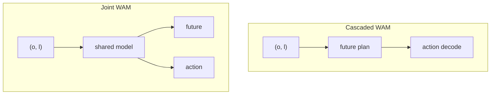

# World Action Models（WAM，世界–动作模型）

**World Action Models（WAM）**：具身基础模型中，把 **环境在干预下的前向演化（未来观测/状态）** 与 **可执行控制动作** 放在 **同一策略框架** 里联合建模的一类方法；其对象可概括为 **未来与动作的联合分布** \(p(o', a \mid o, l)\)，而不是只对动作边缘化建模。

## 一句话定义

让模型在生成动作时 **必须依托对未来世界的显式前向预测**，且该预测与动作在结构与训练目标上 **耦合**，而不是事后外挂仿真或辅助分支。

## 英文缩写速查

| 缩写 | 英文全称 | 简要说明 |
|------|----------|----------|
| WAM | World Action Model | 联合预测世界动态与动作的多模态模型 |
| VLA | Vision-Language-Action | 传统分模块的级联对照基线 |
| WM | World Model | 侧重环境预测、动作后解码的架构 |
| IDM | Inverse Dynamics Model | 由未来潜变量反推动作的常见头 |
| RL | Reinforcement Learning | 可用 WAM 想象 rollout 微调策略 |

## 为什么重要

- **VLA** 在多任务语义与语言条件上很强，但常见形态仍是 **当前观测 → 动作** 的反应式映射，对 **长程物理后果** 与 **反事实 rollout** 的显式表达有限。
- **世界模型** 擅长 \(p(o' \mid o, a)\)，却 **不单独构成** 可部署策略：还需要 planner、策略头或二阶段系统。
- **WAM** 试图把两条线收束到一个范式里：既是 **预测器** 又是 **控制器**，便于讨论 **耦合方式、数据混合、评测协议** 与 **安全部署** 上的共同问题。

## 核心结构：与相邻概念的分界

| 范式 | 典型对象 | 角色 |
|------|-----------|------|
| **VLA** | \(p(a \mid o, l)\) | 语义接地强；多数实现不显式滚未来世界 |
| **World model** | \(p(o' \mid o, a)\) | 预测下一观测/潜状态；策略可外接 |
| **WAM** | \(p(o', a \mid o, l)\)（或等价分解） | **未来预测参与动作条件化**，且为 **端到端策略的一部分** |

仓库内已有 **潜空间世界–动作** 先验的实例讨论，可与本概念对照阅读：[Being-H0.7](../methods/being-h07.md)。

## 架构族谱（综述taxonomy）

综述将实现路线粗分为 **Cascaded** 与 **Joint** 两族；二者差别在于 **世界预测与动作解码的模块边界** 与 **训练时的监督如何共享**。

### Cascaded WAM

`future plan → action`：先由世界路径产生 **未来表征**（像素/视频、流、深度、潜向量、token 等），再由动作模块 **以该未来为条件** 解码控制。

- **工程直觉**：模块清晰，便于分别迭代世界模型与策略头。
- **主要张力**：两阶段 **信息瓶颈与对齐**——未来计划是否保留 **动作可恢复** 的足够信息。

**文献实例（Cascaded + 显式解耦预训练）**：[DeFI](../methods/defi-decoupled-dynamics-vla.md) 将 **GFDM（视频生成式前向动力学）** 与 **GIDM（自监督逆动力学潜动作）** 在 **不同数据源与目标** 上独立预训练，再在下游用扩散适配器耦合；论文强调弱化逆向模块（如 VPP）会成为整条链路的瓶颈（arXiv:2604.16391）。

### Joint WAM

`future + action`：在 **共享骨干** 下联合预测未来与动作（自回归统一词表、扩散/流匹配单引擎或多引擎等）。

- **工程直觉**：耦合更紧，可能更利于 **一致性** 目标。
- **主要张力**：**推理延迟**、训练目标设计、以及在多模态物理量（力触觉、形变）上的扩展。

**文献实例（Joint 族 + 显式推理枢纽）**：[Pelican-Unified 1.0](../methods/pelican-unified-1.md) 用 VLM 产生可监督 CoT 并把末态投影为稠密 **\(z\)**，再以 **同一扩散去噪** 联合解码未来视频与动作，使语言 / 视频 / 动作损失回传至共享表示——可视作在 Joint WAM 思路上显式插入 **语言推理状态** 的工程化版本（细节与数字以 arXiv:2605.15153 为准）。

**文献实例（Joint 族 + 潜自回归闭环 · 空中 VLN）**：[WorldVLN](../entities/paper-worldvln-aerial-vln-wam.md) 在 **无人机 VLN** 上将 **预训练视频潜自回归骨干** 用于 **短视界世界转移预测**，经解码器输出 **waypoint 段**，执行后把新观测写回上下文；Stage 2 使用作者所称首个面向 **自回归 WAM** 的 **Action-aware GRPO**（arXiv:2605.15964）。与 Pelican 的扩散联合去噪不同，WorldVLN 强调 **因果 observe–act–update** 与 **导航后果优化**，而非整段双向 clip 生成。

**文献实例（Joint 族 + 操纵测试时仿真 · Agibot）**：[τ₀-World Model（τ0-WM）](../entities/tau0-world-model.md) 在 **Wan-2.2 级视频扩散骨干** 上 **联合** 预测未来多视角 latent 与 **action chunk**，并用 **动作条件 rollout + 任务进度轨迹** 在执行前做 **propose–evaluate–revise**；异构 **~2.73 万小时** 数据通过 **模态掩码** 分监督（人视频不伪标机器人动作）。

**平台实例（Joint 族 + 全模态单栈 · NVIDIA）**：[Cosmos 3](../entities/cosmos-3.md) 在 **MoT** 内用 **Generator** 同时暴露 **policy、forward dynamics、inverse dynamics**，用 **Reasoner** 做具身 CoT 与 2D 轨迹规划，并支持 **Reasoning + Generation**（先文本轨迹再视频再生）；与 Cascaded「先完整视频计划再解码动作」相比，更强调 **同一 checkpoint 多任务 I/O 配置** 与 **开源 serving 栈**（arXiv:2606.02800）。

**文献实例（Joint 族 + 双 DiT 联合训练 · VAM）**：[DiT4DiT](../entities/paper-dit4dit-video-action-model.md) 以 **Cosmos-Predict2.5 Video DiT** 与 **Action DiT** **端到端 dual flow-matching** 联合优化，用 **固定 flow 步隐状态** 条件动作；§3 验证视频生成相对 Grounding/FLARE 的 **~10× 样本效率**；LIBERO **98.6%**、G1 真机桌面与全身 loco-manip（arXiv:2603.10448，Mondo Robotics / HKUST，[开源](https://github.com/Mondo-Robotics/DiT4DiT)）。

**文献实例（Joint 族 + 双 DiT 实时闭环 · 人形 loco-manip）**：[MotionWAM](../entities/paper-motionwam-humanoid-loco-manipulation-wam.md) 以 **Cosmos-Predict2.5 系 Video DiT** 在 **固定 flow 步单次前向** 的隐状态条件 **Motion DiT**，在 **SONIC 统一全身 motion token** 上联合预测行走、躯干、身高、足端交互与双手操作；三阶段 **egocentric 视频 → 跨具身动作 → 全身遥操作** 微调，在 **宇树 G1** 九项真机任务上相对同演示微调的 VLA 基线 **整体成功率 +32% 绝对值**，并报告 **任务驱动足部行为**（arXiv:2606.09215，Mondo Robotics / HKUST）。

**文献实例（Joint 族 + 移动操作三层对齐 · latent action + Dream Forcing）**：[ABot-M0.5](../entities/paper-abot-m05-mobile-manipulation-wam.md) 以 **Wan2.2** 视频骨干建立 **Video → 帧级 latent action → 可执行动作** 级联，用 **双层 D-MoT** 解耦 **移动/操作** 子空间，并以 **Dream Forcing** 在 **自生成视频 latent** 上训练逆动力学以对齐自回归 rollout；在 **RoboCasa365**（+Condensed Memory **46.6%**）、**RoboTwin 2.0**（**94.1%**）、**LIBERO-Plus 零样本 WAM 对照**（**83.4%**）与真机长程任务上报告领先表现（arXiv:2607.00678，AMAP CV Lab / 阿里巴巴）。

**2026-07 动作后果横切面（策展）**：[动作后果技术地图](../overview/robot-world-models-action-consequence-technology-map.md) 将近期 WAM 按 **执行 / 修正 / 筛选** 三类接口归纳——[DSWAM](../entities/paper-dswam-dual-system-wam.md)（双系统直出动作块）、[DynaWM](../entities/paper-dynawm-vla-online-correction.md)（冻结 VLA + 在线流匹配修正）、[DreamSteer](../entities/paper-dreamsteer-vla-deployment-steering.md)（潜变量 WM 部署筛选）；接触与几何支路见 [VT-WAM](../entities/paper-vt-wam-visuotactile-contact-rich.md)、[MECo-WAM](../entities/paper-meco-wam-4d-geometry-cotraining.md)、[RynnWorld-4D](../entities/paper-rynnworld-4d-rgb-depth-flow.md)。

**文献实例（Joint 族 + 目标条件视觉导航 · Cosmos latent canvas）**：[NavWAM](../entities/paper-navwam-goal-conditioned-visual-navigation-wam.md) 在 **Cosmos Predict 2（2B）** 上构建 **九帧共享 latent 序列**（条件：state / goal image / 当前 egocentric；预测：action chunk / future state / 两帧未来观测 / goal-progress value），以 **policy / world-model / value 三模式** 联合训练；推理 **policy 模式单次扩散** 直接输出 action chunk，**无需 CEM**，在 **go stanford image-goal** 与 **Diablo 真机 24 episode** 上优于 **NWM+CEM** 与 **OmniVLA**（arXiv:2606.13494，东京大学 / NII / ATR）。

**文献实例（Joint 族 + 野外 egocentric 人数据协同训练 · 可替换世界目标）**：[EgoWAM](../entities/paper-egowam-egocentric-human-wam-co-training.md) 在 **HPT** 上 **固定骨干、flow-matching 动作头与三源数据混合**（机器人遥操作 + 域内人 + [EgoVerse](https://egoverse.ai/) 野外人），**仅替换世界预测目标**（Pixel / DINO / 3D motion flow），系统检验 **WAM 动力学监督** 能否把 **具身差距** 下常失效的 **BC 人–机共训** 转为可扩展增益：**DINO** 在 OOD 物体/场景上最高约 **4×** 泛化，**3D flow** 域内 **+20–30%**；未对齐人数据时 **BC 可跌至 robot-only 以下** 而 **3D Flow** 仍鲁棒（Georgia Tech RL²，[项目页](https://gatech-rl2.github.io/egowam.github.io/)）。

**文献实例（Joint 族 + 原生 CEDC · 4B 部署导向）**：[Kairos](../entities/paper-kairos-native-world-model-stack.md) 以 **Video DiT + Action DiT（MoT）** 联合 flow matching，**Stage I–II 仅训 VideoDiT、Stage III 联合 ActionDiT**；推理支持 **action-only**（不滚未来视频）与 **Kairos-joint**（联合去噪，LIBERO-Plus **89.0→90.8**）。原生 **跨具身数据课程** 与 **仅训 ActionDiT** 消融（**−23.2** LIBERO-Plus）强调：世界生成监督是控制相关表征的必要来源（arXiv:2606.16533，Kairos Team / kairos-agi）。

**文献实例（Joint 族 + latent foresight 查询冻结生成器 · 部署纯 VLA）**：[InternVLA-A1.5](../entities/paper-internvla-a15-unified-vla.md) 在 **Qwen3.5-2B MoT** 上持续 **VQA/子任务** 共训，用 **50 个 foresight token** 读出紧凑潜码条件化 **冻结 WAN2.2-5B**，以 video flow loss **蒸馏动力学先验** 至 unified expert，再以 **flow matching** 输出连续 action chunk；**推理丢弃视频分支**（~0.1s/步），在 LIBERO-Plus / DOMINO 零样本与真机 **组合指令 OOD** 上报告最强组合泛化（arXiv:2607.04988，上海 AI Lab Physical Intelligence Team）。

## 数据与评测（概念层归纳）

- **数据**：高对齐机器人轨迹、便携人类示教、仿真特权信号、互联网/自我中心视频——关键是 **混合比例与监督对齐**，而非单一来源堆量。
- **评测**：需同时看 **世界侧**（保真、物理常识、动作可推断性）与 **策略侧**（任务成功率、长程、sim2real、形态相关基准）；避免只用视觉逼真度或只用任务成功率 **单侧代理** 评价 WAM。

## 常见误区

- **误区 1：带 world-model loss 的 VLA 就等于 WAM。** 若未来分支仅作辅助表示、推理路径不依赖前向预测，则更宜归类为 **VLA + 辅助目标**，而非 WAM。
- **误区 2：两阶段 pipeline（先仿真再 RL）就是 Cascaded WAM。** 若世界模块是 **外部** 可微仿真/引擎而非学习策略的一部分，边界上更接近 **经典 model-based RL / planning**，与综述定义的 WAM 不完全同构。
- **误区 3：把视频生成当世界模型就自动解决控制。** 视频级预测与 **可执行、可闭环** 的控制仍隔着 **动作可识别性、因果一致性与延迟** 等工程约束。

## 与其他页面的关系

- [WAM 纵深路线](../../roadmap/depth-wam.md) — Stage 0–5 学习路径（边界族谱 → Cascaded / Joint → 部署职责三分）
- [VLA](../methods/vla.md) — 语言条件视觉策略的主线；WAM 可视为在目标分布与训练接口上的延伸讨论。
- [Generative World Models](../methods/generative-world-models.md) — 像素/潜空间动态预测工具箱；WAM 强调 **与控制头的耦合位置**。
- [Model-Based RL](../methods/model-based-rl.md) — 经典 **模型 + 规划/策略** 分解；对照理解 Cascaded WAM 的历史渊源。
- [Loco-Manipulation](../tasks/loco-manipulation.md) — 高 DoF 任务上 **长程协调** 与 **sim2real** 压力最集中，是 WAM 论文重点引用的评测语境之一。
- [视觉–语言导航（VLN）](../tasks/vision-language-navigation.md) — 语言条件空间决策；[WorldVLN](../entities/paper-worldvln-aerial-vln-wam.md) 提供 **UAV / 自回归 WAM** 实例。
- [AI Auto-Research（学术研究自动化）](./ai-auto-research.md) — 另一篇 **领域综述 + Awesome 列表** 维护范式（学术全生命周期 vs 具身 WAM）。

## 参考来源

- [sources/papers/world_action_models_survey_2605.md](../../sources/papers/world_action_models_survey_2605.md)
- [sources/papers/dit4dit_arxiv_2603_10448.md](../../sources/papers/dit4dit_arxiv_2603_10448.md)
- [sources/papers/motionwam_arxiv_2606_09215.md](../../sources/papers/motionwam_arxiv_2606_09215.md)
- [sources/papers/abot_m05_arxiv_2607_00678.md](../../sources/papers/abot_m05_arxiv_2607_00678.md)
- [sources/papers/navwam_arxiv_2606_13494.md](../../sources/papers/navwam_arxiv_2606_13494.md)
- [sources/papers/egowam.md](../../sources/papers/egowam.md)
- [sources/papers/worldvln_arxiv_2605_15964.md](../../sources/papers/worldvln_arxiv_2605_15964.md)
- [sources/papers/pelican_unified_uei_arxiv_2605_15153.md](../../sources/papers/pelican_unified_uei_arxiv_2605_15153.md)
- [sources/repos/awesome-wam-openmoss.md](../../sources/repos/awesome-wam-openmoss.md)
- [sources/sites/awesome-wam-openmoss.md](../../sources/sites/awesome-wam-openmoss.md)

## 关联页面

- [WAM 纵深路线](../../roadmap/depth-wam.md)
- [VLA](../methods/vla.md)
- [Generative World Models](../methods/generative-world-models.md)
- [Being-H0.7](../methods/being-h07.md)
- [Pelican-Unified 1.0（UEI）](../methods/pelican-unified-1.md)
- [DiT4DiT（双 DiT 联合 VAM）](../entities/paper-dit4dit-video-action-model.md)
- [MotionWAM（人形 loco-manip · 实时 WAM）](../entities/paper-motionwam-humanoid-loco-manipulation-wam.md)
- [ABot-M0.5（移动操作 · latent action + Dream Forcing）](../entities/paper-abot-m05-mobile-manipulation-wam.md)
- [动作后果技术地图（2026-07 策展）](../overview/robot-world-models-action-consequence-technology-map.md)
- [DSWAM（双系统 WAM 执行）](../entities/paper-dswam-dual-system-wam.md)
- [DynaWM（VLA 在线修正）](../entities/paper-dynawm-vla-online-correction.md)
- [DreamSteer（部署时 VLA steering）](../entities/paper-dreamsteer-vla-deployment-steering.md)
- [VT-WAM（视觉-触觉接触丰富 WAM）](../entities/paper-vt-wam-visuotactile-contact-rich.md)
- [WorldVLN（空中 VLN · WAM）](../entities/paper-worldvln-aerial-vln-wam.md)
- [NavWAM（image-goal 视觉导航 · WAM）](../entities/paper-navwam-goal-conditioned-visual-navigation-wam.md)
- [EgoWAM（野外 egocentric 人数据 · WAM 协同训练）](../entities/paper-egowam-egocentric-human-wam-co-training.md)
- [τ₀-World Model（τ0-WM）](../entities/tau0-world-model.md)
- [视觉–语言导航（VLN）](../tasks/vision-language-navigation.md)
- [Loco-Manipulation](../tasks/loco-manipulation.md)
- [Model-Based RL](../methods/model-based-rl.md)
- [具身大模型分类学选型闭环（专题枢纽）](../overview/topic-embodied-foundation-model.md) — WAM 对应五层闭环的世界模型推演层
- [Query：具身大模型分类学选型闭环知识链](../queries/embodied-fm-taxonomy-loop.md) — WAM 是五层选型闭环 **⑤ 世界模型推演层** 的 **联合建模** 范式（`p(o',a|o,l)` 前向预测与动作生成耦合），与生成式世界模型的「级联预演」范式并列

## 推荐继续阅读

- Wang et al., *World Action Models: The Next Frontier in Embodied AI* — [arXiv:2605.12090](https://arxiv.org/abs/2605.12090)
- OpenMOSS **Awesome-WAM** 论文库与导航 — [GitHub 仓库](https://github.com/OpenMOSS/Awesome-WAM) · [静态站点](https://openmoss.github.io/Awesome-WAM)
