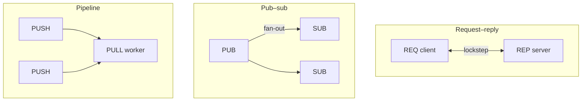

# ZeroMQ 消息模式

**ZeroMQ** 把 **消息模式** 固化在 **socket 类型** 里：开发者通过 **bind/connect** 拼拓扑，而不是向独立 Broker 注册 topic。语义的一手定义见 [ZeroMQ RFCs（spec:28–31 等）](https://rfc.zeromq.org/) 与 [ØMQ Guide](https://zguide.zeromq.org/)；线上字节格式见 [ZMTP 3.0](../../sources/sites/zmq-rfc-zmtp-3.md)。

## 一句话定义

**Brokerless 消息库**：每种 socket 类型规定 **谁先发、是否 fan-out、是否保留 envelope**；传输层（tcp/ipc/inproc）与模式正交，机器人里多用于 **跨进程策略推理** 与 **调试数据流**，不是现场总线。

## 英文缩写速查

| 缩写 | 英文全称 | 简要说明 |
|------|----------|----------|
| ZMQ | ZeroMQ | 本页讨论的库 |
| ZMTP | ZeroMQ Message Transport Protocol | 连接上的帧协议 |
| XPUB/XSUB | Extended PUB/SUB | 带订阅反馈的 pub/sub 变体 |
| DEALER/ROUTER | Dealer / Router | 异步 req/rep 与多跳路由 |
| LWM | High-Water Mark | socket 发送/接收队列高水位（背压） |
| HWM | High-Water Mark | 同上（文档常写 HWM） |

## 为什么重要

- **与 MQTT 对比**：MQTT **必须** Broker + Topic + QoS；ZeroMQ **无** 标准 Broker，Topic 过滤仅在 **SUB socket** 侧以 **prefix filter** 实现，语义更轻、运维责任更在应用侧。
- **与 ROS 2 对比**：ROS 2 图 + DDS **发现与 QoS** 是栈核心；ZeroMQ **不** 提供类似 `/tf` 的全局图，适合 **点对点或少节点** 管道（如 GR00T server）。
- **与 LCM 对比**：LCM 面向 **强类型 log/pub 与低延迟**；ZeroMQ 更 **通用**、语言绑定更广，但 **无** LCM 式统一 type hash 规范，schema 需项目自定。

## 核心原理

### 常见 socket 模式（Guide + RFC 语义摘要）

| 模式 | Socket | 行为摘要 | 机器人典型用途 |
|------|--------|----------|----------------|
| Request–reply | REQ ↔ REP | **严格交替** send/recv；易死锁 | 简单 RPC（单 client） |
| Async RR | DEALER ↔ ROUTER | 多帧 envelope + identity | 多 client 策略 server |
| Pub–sub | PUB → SUB | 广播；**慢 joiner 丢历史** | 状态广播、调试流 |
| Pipeline | PUSH → PULL | 负载均衡 fan-in | 采集 worker 池 |
| Pair | PAIR ↔ PAIR | 1:1  exclusive | 单链路控制 |

### ZMTP：线上成帧与安全

- TCP 字节流 → **length-prefixed frames** + **flags**（multipart）。
- **Greeting** 协商版本；**security mechanism**（PLAIN/CURVE/…）在握手阶段选定。
- 跨语言互通问题优先查 **ZMTP 版本** 与 **CURVE 密钥** 配置，而非仅看应用 payload。

### 进程内 vs 跨机

| 传输 | 场景 |
|------|------|
| **inproc** | 同进程线程间（零拷贝倾向） |
| **ipc** | 同机多进程（仿真 subprocess） |
| **tcp** | GPU 工作站 ↔ 真机/仿真机 |

## 常见误区

- **把 ZeroMQ 当持久化队列**：默认 socket **不** 保证断线重投；需自建持久层或选 Kafka 等。
- **REQ 嵌套 REQ**：lockstep 下易死锁；改用 DEALER/ROUTER 或严格单线程 poll。
- **SUB 刚连上就收首包**：经典 **slow subscriber**；需要 sleep、缓存或 XPUB/XSUB 握手。
- **与 ROS topic 同名即可互通**：载荷与发现层完全不同，需 **桥接节点**。
- **1 kHz 力控走 ZMQ tcp**：延迟与 jitter 通常不满足；伺服仍走 CAN/EtherCAT/LCM/共享内存。

## 与其他页面的关系

- 项目实体与工程清单：[ZeroMQ](../entities/zeromq.md)
- IoT Broker 协议：[MQTT](./mqtt-protocol.md)
- 实时分层选型：[运控中间件指南](../queries/real-time-control-middleware-guide.md)
- 通信 hub：[硬件通信与协议](../overview/hub-communication.md)

## 推荐继续阅读

- [ZeroMQ Guide — Reliable Request-Reply](https://zguide.zeromq.org/)（在线章节）
- [RFC spec:28 REQREP](https://rfc.zeromq.org/spec:28/)
- [RFC spec:29 PUBSUB](https://rfc.zeromq.org/spec:29/)

## 参考来源

- [ZeroMQ 官方网站（一手）](../../sources/sites/zeromq-org-primary-refs.md)
- [ØMQ Guide（一手教程）](../../sources/sites/zguide-zeromq.md)
- [ZMTP 3.0 规范](../../sources/sites/zmq-rfc-zmtp-3.md)
- [libzmq 仓库](../../sources/repos/libzmq.md)
