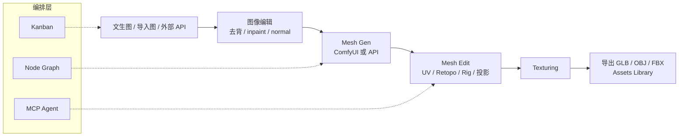
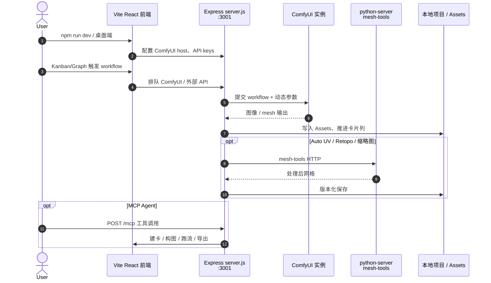

# 3D Gen Studio

**3D Gen Studio**（[visualbruno/3DGenStudio](https://github.com/visualbruno/3DGenStudio)，官网 [3dgenstudio.com](https://www.3dgenstudio.com/)，产品版本 **v2.1.0**）是面向 **AI 驱动 3D 网格生产** 的 **本地优先** 开源工作台：在单一可视化界面中编排 **文生图 → 图像编辑 → 网格生成 → UV / 纹理 → 导出**，原生对接 **ComfyUI** 与外部 REST/GraphQL API，并提供 Kanban、Node Graph、Assets Library、Mesh Editor 与 **MCP Server**。由 **Bruno Fargnoli（visualbruno）** 维护。

## 英文缩写速查

| 缩写 | 英文全称 | 简要说明 |
|------|----------|----------|
| ComfyUI | Comfy UI | 节点式本地扩散/3D 工作流运行时；本工作室的核心生成后端 |
| MCP | Model Context Protocol | 代理工具协议；本应用暴露 `/mcp` 供 LLM 自动化管线 |
| GLB | glTF Binary | 常用二进制 glTF 网格+材质封装，仿真/引擎道具常见交换格式 |
| OBJ | Wavefront OBJ | 经典三角网格交换格式 |
| UV | UV Mapping | 网格表面到 2D 纹理坐标的展开；Auto UV 为其自动化入口 |
| API | Application Programming Interface | 本工作室可挂接 Tripo / 腾讯云等第三方 3D 服务 |
| DCC | Digital Content Creation | 数字内容创作软件；下游常再进 Blender 等精细编辑 |
| PBR | Physically Based Rendering | 基于物理的材质通道；Mesh Editor 纹理/投影流程相关 |

## 核心信息

| 字段 | 内容 |
|------|------|
| 机构 | 三维生成工作室（3D Gen Studio）/ Bruno Fargnoli（visualbruno） |
| 类型 | 本地优先 AI 网格生产工作台（ComfyUI 编排层） |
| 版本 | v2.1.0（2026-07 官网与 `package.json`） |
| 代码 | <https://github.com/visualbruno/3DGenStudio> |
| 许可 | 3D Gen Studio Community License（生成物归用户；禁转售软件本体与付费 SaaS） |

## 为什么对机器人栈重要

1. **场景道具与外观资产瓶颈：** 具身仿真与演示常需要大量 **静态网格道具**（桌椅、物体外壳、背景件）。本工作室把 **ComfyUI 工作流 + 第三方 mesh API** 编排成可复用的 **Images → Mesh Gen → Texturing** 管线，降低「单次黑盒网站生成」的摩擦。
2. **与制造 CAD / 仿真关节资产的选型边界：** 输出是 **GLB / OBJ / FBX 等网格**，适合渲染与粗碰撞近似；**不是** [文字生成 CAD](../concepts/text-to-cad.md) 的 STEP/B-rep，也不是 [Articraft](./articraft.md) / [PhysForge](./paper-physforge-physics-grounded-3d-assets.md) 的 **仿真就绪可关节** 真值——进入 MuJoCo / Isaac 前仍须简化碰撞、惯量与坐标系（见 [Sim2Real](../concepts/sim2real.md)）。
3. **Agent 可自动化：** 内置 MCP（项目、卡片、图、工作流、mesh tools），可与 Claude / Cursor 等宿主批处理资产生成；对照 [FreeCAD MCP](./freecad-mcp.md)（遥控桌面 CAD）与 [CAD Skills](./cad-skills.md)（build123d→STEP），本产品落在 **网格生产编排** 一侧。
4. **Local-first：** 项目与资产落盘本地、可 Git 同步，便于实验室环境复现与离线迭代，避免把中间资产锁进单一云厂商。

## 核心结构 / 机制

| 模块 | 角色 |
|------|------|
| **Kanban Board** | 卡片沿 Images → Image Edit → Mesh Gen → Mesh Edit → Texturing（及 Rigging 等扩展列）流转；每卡可挂 ComfyUI / API 动作 |
| **Node Graph** | 资产依赖与数据流可视化；检查器内联工作流参数，一键启动 |
| **Assets Library** | 统一 Images / Meshes / Workflows；版本追踪；格式徽章（PNG、GLB、OBJ、EXR 等） |
| **ComfyUI Native** | 导入 API 导出的 workflow JSON；动态参数注入；输出链式进入下一阶段（仓库 `comfyui_workflows/` 含 Trellis2、Hy2.1、Qwen Edit、SAM 3.1 等示例） |
| **External API** | REST/GraphQL；Changelog 可见 Tripo AI、Tencent Cloud、Hitem3D 等集成 |
| **Mesh Editor** | Texturing / Modeling / Sculpting / Painting / Displace / Projection；**Auto UV**、**Auto Retopo**、**Auto Rig**（SkinTokens / mesh2motion） |
| **python-server** | 独立 Python 服务：mesh-tools（UV、Retopo、缩略图等） |
| **MCP Server** | 默认 `http://localhost:3001/mcp`；stdio 桥见 `mcp/stdio.js` |
| **Electron Desktop** | 可选桌面安装包（`electron/` + `electron-builder`） |

### 流程总览

### 源码运行时序图

主仓 **已开源**（Community License）。下列时序对齐 README 安装步骤与 `docs/mcp.md` / `python-server` 入口。

关键复现路径：本机起 ComfyUI → `npm install && npm run dev` → 另起 `python-server` → Settings 指向 ComfyUI → 从 Assets 导入示例 workflow → Graph/Kanban 跑通「去背 → Trellis2/Hy 等 mesh」。

## 工程实践

| 项 | 要点 |
|----|------|
| **前置** | Node.js/npm；独立 ComfyUI；可选 GPU（官网示意 RTX 级本地推理） |
| **快速启动** | `git clone` → `npm install` → `npm run dev`；`python-server` 建 venv 后 `python main.py` |
| **工作流导入** | ComfyUI「Export (API)」→ Assets 导入 → 勾选/重命名输入输出类型（Image / Mesh） |
| **Trellis2 注意** | 文档强调需 **透明底图**；先接去背 workflow 再接 mesh 节点 |
| **MCP** | Claude：`claude mcp add --transport http 3d-gen-studio http://localhost:3001/mcp`；远程设 Bearer token |
| **开源边界** | 可改可自用；**禁止**转售软件本体与付费 SaaS 托管；**生成物商用归用户**（以 `LICENSE` 为准） |
| **下游** | 网格进 [Blender](./blender.md) 精修，或进仿真前做碰撞简化；关节化需求另走 Articraft / 手工 URDF |

## 局限与风险

- **不是仿真就绪关节资产：** Auto Rig 面向 **动画骨骼/蒙皮**，不要默认当成 MuJoCo 关节限位与接触几何。
- **不是工业 CAD：** 无 STEP/B-rep/公差叙事；承力件与夹具仍应走 Text-to-CAD / FreeCAD / CAD Skills。
- **依赖外部栈质量：** 网格质量高度依赖所选 ComfyUI 模型与第三方 API；工作室本身是 **编排层**。
- **许可非 OSI 宽松：** Community License 对 **再分发软件本体 / 商业托管** 有硬限制；嵌入产品前须法务阅读 `LICENSE`。
- **运维成本：** 本地 GPU、ComfyUI 节点兼容性、多 workflow 排队延迟（Changelog 曾修过批量排队卡顿）需自行承担。

## 关联页面

- [文字生成 CAD（Text-to-CAD）](../concepts/text-to-cad.md) — 制造向 B-rep/STEP 主线；本页属「网格资产」对照分支。
- [ComfyUI](./comfyui.md) — 本工作室的 **节点生成运行时**（GPL 核心仓 Comfy-Org/ComfyUI）；工作室是编排层。
- [Blender](./blender.md) — 全流程 DCC；常作本工作室导出后的精修宿主。
- [Articraft](./articraft.md) — 程序化 agent → **仿真就绪可关节** 资产；目标不同于静态 mesh 生产。
- [img2threejs](./img2threejs.md) — 单图 → **程序化 Three.js 代码工厂**；同属视觉 3D 资产，但产物是 TS 而非 GLB 黑盒网格。
- [FreeCAD MCP](./freecad-mcp.md) — MCP 遥控桌面 CAD；与本页 MCP 网格编排形成「CAD vs mesh studio」对照。
- [CAD Skills](./cad-skills.md) — Agent Skills 形态的 STEP/URDF 制造链。
- [PhysForge](./paper-physforge-physics-grounded-3d-assets.md) — 学习式物理接地 3D 资产。
- [SCULPT](./paper-sculpt-subtractive-3d-part-generation.md) — **TRELLIS.2 减法式部件生成**；Comfy 管线可接整对象 mesh，但 SCULPT 的 latent subtractive 分解需官方代码（截至入库日未开源）。
- [EmbodiedGen V2](./paper-embodiedgen-v2-sim-ready-world-engine.md) — 具身仿真就绪世界引擎（场景/资产尺度不同）。
- [Sim2Real](../concepts/sim2real.md) — 几何与动力学一致性提醒。

## 参考来源

- [3D Gen Studio 官网归档](../../sources/sites/3dgenstudio-com.md)
- [visualbruno/3DGenStudio 仓库归档](../../sources/repos/3dgenstudio.md)

## 推荐继续阅读

- [3D Gen Studio 官网](https://www.3dgenstudio.com/)
- [GitHub — visualbruno/3DGenStudio](https://github.com/visualbruno/3DGenStudio)
- [仓库内 MCP 文档（docs/mcp.md）](https://github.com/visualbruno/3DGenStudio/blob/main/docs/mcp.md)
- [ComfyUI（本库实体页）](./comfyui.md)
- [ComfyUI 官方仓库](https://github.com/Comfy-Org/ComfyUI)
