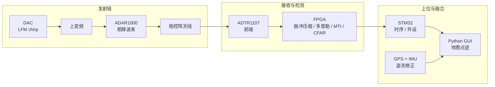

# AERIS-10（PLFM_RADAR）

**AERIS-10** 是 GitHub 上高关注度的 **开源脉冲线性调频（PLFM）相控阵雷达** 全栈：从原理图、PCB、FPGA 固件到 Python 可视化一应俱全，适合研究 **波束赋形、脉冲压缩、多普勒检测** 或评估 **主动雷达 vs LiDAR** 在野外机器人/无人机上的感知取舍。

## 英文缩写速查

| 缩写 | 英文全称 | 简要说明 |
|------|----------|----------|
| PLFM | Pulse Linear Frequency Modulation | 脉冲线性调频，雷达 chirp 波形 |
| LFM | Linear Frequency Modulation | 线性调频，脉冲压缩常用波形 |
| CFAR | Constant False Alarm Rate | 恒虚警率检测，FPGA 片上实现 |
| MTI | Moving Target Indication | 动目标指示，抑制静止杂波 |
| FPGA | Field-Programmable Gate Array | 可编程门阵列，承担实时信号处理 |
| GPS | Global Positioning System | 全球定位，GUI 地图中心与点迹地理标注 |
| IMU | Inertial Measurement Unit | 惯性测量单元，俯仰/横滚修正目标坐标 |

## 为什么重要

- **成本与开放度**：相对商用相控阵雷达，提供可制造、可修改的 **10.5 GHz** 参考设计（硬件 CERN-OHL-P + 软件 MIT），降低 SDR/雷达教学与原型门槛。
- **机器人相关场景**：README 明确面向 **大学研究者、无人机创业团队、高级 maker**；可与 [PX4](../entities/px4-autopilot.md) 伴机或地面机器人导航实验组合，但 **不替代** [FAST-LIO](../entities/fast-lio.md) 等 LiDAR SLAM 栈——二者测距原理、角分辨率与 ROS 生态成熟度不同。
- **片上信号处理示范**：FPGA 完成 chirp 生成、脉冲压缩、多普勒 FFT、MTI、CFAR，是理解 **感知前端算力边界** 的硬件案例（对比纯 CPU/GPU 点云管线）。

## 核心结构/机制

| 子系统 | 关键器件 / 职责 |
|--------|------------------|
| 波形与 RF | DAC 生成 LFM chirp；LTC5552 上下变频；ADF4382 频率合成 |
| 波束赋形 | 4× ADAR1000 四通道相移器，16 元电子扫描 **±45°** |
| 收发前端 | 16× ADTR1107 LNA/PA；Extended 版 16× GaN 功放（约 10 W×16） |
| 实时处理 | XC7A50T FPGA：I/Q 下变频、抽取/滤波、脉冲压缩、多普勒、CFAR |
| 系统管理 | STM32F746：上电时序、外设、混合 AGC（FPGA/STM32/GUI） |
| 地理姿态 | UM982 GPS + GY-85 IMU + BMP180；点迹地图叠加 |
| 人机界面 | Python 3.8+ GUI，实时点迹与地图 |

### 双版本对照

| 参数 | AERIS-10N（Nexus） | AERIS-10X（Extended） |
|------|-------------------|----------------------|
| 最大距离 | 3 km | 20 km |
| 天线 | 8×16 贴片阵列 | 32×16 缝隙波导阵列 |
| 发射功率 | ~1 W × 16 | ~10 W × 16（GaN） |

## 流程总览

## 常见误区或局限

- **不是即插即用 ROS 2 传感器**：无官方 `sensor_msgs`/`nav2` 桥接；接入 [导航栈总览](../overview/navigation-slam-autonomy-stack.md) 需自建驱动、时间同步与 `tf`。
- **Alpha 状态**：功能与文档仍在迭代；硬件组装需 RF/PCB 经验，Extended 版涉及 **高功率 RF** 安全与法规（频段、辐射合规需自行确认）。
- **与 LiDAR 分工不同**：雷达擅长 **远距离动目标与全天候测距**，角分辨率与稠密建图通常不如旋转 LiDAR；不宜直接等同 [LiDAR SLAM 选型](../comparisons/lidar-slam-lio-vio-selection.md) 中的 LIO 方案。
- **仿真缺口**：本库 [多旋翼仿真栈](../overview/multirotor-simulation-planning-control-stack.md) 以 AirSim/PyBullet 为主，**不含** 相控阵雷达物理仿真；算法验证多依赖本仓库自带仿真报告（`docs/`）或实测。

## 参考来源

- [sources/repos/plfm_radar.md](../../sources/repos/plfm_radar.md)
- [NawfalMotii79/PLFM_RADAR](https://github.com/NawfalMotii79/PLFM_RADAR)
- [项目文档（GitHub Pages）](https://NawfalMotii79.github.io/PLFM_RADAR/docs/)

## 关联页面

- [导航·SLAM·自动驾驶开源栈总览](../overview/navigation-slam-autonomy-stack.md)
- [多旋翼仿真—规划—飞控开源栈总览](../overview/multirotor-simulation-planning-control-stack.md)
- [状态估计（专题汇总）](../overview/topic-state-estimation.md)
- [野外机器人排障指南](../queries/field-robotics-troubleshooting.md)

## 推荐继续阅读

- [System Architecture（官方）](https://NawfalMotii79.github.io/PLFM_RADAR/docs/architecture.html)
- [Hardware Bring-Up Guide（官方）](https://NawfalMotii79.github.io/PLFM_RADAR/docs/bring-up.html)
