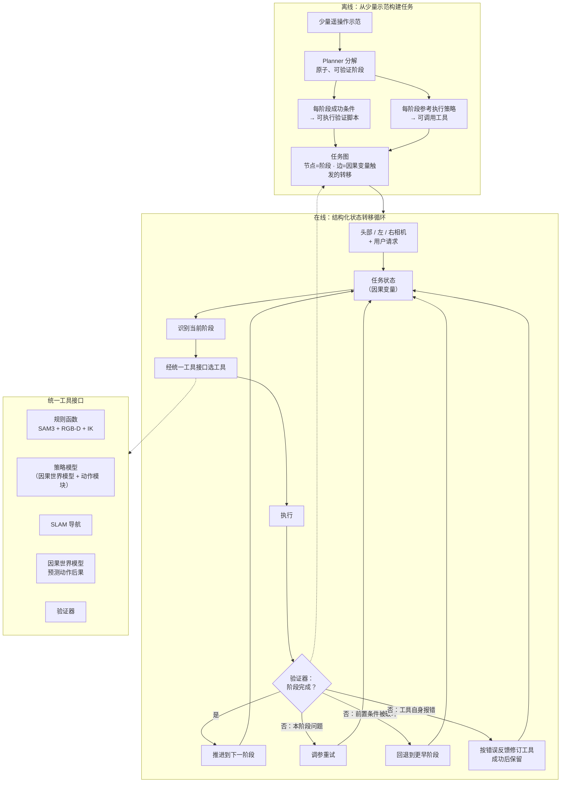

# CRIS-0：因果驱动的真实世界机器人智能系统（Aether AI）

| 字段 | 内容 |
|------|------|
| **机构** | Aether AI（aetherlabs.ai；创始人黄碧薇 Biwei Huang，UCSD 助理教授） |
| **类型** | 产业官方技术博文 + 新闻稿 + 媒体报道（非 peer-reviewed，无论文 / arXiv） |
| **系统** | CRIS-0 = Causal Robotic Intelligence System |
| **发布** | 2026-10-08（官方博文 / News / Business Wire）；量子位报道 2026-10-09 |
| **作者** | Lingjun Mao、Lukun He、Jinglin Cao、Wenpeng Xu（†）等 21 人，末位 Kun Zhou\*、Biwei Huang |
| **开源** | **未开源**（无代码 / 权重 / 数据链接；2026-10-10 核查官方页与 Hugging Face） |

> **区分：** 本页是 **CRIS-0 系统级** 页面——智能体 + 世界模型如何组成真实机器人闭环。其中世界模型本体见 [CausalWM](./paper-causalwm.md)；媒体称智能体层的前序研究是软件环境中的 [RSIAgent](./aether-rsiagent.md)；公司与时间线见 [Aether AI](./aether-ai.md)。

## 一句话定义

**CRIS-0** 是 Aether AI 的真实世界机器人系统：用一组 **显式因果变量** 表示「任务进行到哪一步」，由 **因果引导机器人智能体** 从少量遥操作示范中自动拆出可验证阶段、验证脚本和可调用工具（规则函数 / 学习策略 / SLAM 导航 / 因果世界模型），再沿 **任务图** 循环「识别阶段 → 选工具 → 执行 → 验证 → 重试或重规划」，失败时回退到受影响阶段甚至自动修补工具代码。

## 英文缩写速查

| 缩写 | 英文全称 | 简要说明 |
|------|----------|----------|
| CRIS-0 | Causal Robotic Intelligence System (v0) | 本页主体：因果智能体 + 因果世界模型的机器人系统 |
| CausalWM | Causal World Model | Aether 的因果世界模型；CRIS-0 中用于预测动作后果并作为策略骨干 |
| WAM | World Action Model | 世界模型 + 动作头；博文 3.2 节「Causal World Action Model」即此类 |
| VLA | Vision-Language-Action | 端到端视觉-语言-动作模型；媒体用作「误差累积」的对照路线 |
| LLM | Large Language Model | 媒体所说「常见 Agent 方案」的推理核心；CRIS-0 planner 底座未披露 |
| SLAM | Simultaneous Localization and Mapping | CRIS-0 工具箱中的导航工具 |
| IK | Inverse Kinematics | 规则函数把目标末端位姿转为关节构型；IK 越限是工具自修复的典型触发 |
| SAM3 | Segment Anything Model 3 | 规则函数用于定位目标（如锅把手）的分割模型 |
| RGB-D | Color + Depth image | 规则函数的感知输入 |

## 为什么重要

- **把「任务进度」显式化为因果状态：** 与端到端 [VLA](../methods/vla.md) 隐式地在网络里记住进度不同，CRIS-0 每个阶段都有命名变量（如 `cloth_grasped`、`corner_offset_cm`、`slippage_detected`）和可执行的成功判据，扰动发生时可以 **定位到哪一阶段失效、回退到哪里**——这是长程任务防止误差累积的结构性手段。
- **工具化的混合执行栈：** 自由空间运动用「SAM3 + RGB-D + IK」生成的规则函数，接触丰富阶段才交给学习策略，按按钮这类两可阶段两者同时暴露、运行时挑选。这是对「单一策略包打天下」的明确反向取舍，与 [行为树 + VLA 编排](../concepts/behavior-tree-vla-orchestration.md)、[SayCan](./paper-saycan.md) 一脉的分层思路相近，但阶段与工具是 **从示范自动生成** 的。
- **工具会被自修补并沉淀：** IK 越限等工具级错误会按报错修订代码，成功后保留；成功恢复路径写回任务图——这是把编码智能体的「试错 + 修复」搬到真机上的一种做法（对照 [LLM 机器人控制接口](../concepts/llm-robotics-control-interfaces.md)）。
- **世界模型同时用于预测和控制：** 因果世界模型按「当前状态 → 因果变量转移 → 未来像素」预测，再加动作模块变成策略（[World Action Models](../concepts/world-action-models.md) 路线），让 planner 能问「这个动作能否带来预期的状态转移」。
- **产业信号：** 一家以因果发现为学术根基的初创公司首次把因果智能体 + 世界模型放到真实家居机器人上公开演示；公司自报约 2000 万美元融资、约 20 人团队（新闻稿）。

## 流程总览

> 图中「失败三分支」按官方博文 Failure Recovery 段绘制（重试 / 回到早期阶段 / 修订工具）；量子位报道的「重试 → 重规划 → 人工介入」三级口径见下文「来源差异」。

## 核心原理

### 1. 统一状态：任务阶段 = 一组因果变量

博文以对齐桌布角为例：

| 变量 | 回答的问题 | 决定什么 |
|------|-----------|----------|
| `cloth_grasped` | 布是否真被抓住？ | 能否开始拉；否则任务状态退回抓取阶段 |
| `corner_offset_cm` | 角点离目标还有多远？ | 拉的方向与距离；何时判定阶段完成 |
| `slippage_detected` | 拉动中是否滑脱？ | 继续，或先重抓 |

工具输入统一为 `stage` + `state` + `target` 三段 JSON（如 `"target": {"corner_offset_cm": [0, 0]}`）。本库读法：这相当于为每个阶段写了一个 **低维、可读的状态机状态**，与 [机器人安全状态机](../concepts/robot-safety-state-machine.md) 同形，但变量由智能体从示范中提取（推测：提取过程依赖基础模型，博文未披露 planner 用的是哪个模型）。

### 2. 统一工具接口

| 工具 | 来源 | 适用阶段 |
|------|------|----------|
| **规则函数**（如 `rule.position_gripper(target=...)`） | 智能体生成：从示范阶段末提取夹爪 / 手臂相对目标物体的位姿，运行时用 [SAM3](./paper-sam3.md) + RGB-D 定位、施加相对位姿、IK 求关节 | 自由空间接近 / 预定位 |
| **技能策略**（如 `policy.skill(label="grasp")`） | 自家策略模型，以因果世界模型为基础 | [接触丰富操作](../concepts/contact-rich-manipulation.md)（稳定抓锅把手、折布） |
| **SLAM 导航** | 导航模块 | 移动到任务所需位置 |
| **因果世界模型** | Aether 世界模型 | 预测候选动作的后果 |
| **验证器** | 每阶段的可执行验证脚本 | 判定阶段完成，驱动重试 / 重规划 |

饮料示例说明分工：planner 依用户「健身目标」选中可乐 → 规则函数把夹爪移到附近、给策略一个好的起始位姿 → 策略只做局部抓取，**不需要理解整体任务或推断用户意图**。

### 3. 任务图与失败恢复

- **构建四步：** 少量遥操作示范 → 分解为原子可验证阶段（区分自由空间 vs 接触）→ 每阶段可观测成功条件（可执行验证脚本）→ 每阶段参考执行策略封装为工具。阶段按依赖与转移条件连成任务图，边由 **关键因果变量的变化** 触发。
- **清理桌布示例：** 01 推布出桌沿（规则；判据「伸出约 5 cm」，循环至满足）→ 02 定位夹爪（规则）→ 03 抓取并微调（策略；验证失败回 02）→ 04 折叠（策略）→ … → 07 放入篮子（规则）。
- **恢复三路径（官方）：** 调参重试本阶段；回到更早阶段恢复必要前置条件；依错误反馈修订工具实现。每次恢复本身也要验证；成功路径并入任务图，修订后的工具留作复用。
- **博文示例轨迹（标注 Illustrative）：** 抓锅时锅被移开 → `verify(grasp_secure)` 失败 → 任务回退到 approach → 重新定位时 IK 越限 → 依报错 patch `rule.position_gripper` → 抓取验证通过 → 保留修订版工具。

### 4. 因果世界模型：预测 + 策略

- **预测：** 给定当前观测与候选动作，先估计关键中间状态（因果变量）如何变化，再据此生成未来画面：**当前状态 → 因果变量转移 → 未来像素观测**。博文展示 6 段生成视频（递杯给人、叠衬衫、瓶子放抽屉、摆盘、红球换层、双手传递）。
- **策略（Causal World Action Model）：** 在世界模型骨干上加动作模块，把共享表示映射为可执行控制；策略因此「继承」世界模型学到的结构化未来理解，而非只看当前观测出动作。详见 [CausalWM](./paper-causalwm.md)。
- **注意：** 官方博文只称「Causal World Model」，未写「CausalWM」，也未说明与 2026-09-19 发布的 CausalWM 是否同一版本；新闻稿与量子位将两者等同。
- **与智能体的闭环（新闻稿口径）：** 世界模型预测指导工具选择、执行结果回馈世界模型更新状态。官方博文没有写出这一双向回路，只说世界模型是一个可调用工具并作为策略基础。

## 评测与结果

### 官方博文：五类场景视频（无数字）

| 能力 | 演示场景 | 播放速度 |
|------|----------|----------|
| 抗扰动 | 抓取前咖啡袋被移；倒粉前磨豆机被移；盘中被放入苹果→微波前先移除；手靠近微波炉门→后撤避免夹手；强闪烁灯光下倒咖啡豆 | 1× |
| 长程自主 | 一次连续运行整理整张杂乱茶几 | 10× |
| 个性化 | 「拿饮料」按用户偏好选不同饮料（2 场景） | 1× |
| 上下文推理 | 空罐扔掉、未开封罐放托盘；书放茶几、私人账单放抽屉 | 2× / 1× |
| 复杂操作 | 换桌布：折旧布入篮、取新布铺平 | 1× |
| 泛化 | 「蛋糕装盒」技能迁移到「苹果放盘」 | 约 1× |

### 定量数字（仅见于新闻稿 / 媒体，**自报**）

| 测试 | Business Wire（2026-10-08） | 量子位（2026-10-09） |
|------|------------------------------|----------------------|
| 咖啡任务抗干扰 | 咖啡豆倒粉 + 研磨中被人为干扰，平均约 **2 s** 重规划 | Coffee Preparation：平均 **2 s** 内识别变量变化并重规划，**10 次随机扰动 9 次有效恢复** |
| 安全停 | 微波炉场景检测到安全风险后，平均 **0.2 s** 内停止或改计划 | 关微波炉门时人手伸入，**0.2 s** 急停 |
| 个性化抓放 | 需推理的复杂模糊提示下成功率 **90%** | Personal Pick and Place：**20 条** 模糊指令 **18 次** 成功 |
| 长程整理 | 未给数字 | 「数十甚至上百步」不崩溃（定性） |

- 两份媒体口径相互一致（18/20 = 90%；0.2 s 一致）；**9/10 只见于量子位**。本次核查的三份来源均 **未出现 0.1 s**。
- 无基线、无试次分布、无失败案例统计；「平均 2 s」的计时起止点未说明。

## 工程实践

| 项 | 实践要点 |
|----|----------|
| **阶段化 + 可执行验证** | 每个阶段写可观测成功条件并由脚本验证（如「布伸出桌沿约 5 cm」）；先验证再推进，局部失败不外溢 |
| **工具分工** | 自由空间段用「感知分割 + 示范相对位姿 + IK」的确定性函数，只在接触段用学习策略；两可阶段两种工具都暴露、由 planner 选 |
| **给策略好的起点** | 规则函数负责把末端送到预抓取位姿，策略只学局部技能——降低策略对全局任务理解与意图推断的需求 |
| **失败分型** | 区分「环境变了」（回退阶段）、「本阶段没做好」（调参重试）、「工具本身有 bug」（改代码并保留）三类，分别处理 |
| **安全条件放进阶段定义** | 媒体解读：同样是「人手出现」，关门阶段是危险变量、递水阶段是交互目标——安全判断依阶段语义而定（对照 [Safety Filter](../concepts/safety-filter.md)） |
| **选型** | **不可下载 / 不可复现**；想复现类似结构可参考开源的行为树编排、SayCan 类 affordance 规划或编码智能体控制方案 |
| **源码运行时序图** | **不适用**（未开源，无代码 / 权重 / 技术报告） |

## 与其他工作对比

只列来源本身做的对照（量子位报道观点），外加本库定位：

| 维度 | 端到端 VLA（报道口径） | LLM / 多模态 Agent（报道口径） | **CRIS-0** |
|------|------------------------|-------------------------------|------------|
| 任务进度表示 | 隐式于网络；遇干扰「不知道发生了什么」 | 把画面转为文本再推理 | 显式因果变量 + 任务图 |
| 长程误差 | 逐步累积 | 有步骤拆解 | 每阶段验证后推进，回退到受影响阶段 |
| 反应速度 | — | 报道称推理慢，难以及时避险 | 自报 0.2 s 安全停、2 s 重规划 |
| 执行器 | 单一策略 | 调用技能 / API | 规则函数、策略、SLAM、世界模型、验证器按阶段选用 |
| 证据等级 | — | — | 公司博文 + 新闻稿 + 媒体；无同任务基线数字 |

- 官方博文本身 **没有** 直接点名对比 VLA 或 LLM 智能体，只说「单一策略难以端到端处理的操作」可被拆成子问题。上表前两列是量子位的叙事，不是实验结论。
- 本库定位（推测）：CRIS-0 更接近「示范驱动的任务分解 + 工具化执行 + 验证闭环」的工程系统，与 [行为树 + VLA](../concepts/behavior-tree-vla-orchestration.md) 的分层编排、[SayCan](./paper-saycan.md) 的技能选择同属分层范式；差异点在于 **阶段 / 验证器 / 工具由智能体从示范自动生成并可自修**，以及世界模型以「因果变量转移」为中间表示。

## 局限与风险

- **证据等级低：** 官方博文 **零定量指标**；所有数字来自新闻稿（明注「according to the company」）与媒体转述，属 **自报**，无评测协议、无基线、无第三方复核。
- **来源细节不一致：**
  - 恢复层级：官方是「调参重试 / 回退早期阶段 / 修订工具」；量子位是「重试 → 重规划 → 人工介入」。官方博文未提人工介入。
  - 咖啡任务被移物：官方视频是「咖啡袋」「磨豆机」；量子位写「咖啡机」「把手相对位姿」。
  - 量子位称机器人会 **抓起晃动** 饮料罐判断是否空罐，官方视频说明只写「空罐扔掉、未开封罐放托盘」，未提晃动。
  - 量子位称系统在世界模型中「排练」确认后再调用 Action Head；官方博文只说世界模型可被调用、并作为策略基础，未描述每步排练流程。
- **关键细节未披露：** 机器人平台型号（博文只提头部 + 左右三路相机，且有双手 / 移动导航）、planner 所用基础模型、策略模型训练数据规模、每个任务需要多少条示范（只说「a small set」）、单任务构建耗时。
- **适用边界（推测）：** 阶段与验证器依赖可从视觉 / 深度中可靠读出的低维变量；对难以写出可观测判据的任务（如精细力控、透明 / 高反光物体）验证器本身可能成为瓶颈。工具代码自修补在真机上的安全边界也未说明。
- **闭源：** 不可下载、不可复现；引用时应与可复现研究分栏标注。

## 关联页面

- [Aether AI（公司入口）](./aether-ai.md)
- [CausalWM（因果世界模型）](./paper-causalwm.md) — CRIS-0 的世界模型 / 策略骨干
- [RSIAgent](./aether-rsiagent.md) — 媒体称智能体层的前序研究（软件环境）
- [VLA](../methods/vla.md) — 媒体对照的端到端路线
- [World Action Models](../concepts/world-action-models.md) — 「世界模型 + 动作模块」作策略
- [LLM 机器人控制接口](../concepts/llm-robotics-control-interfaces.md) — 抽象层级决定 LLM 能否控制机器人
- [行为树与 VLA 编排](../concepts/behavior-tree-vla-orchestration.md) — 可恢复的分层任务结构
- [SayCan](./paper-saycan.md) — 语言规划 + 技能可行性选择
- [SAM3](./paper-sam3.md) — 规则函数中的分割模块
- [Contact-rich Manipulation](../concepts/contact-rich-manipulation.md)
- [机器人安全状态机](../concepts/robot-safety-state-machine.md)
- [Manipulation](../tasks/manipulation.md)

## 参考来源

- [CRIS-0 官方博文 + 新闻稿 + 量子位（来源归档）](../../sources/blogs/aether_cris_0.md)
- 官方博文：<https://aetherlabs.ai/articles/real-world-autonomous-robotic-system-with-causality-driven-agent-and-world-model.html>
- 官方 News：<https://aetherlabs.ai/news.html>
- Business Wire（Morningstar 转载）：<https://www.morningstar.com/news/business-wire/20261008233217/aether-ai-brings-causal-intelligence-into-the-physical-world>
- 量子位：<https://www.qbitai.com/2026/10/502411.html>

## 推荐继续阅读

- [Aether AI Blog 索引](https://aetherlabs.ai/blog.html) — CRIS-0 之前的 CausalWM、RSIAgent 等系列博文
- Ahn, M., et al. (2022). *Do As I Can, Not As I Say: Grounding Language in Robotic Affordances* — 分层「语言规划 + 技能」范式的起点
- Liang, J., et al. (2023). *Code as Policies: Language Model Programs for Embodied Control* — 由模型生成机器人可执行函数的代表工作
