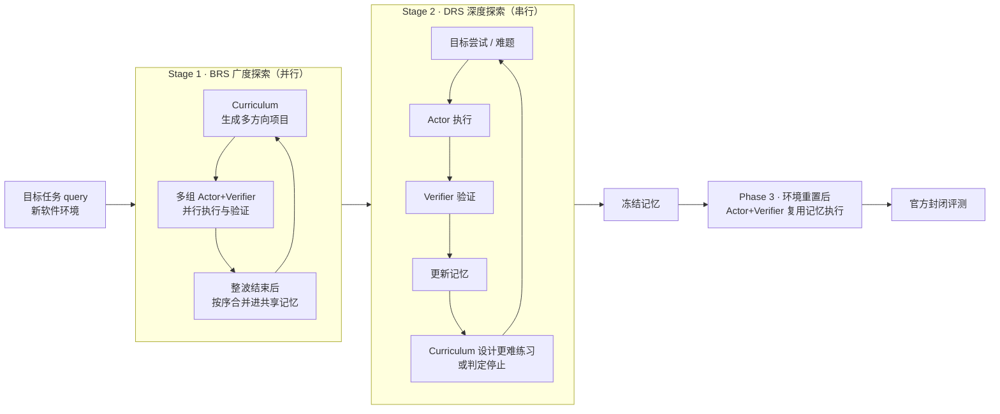
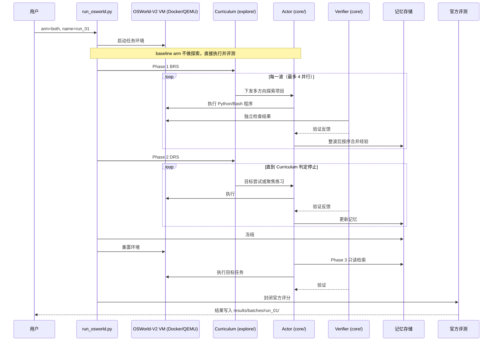

# RSIAgent：新环境中的自主探索式递归自改进

**RSIAgent**（*Autonomous Exploration for Recursive Self-Improvement in New Environments*，[arXiv:2609.15364](https://arxiv.org/abs/2609.15364)，[官方博客](https://aetherlabs.ai/articles/rsiagent-autonomous-exploration-for-recursive-self-improvement.html)，[项目页](https://aetherlabsai.github.io/RSIAgent/)，[代码](https://github.com/AetherLabsAI/RSIAgent)）由 **以太智能（Aether AI）** 联合 **加州大学圣地亚哥分校（UCSD）** 与 **伊利诺伊大学芝加哥分校（UIC）** 提出，作者 Sibo Zhu、Shicheng Fan、Xinyue Wang、Wenyi Wu、Kun Zhou（通讯）、Biwei Huang。它是一个 **免训练** 的多智能体框架：让开源大模型进入陌生软件后自己出题、动手、验证，把「动作–条件–结果」的因果经验写进记忆，记忆冻结后直接复用于正式任务。

> **评测范围提醒：** RSIAgent 论文的所有实验都在 **软件 / 计算机使用（computer-use）** 环境（OSWorld 2.0、Agents' Last Exam、GameCraft-Bench）中完成，**没有机器人或物理世界实验**。它与机器人的关系在于：Aether 后续机器人系统 [CRIS-0](./aether-cris-0.md) 的「Causality-guided Robot Agent」被媒体报道为以 RSIAgent 这类因果智能体研究为前序（RSIAgent 论文本身未提及机器人），见下文「与机器人系统的关系」。

## 一句话定义

**模型参数不动，让智能体在新环境里先广后深地自主练习、用真实执行结果验证，再把验证过的因果经验沉淀为冻结记忆，下一次直接带着经验上场。**

## 英文缩写速查

| 缩写 | 英文全称 | 简要说明 |
|------|----------|----------|
| RSI | Recursive Self-Improvement | 递归自改进；本文指不改权重、靠记忆迭代变强 |
| RSIAgent | Autonomous Exploration for Recursive Self-Improvement Agent | 本文框架名；项目页副标题「Causality-driven RSI Agent v1」 |
| BRS | Broad Recursive Self-exploration | 第一阶段：多方向并行探索，类比预训练 |
| DRS | Deep Recursive Self-exploration | 第二阶段：围绕难点串行加难，类比后训练 |
| ALE | Agents' Last Exam | 计算机使用基准，本文用 Near-term 67 题子集 |
| GUI | Graphical User Interface | OSWorld 类任务的操作对象 |
| CRIS-0 | （Aether 机器人系统名） | 其因果引导机器人智能体被报道以 RSIAgent 为前序研究 |

## 为什么重要

- **把「适应新环境」从重训换成练习：** 企业软件、私有工具链难以采集公开数据，频繁微调也不现实；RSIAgent 证明（在其设定下）只靠探索 + 记忆就能把开源模型在 OSWorld 2.0 上的 partial 分数再抬 **7.01** 个点（自报）。
- **「Scaling Experience」叙事：** Aether 把它定位为模型规模之外的另一条扩展轴——参数固定，扩展的是探索轮次与经验记忆。这与 [递归自改进](../concepts/recursive-self-improvement.md) 讨论里「记忆层 RSI」最低一层的持久改进相对应（见 [RSI 四层标准](../queries/rsi-four-tier-five-pushes.md)）。
- **因果视角的记忆：** 与只存轨迹的经验回放不同，作者强调记忆里存的是「哪个操作在什么条件下导致什么结果」，这正是 Aether 团队（Biwei Huang 长期做因果发现）把因果学习带进智能体的落点，也是其机器人系统叙事的上游。
- **对具身研究者的参考价值（推测）：** 「出题–执行–独立验证–记忆合并」的环路与 [Physical RSI](./physical-rsi.md) 等具身 harness 自进化工作结构相近，但 RSIAgent 改的是记忆而不是 harness 代码，可作为对照基线理解。

## 核心原理

### 三个角色

| 角色 | 输入 | 职责 | 默认模型（项目页） |
|------|------|------|--------------------|
| Curriculum Agent | 目标 query、已有结果、记忆（发布版为只读视图） | 决定下一步练什么；判断是否还值得继续练 | Kimi-K3 |
| Actor Agent | 任务 + 记忆 + 视觉观测 | 用可执行 Python / Bash 程序操作软件（code as policy）；验证后蒸馏经验并与已有记忆调和 | GLM-5.3 |
| Verifier Agent | 任务要求 + 环境结果 | 独立检查结果是否真的完成；**读不到** Actor 的私有推理与记忆 | Kimi-K3 |

三者上下文相互独立；官方基准评分始终在学习环之外，不进入任何 agent 的提示或记忆（README 称审计文件只留在宿主机）。

### 流程总览

- **BRS（类比预训练）：** 一次出多个方向的探索项目（换工具、换交互方式、换输入条件），快速铺开「环境知识地图」。默认名义预算 **8 个项目、最多 4 个并行**，每波完成后检查预算。
- **DRS（类比后训练）：** 从较难任务出发，根据刚暴露的失败与弱点设计更难的练习，逐轮推进，类似自动化压力测试；Curriculum 认为无需再练即停。
- **测试期：** 记忆冻结，Curriculum 与记忆更新关闭，Actor 与 Verifier 沿用同一套「动作–验证」环路执行。

### 记忆里存什么

README 描述为「过程、脚本与失败教训」；博客与摘要强调其中的 **动作–条件–结果因果关系**。成功与失败都可以成为教训。案例：REAPER 音频任务中，DRS 发现预拼接音频与原生编辑的采样不一致，于是修正了记忆中的渲染重采样设置（`RENDER_RESAMPLE 0 0 0`），测试期直接复用该设置。

## 源码运行时序图

依据 README 的 OSWorld 路径（`run_osworld.py --arm both`）整理；ALE 路径对应 `run_ale.py prepare / smoke / run / report`。

## 实验与评测

### 主结果（自报，单位 %）

| 模型 / 方法 | OSWorld 2.0 Partial | OSWorld 2.0 Binary | ALE Partial | ALE Binary |
|-------------|--------------------:|-------------------:|------------:|-----------:|
| Kimi-K3（单模型） | 58.30 | — | 71.60 | 40.30 |
| Claude Opus 5 | 70.19 | 34.72 | 79.54 | 46.27 |
| GPT-6 Astra | 72.60 | — | 82.26 | **52.24** |
| RSIAgent（w/o RSI） | 71.97 | 37.80 | 83.75 | 49.25 |
| **RSIAgent** | **78.98** | **42.68** | **84.82** | 50.75 |

- OSWorld 2.0 为 0808 offline 82 题；ALE 为 Near-term 67 题。Partial = 平均任务得分，Binary = 整题全对率。
- RSI 增益：OSWorld partial **+7.01**、binary **+4.88**；ALE partial **+1.07**、binary **+1.50**（全对 33 → 34 题）。
- 对比基线大多取自各家官方报告或榜单（论文 2026-09-11 快照），**不是匹配预算、同 harness 的对比**。

### 聚合口径（必须看）

- OSWorld RSI 行中只有 **41/82** 题是真正跑过 RSI 的结果，其余 41 题沿用基线分；T082 安装失败计 0。
- ALE RSI 行中只有 **19/67** 题是 RSI 分，48 题沿用基线；含本地修正评分、ECG 公共标签迁移和一个去掉 BRS 的 Tax Form 变体。
- RSI 列包含挑选的重试与不同预算的 checkpoint，**不是**匹配重复运行的平均（README 原话的归纳）。

### 消融（4 题探索性子集，partial 0–1）

| 任务 | w/o RSI | w/o DRS | w/o BRS | Full RSI |
|------|--------:|--------:|--------:|---------:|
| T080 WPS 表格修复 | 0.05 | 0.55 | 0.60 | 0.69 |
| T085 REAPER 音频编辑 | 0.68 | 0.91 | 0.60 | 0.94 |
| T089 浏览器演示文稿修复 | 0.68 | 0.77 | 0.64 | 0.81 |
| T106 3D Slicer 肝脏分割 | 0.36 | 0.39 | 0.42 | 0.54 |

四题均是 Full RSI 最高；但这 4 题是 **按已记录改进挑选** 的，且 deep-only 条件（空记忆起步、最多 2 个练习项目）与发布版默认设置不同。

### 其他实验

- **RSI 轮次：** 随记忆 checkpoint 推进分数持续上升；简单任务几轮收敛，部分初始 0–40% 的任务最终到 100%（代表性任务，自报）。
- **GameCraft-Bench 游戏开发：** Overall 分在三个生成器上都提升，如 Kimi-K2.6 31.28 → 46.37、GLM-5.3-Flash 30.55 → 48.72（自报；关联项目 RSIGame，arXiv:2609.39045）。

## 与其他工作对比

| 工作 | 改什么 | 反馈来源 | 评测环境 |
|------|--------|----------|----------|
| **RSIAgent** | 冻结前的经验记忆（过程 / 脚本 / 因果教训） | 独立 Verifier + 真实执行结果 | 软件 / 计算机使用 |
| [Physical RSI](./physical-rsi.md) | 可执行 harness 代码（路由、技能、工具组合） | 具身 rollout 评测，达尔文式选择 | 机器人仿真（RoboDojo） |
| [MetaRSI-v1](./paper-metarsi-v1.md) | 数据 / harness / 模型三类算子 | 无外部 teacher 的闭环评估 | 代码与科学问题 |
| [RRSI](./paper-rrsi-2609-24972.md) | 冻结模型上的开放 harness 编辑 | 提案与筛选正则化 | 多域基准 |
| [Dream-RSI](./paper-dream-rsi.md) | 探索策略（discovery history 回放） | dream 筛选 | 多域任务 |

RSIAgent 的位置：在 [RSI 四层标准](../queries/rsi-four-tier-five-pushes.md) 中属于「记忆层持久改进 + 有界闭环」，不改权重、不改 harness，也不声称开放式自改进。

## 结论

**RSIAgent 证明的是「同一组开源模型 + 好的 harness + 针对目标环境的自主练习」能在计算机使用基准上拿到很高的 partial 分数；RSI 本身的贡献比标题数字小，也只在软件环境里得到验证。**

1. **先分清增益来源** — Kimi-K3 单模型 58.30 → RSIAgent w/o RSI 71.97（+13.67）来自多智能体 harness 与代码动作；RSI 再加 +7.01。ALE 上 RSI 只加 +1.07。
2. **「超越 GPT-6 Astra」只在 partial 上成立** — ALE binary 50.75 仍低于 GPT-6 Astra 的 52.24；对比也不是同预算。
3. **这是测试期针对性练习** — Curriculum 在两个探索阶段都能看到目标 query，记忆是为目标环境 / 任务建的，不能当作零样本泛化读。
4. **聚合混入了大量基线分** — 一半 OSWorld 题、近 3/4 ALE 题沿用基线，读数字时要按「部分任务改进 + 未动部分」理解。
5. **独立 Verifier 是关键设计** — Verifier 看不到 Actor 的推理与记忆，减少自我确认；但作者自己承认验证可能放过不完整结果。
6. **可复现性好于多数同类工作** — Apache-2.0 代码、两个批处理入口、`--dry-run` 与 smoke 检查齐全；但完整复现需要大量 VM 存储与付费模型 API。

## 局限与风险

- **无机器人实验：** 论文只在 OSWorld 2.0、ALE、GameCraft-Bench 等软件环境评测。迁移到物理机器人时，动作不可逆、环境不易重置、验证需要感知判断，这些在本文都未涉及。
- **记忆可能固化错误规则：** 作者的失败分析列出三类上限——练习没打到真实弱点、验证接受了不完整结果、记忆保存了错误规则。探索质量比探索量更关键。
- **探索成本未公开对齐：** BRS 默认 8 个项目、DRS 不定长，每题的 token / 时间成本与基线不同预算，对比不公平之处项目页已自行说明。
- **消融子集有选择偏差：** 4 个消融任务按已有改进挑选，不能说明 BRS / DRS 在所有任务上都必要。
- **依赖外部模型 API：** 发布版通过 OpenRouter 调用模型；底座模型版本变化会影响复现。
- **基准与模型名称时效：** 对比表中的闭源模型分数取自 2026-09-11 快照，之后的榜单变化未体现。

## 工程实践

| 项 | 内容 |
|----|------|
| 开源状态（2026-10-10 核查） | **已开源**：`AetherLabsAI/RSIAgent`，Apache-2.0；无自有权重（免训练，调用模型 API） |
| 运行环境 | Python 3.12、uv、Linux + Docker + `/dev/kvm`；`.env` 填 `OPENROUTER_API_KEY` |
| OSWorld | 需固定版本 OSWorld-V2 `v2026.08.08`；`tools/prepare_osworld_v2_release.py` → `tools/smoke_osworld.py` → `run_osworld.py --arm both --dry-run` 再正式跑 |
| ALE | `scripts/setup_ale.py` 安装隔离的 grader / worker 环境；Linux 镜像约 167 GiB、Windows 约 157 GiB；需每个 OS 先通过 smoke |
| 实验臂 | `--arm baseline`（不探索）、`--arm rsi`（探索后冻结记忆评测）、`--arm both` |
| 并发 | 建议从 `--concurrency 1` 起步；每次运行换新 `--name` / `--output`，旧结果不会被覆盖 |
| 无凭据检查 | `tools/check_rsi_release.py` 可在无 Docker、无 API 的情况下做便携检查 |
| 调试关注 | 每题记忆增长、Verifier 拒绝率、DRS 停止轮次；README 的 smoke 会检查记忆不可变、Verifier 隔离与 checkpoint 回滚 |

## 与机器人系统的关系

- Aether 的机器人系统 [CRIS-0](./aether-cris-0.md) 中有一个「Causality-guided Robot Agent」；媒体报道称其智能体层的前序研究是软件环境中的 RSIAgent。RSIAgent 论文、博客与代码 **均未** 包含机器人部分，具体如何把「出题–执行–验证–记忆」环路搬到机器人上，Aether 未公开细节，以 CRIS-0 页面及其原始材料为准。
- 公司背景、团队因果研究脉络（Causal-Copilot、C-World、StructAgent 等）见 [Aether AI](./aether-ai.md)；与世界模型侧的因果建模工作对照见 [CausalWM](./paper-causalwm.md)。
- **推测：** 迁移到机器人时，Verifier 很可能需要依赖视觉 / 世界模型判断而非程序化检查，环境重置也更昂贵，BRS 的并行探索预算会受到实机数量限制；这些是 RSIAgent 论文未回答的问题。

## 关联页面

- [Aether AI](./aether-ai.md) — 公司入口页
- [Aether CRIS-0](./aether-cris-0.md) — 智能体层被报道以 RSIAgent 为前序研究的机器人系统
- [CausalWM](./paper-causalwm.md) — Aether 因果世界模型线
- [Physical RSI](./physical-rsi.md) — 具身侧 harness 自进化对照
- [MetaRSI-v1](./paper-metarsi-v1.md)、[RRSI](./paper-rrsi-2609-24972.md)、[Dream-RSI](./paper-dream-rsi.md) — 同期 RSI 工作
- [Kimi K3](./kimi-k3.md) — 底座模型之一
- [递归自改进](../concepts/recursive-self-improvement.md) — RSI 概念
- [AI Agent 评测](../concepts/ai-agent-evaluation.md) — 智能体基准读法
- [RSI 四层标准与五次边界推进](../queries/rsi-four-tier-five-pushes.md) — RSI 层级定位

## 参考来源

- [Aether AI RSIAgent 博客与论文 / 代码归档](../../sources/blogs/aether_rsiagent.md)
- [官方博客（2026-09-15）](https://aetherlabs.ai/articles/rsiagent-autonomous-exploration-for-recursive-self-improvement.html)
- [arXiv:2609.15364](https://arxiv.org/abs/2609.15364)
- [项目页](https://aetherlabsai.github.io/RSIAgent/)
- [GitHub：AetherLabsAI/RSIAgent](https://github.com/AetherLabsAI/RSIAgent)
- [Biwei Huang 发布推文](https://x.com/huang_biwei/status/2099664633095401659)

## 推荐继续阅读

- [RSIAgent 项目页的完整对比表与 T085 案例拆解](https://aetherlabsai.github.io/RSIAgent/)
- [RSIGame：把 RSI 扩到自主游戏开发](https://github.com/WenyiWU0111/RSIGame)
- [OSWorld 2.0 基准](https://osworld-v2.xlang.ai/)
- [Agents' Last Exam 榜单](https://agents-last-exam.org/leaderboard)
