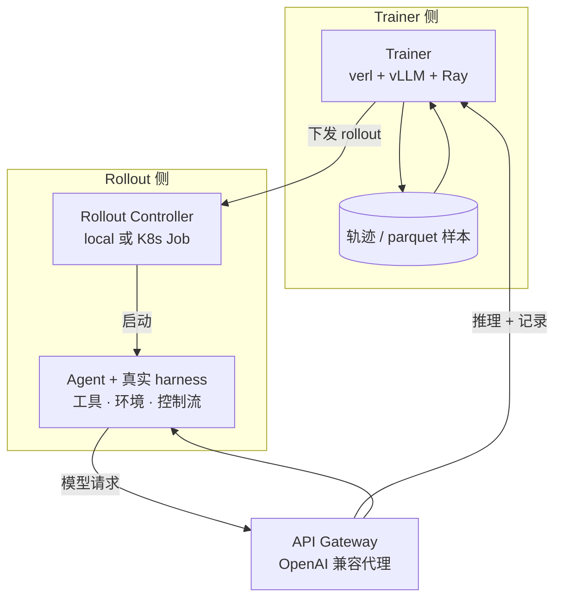
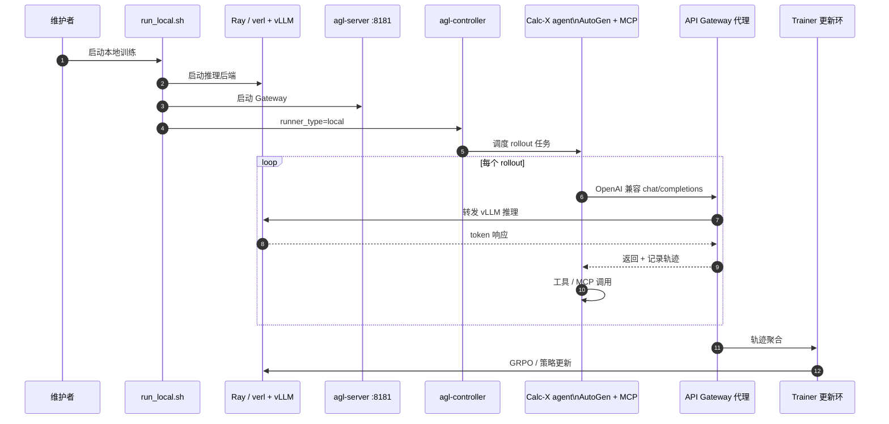

# Agent Lightning（Microsoft）

**Agent Lightning**（[microsoft/agent-lightning](https://github.com/microsoft/agent-lightning)）是微软研究院开源的 **agentic 强化学习基础设施**（PyPI `agentlightning` **1.0.1**，MIT）。v1.0 用约 **3,500 行 Python** 把训练拆成 **Trainer / API Gateway / Rollout Controller** 三组件：agent 仍走原有 harness（工具、上下文、控制流、环境不变），仅把模型调用改经 **OpenAI 兼容代理** 以便采集轨迹并对接 **verl + vLLM** 做 GRPO 等策略更新。

## 一句话定义

用 **Gateway 代理 + 真实 harness rollout + verl 训练环**，把「任意 LLM agent 的交互轨迹」变成可优化的 RL 样本，而 **不必重写 agent 代码或沙箱编排**。

## 英文缩写速查

| 缩写 | 英文全称 | 简要说明 |
|------|----------|----------|
| RL | Reinforcement Learning | 从交互回报中学习策略；本栈面向 LLM agent 轨迹级优化 |
| GRPO | Group Relative Policy Optimization | verl 侧常用的组相对策略优化变体（示例训练栈） |
| K8s | Kubernetes | v1.0 Controller 可将 agent rollout 直接调度为 Job |
| API | Application Programming Interface | Gateway 提供 OpenAI 兼容代理面，harness 零改动接入 |
| SWE | Software Engineering | Coding Agent 示例基准域（如 SWE-bench Verified） |
| vLLM | — | 高吞吐 LLM 推理服务；Trainer 侧与 verl 联用 |

## 核心信息

| 字段 | 内容 |
|------|------|
| 机构 | 微软（Microsoft / Microsoft Research） |
| 类型 | Agentic RL 训练框架（Gateway + Controller + Trainer） |
| 版本 | 1.0.1（v1.0 完全重构；v0.x 见独立分支） |
| 代码 | <https://github.com/microsoft/agent-lightning> |
| 文档 | <https://microsoft.github.io/agent-lightning/stable/> |
| 许可 | MIT |
| 开源结论 | **已开源**（完整包、示例、文档与 verl 安装脚本）；**不自带** 基座权重，GPU 栈需自行准备 |

## 为什么重要（对本知识库读者）

- **Harness 与训练解耦：** 本库已收录 [DeepSeek Harness](./deepseek-harness.md)、[Hermes Agent](./hermes-agent.md)、[RSI-Harness](./rsi-harness.md) 等 **agent 运行时 / 实验组织** 层；Agent Lightning 解决 **下一层** — 如何把这些 harness 里真实的工具调用轨迹 **变成 RL 更新**，而不是另写一套「简化版 agent 环境」。
- **对接 autoresearch 思维：** [Karpathy autoresearch](./karpathy-autoresearch.md) 与 [AI Auto-Research](../concepts/ai-auto-research.md) 强调 **Explore→Execute→Verify**；Agent Lightning 的 Coding Agent 管线（数据清洗、reward hacking 防护、仓库测试奖励）是 **S3 代码与实验** 侧可复用的 **RL 飞轮** 参照，与机器人 sim RL 正交但共享「轨迹→策略」结构。
- **工程可落地：** 官方给出 **单卡 A100 Calc-X Quick Start**、**K8s Job** 模式，以及 Search R1 / LLM-in-Sandbox / SWE 等多域示例；对需要 **在线 agent rollout + 异步采集** 的研究栈（对照 [reinforcement-learning](../methods/reinforcement-learning.md) 中 verl 生态条目）是直接入口。

## 核心原理

### 三组件分工（v1.0）

| 组件 | 职责 |
|------|------|
| **Trainer** | 启动 Ray、`verl`、vLLM；构建训练 batch；执行策略更新 |
| **API Gateway（`agl-server`）** | 代理 LLM 请求/响应，记录 token 级轨迹供训练聚合 |
| **Rollout Controller（`agl-controller`）** | `runner_type=local` 或 K8s reconciler 启动 agent 进程 / Job |

Trainer 创建 rollout 任务 → Controller 拉起带真实 harness 的 agent → agent 经 Gateway 调模型 → Gateway 把交互转为训练事件 → Trainer 聚合轨迹并更新权重。

### 流程总览

### 源码运行时序图

典型 **本地 Calc-X** 路径（`examples/calc_x/run_local.sh`）：

图下说明：agent 侧仅改 **模型 base URL** 指向 Gateway；**MCP 计算器、AutoGen 控制流** 等保持原 harness。完整 SWE / K8s 路径见官方 [Controller Configuration](https://microsoft.github.io/agent-lightning/stable/30-controller-configuration/)。

## 工程实践

| 步骤 | 要点 |
|------|------|
| **环境** | Python 3.12+；`uv sync` + `scripts/setup_verl.sh`（CUDA / verl 版本以文档为准） |
| **最小验证** | 下载 Calc-X 数据 → `examples/calc_x/run_local.sh`；日志默认 `/tmp/` |
| **生产 rollout** | `k8s_reconciler.py` 将 agent 跑为 **Kubernetes Job**，无需外部 sandbox 服务 |
| **Coding Agent** | `examples/swe_smith` + 公开数据清洗与 anti–reward-hacking 脚本；Qwen3.5-9B SWE-bench Verified **+14.6 pp** |
| **观测** | Quick Start 示例可接 W&B；Gateway / Controller 配置见文档 20–30 章 |

## 局限与风险

- **GPU 依赖重：** 轻量的是 **编排代码**，策略推理与 GRPO 仍依赖 **verl + vLLM + GPU**；非「CPU 即可训 agent」。
- **Windows 本地限制：** `runner_type=local` **不支持原生 Windows**；需 WSL / Linux / K8s。
- **v1 破坏性迁移：** v0.x 与 v1.0 架构不兼容；读旧帖 / 社区项目时需核对分支（如 `contrib/youtu-agent-lightning`）。
- **与具身 RL 的距离：** 官方示例集中在 **搜索、沙箱代码、SWE、文本环境**；接入真机 / 仿真需自建 harness 与奖励，框架提供 **轨迹采集与训练环**，不替代机器人环境栈。
- **Retokenization：** 项目强调 OpenAI 兼容 API 返回 **token id** 的重要性（见 vLLM 合作文）；错误代理层可能导致 RL 信号漂移。

## 关联页面

- [DeepSeek Harness](./deepseek-harness.md) — 通用 **agent OS**；可经 Gateway 代理接 RL 训练环
- [Hermes Agent](./hermes-agent.md) — 常驻 agent 运行时 + 轨迹导出；与「外置 RL Trainer」互补
- [RSI-Harness](./rsi-harness.md) — **实验组织 Genome**；Agent Lightning 偏 **策略权重 RL**
- [Karpathy autoresearch](./karpathy-autoresearch.md) — 固定验证指标的 **代理 ablation 环**
- [AI Auto-Research](../concepts/ai-auto-research.md) — S3 实验自动化生命周期坐标
- [Reinforcement Learning](../methods/reinforcement-learning.md) — RL 方法栈；verl 生态交叉引用

## 参考来源

- [Agent Lightning 仓库源归档（本站）](../../sources/repos/agent_lightning.md)
- [Microsoft Research 项目页源归档（本站）](../../sources/sites/agent-lightning-microsoft-research.md)
- [v1.0 技术报告源归档（本站）](../../sources/papers/agent_lightning_v1_technical_report.md)
- [microsoft/agent-lightning（GitHub）](https://github.com/microsoft/agent-lightning)

## 推荐继续阅读

- [Agent Lightning v1.0 文档 — Quick Start](https://microsoft.github.io/agent-lightning/stable/01-quick-start/) — 单卡 A100 Calc-X 端到端
- [Agent Lightning v1.0: Towards Harnessed Agentic RL（arXiv:2608.17528）](https://arxiv.org/abs/2608.17528) — 架构与 benchmark 细节
- [No More Retokenization Drift（vLLM 博客）](https://blog.vllm.ai/2025/10/22/agent-lightning.html) — Gateway 返回 token id 的工程动机
