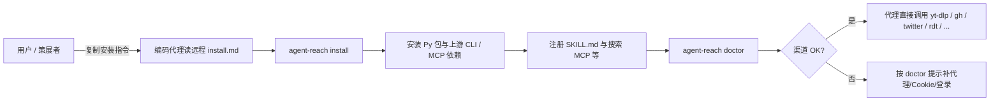

# Agent Reach（Panniantong）

Agent Reach 是面向编码代理的开源安装脚手架：把网页、社媒、视频字幕、GitHub、RSS 与语义搜索等能力所依赖的上游 CLI 与 MCP 依赖收拢到可重复的安装与诊断路径；凭据默认仅存本机。官方仓库见 [Panniantong/Agent-Reach](https://github.com/Panniantong/Agent-Reach)。

README 将自身定位为 **scaffolding（脚手架）而非应用框架**：各渠道背后是可替换的独立工具链，代理在运行期 **直接调用** twitter-cli、rdt-cli、yt-dlp、`gh`、Jina Reader、feedparser、mcporter 等，本仓库代码侧重 **安装、渠道注册与健康检查（`doctor`）**。

## 一句话定义

用 **`agent-reach` CLI + 渠道检测（`doctor`）+ Agent 侧 SKILL 分发**，把多平台信息接入的 **工程摩擦** 从「每个项目手搓一遍」降到 **可审计的一键安装与可插拔替换**。

## 英文缩写速查

| 缩写 | 英文全称 | 简要说明 |
|------|----------|----------|
| SDK | Software Development Kit | 软件开发工具包 |
| API | Application Programming Interface | 应用程序编程接口 |
| LLM | Large Language Model | 大语言模型，常作高层任务/语言接口 |

## 为什么重要（对本知识库读者）

- **文献与代码调研侧**：机器人论文、开源仓库、教程视频、社区讨论（Reddit / X / 中文社区）常分散在多站；本工具链把 **字幕抽取、公开网页清洗阅读、GitHub 检索、RSS 订阅、微信公众号全文（Camoufox / Exa）** 等接到同一套 CLI/MCP 习惯里，便于代理辅助 **ingest 与交叉验证**（仍须遵守各平台 ToS 与学术引用规范）。本站经 `wechat-article-for-ai`（Camoufox）抓取多篇 `mp.weixin.qq.com` 长文（如 [Humanoid Hardware 101](../../sources/blogs/wechat_human_five_humanoid_hardware_101.md)、[世界模型训练闭环](../../sources/blogs/wechat_embodied_ai_lab_robot_world_model_training_loop.md)、[李群/李代数/四元数基础](../../sources/blogs/wechat_shenlan_lie_group_lie_algebra_quaternion.md)）时，Jina Reader 常返回 CAPTCHA，与公开 README 一致。
- **与「代理工程规约」相邻**：和 [Superpowers（obra）](superpowers-obra.md) 这类 **软件交付流程技能库** 不同，Agent Reach 解决的是 **外网只读/检索型工具链**；和 [Articraft](articraft.md) 这类 **3D 资产生成 SDK** 也不同，但同属 **把代理能力边界写进可版本化外围** 的实践谱系。
- **安全与运维意识对齐公开文档**：README 明确 **Cookie 等凭据本地 `~/.agent-reach`、文件权限 600**、`--safe` / `--dry-run`、以及 **Cookie 平台封号风险** 与 **小号建议**；适合作为代理侧 **凭据与合规** 讨论的参照锚点。

## 核心结构

| 层次 | 内容 |
|------|------|
| **分发形态** | PyPI 包 `agent-reach`；安装/更新可由上游提供的远程 `docs/install.md`、`docs/update.md` 引导（URL 以 README 为准，避免在此固化易变路径）。 |
| **运行时边界** | 安装后代理 **直接调用** twitter-cli、rdt-cli、yt-dlp、`gh`、Jina Reader、feedparser、mcporter 等；渠道 Python 模块侧重 **可用性检测**（如 `doctor`），而非二次业务 API 包装。 |
| **渠道模型** | `channels/*.py` 映射「场景 → 当前默认上游」；README 声明 **单文件可替换** 以换 Firecrawl、官方 API、其他 MCP 等。 |
| **诊断** | `agent-reach doctor` 汇总各渠道连通性与修复提示。 |
| **卸载** | `agent-reach uninstall` 清理配置目录、技能文件与 mcporter 侧注册（细节以上游文档为准）。 |

### 流程总览（概念级）

## 常见误区或局限

- **误区：装了就能无限制爬取。** 各平台反爬、登录态、地域与账号策略仍适用；README 对 Reddit 认证、X/B 站等场景有 **额外配置** 说明。
- **误区：等价于官方 API 封装。** 当前默认路径大量依赖 **Cookie 或第三方读服务**；稳定性随平台政策波动，需要持续维护（上游自述会跟进平台变化）。
- **局限：** 本知识库 **不** 在此复述具体 shell 命令行；请以克隆时的 [官方 README](https://github.com/Panniantong/Agent-Reach/blob/main/README.md) 为准。

## 关联页面

- [Superpowers（obra）](superpowers-obra.md) — 编码代理 **交付流程** 技能库（与本页「外网工具链」互补）
- [Hermes Agent](hermes-agent.md) — **完整代理运行时**（内置 web/MCP/终端与网关；与本页「读搜脚手架」互补）
- [Articraft](articraft.md) — 另一类 **harness + SDK** 型代理外围（3D 资产域）
- [LLM Wiki（Karpathy 模式）](../references/llm-wiki-karpathy.md) — 持久化知识结构与 **人类策展** 范式

## 参考来源

- [Agent Reach 仓库源归档（本站）](../../sources/repos/panniantong_agent_reach.md)
- [Panniantong/Agent-Reach（GitHub）](https://github.com/Panniantong/Agent-Reach)

## 推荐继续阅读

- [Agent Reach README（main 分支）](https://github.com/Panniantong/Agent-Reach/blob/main/README.md) — 支持平台矩阵、当前上游选型表与安全说明
