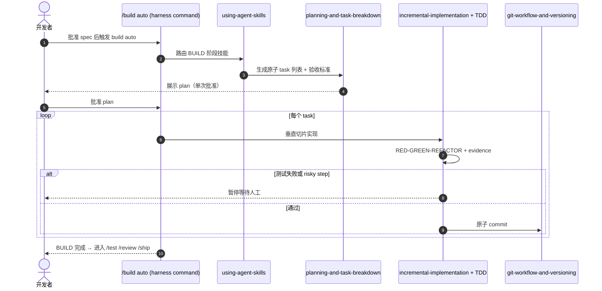

# Agent Skills（Addy Osmani）

**Agent Skills** 是 [addyosmani/agent-skills](https://github.com/addyosmani/agent-skills) 仓库及其 [skills.addy.ie](https://skills.addy.ie) 入口的总称：把 **资深工程师在 production 上的工作流**（写 spec、约束质量栏、TDD 垂直切片、五轴 review、安全/性能/可观测性、CI/CD 与 launch）打包成 **25 个结构化 `SKILL.md`**，并通过 **9 个 slash 命令** 与 **4 个 specialist agent persona** 让编码代理在 **DEFINE → PLAN → BUILD → VERIFY → REVIEW → SHIP** 各阶段自动加载对应技能。

## 一句话定义

用 **全 SDLC 技能目录 + 生命周期命令 + 不可协商的 verification 出口**，把代理从「最短路径写代码」拉回到 **spec 先行、测试为证、合并前 review、上线前 checklist** 的生产纪律。

## 英文缩写速查

| 缩写 | 英文全称 | 简要说明 |
|------|----------|----------|
| SDLC | Software Development Lifecycle | 本包覆盖的软件开发生命周期六阶段 |
| TDD | Test-Driven Development | Red-Green-Refactor；技能含测试金字塔与 Beyoncé Rule |
| PRD | Product Requirements Document | `spec-driven-development` 产出物，编码前必写 |
| ADR | Architecture Decision Record | `documentation-and-adrs` 技能；记录决策 **why** |
| OWASP | Open Web Application Security Project | `security-and-hardening` 对照 Top 10 |
| CI/CD | Continuous Integration / Continuous Delivery | `ci-cd-and-automation`：Shift Left、feature flags |

## 为什么重要（对本知识库读者）

- **与 Superpowers / mattpocock 构成选型三角：** [Superpowers（obra）](superpowers-obra.md) 偏 **强制交付管线 + 子代理评审**；[mattpocock/skills](mattpocock-skills.md) 偏 **轻量可组合 + grill/CONTEXT**；本包偏 **覆盖完整 SDLC 的 25 技能 + Google 工程文化嵌入**，并自带 [官方 comparison 文档](https://github.com/addyosmani/agent-skills/blob/main/docs/comparison.md)。
- **与本站维护流程同构：** [Karpathy LLM Wiki](../references/llm-wiki-karpathy.md) + [Ingest Workflow](../../schema/ingest-workflow.md) 把 **知识维护** 写成文件契约；Agent Skills 把 **软件交付** 写成 SKILL + references + evals；`constraint-driven-development` 与 `make ci-preflight` 文化相近（**质量栏写进文件、禁止静默跳过检查**）。
- **与 Open Code Review 分工：** [Open Code Review](open-code-review.md) 提供 **diff 级评审 CLI**；本包 `code-review-and-quality` 与 `/review` 提供 **流程内五轴 review 技能**；可组合而非互斥。
- **stars 高 ≠ 机器人栈开箱即用：** 示例与 checklist 偏 **Web/TS 应用工程**；迁移到 Isaac / MuJoCo / ROS 时需重写 CONSTRAINTS 与测试证据类型。

## 核心结构

| 层次 | 内容 |
|------|------|
| **分发** | `npx skills add addyosmani/agent-skills`；Claude `/plugin marketplace add`；Codex `codex plugin marketplace add`；各 harness 见 `docs/*-setup.md` |
| **便携核心** | `skills/`（25）、`agents/`（4 persona）、`references/`（7 checklist） |
| **生命周期命令** | `.claude/commands/` 等：`/spec` `/plan` `/build` `/test` `/constraints` `/review` `/webperf` `/code-simplify` `/ship` |
| **Meta** | `using-agent-skills` — 路由 incoming work 到正确 skill |
| **设计机制** | Anti-rationalization 表；Verification evidence；Progressive disclosure；`evals/` 结构/路由/执行三层评测 |
| **协议** | MIT |

### 流程总览（生命周期）

```mermaid
flowchart LR
  subgraph DEFINE
    A[/spec] --> B[interview-me / idea-refine / spec-driven-development]
  end
  subgraph PLAN
    C[/plan] --> D[planning-and-task-breakdown]
  end
  subgraph BUILD
    E[/build] --> F[incremental-implementation + TDD + domain skills]
  end
  subgraph VERIFY
    G[/test] --> H[debugging + browser-testing-with-devtools]
  end
  subgraph REVIEW
    I[/review] --> J[code-review-and-quality + security + performance]
  end
  subgraph SHIP
    K[/ship] --> L[shipping-and-launch + ci-cd + observability]
  end
  DEFINE --> PLAN --> BUILD --> VERIFY --> REVIEW --> SHIP
```

## 工程实践

| 场景 | 建议入口 | 备注 |
|------|----------|------|
|  greenfield 全生命周期 | 按 README Adoption Guide 从 `/spec` 顺序推进 | 见 `docs/adoption-guide.md` |
| 存量代码增量接入 | verification-first  rollout | 先 `constraint-driven-development` 写 CONSTRAINTS.md |
| 一次批准全自动实现 | `/build auto` | 仍 **逐 task TDD + 单独 commit**；失败或 risky step 会暂停 |
| 合并前 review | `/review` 或 `code-review-and-quality` skill | 五轴、~100 行 change sizing |
| 上线 | `/ship` + 4 persona 并行 | code-reviewer / test-engineer / security-auditor / web-performance-auditor |
| 本 wiki 维护 | 借鉴 `spec-driven-development` + `git-workflow-and-versioning` | **不能** 替代 `make ci-preflight` / ingest schema |

### 源码运行时序图（`/build auto` 概念级）

官方仓 **已开源**；下列时序对齐 README 对 **`/build auto`** 的叙述（计划一次批准 →  autonomous 执行 → 每 task 仍 TDD + commit）：



**复现路径：** `npx skills add addyosmani/agent-skills` → 按 harness 文档复制 `skills/` 或装 marketplace 插件 → 在目标仓库运行 `/spec` 起链。

## 局限与风险

- **单 skill 安装缺 references：** `npx skills add ... --skill foo` **不复制** 仓库级 `references/`（[#361](https://github.com/addyosmani/agent-skills/issues/361)）；需整仓集成或手动拷贝 checklist。
- **Harness 适配碎片化：** Cursor 要求 skills 在 `.cursor/skills/`、rules 仅放短策略；Antigravity 部分 legacy wrapper 不可发现 — 以各 `docs/*-setup.md` 为准。
- **非官方 Google 产品：** 技能 **引用** Google 工程文化，但仓库属 Addy Osmani 社区项目，不代表 Google 背书。
- **Recall 式「全找问题」不是目标：** 与 [Open Code Review](open-code-review.md) 类似，流程技能强调 **可执行 gate**，不是穷尽所有缺陷。

## 关联页面

- [Superpowers（obra）](superpowers-obra.md) — 子代理 + worktree + 强制 TDD 管线
- [Skills For Real Engineers（mattpocock）](mattpocock-skills.md) — 轻量 grill/TDD/CONTEXT 组合
- [Open Code Review（Alibaba OCR）](open-code-review.md) — diff 级评审 CLI
- [HumanLayer Skills](humanlayer-skills.md) — 迭代维护 control-loop
- [WikiSkill（论文实体）](paper-wikiskill.md) — wiki + skill 共进化学术对照
- [Agentic Coding 时代的软件工程基础](../concepts/agentic-coding-software-fundamentals.md) — 人如何用取舍语言转向 agent
- [LLM Wiki（Karpathy 模式）](../references/llm-wiki-karpathy.md) — 持久知识编译范式
- [Ingest Workflow](../../schema/ingest-workflow.md) — 本仓库维护规范

## 参考来源

- [Agent Skills 仓库源归档（本站）](../../sources/repos/addyosmani-agent-skills.md)
- [skills.addy.ie 项目页核查（本站）](../../sources/sites/skills-addy-ie.md)
- [addyosmani/agent-skills（GitHub）](https://github.com/addyosmani/agent-skills)
- [Agent Skills 官方站](https://skills.addy.ie)

## 推荐继续阅读

- [docs/comparison.md（GitHub）](https://github.com/addyosmani/agent-skills/blob/main/docs/comparison.md) — 与 Superpowers、mattpocock/skills 并排对照
- [docs/skill-anatomy.md](https://github.com/addyosmani/agent-skills/blob/main/docs/skill-anatomy.md) — SKILL.md 格式规范
- [docs/adoption-guide.md](https://github.com/addyosmani/agent-skills/blob/main/docs/adoption-guide.md) — greenfield vs 存量代码 rollout
