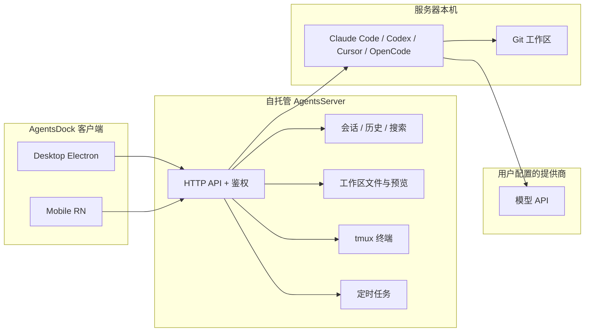
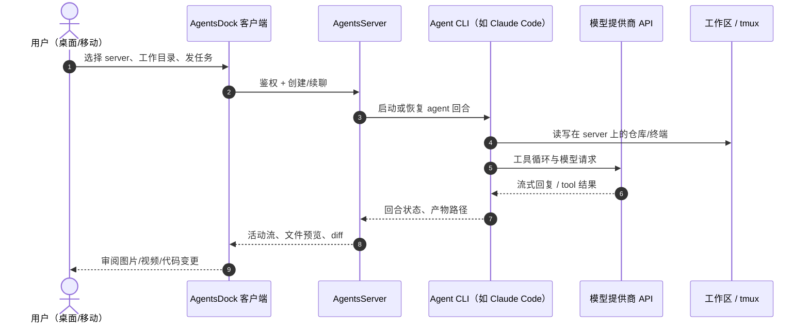

# AgentsDock

[AgentsDock](https://agentsdock.net/) 由 [Zhengyi Luo](./zhengyi-luo.md) 维护：**客户端**（[ZhengyiLuo/AgentsDock](https://github.com/ZhengyiLuo/AgentsDock)）负责桌面与移动 UI；**后端** [AgentsServer](https://github.com/ZhengyiLuo/AgentsServer) 跑在持有仓库与 agent CLI 的机器上。二者 Apache-2.0 开源；模型调用仍走用户自选的云端编码代理提供商。

## 一句话定义

用 **自托管 AgentsServer + 跨端 AgentsDock 客户端**，把「在服务器上长跑的 Claude Code / Codex / Cursor / OpenCode」变成 **可检索、可审阅、可换设备继续** 的研究工作区，而不是把项目文件交给托管聊天产品。

## 英文缩写速查

| 缩写 | 英文全称 | 简要说明 |
|------|----------|----------|
| IDE | Integrated Development Environment | 集成开发环境；此处指代理任务与产物的统一工作区 |
| CLI | Command Line Interface | 命令行接口；Claude Code、Codex 等以 CLI 形式装在服务器 |
| API | Application Programming Interface | 应用程序编程接口；客户端经 API 与 AgentsServer 通信 |

## 为什么重要（对本知识库读者）

- **与机器人研究工程栈相邻**：维护者本人做人形控制与 Sim2Real，但 AgentsDock 解决的是 **编码代理长跑时的 UX 与数据主权** — 仿真训练、数据处理、论文实验脚本常在远程 GPU 机或实验室服务器上跑；手机/笔记本只连自托管后端即可盯日志、看图、拉 artifact，而不必 SSH + tmux 裸奔。
- **与 Hermes / Agent Reach 互补**：[Hermes Agent](hermes-agent.md) 是 **自带工具环与消息网关的代理 OS**；[Agent Reach](agent-reach.md) 是 **外网读搜脚手架**；AgentsDock **不替换** 代理运行时，而是给 **已有 Claude Code / Codex / Cursor** 套一层 **持久会话 + 富媒体审阅 + 多客户端** 壳。交付流程 skills 仍可对齐 [Superpowers（obra）](superpowers-obra.md)。
- **开源状态清晰（2026-10-01 项目页核查）**：agentsdock.net 与 GitHub 均链双仓；**无**「待发布代码」占位。限制在于 **模型非本地**、Windows 安装包可能未签名、Team Network 等能力仍标 beta — 见官方 FAQ / release notes。

## 核心结构

| 组件 | 职责 |
|------|------|
| **AgentsDock 客户端** | Electron 桌面（macOS/Linux/Windows）、React Native 移动（iOS/Android）；连接一个或多个 server URL + token |
| **AgentsServer** | Python 服务（`uv` 安装）；默认端口 **7850**；持久化聊天、调度 agent 回合、文件 IO、可选 tmux 终端、定时任务、Side chat 等 |
| **Agent CLI（在 server 上）** | Claude Code、Codex、Cursor、OpenCode（beta，视版本）；须 **在服务器** 安装并完成提供商登录 |
| **产品站 `website/`** | setup / features / update 用户文档；与仓库内 `docs/` 架构说明分工 |

### 流程总览

### 源码运行时序图

## 工程实践

| 主题 | 读法 |
|------|------|
| **安装** | 桌面 Release 或 App Store；服务器 `./install.sh`（[AgentsServer README](https://github.com/ZhengyiLuo/AgentsServer#guided-setup)） |
| **远程访问** | 官方推荐 Tailscale 等私有网络，**勿** 将 agent 端口直接暴露公网 |
| **多 server** | `./instances.sh new` 单机多实例；客户端可保存多条连接 |
| **Workspace Changes（≥1.0.3）** | UI 内 stage/commit、三路 merge 冲突编辑；**不** 代管 GitHub PR / push（终端仍可手动） |
| **内存** | 默认 launch 检查可用 RAM（agent 2 GiB / 定时 4 GiB） |

## 常见误区或局限

- **误区：自托管 = 本地大模型。** 仅 **执行与存储** 自托管；推理仍依赖 Claude/OpenAI/Cursor 等账号与网络。
- **误区：手机上也能跑 Codex。** CLI 必须在 **server**；手机只是远程控制台。
- **局限：** Git UI 仍偏「整文件 stage + commit」；复杂 hook、二进制冲突或 PR 流程需回终端或外部 Git 工具。
- **局限：** 客户端 stable/beta 与 server 版本需配对（如 Workspace Changes 要求 server 1.0.3+）。

## 关联页面

- [Zhengyi Luo（罗正宜）](./zhengyi-luo.md) — 维护者与 GEAR 人形研究脉络
- [Hermes Agent](./hermes-agent.md) — 自带网关与工具环的代理运行时
- [Agent Reach](./agent-reach.md) — 编码代理外网读搜脚手架
- [Superpowers（obra）](./superpowers-obra.md) — 交付流程 skills，可与任意 CLI 代理叠加
- [Model Context Protocol](../concepts/model-context-protocol.md) — 客户端 `/` 菜单可管理 MCP（以官方 features 为准）
- [LLM Wiki（Karpathy 模式）](../references/llm-wiki-karpathy.md) — 知识编译范式；AgentsDock 编译的是 **代理会话与产物审阅体验**

## 参考来源

- [AgentsDock 产品站归档](../../sources/sites/agentsdock-net.md)
- [AgentsDock 客户端仓库归档](../../sources/repos/zhengyiluo_agentsdock.md)
- [AgentsServer 后端仓库归档](../../sources/repos/zhengyiluo_agentsserver.md)

## 推荐继续阅读

- [AgentsDock 功能说明（官方）](https://agentsdock.net/features.html)
- [AgentsDock 安装指南（官方）](https://agentsdock.net/setup.html)
- [AgentsDock GitHub README](https://github.com/ZhengyiLuo/AgentsDock)
