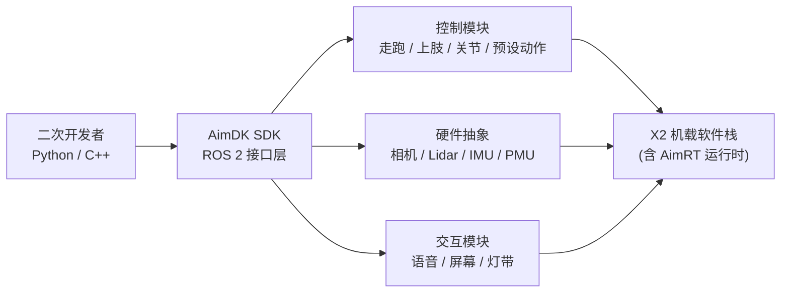

# AimDK X2（灵犀 X2 二次开发框架）

## 一句话定义

**AimDK X2** 是智元机器人（AgiBot）为 **灵犀 X2** 人形提供的 **任务编程与扩展框架**：通过 [官方文档站](https://x2-aimdk.agibot.com/zh-cn/latest/index.html) 提供统一 ROS 2 接口与 Python/C++ SDK，让二次开发者控制运动与上肢、订阅传感器、驱动交互模块，并在开发者模式下集成自定义算法与应用。

## 英文缩写速查

| 缩写 | 英文全称 | 简要说明 |
|------|----------|----------|
| AimDK | AgiBot Intelligent Development Kit | 智元 X2 二次开发框架与 SDK 品牌 |
| ROS 2 | Robot Operating System 2 | 底层分布式通信与节点架构 |
| SLAM | Simultaneous Localization and Mapping | 选装感知：建图与重定位 |
| PMU | Power Management Unit | 机载电源管理单元抽象接口 |
| GNSS | Global Navigation Satellite System | 室外定位模块（文档含订阅示例） |
| MC | Motion Control | 运控模块；含多输入源仲裁与状态查询 |

## 为什么重要

- **X2 真机二次开发的官方入口**：与 [agibot_x2_urdf](./cn-os-agibot-x2-urdf.md)（仿真资产）和 [AimRT](./cn-os-aimrt.md)（开源运行时）形成 **资产 → 运行时 → 应用 API** 分层，避免把「能仿真」误当成「能控真机」。
- **任务级而非裸关节**：文档强调高层 API、预设动作、走跑控制与 MC 信号仲裁，适合快速验证场景逻辑，再下沉到关节/末端控制。
- **研究复现语境**：多篇 X2 相关论文（如 [SSR](./paper-ssr-humanoid-open-world-traversal.md)、[SONIC-Transfer](./paper-sonic-transfer.md)、[CReF](./paper-cref.md)）以 AgiBot X2 为平台；理解 AimDK 边界有助于区分 **官方 SDK 部署** 与 **第三方/play bundle 推理** 路径。

## 流程总览

## 核心原理

| 维度 | 要点 |
|------|------|
| **通信基座** | 基于 **ROS 2**，继承分布式与实时通信能力 |
| **语言** | **Python** 与 **C++** 双语言；文档含 36+ 对齐示例 |
| **控制面** | 运动模式切换、走跑、MC 多输入源仲裁、上肢/关节/末端、预设与灵创（LinkCraft）动作 |
| **感知面** | 标准传感器话题（IMU、RGB/深度/双目、Lidar、GNSS）；**SLAM/导航为选装**；视觉接口标注待开放 |
| **交互面** | TTS/音频/麦克风、表情与视频、灯带；可选灵心云（LinkSoul） |
| **运维面** | 故障诊断码表、系统/开发者模式切换 |
| **硬件变体** | X2 Ultra、X2 Ultra (new version)、X2 EDU；旗舰/焕新版支持机载 SDK 或容器开发 |

## 工程实践

1. **读边界再写代码** — 文档第 9 章「二次开发边界与声明」与 FAQ 中的过渡方案（如关闭内置语音、McAction 状态码变更）会直接影响兼容性。
2. **选开发模式** — 旗舰/焕新版可机载直连 SDK 或 **容器开发（推荐）**；亦可用上位机/外接算力包跨机组网；EDU 版网络与接口子集不同。
3. **首次运行路径** — 网络连接 → 构建 SDK → 跑「获取状态 / 挥手」示例 → 在现有工作空间添加 Python 示例并注册构建系统。
4. **与 AimRT 分工** — 需要改模块通信、插件或跨端部署时查 [AimRT](./cn-os-aimrt.md) 与 `aimrt_mujoco_sim`；需要 X2 真机任务 API 时用 AimDK。
5. **仿真对照** — 动力学与 URDF 用 [agibot_x2_urdf](./cn-os-agibot-x2-urdf.md)；Sim2Real 策略部署仍需核对 AimDK 控制话题与训练栈关节/观测约定是否一致。

## 局限与风险

- **SDK 非 GitHub 全量开源**：开发包通过文档站「获取 SDK」分发，需硬件与官方流程；与 AimRT 的公开仓库模式不同。
- **选装与待开放**：SLAM/导航为选装；文档标注视觉接口 **待开放** — 勿假设所有传感器能力默认可编程。
- **版本过渡**：v0.7.x 及之前部分 McAction 状态码不再支持；内置交互可临时关闭以接入自研语音 — 升级前必读第 8 章。
- **文档快照**：本页基于 AimDK **1.1.0** 文档（2026-09-23）；接口以在线文档为准。

## 关联页面

- [AimRT（部署运行时）](./cn-os-aimrt.md)
- [agibot_x2_urdf（本体模型资产）](./cn-os-agibot-x2-urdf.md)
- [AGILE（感控一体底座）](./agibot-agile.md)
- [SONIC-Transfer（X2 Ultra WBC 迁移）](./paper-sonic-transfer.md)

## 参考来源

- [x2-aimdk.agibot.com 文档站归档](../../sources/sites/x2-aimdk-agibot.md)（<https://x2-aimdk.agibot.com/zh-cn/latest/index.html>）
- [AimRT 源码归档](../../sources/repos/aimrt.md)（<https://github.com/AimRT/AimRT>）

## 推荐继续阅读

- [AimDK X2 快速开始（官方）](https://x2-aimdk.agibot.com/zh-cn/latest/sections/quick_start/index.html)
- [AimRT 文档](https://docs.aimrt.org/)
