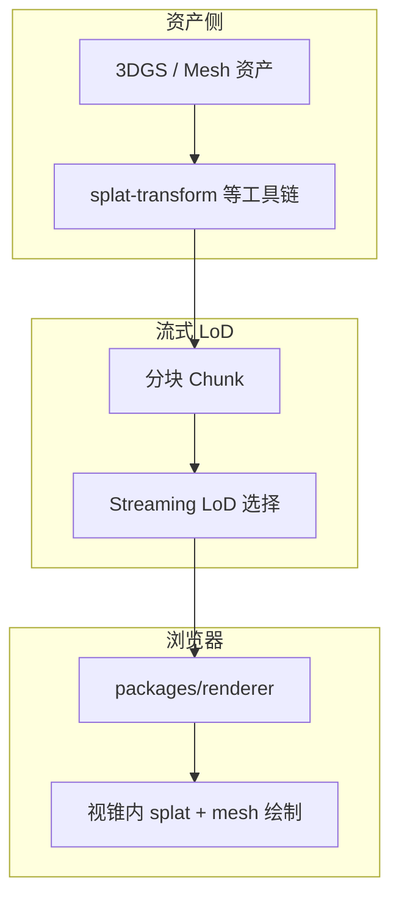

# Aholo Viewer

**Aholo Viewer**（[manycoretech/aholo-viewer](https://github.com/manycoretech/aholo-viewer)）是面向 **浏览器** 的 **3D Gaussian Splatting（3DGS）与三角网格（Mesh）** 高性能渲染项目，官网 [aholojs.dev](https://aholojs.dev/)。与 [World Labs Spark](./spark-3dgs-renderer.md) 同属 Web 大场景 splat 赛道，但由独立团队维护，架构为 **pnpm monorepo + TypeScript 渲染包**。

## 一句话定义

用 **Chunked Streaming LoD** 在 Web 上同时承载 **超大 3DGS 与 Mesh**，并以文档站 / Playground 降低集成门槛。

## 英文缩写速查

| 缩写 | 英文全称 | 简要说明 |
|------|----------|----------|
| API | Application Programming Interface | 应用程序编程接口 |
| CAD | Computer-Aided Design | 计算机辅助设计，硬件结构建模 |

## 为什么重要

- **3DGS + Mesh 混渲**：许多机器人/数字孪生场景需要 **splat 外观 + 传统网格碰撞体或 CAD** 同屏；Aholo 公开定位覆盖两类几何。
- **流式 LoD 另一实现样本**：与 Spark 2.0 的 **LoD splat 树 + .RAD** 对照，帮助理解「Chunked Streaming LoD」在工程上的不同切分。
- **开发者工具链完整**：`pnpm check:content` 校验手册/示例一致性；Playground 用 `lz-string` 在 URL 中保存代码，便于分享复现。

## 仓库与依赖边界

| 路径 | 角色 |
|------|------|
| `packages/renderer/` | 渲染器 TS 源码（API 由 TypeDoc 生成） |
| `website/` | Astro：手册、示例、Playground |
| `external/egs-core/` | **必需子模块**（上游，默认只读） |
| `external/splat-transform/` | **专有** splat 处理工具（可用但不可再分发，见 COPYRIGHT） |

构建要求：**Node ≥ 22.22.1**、**pnpm**；克隆须 `git clone --recurse-submodules`。

## 流程总览（Chunked Streaming LoD）

（具体 chunk 划分与 LoD 策略以官方 `docs/architecture.md` 为准；本页仅保留公开 README 级归纳。）

## 常见误区或局限

- **`splat-transform` 非开源**：内容生成/处理工具为专有许可，集成时需遵守 [COPYRIGHT](https://github.com/manycoretech/aholo-viewer/blob/main/external/splat-transform/COPYRIGHT.md)。
- **≠ 机器人仿真**：不提供与 [GS-Playground](./gs-playground.md) 同类的 **物理步进 + 批量训练观测**；侧重交互浏览与内容交付。
- **生态绑定**：与 Spark 的 THREE.js 生态不同，选型时应比对团队现有前端栈与许可。

## 关联页面

- [Spark（Web 3DGS）](./spark-3dgs-renderer.md)
- [Spark vs Aholo 对比](../comparisons/spark-vs-aholo-web-3dgs-renderers.md)
- [GS-Playground](./gs-playground.md)
- [World Labs](./world-labs.md)

## 参考来源

- [aholo-viewer 仓库归档](../../sources/repos/aholo-viewer.md)

## 推荐继续阅读

- [Aholo 入门手册](https://aholojs.dev/en-US/manual/getting-started/)
- [GitHub：manycoretech/aholo-viewer](https://github.com/manycoretech/aholo-viewer)
