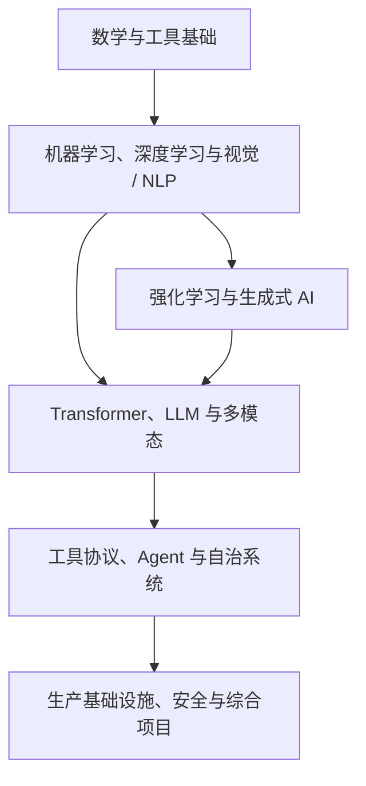
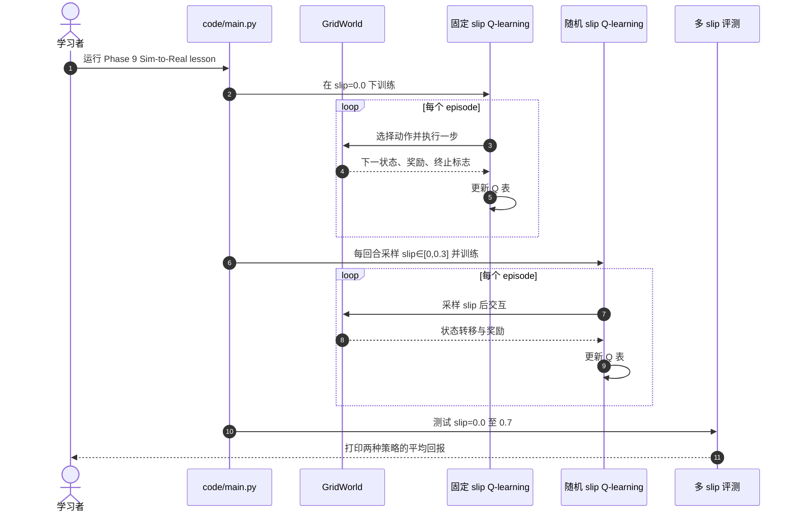

# AI Engineering from Scratch（AI 工程开源课程）

**AI Engineering from Scratch** 是一门以可运行代码为主线的 AI 工程课程，从数学和机器学习基础逐步覆盖深度学习、强化学习、LLM、Agent、工具协议和生产系统。

## 英文缩写速查

| 缩写 | 英文全称 | 简要说明 |
|------|----------|----------|
| AI | Artificial Intelligence | 课程覆盖的人工智能与工程系统主题 |
| ML | Machine Learning | Phase 2 等阶段从原理到代码介绍的机器学习方法 |
| RL | Reinforcement Learning | Phase 9 的核心内容；课程也安排 Sim-to-Real lesson |
| LLM | Large Language Model | Phase 10–11 的语言模型与应用工程主题 |
| MCP | Model Context Protocol | 课程作为工具协议之一教授和生成练习产物的开放协议 |
| PPO | Proximal Policy Optimization | RL 阶段的策略优化 lesson；需结合原论文与机器人实现学习 |

## 项目定位

项目 README 当前展示 20 个阶段、523 节课、约 342 小时，覆盖 Python、TypeScript、Rust 与 Julia。它将 AI 学习组织成一条从基础数学到 Agent 和生产部署的渐进路线；README 同时提供学习路径选择、命令行技能安装、可运行代码与课程网站。

它与机器人研究的连接主要在基础知识与少数直接相关 lesson：强化学习阶段涵盖 PPO 与 Sim-to-Real，视觉阶段涉及 3D vision / NeRF 和世界模型，边缘推理章节连接 Jetson 等部署主题。它不是机器人专用课程，也不提供完整的人形机器人控制栈。

## 课程结构与学习闭环

README 采用“先理解，再从头构建，再使用生产库，最后交付可复用产物”的组织方式。单节课按 Motto、Problem、Concept、Build It、Use It、Ship It 六个步骤展开；学习者被要求运行 lesson 命令、留存输出证据，并能够解释结果后再推进。

### 对机器人学习路线的映射

| 课程部分 | 对机器人学习者的用处 | 适合的读法 |
|---|---|---|
| Math / ML / Deep Learning | 补概率、优化、神经网络基础 | 只补不熟悉的先修概念 |
| Phase 9: Reinforcement Learning | 建立 MDP、价值学习、策略梯度和 PPO 的算法背景 | 对照机器人现有 PPO / reward / rollout 代码 |
| Sim-to-Real Transfer | 梳理域随机化、系统辨识、适应与 teacher/student | 把它当概念导读，实验细节另查原论文 |
| Computer Vision / World Models | 补 3D 视觉、NeRF、视频生成与世界模型的基础 | 选读与当前感知 / 预测任务相邻的 lesson |
| Agent Engineering / Edge Inference | 补工具循环、评测、部署与设备推理思路 | 服务于训练工具、模型应用和推理侧工程 |

## 可运行的 Sim-to-Real lesson 时序

配套源码位于 Phase 9 的 Sim-to-Real lesson。代码用 5×5 GridWorld 的侧滑概率模拟环境差异，分别训练固定参数策略与每回合随机化 slip 的 Q-learning 策略，再评估不同测试 slip 下的回报。

本地运行命令（在仓库根目录）：

~~~bash
python3 phases/09-reinforcement-learning/11-sim-to-real-transfer/code/main.py
~~~

该代码为标准库 GridWorld 教学实验，不需要 GPU、机器人驱动或外部仿真器。它用来解释“训练中覆盖参数变化可提升对参数偏移的鲁棒性”，不能作为真实机器人的系统辨识、硬件迁移或性能证据。

## 工程阅读建议

1. 先跑 Phase 9 Sim-to-Real 脚本，查看固定 slip 与随机 slip 策略在训练分布内外的回报差异。
2. 对照 [强化学习方法页](../methods/reinforcement-learning.md) 和 [Sim2Real](../concepts/sim2real.md)，把 lesson 里的域随机化映射到机器人动力学参数、观测噪声和执行延迟。
3. 读取课程内 PPO / Actor-Critic lesson，并对照原论文、训练框架文档和已有机器人实现；课程中的简化实现适合建立直觉，不能替代工程复现。
4. 需要做 LLM 工具链或训练脚本时，再选读 Agent Engineering 与 Infrastructure / Edge Inference 路线。

## 开源状态与局限

- **代码与课程：已开源，MIT。** GitHub 仓库公开，根目录 LICENSE 明确采用 MIT。
- **课程规模：动态快照。** 20 阶段、523 课和约 342 小时为 README 当前展示值；课程目录会更新。
- **机器人相关内容：专题嵌入在通用课程内。** RL / Sim-to-Real lesson 有机器人背景，但对应演示代码是 GridWorld；项目没有提供完整的 Unitree、Isaac Lab 或 MuJoCo 训练 pipeline。
- **内容时效：** AI 框架、模型和部署生态更新很快。课程中的版本与“当前主流”类判断应回到原论文、官方文档和发布日期核对。
- **研究使用边界：** 将它作为概念地图、自学材料与代码练习；实验结论、控制参数与硬件安全策略需要独立验证。

## 结论与实践建议

这个仓库适合把零散的 AI / RL 基础补成一条能亲手运行的学习路线；对机器人方向最直接的价值是 PPO、Sim-to-Real、视觉与 Agent 工程入口，而不是现成的机器人策略或控制器。

- 如果已在做机器人 PPO，只补 Phase 9 中不熟的数学与算法，再回到自己的 rollout 和 reward 代码解释每一项。
- 用 Sim-to-Real GridWorld 理解随机化的作用与 OOD 评测，再映射到真实仿真的质量和真实测量参数。
- 把 lesson 中的简化假设标出来，并用机器人论文、Isaac Lab / MuJoCo 文档或真机实验做后续核验。
- 不必按“约 342 小时”的完整课程顺序学习；按自己的能力缺口选择 lesson。

## 关联页面

- [Reinforcement Learning](../methods/reinforcement-learning.md) — 机器人 RL 算法与训练环背景
- [Sim2Real](../concepts/sim2real.md) — 机器人部署中的现实差距、域随机化与系统辨识
- [Agentic Coding 软件工程基础](../concepts/agentic-coding-software-fundamentals.md) — Agent 工具正在改变编码方式，但没有替代软件工程判断

## 参考来源

- [AI Engineering from Scratch 仓库归档](../../sources/repos/ai-engineering-from-scratch.md) — 仓库结构、课程阶段和机器人相关 lesson 摘要
- [官方网站归档](../../sources/sites/ai-engineering-from-scratch.md) — 在线课程页与 Sim-to-Real lesson 入口
- [GitHub README](https://github.com/rohitg00/ai-engineering-from-scratch)
- [Phase 9: Reinforcement Learning](https://github.com/rohitg00/ai-engineering-from-scratch/tree/main/phases/09-reinforcement-learning)
- [Sim-to-Real lesson source](https://github.com/rohitg00/ai-engineering-from-scratch/tree/main/phases/09-reinforcement-learning/11-sim-to-real-transfer)
- [Sim-to-Real online lesson](https://aiengineeringfromscratch.com/lesson?path=phases/09-reinforcement-learning/11-sim-to-real-transfer)

## 推荐继续阅读

- [项目课程网站](https://aiengineeringfromscratch.com) — 搜索课程目录、学习路径和在线 lesson
- [MIT License](https://github.com/rohitg00/ai-engineering-from-scratch/blob/main/LICENSE)
- [Sim-to-Real Transfer in Deep Reinforcement Learning for Robotics: A Survey](https://arxiv.org/abs/2009.13303) — 机器人 sim-to-real 方法综述，域随机化、域适应、模仿学习、元学习与知识蒸馏
