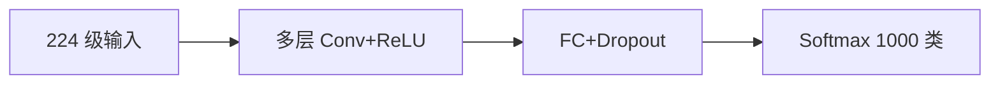

# AlexNet

## 一句话定义

**AlexNet** 是 2012 ImageNet 竞赛冠军 CNN：更大深度/宽度、ReLU、Dropout 与 GPU 训练，证明端到端深度卷积特征可碾压传统手工特征。

## 英文缩写速查

| 缩写 | 英文全称 | 简要说明 |
|------|----------|----------|
| AlexNet | AlexNet | 2012 ImageNet CNN 里程碑 |
| ReLU | Rectified Linear Unit | 非线性激活 |
| Dropout | Dropout Regularization | 抑制分类头过拟合 |
| LRN | Local Response Normalization | 原结构中的局部响应归一化 |
| ILSVRC | ImageNet LSVRC | 评测赛事 |

## 为什么重要

- 课程 2.2.2：连接 LeNet 与 VGG/ResNet 的规模化节点。
- 确立「大数据 + GPU + 深度 CNN」范式，影响后续检测分割预训练习惯。

## 核心原理

五层卷积 + 三层全连接；使用 ReLU 加速收敛，Dropout 正则，数据增强（裁剪/翻转）。双 GPU 拆分是历史实现细节，现多单卡复现。

## 工程实践

| 项 | 建议 |
|----|------|
| 学习 | 用现代框架复现结构，不必复制双 GPU 技巧 |
| 对照 | 同数据上对比 VGG/ResNet 收敛与精度 |
| 部署 | 生产已不选 AlexNet；仅教学 |

## 局限与风险

全连接巨大、无残差、深度有限；作为骨干已过时，但历史位置不可替代。

## 关联页面

- [LeNet-5](./lenet5.md)
- [VGGNet](./vggnet.md)
- [ImageNet](./dataset-imagenet.md)
- [Transformer CV 课程策展](../entities/transformer-cv-curriculum.md)

## 参考来源

- [Transformer 视觉应用课程大纲](../../sources/courses/transformer_cv_applications_syllabus.md)

## 推荐继续阅读

- [Krizhevsky et al. ImageNet Classification with Deep CNNs (NeurIPS 2012)](https://papers.nips.cc/paper/4824-imagenet-classification-with-deep-convolutional-neural-networks)
