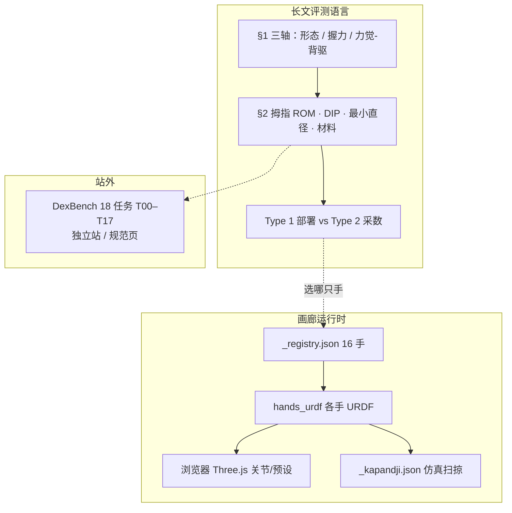

# All Hands Up（RLWRLD 灵巧手档案）

## 一句话定义

**All Hands Up !** 是瑞沃世界（RLWRLD）维护的 **腕装模块化灵巧手公开档案**：在浏览器里加载各手 URDF、对照规格，并用仿真扫掠给出 **Kapandji 对掌分**；配套长文解释「规格表读不出、但真机任务会失败」的设计变量，以及 **Type 1 部署手 / Type 2 采数手** 的双硬件策略。

## 英文缩写速查

| 缩写 | 英文全称 | 简要说明 |
|------|----------|----------|
| AHU | All Hands Up | 本页平台：画廊 + 长文 + Kapandji 档案 |
| URDF | Unified Robot Description Format | 统一机器人描述；画廊用 Three.js 加载各手模型 |
| Kapandji | Kapandji opposition scale | 临床拇指对掌地标 K0–K10；本站在 URDF 上仿真计分 |
| DIP / PIP / MCP | Distal / Proximal Interphalangeal / Metacarpophalangeal | 远侧/近侧指间关节与掌指关节；DIP 是否独立驱动决定 tip pinch vs pad pinch |
| DoF | Degrees of Freedom | 独立可控关节数；人手除腕约 22 |
| DexBench | Dexterity Benchmark | 同机构 18 项工业灵巧任务规格（T00–T17），见 [DexBench](./dexbench.md) |

## 为什么重要

- **选型不能只看 DoF / 握力 / 重量。** 拇指能否摸到食指 MCP 外侧（Kapandji 低位）、DIP 会不会在接近时被碰弯、5–8 mm 细杆能不能包络、指垫 Shore 与摩擦，往往比「20 DoF」更能预测开瓶盖、捡螺母、用内六角这类任务。
- **补本库硬件页的横向层。** [Allegro](./allegro-hand.md)、[Orca](./orca-hand.md)、[Wuji Hand](./wuji-robotics.md) 已有单品叙事；AHU 提供同一套浏览器模型与同一套 Kapandji 协议，避免各厂商 datasheet 口径互不可比。
- **把采数手和上线手拆开。** 与 [灵巧操作数据采集指南](../queries/dexterous-data-collection-guide.md) 对齐：高背驱、力矩可当学习信号的手（Type 2）和轻、耐冲击的现场手（Type 1）目标不同；用一台「全能手」同时扛两件事，目前结构上做不到。
- **服务同机构 VLA 叙事。** [RLDX-1](./rldx-1.md) 需要跨 embodiment 的手；AHU 是他们公开的硬件对照层，不是模型仓的附属 README。

## 核心原理

### 平台分层

画廊默认落地页是 `#gallery`（中文：`/zh/#gallery`）。点缩略图进入详情：主动 DoF / 指数 / Kapandji 速览、关节滑条、Open / Spread / Grasp / V 预设，以及 K0–K10 按钮（够不着的等级灰掉）。

### 三轴耦合（§1）

真机灵巧要同时满足：

1. **形态多样性** — 指数、人手尺度、足够 DoF（含外展/对掌）；欠驱动省空间，但丢掉独立外展或 DIP 控制。
2. **握力** — 指尖力与钩挂载荷；臂再强，手抓不住物体仍会滑。
3. **力觉与调节** — 触觉/力传感 + 背驱与力透明；非背驱手也能「控得准」，但吸收不了突发冲击。

耦合是结构的，不是营销话术：缩小手 → 执行器变小 → 握力/DoF 下降；加大减速比提力 → 背驱变差；降减速比换柔顺 → 同体积出力不够。§1 用三则示意仿真（开盖 / 捡螺母 / 接球）对照「低 DoF 紧凑」「超人手尺度高出力」「人手尺度但不背驱」——模型用的是 WIRobotics **ALLEX** URDF，站点写明 **不代表 ALLEX 实测能力**。

### 规格表之外的四项（§2）

| 项 | 为什么任务会失败 |
|----|------------------|
| 拇指 ROM / Kapandji | Feix GRASP 33 类以拇指外展/内收为顶层分裂；移液器、按笔尾等需要摸到食指 MCP 外侧。多数机器拇指 3–4 DoF，对人 5 DoF 是轴错位，不只是降维，直接伤遥操作采数质量。 |
| DIP 独立驱动 | 人 DIP 是「伪被动」：空挥随 PIP，接触后可独立。纯被动 DIP 一碰就屈，窄箱捡 M6、桌面薄片抓取会先塌成 tip pinch；独立 DIP 才能 pad pinch、增大接触面抗剪。 |
| 最小可抓直径 | 关节 ROM **和** 指节长度比必须同时对；5–8 mm 细长物（内六角、扎带、笔）才暴露，大物体抓取看不出来。 |
| 指垫材料 | 硬度（站点经验 Shore A 10–30 硅胶）与摩擦系数独立；硬材料利于 sim2real 接触模型，软材料增大接触面积。 |

评测范围刻意收在 **腕装模块手**：前臂集成腱驱（ALLEX 一类）要拆 7 轴臂前臂、动保修，和「法兰盘拧上手」不是同一安装约束，故不进主表。

### Type 1 / Type 2

承认市面没有同时满足高 DoF、人手尺度、足够出力、高背驱的手。RLWRLD 的 internally 靶标（两端都要主动 DoF ≥20、钩挂 15 kg / 30 s 等）主要差在：

- **Type 1**：更小更轻（长 <205 mm、重 <600 g），允许更高背驱力矩上限，服务空间窄、工具重、要连续出勤的现场。
- **Type 2**：外形略放宽，把背驱力矩压得更低，让电流估矩接近真实接触力，阻抗/增益可调，服务学习采数。

策略是 **两台互补跑**，不是等完美手：Type 2 上长出的数据与策略，再落到 Type 1 部署。

## 工程实践

| 步骤 | 做法 |
|------|------|
| 打开画廊 | [allhandsup.org/zh/#gallery](https://allhandsup.org/zh/#gallery) 或 [allhandsup.rlwrld.co/en/](https://allhandsup.rlwrld.co/en/) |
| 先看三列 | 主动 DoF、指数、Kapandji；再展开规格网格（背驱、外展、掌/指触觉、钩挂、指尖力、总线） |
| 拉 URDF | `https://allhandsup.org/hands_urdf/_registry.json` 取路径；网格按 `packages` 与 `_meshPathRewrite` 解析。许可是 **逐手** 的，复用前读 registry `license` |
| 读 Kapandji | `hands_urdf/_kapandji.json`；满分 11。若 `_validation.outOfSiteLimit` 点名该手，分数含越限姿态，仿真可达 ≠ 真机安全可达 |
| 对 DexBench | 任务级 18 项见 [DexBench](./dexbench.md)；AHU 只映射「哪些硬件轴伤哪些任务」，不在本页重贴 T00–T17 分数 |
| 纠错 / 寄样 | partnership@rlwrld.ai；页脚欢迎厂商寄测 |

**画廊速查（入库日 16 手，Kapandji = 仿真达标地标数 / 11）：**

| 手 | 厂商 | 宣称 DoF | 重量 (g) | 背驱 | Kapandji |
|----|------|----------|----------|------|----------|
| Sharpa Wave | Sharpa | 22 | 1300 | 是 | 9 |
| Brainco Revo3 | BrainCo | 21 | — | 是 | 11 |
| Tesollo DG-5F-S / M | Tesollo | 20 | 880 / 1763 | 是 | 10 / 10 |
| Wuji Hand V1.1 | 舞肌 | 20 | 590 | **否** | 10 |
| Robotis HX5-D20 | ROBOTIS | 20 | 1360 | 是 | 11 |
| Allegro V5 Plus | Wonik | 16 | 1024 | 是 | 9 |
| LEAP Hand V1 | CMU | 16 | 595 | 是 | 9 |
| Orca Hand V1 | ETH SRL | 16 | 1100 | 是 | 9 |
| Linkerbot L20 | Linkerbot | 16 | 1000 | 否 | 8 |
| Agibot Omnihand Pro | 智元 | 12 | 750 | 否 | 10 |
| XHAND 1 | 星动纪元 | 12 | 1100 | 是 | 8 |
| Inspire RH56F1 | 因时 | 6 | 630 | 是 | 5 |
| 其余低主动 DoF | BrainCo Revo2 / OYMotion / PSYONIC | 6–11 | 383–680 | 部分未标 | 5–6 |

§2 点名的「高分叙事」是 **SharpaWave**（力任务强、约 $50k）、**DG-5F-S**（DexBench 接近 Sharpa、约 $7.5k，金属指面摩擦偏低）、**Wuji V1.1**（最接近人手重量尺度、小工具好、零背驱怕撞）。这是 RLWRLD 自己的操作目标，不是中立排行榜。

## 局限与风险

- **开源边界：** 站点与 URDF **可公开下载**；截至 2026-08-15 **无官方 GitHub**。不要默认存在可 `pip install` 的驱动或训练入口。
- **Kapandji 是仿真协议：** 拇指尖碰地标即计分；部分手的公布姿态越出 URDF 限位。不能当临床或真机验收。
- **缩略图是 AI 生成：** 站点免责声明与实物可能不一致；几何以 URDF 为准。
- **规格混编：** registry 数字来自厂商公开值与 RLWRLD 补测，口径（主动 DoF vs URDF 可动关节、指尖力定义）并不统一。
- **画廊 ≠ 评测全集：** ALLEX 只在长文旁注；前臂集成手要等后续；Part 3 仍是 Coming Soon。DexBench 逐任务分数不在本站完整给出。
- **价格与可用性会变：** Sharpa / Tesollo 美元价来自长文，采购前应回厂商。

## 关联页面

- [Allegro Hand](./allegro-hand.md) — 画廊含 Allegro V5 Plus（16 DoF、背驱、Kapandji 9）
- [Orca Hand](./orca-hand.md) — 画廊含 Orca V1（开源仿生对照）
- [舞肌科技 / Wuji Hand](./wuji-robotics.md) — §2 重点案例：轻、拟人、不背驱
- [RLDX-1](./rldx-1.md) — 同机构灵巧操作 VLA
- [MIDAS Hand](./midas-hand.md) — 未入画廊的开源直驱触觉对照
- [Shadow Hand](./shadow-hand.md) — 高 DoF 科研标杆；AHU 主集是腕装模块手
- [灵巧手运动学](../concepts/dexterous-kinematics.md) — 多指闭链与可操作性
- [灵巧操作数据采集指南](../queries/dexterous-data-collection-guide.md) — Type 2 手服务遥操作/重定向采数
- [Manipulation](../tasks/manipulation.md) — 操作任务层
- [DexBench](./dexbench.md) — 同机构工业任务规格（OSC / Regime / T00–T17）；AHU 是硬件层
- [具身评测基准选型闭环](../queries/embodied-eval-benchmark-selection-loop.md) — AHU 落在硬件层，DexBench 落在 ③ 层工业规格，不要和 VLA 仿真成功率榜混读

## 参考来源

- [All Hands Up 站点归档](../../sources/sites/allhandsup-org.md)
- [DexBench 站点归档](../../sources/sites/dexbench-org.md)
- 画廊数据：<https://allhandsup.org/hands_urdf/_registry.json>、<https://allhandsup.org/hands_urdf/_kapandji.json>（2026-08-15 拉取）
- 长文：<https://allhandsup.org/blog/part1.html>、<https://allhandsup.org/blog/part2.html>

## 推荐继续阅读

- 中文画廊：<https://allhandsup.org/zh/#gallery>
- [DexBench 规范页](https://dexbench.org/en/)
- RLWRLD 发布说明（2026-07）：[Robotics & Automation News](https://roboticsandautomationnews.com/2026/07/07/rlwrld-launches-open-platform-to-benchmark-dexterous-robotic-hands/103146/)
