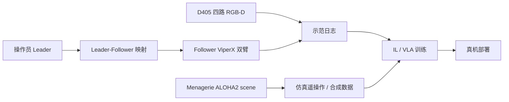

# ALOHA 2（增强型低成本双臂遥操作硬件）

**ALOHA 2** 是 Google DeepMind **ALOHA 2 Team** 在初代 [ALOHA](./aloha.md) 上的硬件迭代：面向 **机队级大规模双臂演示采数**，同时开源 **全部硬件设计、装配教程** 与 **系统辨识后的 MuJoCo 工位模型**（[Menagerie `aloha/`](https://github.com/google-deepmind/mujoco_menagerie/tree/main/aloha)）。

## 一句话定义

> **ALOHA 2** = 更好用的 Leader/Follower 夹爪与机架 + **D405 深度相机阵列** + **Menagerie 可共享的仿真工位**，把「真机遥操作采数」和「同构仿真策略学习」绑在同一套资产上。

## 英文缩写速查

| 缩写 | 英文全称 | 简要说明 |
|------|----------|----------|
| ALOHA | A Low-cost Open-source Hardware for Bimanual Teleoperation | 双臂遥操作硬件族 |
| MJCF | MuJoCo XML Format | Menagerie 仿真描述 |
| D405 | RealSense Depth Camera D405 | 短距全局快门 RGB-D，ALOHA 2 默认相机 |
| FK | Forward Kinematics | 由关节角求末端位姿，手眼标定输入 |
| SysID | System Identification | 真机轨迹拟合仿真执行器/摩擦参数 |

## 为什么重要

- **数据规模瓶颈在硬件：** 成本、鲁棒性、遥操作疲劳度直接 cap 住 imitation / VLA 的数据上限；ALOHA 2 明确优化 **人体工学 + 机队维护性**。
- **视觉 Sim2Real 锚点：** 腕/顶/仰视四路相机在 Menagerie 中 **内参对齐 D405**；外参链仍要在真机做 [手眼标定](../concepts/hand-eye-calibration.md)。
- **与 ACT 生态连续：** 仍是 [action-chunking](../methods/action-chunking.md) / 双臂 IL 的默认硬件升级路径，而非替换算法范式。

## 核心组成（相对 ALOHA 1）

| 模块 | 要点 |
|------|------|
| Leader 夹爪 | 低摩擦 **导轨** 替代剪刀机构 → 更跟手 |
| Follower 夹爪 | 低摩擦设计 → 减延迟、增夹持力；升级 griptape |
| 重力补偿 | **被动** 现货件机构，替代橡皮筋 |
| 机架 | 20×20 铝型材；操作员对侧 **去竖框**，便于人机共采与大道具 |
| 相机 | **Intel RealSense D405** ×4（顶、仰视、左腕、右腕）；更小体积、深度、全局快门 |
| 仿真 | Menagerie **ALOHA 2 scene** + **11 条正弦轨迹 SysID** |

### 流程总览

## 工程实践

| 项 | 建议 |
|----|------|
| 硬件复现 | 项目页 **Tutorial** + [Trossen ALOHA 2.0 文档](https://docs.trossenrobotics.com/aloha_docs/2.0/) |
| 仿真加载 | MuJoCo ≥3.1.1；加载 `mujoco_menagerie/aloha/scene.xml` |
| 相机 | D405 理想距离 **7–50 cm**（腕部）；内参可用 SDK / 标定板 |
| 外参 | 四路相机相对各 link：**手眼或 CAD+实测**；与 [Intel RealSense](./intel-realsense.md) 页 D405 表一致 |
| SysID | 勿直接用默认 ViperX 执行器参数做 sim2real 对比 |

## 局限与风险

- **开源边界：** 硬件 CAD/教程 + Menagerie **已开源**；**无**单独「ALOHA 2 训练代码仓」—— IL 栈仍接 ACT 或自研管线。
- **D405 量程：** 顶/仰视远距深度精度弱于 D455；远距任务勿假设腕部深度可用。
- **Menagerie 是简化 MJCF：** 接触/线缆/柔性体未建模；策略迁移仍需 domain randomization 或真机微调。
- **采购依赖：** 完整套件经 Trossen；自造需严格复现夹爪与相机支架。

## 关联页面

- [ALOHA（初代）](./aloha.md)
- [MuJoCo Menagerie](./mujoco-menagerie.md)
- [Intel RealSense D405 语境](./intel-realsense.md)
- [手眼标定](../concepts/hand-eye-calibration.md)
- [遥操作](../tasks/teleoperation.md)
- [双臂操作](../tasks/bimanual-manipulation.md)

## 参考来源

- [ALOHA 2 项目页归档](../../sources/sites/aloha-2-github-io.md)
- [ALOHA 2 技术报告摘录](../../sources/papers/aloha2_arxiv_2405_02292.md)
- [Menagerie ALOHA 子目录](../../sources/repos/mujoco-menagerie-aloha.md)
- [RealSense D405 规格](../../sources/sites/realsense-d405-product.md)

## 推荐继续阅读

- 项目页：<https://aloha-2.github.io/>
- arXiv：<https://arxiv.org/abs/2405.02292>
- Menagerie README：<https://github.com/google-deepmind/mujoco_menagerie/blob/main/aloha/README.md>
