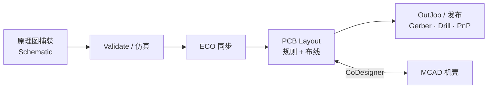

# Altium Designer

**Altium Designer** 是 Altium 旗下的 **商业 PCB EDA 套件**，在单一 **Unified Design Environment** 内完成原理图 → PCB → 仿真/BOM → 制造数据输出，并可通过 **Altium 365 Workspace** 与 **MCAD CoDesigner** 做版本化协作与机壳协同。2026 年官方技术文档已 **不再按 AD 版本分册**，与 Altium Designer / Develop / Agile 共用 [在线文档集](https://www.altium.com/documentation/altium-designer)。

## 英文缩写速查

| 缩写 | 英文全称 | 简要说明 |
|------|----------|----------|
| EDA | Electronic Design Automation | 电子设计自动化（原理图/PCB/仿真工具链） |
| PCB | Printed Circuit Board | 印刷电路板 |
| ECAD | Electronic Computer-Aided Design | 电子 CAD，含原理图与 PCB |
| MCAD | Mechanical Computer-Aided Design | 机械 CAD，机壳与结构 |
| ECO | Engineering Change Order | 原理图与 PCB 间的设计变更单 |
| DRC | Design Rule Check | 设计规则检查（间距、线宽等） |
| BOM | Bill of Materials | 物料清单 |
| PI | Power Integrity | 电源完整性（压降、分配等） |

## 为什么重要

- **机器人板级硬件的主线工具之一：** 关节驱动板、电源分配、传感器载板、通信转接板等需要 **可制造、可版本化** 的 PCB 数据；[力矩电机纵深路线 Stage 4](../../roadmap/depth-torque-motor-design.md) 将「原理图 → layout → 打样 bring-up」列为独立阶段，商业 EDA 在此承担 **规则约束与制造输出** 角色。
- **与开源参考设计互补：** [SimpleFOC](./simplefoc.md) 等生态提供 **EasyEDA/KiCad 可读** 的低功率参考板；Altium 文档更侧重 **Constraint Manager / Design Rules、OutJob、Project Releaser、CoDesigner** 等量产与跨域协同流程。
- **ECAD–MCAD 闭环：** 人形/移动机器人 PCB 常受 **异形机壳与关节体积** 约束；CoDesigner 支持在 SOLIDWORKS / Fusion 等环境中 **双向推送** 板形与 3D 间隙，比一次性 STEP 交换更易保持 revision 一致（机械侧另见 [CAD Skills](./cad-skills.md)）。

## 核心结构 / 机制

### 设计数据流（官方 QuickStart 抽象）

| 阶段 | 关键机制 | 一手文档 |
|------|----------|----------|
| 原理图 | Components 面板、Power Port、层次化多页、原理图侧 **Parameter Set 规则** | [Schematic QuickStart](https://www.altium.com/documentation/altium-designer/schematic) |
| 同步 | 比较引擎 → **ECO**；`Design » Update PCB Document` / `Update Schematics` | [sch-pcb](https://www.altium.com/documentation/altium-designer/sch-pcb) |
| PCB | Layer Stack、**Design Rules** 或 **Constraint Manager**、交互布线、DRC | [PCB QuickStart](https://www.altium.com/documentation/altium-designer/pcb) |
| 制造 | **OutJob** 分 fab/assembly；**Project Releaser** 批量验证与归档 | [Preparing for Manufacture](https://www.altium.com/documentation/altium-designer/preparing-for-manufacture) |
| 协同 | Altium 365 Workspace、PCB CoDesign、MCAD CoDesigner 插件 | [ECAD-MCAD CoDesigner](https://www.altium.com/documentation/altium-designer/ecad-mcad-codesign) |

### 电机驱动 PCB 场景映射（对照 Stage 4）

| Stage 4 关注点 | Altium 中的落点 |
|----------------|-----------------|
| 功率级 / 栅驱 / 死区 | 原理图设计 + 仿真（可选）；layout 阶段 **电源分区与铜皮** |
| 电流采样链路 | 差分/开尔文走线通过 **Width/Clearance/Topology** 规则约束；Net Class 区分功率与小信号 |
| 布局散热 | 铜皮、过孔阵列、机械层标注导热路径；3D 检查与 MCAD 热间隙 |
| 制造交接 | Gerber、钻孔、贴装坐标、BOM；OutJob 与发布流程 |

## 常见误区或局限

- **误区：会画原理图就等于会 layout 电机驱动板。** 大功率开关回路对 **环路电感、地分裂、采样窗口** 敏感；EDA 只提供规则与 DRC，**电流容量与 EMI** 仍需按器件手册与实测验证。
- **误区：Altium 与 KiCad/EasyEDA 工程可无损互转。** 官方提供部分 **Importer**（EAGLE、OrCAD 等），但复杂规则、私有库与 3D 体常需人工核对；开源板卡宜保留 **原始格式 + PDF 原理图** 双轨。
- **局限：闭源商业许可。** 无官方源码；团队需自行管理 **term license / Develop / Agile** 迁移策略（见 [官方说明](https://www.altium.com/documentation/altium-designer)）。
- **局限：Constraint Manager 与经典 Rules 不可随意切换。** 新建工程若启用 Constraint Manager，则 **无法回退** 到 Design » Rules 流程（可自 Rules **单向迁移**）。

## 关联页面

- [力矩电机设计纵深路线（Stage 4 PCB）](../../roadmap/depth-torque-motor-design.md)
- [Humanoid Hardware 101 · 05：能源与计算电子](../overview/humanoid-hardware-101-power-compute-electronics.md)
- [SimpleFOC（Arduino-FOC 生态）](./simplefoc.md) — 开源低功率驱动板参考
- [CAD Skills](./cad-skills.md) — 机械 CAD / URDF 与板级 ECAD 的分工
- [开源人形机器人硬件](./open-source-humanoid-hardware.md) — 整机驱动板开源范例

## 推荐继续阅读

- [Altium Designer 完整入门教程](https://www.altium.com/documentation/altium-designer/tutorial) — 九器件板从原理图到制造文件
- [KiCad 官方文档](https://docs.kicad.org/) — 开源 EDA 对照
- [SimpleFOC 文档 — SimpleFOCBoards](https://docs.simplefoc.com/) — 低功率驱动硬件开源链

## 参考来源

- [sources/sites/altium-designer-primary-refs.md](../../sources/sites/altium-designer-primary-refs.md)
- [Altium Designer Documentation](https://www.altium.com/documentation/altium-designer)
